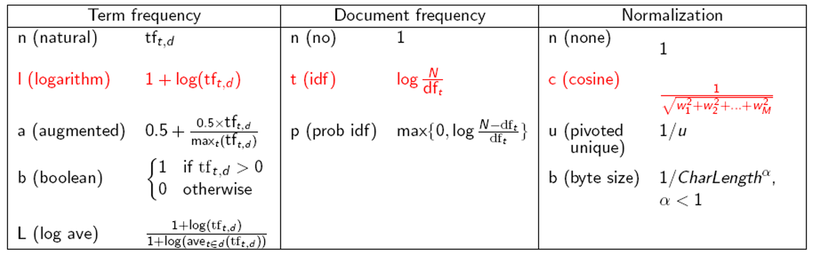

# **Final Revision**

选择题 10

判断题 10

名词解释 24

简答题 20

计算(可带计算器) 36

****

模型:文档+查询+相关度+评价+(公式)

## **Chap1 布尔检索**

1.1 信息检索的概念

1.2 构建倒排索引

(倒排索引的概念/词项词典/倒排记录和倒排记录表)

>   **构建倒排记录表的流程:**
>
>   **收集文档->词条化->语言学处理->建立倒排索引(注意特殊处理:将词项和文档ID对应->去重->==排序==)**

1.3 布尔检索模型的概念

>   **模型的定义:文档如何表示?查询如何表示?词项文档如何表示**
>
>   ->1.词典
>
>   ->2.布尔表达式
>
>   ->3.==**词项文档关联矩阵**==

1.4 基于布尔查询倒排记录表的**合并算法**(上机作业)->**算法思想**

课后作业 1-1,1-2,1-3

## **Chap2 词项词典及倒排记录表**

2.1 文档分析

>   1.字符序列(ASCII)
>
>   2.文档单位(颗粒度->章节段落句子)

2.2 词项集合确定

>   1.词条化(概念+词条类+词项的概念/表示)->**词条类和词项的区别**
>
>   2.去除停用词(什么是停用词[df排序/30-定律],生成停用词的方法)
>
>   3.词项归一化(什么是词项归一化,归一化的方法[如何建立等价类],如何建立等价类->习题2.2)
>
>   4.词干还原与词形归并(概念/Porter算法[最长匹配算法])
>
>   >   给你一个词项进行词干还原和归并

2.3 跳表合并算法(上机作业)

>   随时跳/按照位置跳

2.4 含位置信息的倒排记录表

>   1.二元词索引
>
>   2.位置信息索引
>
>   3.混合索引极值

2.5 2-1,2-2,2-3,2-4,2-6,2-7

## **Chap3 词典和容错式检索**

1.词典搜索的结构(1.哈希表 2.搜索树(二叉树) 3.B树)

2.通配符查询

>1.一般的通配符查询 (轮排索引)
>
>>   **轮排索引表的具体内容 3-2作业**
>
>2.支持**通配符查询**的 k-gram 索引
>
>>   3-4作业

3.拼写校正

>   1.拼写校正的实现
>
>   2.拼写校正的方法
>
>   **3.编辑距离(看ppt)**
>
>   4.k-gram索引(计算Jacaard系数)
>
>   5.上下文敏感的拼写校正(了解)
>
>   6.发音校正技术(了解)

4.作业 3-2.3-3.3-5,3-6,3-8,3-10

## **Chap4 索引构建**

(计算题没有)

0.硬件(省略)

1.基于块的排序索引(概念[看BSBI的具体步骤])

2.基于内存单遍扫描索引(概念[看SPMI])

**区别:需要维护的词典个数**

3.分布式检索

4.动态索引构建(性能最好的对数合并算法,也可以直接合并)

5.Oth索引(略)

## **Chap5 索引压缩**

1.词项的统计特性

>   1.Heaps定律 词项数目的估计(M是词项的数目,T是文档集词条个数)

>   >   文档集大小和词汇量的关系(注意两个对象)

>   2.Zipf定律

>   >   目的:词项分布建模(词项在文档中的分布)

(有了公式才能量化压缩)

**2.词典压缩(定律+应用)**

>   1.单一字符串的压缩(看PPT)
>
>   2.按块压缩(分为k块压缩,每个块)
>
>   3.前端编码

3.倒排记录表的压缩

>   (VB和γ都是间距的编码)
>
>   1.可变字节编码(VB编码,注意后7位表示的是间距,最高1位是延续位)
>
>   2.γ编码(长度[间距二进制+1]+偏移)

作业:5-4,5-6,5-8

## **Chap6 向量权重模型**

1.参数化索引及域索引(域索引概念)

>   1.域加权评分(公式,Eg6-1)
>
>   2.权重学习
>
>   3.最优权重g的(计算专家直接给出,机器学习调整)

2.词项频率及权重计算(df,tf,tf-idf计算公式)

>   1.逆文档频率
>
>   2.tf-idf权重的计算

3.向量空间模型(概念,PPT)

>   1.对文档如何建模.对查询如何建模.计算相似度+内积
>
>   2.查询向量
>
>   3.相似度的计算 **==6-4==**

4.其它tf-idf的计算方法

>   

作业:6-2,6-10,6-15,6-17,6-19

## **Chap7 评分**

1.快速评分及排序

>   **0.精确Topk(PPT)**
>
>   **1.非精确Topk(书上)**
>
>   >   **索引去除技术(tf,idf如何使用)**
>   >
>   >   **胜者表(定义[参考书上,可以是tf的权重也可以是idf])**
>   >
>   >   **静态得分和排序(怎么来的)**
>   >
>   >   **簇剪枝方法(先导者,追随者)**
>
>   2.信息检索系统的组成(主要是图7-5,需要理解)
>
>   
>
>   (这里还缺少评价在第八章)
>
>   3.向量空间评分方法和各种查询关联(略)

## **Chap8 信息检索的评价**

1.信息检索系统的评价->测试集的组成(文档集,需求)

2.标准测试集(书上给的一个测试集,略)

3.无序检索结果集合的评价(P,R,(R不确定->Pooling方法),F值)

4.有序检索结果的评价方法(MAP,R个结果的R正确率,GMAP,NDCG)

5.相关性判断(kappa统计量)

作业:8-1,8-8,8-9(TREC和插值正确率结果不同,手机上),8-10

## **Chap9 相关反馈**

相关反馈和伪相关反馈+什么是查询拓展+思想

>   (相关反馈和伪相关反馈,间接相关反馈的主要思想)
>
>   其它的都略了

## **Chap10 XML**

1.XML的基本概念(基本模型:DOM,路径表示:XPATH,查询表示:NEXI)

2.XML的挑战问题(略)

3.基于向量空间模型的XML(结构化词项,路径+相似度的概念)

4.XML的评价(相关度,覆盖度[3e2l...])

## 最后两章都是概念

## **Chap11 概率检索模型**

1.概率论基础知识(略)

2.概率排序原理(略)

>   0-1风险情况
>
>   概率排序原理

3.二值独立模型(概念,文档查询,相关性NB)

>   1.排序函数的推导 略
>
>   2.概率估计方法RSV(N,df,相关S)
>
>   3.实际概率估计 略
>
>   4.基于概率的相关反馈算法

4.模型相关频率和扩展

>   BM25模型不是二值->状态检索值的计算方式,RSV计算方式

## **Chap12 基于语言模型**

1.语言模型(概念[映射函数/公式看书])==Md怎么来的==

>   1.有穷自动机和语言模型(了解)
>
>   2.一元模型/二元模型的概念

**2.查询似然模型(文档,查询(抽样分布),排序(概率)**

>   1.IR的查询似然模型(概念167)
>
>   >IR中最早使用的LM模型：
>   >
>   >对文档集中的每篇文档ｄ构建对应的语言模型$M_d$,目标是将文档按照相关的似然概率排序
>   >
>   >文档如何表示?查询如何表示?
>
>   2.查询生成概率估计
>
>   >   Eg 12-7