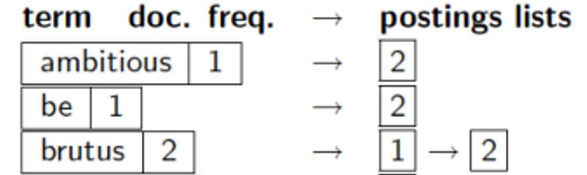

# **Final Revision**

<font color=Deeppink>Deeppink表示很重要</font>

选择题 10

判断题 10

名词解释 24

简答题 20

计算  36

****

模型:文档+查询+相关度+评价+(公式)

## <font color=red>**Chap1 布尔检索**</font>

#### **1.1 信息检索的概念**

**信息检索(IR):从<font color=red>大规模非结构化数据的集合中</font>找出<font color=red>满足用户需求</font>的资料**

>   **非结构化数据:没有组织的自由格式数据,无法直接使用,需要进行数据转换使用**
>
>   >   文字/网页内容/原始信号/音效
>
>   **结构化数据:具有清晰和明显语义的结构**
>
>   >   关系数据库
>
>   **半结构化数据:结构没有规则且变化迅速的结构**
>
>   >   具有格式标记的网页
>
>   <font color=red>**注意:大部分数据严格意义上不属于结构化数据(可以进一步细化)**</font>

**信息检索模型:描述信息检索中的==文档,查询和它们之间的关系==的数学模型**

>   **==基于文本内容的检索模型==**
>
>   第1章:布尔检索及倒排索引
>
>   第6章:向量模型及检索系统
>
>   第11章:概率模型
>
>   第12章:基于语言建模的检索模型
>
>   **==与内容无关的其他检索模型==**
>
>   第13章:文本分类(基于贝叶斯)

****

#### **1.2 构建倒排索引**

(倒排索引的概念/词项词典/倒排记录和倒排记录表)

###### **1.2.1 基本概念**

**词项词典:所有词项的集合**

**倒排索引：信息检索系统中 <font color=red>将词项反向映射到文档</font> 的索引结构**

**倒排记录(posting):     <font color=red>"一个词项,在一个文档" 中的信息</font>**

**倒排记录表(posting list):<font color=red>一个词项,在所有文档" 中的信息</font></font>**

**倒排索引(posting index)：      <font color=red>所有词项的倒排记录表</font>**

###### **1.2.2 构建倒排记录表**

>**1.文档解析(Doc Parsing)**
>
>**2.词条化(Tokenization):**分词/去标点符号/数字和特殊字符处理
>
>**3.词条标准化(Token Normalization)**
>
>>   **a.大小写转换**
>>
>>   **b.词干还原:提取词干**     (Porter Stemmer法移除后缀-ing,-ed,-es)
>>
>>   **c.词形归并:提取词元**     (根据词语的实际意义进行还原)
>>
>>   **d.停用词移除:删除没有检索意义的词语(is/the/a)**

###### **1.2.3 建立倒排索引**

**<font  color=red>注意排序和去重操作</font>**

>**a.建立词项与文档ID对应的序列**
>
>>   **出现的文档 赋一个连续的整数编号(DocID)**
>
>==**b.排序**==
>
>>   **<font color=red>排序依据:先按照词项的alphabet进行排序,再按照docID进行排序</font>**
>
>**c.建立索引(词典和倒排表的建立)**
>
>>   ==去重==:同文章的多次出现的词被合并
>>
>>   统计:统计docID的个数,写在词典项
>>
>>   排序:按照docID从小到大排序
>>
>>   
>
>**<font color=red>倒排记录表不存在重复元素,从小到大</font>**
>
>**<font color=red>词项必须排序!!!!!!,文档ID必须排序!!!</font>**
>
>**<font color=red>必须转义两次:string-int-string</font>**

>   **收集文档->词条化->语言学处理->建立倒排索引(注意特殊处理:将词项和文档ID对应->去重->==排序==)**

#### **1.3 布尔检索模型的概念**

>   **模型的定义:文档如何表示?查询如何表示?词项文档如何表示**
>
>   ->文档的表示方式:所有词项的集合
>
>   ->查询的表示方式:布尔表达式
>
>   ->词项文档表示方式==**词项文档关联矩阵**==

#### **1.4 基于布尔查询倒排记录表的合并算法**

(上机作业)->**算法思想**:朴素双指针算法(看1.3习题)主要是取集合的过程

#### **<font color=Deeppink>课后作业 1-1,1-2,1-3</font>**

**1.1 创建倒排序列**

**Eg1:画出下列文档集所对应的倒排序列**

```txt
doc1: new home sales top forecasts
doc2: home sales rise in july
doc3: increase in home sales in july
doc4: july new home sales rise
```

>   **解:<font color=red>注意这里的term是排好序的,后面的docID也是</font>**
>
>   ```
>   forecasts  ->  1
>   home       ->  1, 2, 3, 4
>   in         ->  2, 3
>   increase   ->  3
>   july       ->  2, 3, 4
>   new        ->  1, 4
>   rise       ->  2, 4
>   sales      ->  1, 2, 3, 4
>   top        ->  1
>   ```

****

**1.2 创建 词项-文档矩阵 和 倒排索引**

**Eg2:考虑文档,画出对应的词项-文档矩阵+画出对应的倒排索引**

```\
doc1 breakthough drug for schizophrenia
doc2 new schizophrenia drug
doc3 new approach for treatment of schizophrenia
doc4 new hopes for schizophrenia patients
```

>**词项文档关联矩阵:0-1矩阵**
>
>
>
>**倒排索引:**
>
>```
>approach       -> 3
>breakthrough   -> 1
>drug           -> 1, 2
>for            -> 1, 3, 4
>hopes          -> 4
>new            -> 2, 3, 4
>of             -> 3
>patients       -> 4
>schizophrenia  -> 1, 2, 3, 4
>treatment      -> 3
>```

****

**1.3:对1.2的文档集进行查询,返回的结果是?**

**`a.schizophrenia AND drug`**

**`b.for AND NOT(drug OR approch)`**

**AND：当且仅当两个位都为1时，结果才为1。否则为0。**

**OR：当两个位中至少有一个为1时，结果才为1。否则为0。**

>   **a:返回的结果是doc1,doc2(1100)**
>
>   >   **schizophrenia:1111**
>   >
>   >   **drug:1100**
>   >
>   >   <font color=red>1111+1100=1100</font>
>
>   **b.返回的结果是doc4(0001)**
>
>   >   **drug:1100**
>   >
>   >   **approach:0010**
>   >
>   >   **for:1011**
>   >
>   >   <font color=red>1011 AND NOT(1110 OR 0010)</font>
>   >
>   >   <font color=red>1101 AND NOT 1110</font>
>   >
>   >   <font color=red>1101 AND 0001</font>
>   >
>   >   <font color=red>0001</font>

## **Chap2 词项词典及倒排记录表**

**<font color=red>(这个Chap主要是构建词项词典的过程,以及合并算法)</font>**

>   **构建词项词典的过程:文档解析->词条化->停用词去除->归一化**
>
>   **合并算法:跳表合并+带有位置信息的合并**

#### **2.1 构建词项词典(文档解析)**

>   1.字符序列的解码(ASCII/UTF等编码格式,以及语言的解析)
>
>   2.定义文档单位(颗粒度->章节段落句子)
>
>   >   **索引粒度过大,段落更长:找到更多不相关内容(可能噪声)<font color=red>(正确率低召回率高)</font>**
>   >
>   >   **索引粒度过小,段落更短:错过重要的段落(索引长度变短)<font color=red>(正确率高召回率低)</font>**

#### **<font color=Deeppink>2.2 构建词项词典(词项集合确定)</font>**

###### **2.2.1 词条化**

**==词条化(概念+词条类+词项的概念/表示)->词条类和词项的区别==**

>   1.**<font color=red>词条化:定义好文档单位以后,将原始字符序列分割成词条token的过程</font>**
>
>   >**Input:"I love cats."**
>   >
>   >**Output: ['I','love','cats']**
>
>   2.词条(Tokens): 在文档中出现的字符序列的一个实例。
>
>   >“I”、“love”、“cats”
>
>   3.词条类(Type)： 相同词条构成的集合
>
>   >   但是比如The和the会被分成两个集合,所以还要处理
>
>   (语言学处理/归一化处理)
>
>   4.词项(Terms):  可能经过归一化后收录的词条类包含在信息检索系统的词典中
>
>   ****
>
>   (文本词条化生成一系列词条->词条归一化取集合构成词条类->词条类处理后词项)
>
>   **词条类和词项的关系:**
>
>   >   其中每个等价类对应一个词项,这些**词项最终用于建立文档**的索引
>   >
>   >   词条类经过归一化处理组成了词项

###### **2.2.3 构建词项词典(去除停用词)**

**==去除停用词(什么是停用词[df排序/30-定律],生成停用词的方法)==**

>   1.停用词:在文档和用户需求进行匹配的时候没有价值,需要从词汇表中删除
>
>   2.停用词停用的依据:30定理(词项的文档集频率df)
>
>   >   **<font color=red>具体内容:出现频率最高的30个词在书面文本中占了30%的出现比例</font>**
>   >
>   >   并且作为停用词删除后不太影响最后的结果
>
>   3.生成停用词的方法:人工筛选df高的频率/使用现成的停用词表:RVC1

###### **2.2.4 构建词项词典(词项归一化)**

**==词项归一化(概念,归一化的方法[如何建立等价类],如何建立等价类->习题2.2)==**

>   1.词条归一化:将看起来不完全一致的多个**词条**归纳成一个等价类
>
>   >   **方法:隐式建立等价类[如何建立]/手工建立同义词表**
>   >
>   >   (USA U.S.A.->USA)
>   >
>   >   (anti-discrimination antidiscrimination->antidiscrimination)
>
>   2.词项归一化:需要将文档和查询中的**词条**归一化成一致的形式。
>
>   >**方法:重音符号,同义词,近义词,词形变体(单复数,动词时态),时态语态**

###### **2.2.5 构建词项词典(词干还原和词形归并)**

**==词干还原与词形归并(概念/Porter算法[最长匹配算法])==<font color=red>会给你一个词项操作</font>**

>   词干还原:(去除前后缀)粗略的去除单词两端词缀的启发式过程
>
>   >   (automate,automatic,automation -> automat)
>
>   >   **==Poter算法:习题2-3[最长匹配算法]==**
>   >
>   >   主要是得到没有歧义的单词
>   >
>   >   书上提到的是复数变单数:去S,IES->I,**SS->SS**,SSES->SS
>   >
>   >   (对于SS结尾的先不变单数,因为有些词本身就有SS)
>
>   词形归并:(合并得到词元)利用词汇表和词形分析去除词缀,转化为基本形式词元

#### **2.3 跳表合并算法**

>   随时跳/按照位置跳

#### **2.4 含位置信息的倒排记录表**

**这里主要涉及了短语(多个词项)查询的解决方法**

>   背景:用户输入了一系列词,如何对结果进行合并?
>
>   **==1.二元词索引查询(查询的变化)==**
>
>   >比如"词项A 词项B 词项C 词项D"->(AB)AND(BC)AND(CD)
>   >
>   >如此可以增加单个短语到n维
>
>   **==2.位置信息索引(倒排记录的变化)==**
>
>   >   term:DocID:<pos1,pos2,...,posx>
>   >
>   >   主要用于/k的k词临近搜索
>   >
>   >   **返回的是DocID**
>
>   **==3.混合索引机制(策略的变化)==**
>
>   >**由于基于位置的倒排记录表对于长短语的合并效率低(太长了)**
>   >
>   >所以将二元词索引和位置信息索引的方法进行混合

#### <font color=Deeppink>课后作业 2-1,2-2,2-3,2-4,2-6,2-7</font>

**2-1.判断以下说法的正确性**

>   a.布尔检索系统中,词干还原从不降低正确率(F)->过度归并
>
>   b.布尔检索系统中,词干还原从不降低召回率(T)
>
>   c.词干还原会增大词项词典的大小(F)->一般减少
>
>   d.词干还原应该在构建索引的时候调用,而不应在查询处理的时候使用(F)
>
>   >   **<font color=red>词干还原和词形归并 在构建 在查询 中需要同步使用</font>**

**2-2 归一化(去符号都换成小写)**

>   a.'Cos     ->  cos
>
>   b.Shi'ite  ->  shiite 
>
>   c.cont'd   ->  contd
>
>   d.Hawai'i  ->  hawaii
>
>   e.O'Rourke ->  orourke

**2-3 词干还原**

>   a.abandon/abandonment -> abandon
>
>   b.absorbency/absorbent -> absorb
>
>   c.maketing/markets    -> <font color=red>意思不同不应该合并</font>
>
>   d.university/universe -> <font color=red>意思不同不应该合并</font>
>
>   e.volume/volumes      -> volume

**2-4 词干还原(Poter算法)**

>   circus canaries boss  -> circus canari boss(和意义无关)

**2-6 跳表比较次数<font color=red>(红色表示跳表指针)</font>**

>   **word1:[<font color=red>4</font>,6,10,12,<font color=red>14</font>,16,18,20,<font color=red>22</font>,32,47,81,<font color=red>120</font>,122,157,180]**
>
>   **word2:[47]**
>
>   >   **a.使用标准倒排记录表**
>   >
>   >   比较11次(4,6,10,12,14,16,18,20,22,32,47)
>   >
>   >   **b.使用跳表$\sqrt{n}=4 $**
>   >
>   >   比较6次(4,14,22,120,22,32,(47))

**2-7 跳表合并的实际跳转次数(题目规定的跳表)<font color=red>(红色表示跳表指针)</font>**

list1:<font color=red>3</font> 5 9 15 <font color=red>24</font> 39 60 68 <font color=red>75</font> 81 84 89 <font color=red>92</font> 96 97 100 <font color=red>115</font>

list2:3 5 89 95 97 99 100 101

表示跳转成功多少次(而不是比较的次数):只有1次,24到75

合并时比较的次数18次

|  1   |       3        | 2        |
| :--: | :------------: | -------- |
|  2   |       5        | 5        |
|  3   |       9        | 89       |
|  4   |       15       | 89       |
|  5   |       24       | 89       |
|  6   | 跳表算一次比较 | 89       |
|  7   |       75       | 89       |
|  8   |       81       | 89       |
|  9   |       84       | 89       |
|  10  |       89       | 89       |
|  11  |       92       | 95       |
|  12  |       96       | 95       |
|  13  |       96       | 97       |
|  14  |       97       | 97       |
|  15  |      100       | 99       |
|  16  |      100       | 100      |
|  17  |      115       | 101      |
|  18  |      115       | 直接加入 |

都不使用跳表19次

## **Chap3 词典和容错式检索**

#### **3.1 词典搜索**

**==词典搜索的结构(1.哈希表 2.搜索树(二叉树) 3.B树)==**

###### **1.哈希表 -> 字典查询**

**一种根据Key来进行访问的数据结构(其中Key通过哈希函数直接赋值)**

>优点：在哈希表的定位速度快于树中的定位速度
>
>缺点：没办法处理微小变形/不支持前缀搜索/哈希冲突
>

###### **2.二叉树 -> 最基本且性能一般的查询**

**一个根结点和两棵互不相交的子树组成的结构**

>满二叉树:所有分支结点都存在左子树和右子树，并且所有叶子都在同一层上
>
>完全二叉树:节点的编号和二叉树的对应编号位置完全相同

###### **3.B树(平衡的多分树) -> 通配符查询**

**<font color=red>(B树中一个节点的子节点数目的==最大值==，用m表示,就是m阶)</font>**

>**每个节点最多只有m个子节点。**
>
>**每个非叶子节点（除了根）具有至少⌈m/2⌉子节点。**

#### **<font color=Deeppink>3.2 通配符查询</font>**

###### **1.一般的通配符查询 (轮排索引)**

==**轮排索引表的具体内容3-2作业**==

(通配符使用场景/首通配符/尾通配符)

###### **2.支持通配符查询的 k-gram 索引**

**==3-4作业==**

#### **<font color=Deeppink>3.3 拼写校正</font>**

###### **1.拼写校正的实现**

###### **2.拼写校正的方法**

###### **3.编辑距离(看ppt)**

###### **<font color=Deeppink>4.k-gram索引(计算Jacaard系数)</font>**


###### **5.上下文敏感的拼写校正(了解)**

#### **3.4 发音校正技术(了解)**

#### **<font color=Deeppink>3.5 作业 3-2.3-3.3-5,3-6,3-8,3-10</font>**

## **Chap4 索引构建**

(计算题没有)

0.硬件(省略)

1.基于块的排序索引(概念[看BSBI的具体步骤])

2.基于内存单遍扫描索引(概念[看SPMI])

**区别:需要维护的词典个数**

3.分布式检索

4.动态索引构建(性能最好的对数合并算法,也可以直接合并)

5.Oth索引(略)

## **Chap5 索引压缩**

1.词项的统计特性

>   <font color=red>1.Heaps定律 词项数目的估计(M是词项的数目,T是文档集词条个数)</font>

>   >   文档集大小和词汇量的关系(注意两个对象)

>   <font color=red>2.Zipf定律</font>

>   >   目的:词项分布建模(词项在文档中的分布)

(有了公式才能量化压缩)

<font color=red>**2.词典压缩(定律+应用)**</font>

>   1.单一字符串的压缩(看PPT)
>
>   2.按块压缩(分为k块压缩,每个块)
>
>   3.前端编码

<font color=red>3.倒排记录表的压缩</font>

>   (VB和γ都是间距的编码)
>
>   1.可变字节编码(VB编码,注意后7位表示的是间距,最高1位是延续位)
>
>   2.γ编码(长度[间距二进制+1]+偏移)

作业:5-4,5-6,5-8

## **<font color=red>Chap6 向量权重模型</font>**

1.参数化索引及域索引(域索引概念)

>   1.域加权评分(公式,Eg6-1)
>
>   2.权重学习
>
>   3.最优权重g的(计算专家直接给出,机器学习调整)

2.词项频率及权重计算(df,tf,tf-idf计算公式)

>   1.逆文档频率
>
>   2.tf-idf权重的计算

3.向量空间模型(概念,PPT)

>   1.对文档如何建模.对查询如何建模.计算相似度+内积
>
>   2.查询向量
>
>   3.相似度的计算 **==6-4==**

4.其它tf-idf的计算方法

>   

作业:6-2,6-10,6-15,6-17,6-19

## **Chap7 评分**

1.快速评分及排序

>   **0.精确Topk(PPT)**
>
>   **1.非精确Topk(书上)**
>
>   >   **索引去除技术(tf,idf如何使用)**
>   >
>   >   **胜者表(定义[参考书上,可以是tf的权重也可以是idf])**
>   >
>   >   **静态得分和排序(怎么来的)**
>   >
>   >   **簇剪枝方法(先导者,追随者)**
>
>   <font color=red>2.信息检索系统的组成(主要是图7-5,需要理解)</font>
>
>   
>
>   (这里还缺少评价在第八章)
>
>   3.向量空间评分方法和各种查询关联(略)

## **Chap8 信息检索的评价**

1.信息检索系统的评价->测试集的组成(文档集,需求)

2.标准测试集(书上给的一个测试集,略)

3.无序检索结果集合的评价(P,R,(R不确定->Pooling方法),F值)

4.有序检索结果的评价方法(MAP,R个结果的R正确率,GMAP,NDCG)

5.相关性判断(kappa统计量)

<font color=red>作业:8-1,8-8,8-9(TREC和插值正确率结果不同,手机上),8-10</font>

## **Chap9 相关反馈**

相关反馈和伪相关反馈+什么是查询拓展+思想

>   (相关反馈和伪相关反馈,间接相关反馈的主要思想)
>
>   其它的都略了

## **Chap10 XML**

1.XML的基本概念(基本模型:DOM,路径表示:XPATH,查询表示:NEXI)

2.XML的挑战问题(略)

3.基于向量空间模型的XML(<font color=red>结构化词项,路径+相似度的概念</font>)

4.XML的评价(相关度,覆盖度[3e2l...])


## 最后两章都是概念

## **Chap11 概率检索模型**

1.概率论基础知识(略)

2.概率排序原理(略)

>   0-1风险情况
>
>   概率排序原理

3.二值独立模型(概念,文档查询,相关性NB)

>   1.排序函数的推导 略
>
>   2.概率估计方法RSV(N,df,相关S)
>
>   3.实际概率估计 略
>
>   4.基于概率的相关反馈算法

4.模型相关频率和扩展

>   BM25模型不是二值->状态检索值的计算方式,RSV计算方式

## **Chap12 基于语言模型**

1.语言模型(概念[映射函数/公式看书])==Md怎么来的==

>   1.有穷自动机和语言模型(了解)
>
>   2.一元模型/二元模型的概念

**2.查询似然模型(文档,查询(抽样分布),排序(概率)**

>   1.IR的查询似然模型(概念167)
>
>   >IR中最早使用的LM模型：
>   >
>   >对文档集中的每篇文档ｄ构建对应的语言模型$M_d$,目标是将文档按照相关的似然概率排序
>   >
>   >文档如何表示?查询如何表示?
>
>   2.查询生成概率估计
>
>   >   Eg 12-7