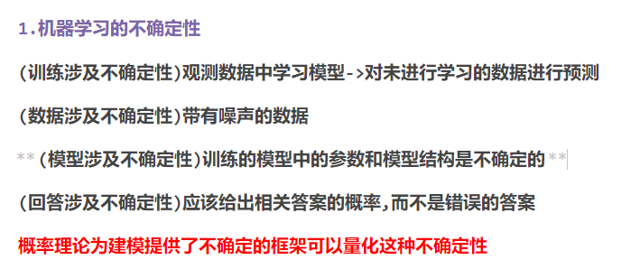

# **Final Revision**

## **试卷构成**

填空题:2分 -> 40分   (主要部分,至少拿25)

选择题:2分 -> 10分   (较难)

判断题:1分 -> 10分   (不排除答案是全对/全错)

简答题:6分 -> 30分   (5个6分)

>   **预测1.贝叶斯决策+最小错误率/最小风险错误**

分析题10分

>   <font color=red>(必考)多层神经网络的过程(p159 8-2+公式)</font>

## **Chap1 机器学习引言**

###### **1.什么是模式(p1)**

>   模式 是数据中蕴含的规律
>
>   模式识别 是从数据中识别并发现这种规律,并加以有效利用
>
>   **==不是所有数据都有模式==**
>
>   1.需要找到的是有用的可泛化的规律
>
>   2.数据量少/噪音/无相关性都会直接导致**不存在模式**

###### (SELECTIVE)什么是机器学习

>   对计算设备:从不具备能力->具备能力的学习过程
>
>   (能力是发现数据中的规律并加以运用的能力)

###### **2.什么是近邻法(p2)**

>   机器学习的近邻法,是根据当前样本最近的 一个或多个样本的 **类别标签**来进行类别预测的
>
>   这里的"近"是一种度量距离:欧式距离/测地线距离
>
>   **==应用:Chap10的聚类==**

###### **3.什么是主动学习(p4)**

>   机器学习的主动学习强调的是对未标注样本的主动/选择性标注
>
>   通过标注少量重要的样本减少人工标注的成本
>
>   **==应用:Chap7的SVM==**

###### **4.什么是异常检测(p8)**

>   1.正常和异常
>
>   >   时序数据:观测值和预测值的误差超过了某个阈值/周期异常
>   >
>   >   统计学上:服从某种分布(正常)->均值偏差过大(异常)
>   >
>   >   距离密度:KNN距离/聚类距离 ->离中心过远(异常)
>
>   2.类别不平衡问题
>
>   >   分类器构建正常类和异常类时正常类远少于异常类导致的问题
>
>   3.异常检测的定义
>
>   >   异常检测是一个正常类和异常类别 极不平均的问题
>   >
>   >   (异常检测本身就是一种不不平衡问题)
>   >
>   >   ->正常样本的数量远远多于异常样本
>
>   4.异常检测中设计损失函数
>
>   >   时序误差:MSE+L2正则化
>   >
>   >   距离:大间隔原理$\frac{1}{2}||w||^2+(软参数选加) $

###### **5.时间序列对异常检测的影响(p8)**

>   1.时序性特点
>
>   时序数据中的观测值是按照时间顺序排序的,通过前后时序关系判断
>
>   >   比如CPU缓慢上升正常,但是突然上升就是异常
>
>   2.趋势性特点
>
>   >双十一区域的激增是正常的
>
>   3.上下文异常
>
>   >   如果CPU在晚上批处理任务80%算是正常的
>
>   4.时效性变化
>
>   >   随着时间变长,原有的模式需要进行增量学习
>
>   5.本身模式的问题
>
>   >   时序数据前后数据点的噪音/不确定性导致模式崩溃
>
>   **解决方法:滑动窗口/上下文依赖LSTM/数据增强**

###### **6.多视图学习的主旨(p10)**

>   多视图:多源异质或多传感器感知的多视图特征
>
>   多视图学习:实现多视图数据处理瓶颈,实现信息的融合和增强,**研究主旨是对视图间相互关系的建模与发掘,建立视图间的正则化约束或概率依赖关系,最终增强学习系统的性能**
>
>   其中的挑战:额外考虑
>
>   >   数据层面:各视图对学习任务的充分性/视图间的异质性/视图间的噪声类型和量级的差异性
>   >
>   >   算法层面:多视图的算法的特异性,时序不同步,部分视图数据缺失

## **Chap2 贝叶斯学习基础**

###### (selective)为什么引入Bayes

>   

###### **1.贝叶斯公式定义(p16)**

>   贝叶斯公式:
>   $$
>   \begin{align}
>   p(w|x) &= \frac{p(w,x)}{p(x)}
>   &= \frac{联合}{边缘}\qquad(生成模型)
>   \\ \\
>   &=\frac{p(x|w)p(w)}{\sum_wp(w,x)}
>   &=\frac{联合(乘法)}{边缘(乘法)}\qquad(先验似然)
>   \\ \\
>   &=p(x|w)p(w)&\qquad(相同数据集下,判断类别使用)
>   \end{align}
>   $$
>   **贝叶斯公式也称作逆概率公式,计算(逆向)后验概率**
>
>   >   **计算概率必须使用完整的分数公式,否则没有归一化**
>   >
>   >   **判断类别则可以偷懒使用先验乘以似然**
>
>   >   **主要思想:通过观测数据反推 隐变量 的概率分布**
>   >
>   >   **刻画内容:刻画了先验概率/似然概率/后验概率之间的关系**

###### **2.贝叶斯公式的概率以及解释(p16)**

>   **==按照是否有观测数据:==**
>
>   >先验概率(prior probability):
>   >
>   >没有观测数据情况下的概率:$\ p(\omega) $
>
>   >   似然概率(likelihood probability):
>   >
>   >   给定变量$\ \omega $的条件下观测到x的概率$\ p(x|\omega) $
>
>   >后验概率(posterior probability)
>   >
>   >给定x的条件下观测到$\ \omega $的概率$\ p(\omega|x) $
>
>   **==按照变量存在的形式:==**
>
>   >   联合概率:多个变量的联合概率$\ p(w,x)$
>
>   >   边缘概率:单一变量的概率$\ p(w)\ or \ p(x) $
>
>   >   条件概率:给定条件下其它变量的值$\ p(w|x)\ or \ p(x|w)$

###### **3.贝叶斯公式刻画的内容(p17)**

**刻画了先验概率/似然概率/后验概率之间的关系**

###### **4.贝叶斯决策的定义(p17)**

>   贝叶斯决策:
>
>   **贝叶斯决策是概率框架下实施决策的基本方法**
>
>   **<font color=red>通过综合考虑"决策的后验分布"和"错误决策的损失"做出决策</font>**
>
>   **前提:决策问题可以用概率分布进行描述+决策使用的概率分布是可以被计算的**

>   贝叶斯决策的主要应用:
>
>   **分类任务(二分多分均可)+回归任务**

###### **5.贝叶斯决策的类别(p18)**

>   最小错误率贝叶斯决策 和 最小风险贝叶斯决策

###### **6.最小错误率贝叶斯的定义和目标(p18)**

>   目标:希望决策的平均错误率足够小
>
>   目标函数:联合错误概率 错误率公式(划分错误的概率)<-对它argmin
>   $$
>   \begin{align}
>   p(error) &= \int^{\infty}_{-\infty}p(error|x)p(x)dx
>   \\ \\&=
>   \int_{R_1}p(x,\omega=2)dx+\int_{R_2}p(x,\omega=1)dx
>   \\
>   \\
>   &应该划分R1类但是分为2;应该划分R2类但是分为1
>   \end{align}
>   $$
>   ->等价于最大化$\ p(correct) $<-对它argmax
>   $$
>   \begin{align}
>   p(error) &= \int^{\infty}_{-\infty}p(error|x)p(x)dx
>   \\ \\&=
>   1-p(correct)
>   \end{align}
>   $$
>   如果是连续性:求极值找最大值/凸优化

###### **7.最小风险贝叶斯的定义和目标(p21)**

>   **目标:选取使得 条件风险 最小的决策,该决策也会使总体风险最小**
>
>   目标函数:条件错误概率 错误率公式(划分错误的代价)<-argmin
>   $$
>   R(h(x)|x) = \sum_i \lambda(h(x)|\omega = i)\ p(\omega =i|x)
>   $$
>
>   >   **==额外增加了一个风险因子$\lambda_{ab}$==**(本来第a类,分到第b类的损失因子)
>   >
>   >   a表示归入的类别
>   >
>   >   如果归为第一类:$R(a_1|x) = \lambda_{11}p(\omega = 1|x)+\lambda_{12}p(\omega = 2|x)$
>   >
>   >   如果归为第二类:$R(a_2|x) = \lambda_{21}p(\omega = 1|x)+\lambda_{22}p(\omega = 2|x)$
>   >
>   >   >   **但是正确的归类比如$\lambda_{11}$的实值是0**

###### **8.最小错误率-风险之间的关系(p23)**

>   **当决策损失定义为0-1损失(正确的归类$\lambda=1$,错误的归类$ \lambda=0$)**
>
>   而不是对不同的匹配进行额外的赋值

>   条件风险等于条件错误率:$1-p(w=i|x) $

###### **9.什么是判别函数(p24)**

>   **判别函数是输入特征的函数,结果可以直接做出分类决策**

>   比如线性判别函数:$g_i(x) = w_i^T x+b_i $,>0属于第一类,<0属于第二类
>
>   比如贝叶斯判别函数$g_i(x) = \prod_i p(x_i|w) \cdot p(w) $,然后给定g(x)的阈值

###### **10.构建分类器的3种思想(p24)**

>   1.生成式模型构建分类器==(基于概率框架 和 贝叶斯决策)==
>
>   >   1.构建学习输入特征和输出类别的 **联合分布**
>   >
>   >   2.贝叶斯公式 推导出输出类别的**后验分布**
>   >
>   >   3.结合 **决策损失函数** 构建 **判别函数** 进行分类决策
>
>   >   构建联合分布->就知道似然->就可以继续训练推导
>   >
>   >   最强大的,但是要N+1维[x是N维,Y是1]

>   2.判别式模型构建分类器==(基于概率框架 和 条件分布)==
>
>   >   1.直接构建并学习 输出类别在输入条件下的 **条件分布**
>   >
>   >   2.结合 **决策损失函数** 构建 **判别函数** 进行分类决策

>   3.直接构建判别函数==(基于复杂映射)==
>
>   >   1.构造函数,对输入特征和输出进行建模(ANN/DL)
>   >
>   >   2.使用**构造函数**进行决策

###### **(SELECTIVE)分类器的错误率计算**

>   1.直接根据错误率的定义计算
>
>   >   如果联合分布,条件分布 有显式表达式
>
>   2.计算错误率的上界
>
>   >   如果联合分布,条件分布有显式表达式
>   >
>   >   Radmacher复杂度理论/PAC-Bayes理论
>
>   3.通过测试数据估计错误率
>
>   >   (不一定准确)直接看正确的/错误的在测试集所占比例

###### (注意:跳过了Gaussian Bayes)

###### **11.朴素贝叶斯分类器和其它分类器的区别(p32)**

>   **朴素贝叶斯分类器采用了=="特征条件独立"==的假设**
>
>   也就是特征之间相互独立,联合分布可以写作直接写成乘积

###### **12.MLE/MAP/EM的基本思想**

>   **1.最大似然估计(MLE)**
>
>   >   基本思想:找到一组参数,使得观测到的数据概率最大化
>   >
>   >   **(假设数据是独立同分布的,还需要知道服从的分布/均值方差)**
>   >
>   >   1.定义似然函数:
>   >   $$
>   >   L(\theta|D) = P(D|\theta) = \prod^{N}_{i=1}p(x_i|\theta)\approx\sum^{N}_{i=1}lnP(x_i|\theta)
>   >   $$
>   >   2.求导等于0,解出$\theta $
>
>   **2.最大后验估计(MAP)**
>
>   >   基本思想:找到一组参数,使得观测数据之后,这些参数最大化
>   >
>   >   **(贝叶斯的思想,MLE基础上引入先验概率)**
>   >
>   >   >   如果MAP是均匀分布,则MAP退化成MLE
>   >
>   >   1.定义后验概率:
>   >   $$
>   >   P(\theta|D) = \frac{P(D|\theta)P(\theta)}{P(D)}\approx lnP(D|\theta)+lnP(\theta)
>   >   $$
>   >   2.求导等于0,解出$\theta $
>
>   **3.最大期望算法(EM)**
>
>   >   基本思想:一种迭代优化算法,在统计模型种寻找MLE/MAP,通过迭代估计隐变量的期望值(W)和最大化完整数据的似然(M步),**逼近**参数的最优估计
>   >
>   >   1.初始化:随机初始化/启发式初始化
>   >
>   >   2.E步:当前参数下,计算隐变量的后验概率(期望步)
>   >   $$
>   >   Q(\theta|\theta^{(t)}) = E_{Z|X,\theta^{(t)}}[ln P(X,Z|\theta)]
>   >   $$
>   >   3.M步:找到新的参数,使得期望最大化
>   >   $$
>   >   \theta^{(t+1)} = argmax_\theta Q(\theta|\theta^{(t)})
>   >   $$
>   >   4.直到参数收敛:实用收敛准则

###### **13.课后习题(2)**

举一个简单的例子说明最小错误率和最小风险贝叶斯的不同

```
(可以省略,只用举例损失矩阵)
类别 ω1： 病人没有患癌症（阴性）
类别 ω2： 病人患有癌症（阳性）
P(ω1)=0.99 (人群中99%的人没有这种癌症，这是一种罕见的疾病)
P(ω2)=0.01 (人群中1%的人患有这种癌症)
P(x∣ω1)：没有癌症的人，其 x 值的分布。
P(x∣ω2)：有癌症的人，其 x 值的分布。
```

>   后验概率:$P(w_0|x)=0.51$(没癌的人) $p(w_1|x)=0.49$(患癌的人)

>   最小错误率:0-1损失(正确分类损失为0)
>
>   | 决策\真实 | No   | Yes  |
>   | --------- | ---- | ---- |
>   | No        | 0    | 1    |
>   | Yes       | 1    | 0    |
>
>   $\therefore P(w_0|x)>P(w_1|x)$判断没有癌症

>   最小风险:自定义损失(正确分类损失为0)
>
>   | 决策\真实 | No   | Yes  |
>   | --------- | ---- | ---- |
>   | No        | 0    | 1000 |
>   | Yes       | 1    | 0    |
>
>   (因为有癌症但是判断没有的损失大,这里设置为1000)
>   $$
>   \begin{align}
>   L(w_0|x) &= \lambda_{00}P(w_0|x)+\lambda_{01}P(w_1|x)
>   \\ \\
>   &=0+1000\times 0.49 = 490
>   \\ \\
>   L(w_1|x) &= \lambda_{11}P(w_1|x)+\lambda_{10}P(w_0|x)
>   \\ \\
>   &=0+1\times 0.51 = 0.51
>   \end{align}
>   $$
>   $\therefore L(w_o|x)>L(w_1|x)$,判断有癌症

## **Chap3 逻辑回归**

###### **(SELECTIVE)分类任务和回归任务**

>   两者都是监督学习都是通过训练有标注的样本来学习输入输出的关系
>
>   按照数据的输出类型进行划分
>
>   >   1.数据的输出是0/1:二分类问题
>   >
>   >   2.数据的输出是有限个离散值:分类问题
>   >
>   >   3.数据的输出是了连续值:回归问题
>
>   **==逻辑回归虽然是一种分类方法==**
>
>   >   逻辑回归通过引入sigmoid函数,实现对输出变量的非线性转换
>   >
>   >   具体表现在可以输出类别的具体概率

###### **1.什么是线性回归(p41)**

>   **定义:通过拟合关于观测数据的线性方程来建模两个变量的关系**
>
>   >   (其中每个变量可以是多元变量)
>   >   $$
>   >   y_i = \beta_01+\beta_1x_1+\cdots+\beta_Dx_D +\epsilon 
>   >   \\ \\
>   >   = \Phi(x)^T\beta+\epsilon\quad(i=1,2,\cdots N)
>   >   \\\\
>   >   (其中\beta_0称作截距项或偏置项,\Phi(x)是基函数向量,\epsilon是高斯噪声)
>   >   $$
>   >   **引入高斯噪声的目的是逼近真实解**
>   >
>   >   ->原因是特征数远少于x的个数,超定方程,约束过多

###### **2.常用的基函数是哪些?(p42)**

>   **定义:基函数是对输入特征进行变换的函数,可以讲线性回归拓展到非线性(一种特征工程)**
>
>   >   1.多项式基函数
>   >   $$
>   >   \Phi_j(x) = x^2_j,x^3_j,\cdots,x^d_j
>   >   $$
>   >   2.高斯基函数
>   >   $$
>   >   \Phi_j(x) = e^{-\frac{(x_j-\mu_j)^2}{2s^2}}
>   >   $$
>   >   3.Sigmoid函数
>   >   $$
>   >   \Phi_j(x) = \sigma(\frac{x-\mu_j}{s}) = \frac{1}{1+e^{-x_j}}
>   >   $$
>   >   4.傅里叶基函数
>   >   $$
>   >   \Phi_j(x) = sin(2\pi_jx_j),cos(2\pi_jx_j)
>   >   $$
>   >   

###### **3.训练线性回归模型的方法(p43)**

**注意:训练线性回归的两种方式:最小二乘和正则化最小二乘**

>   **1.回归问题**
>
>   >最小二乘法:
>   >
>   >>   直接最小化MSE即可(梯度下降法)
>   >>   $$
>   >>   J(w,b) = \sum^{N}_{i=1}(y_i-(w^Tx_i+b))^2
>   >>   $$
>   >
>   >正则化最小二乘法:
>   >
>   >>   直接最小化MSE(R2)即可(梯度下降法)
>   >>   $$
>   >>   J(w,b) = \sum^{N}_{i=1}(y_i-(w^Tx_i+b))^2+\lambda||w||^2_2
>   >>   $$
>
>   **2.分类问题**
>
>   >   最小二乘法:
>   >
>   >   >   训练出一个回归模型
>   >   >
>   >   >   对于回归模型的预测,超过预测阈值就可以分类
>   >
>   >   正则化最小二乘法:添加正则化项
>
>   **3.两者区别**
>
>   >   都需要训练出回归模型,但是分类需要额外的AF进行阈值的判断

###### **(SELECTIVE)梯度下降法**

>   (1)梯度下降法
>   $$
>   \begin{cases}
>   w^{(l)}_{ij} = w^{(l)}_{ij}-\alpha\frac{\partial J(W,b)}{\partial w^{(l)}_{ij}}
>   \\ \\
>   b^{(l)}_{ij} = b^{(l)}_{ij}-\alpha\frac{\partial J(W,b)}{\partial b^{(l)}_{ij}}
>   \end{cases}
>   $$
>   (2)Batch梯度下降法(通过所有样本点的平均梯度)
>   $$
>   \begin{cases}
>   w^{(l)}_{ij} = w^{(l)}_{ij}-\alpha(\frac{1}{N}\sum^{N}_{i=1}\frac{\partial J(W,b,x^{(n)},y^{(n)})}{\partial w^{(l)}_{ij}}+\lambda w^{(l)}_{ij})
>   \\ \\
>   b^{(l)}_{ij} = b^{(l)}_{ij}-\alpha(\frac{1}{N}\sum^{N}_{i=1}\frac{\partial J(W,b,x^{(n)},y^{(n)})}{\partial b^{(l)}_{ij}})
>   \end{cases}
>   $$
>   (3)SGD下降(使用一个样本的梯度进行迭代)
>   $$
>   \begin{cases}
>   w^{(l)}_{ij} = w^{(l)}_{ij}-\alpha(\frac{\partial J(W,b,x,y)}{\partial w^{(l)}_{ij}})
>   \\ \\
>   b^{(l)}_{ij} = b^{(l)}_{ij}-\alpha(\frac{\partial  J(W,b,x,y)}{\partial b^{(l)}_{ij}})
>   \end{cases}
>   $$

###### **4A.什么是最小二乘法?基本思想?(p44)**

**最小二乘:最小化误差的平方和**

>   误差是真实输出值和拟合因变量的值之间的差
>
>   **<font color=red>假设数据服从正态分布,并且均值方差已知</font>**
>
>   最小二乘的目的:调整模型的参数,使得函数拟合数据集
>
>   最小二乘的目标:最小化平方误差和
>   $$
>   S= \sum^{N}_{i=1}e_i^2 = \sum^{N}_{i=1}(y-f(x_i,\beta))^2
>   $$
>   最小二乘法的求解:
>
>   >   1.求导得到解析解->x^2^是严格凸函数可求导
>   >   $$
>   >   数据点:\sum^{N}_{i=1}(y_i - f(x_i,\beta))^2 \Leftrightarrow \sum^{N}_{i=1}(y_i-\beta^T \Phi(x_i))^2
>   >   \\ \\ 
>   >   向量:(y-\Phi\beta)^T(y-\Phi\beta)
>   >   \\ \\
>   >   \therefore \begin{cases}
>   >   \beta = (\Phi^T\Phi)^{(-1)}\Phi^T y
>   >   \\ \\
>   >   \sigma^2 = \frac{1}{N}\sum^{N}_{i=1}(y_i - f(x_i,\beta))^2
>   >   \end{cases}
>   >   $$
>   >   2.最大似然估计(<font color=red>数据服从正态分布的前提</font>)
>
>   <font color=red>(误差使用平方而不是绝对值:因为|X|的导数是+-1不连续)</font>

###### **4B.正则化最小二乘法是什么?基本思想?**

问题问题:

>   欠拟合问题:回归系数的数量过少无法拟合
>
>   过拟合问题:模型在训练集上拟合误差很小,在测试集上的误差很大
>
>   (在最小二乘法中表示为函数为了拟合数据的剧烈变化)

正则化最小二乘法:

>   **由于回归系数越大模型波动越大,需要对回归系数进行约束**
>
>   L2正则化(岭回归):使用L2范数$||\beta||_{L2} = \sqrt{\beta^T \beta}$
>
>   >   (本质上是将参数元限制在一定范围内)
>   >
>   >   **缺点:正则化能力有限,但是易于计算**
>
>   L1正则化(Lasso回归):使用L1范数$||\beta||_{L1} = |\beta| $
>
>   >   (本质上是关闭部分参数元,限制参数元的数量,**效果更强**)
>   >
>   >   **缺点:不光滑不可导并且受方向约束(分段函数)**
>
>   **p范数:<font color=red>注意范数的定义</font>**
>
>   >   $$
>   >   ||p||=(|x_1|^p+|x_2|^p+...+|x_n|^p)^p
>   >   $$
>   >
>   >   为小数的时候局部最优解可能比全局最优解好

正则化最小二乘法的目标函数:

>   $$
>   \sum^{N}_{i=1}(y_i-f(x,\beta))^2+\lambda\beta^T\beta
>   $$

正则化最小二乘法的求解:

>直接对目标函数求导得到解析解:
>$$
>\beta = (\lambda I  +\Phi^T\Phi)^{-1}\Phi^Ty
>$$
>最大后验估计(后验分布满足高斯分布)
>$$
>lnp(\beta|X,y,\alpha,\sigma^2) = -\frac{1}{2\sigma^2}\sum^{N}_{i=1}(y_i-f(x_i,\beta))^2 - \frac{\alpha}{2}\beta^T\beta + const
>$$
>(当$\alpha = \frac{\lambda}{\sigma^2} $的时候和解析解相同)

###### **5.最小二乘和正则最小二乘的区别(p47)**

>   1.正则化项的区别(在公式中的体现)
>
>   2.参数结果等价的区别
>
>   >   最小二乘的结果MLE(正态假设)
>   >
>   >   正则化最小二乘的结果MAP(正态先验假设)
>
>   3.结果的区别
>
>   >   最小二乘的结果更容易发生过拟合
>   >
>   >   正则化最小二乘的结果通过增加一些偏差来降低方差
>
>   4.超参数的区别
>
>   >   最小二乘的参数是通过学习出来的
>   >
>   >   正则化最小二乘的超参数λ需要交叉验证的调优

###### **6.贝叶斯线性回归(p50)**

**背景:数据集比较小/不确定性较大**

贝叶斯线性回归:

>   贝叶斯线性回归将贝叶斯框架应用到线性回归中,回归系数β被假设为存在先验分布的随机变量,该先验分布影响β的解,给出β的后验分布
>
>   <font color=red>(注意给出的是分布而不是特定的值)</font>

(之后的计算过于困难:Laplace近似/逆probit函数/逆gamma分布)

****

###### **<font color=red>(SELECTIVE)线性回归和逻辑回归的不同</font>**

>   线性回归:是一种**回归模型**+使用线性函数预测连续取值的变量
>
>   >   预测连续的输出(股票),使用最小二乘法为准则->MSE
>   >
>   >   MLE:使用的高斯噪声假设(数据分布为高斯分布)
>
>   逻辑回归:是一种**分类模型**+使用线性函数预测离散取值的变量
>
>   >   预测离散的类别标签,使用交叉熵损失为准则
>   >
>   >   MLE:使用的高斯误差假设(后验分布为高斯分布)

###### **7.逻辑回归定义+应用(p52)**

**逻辑回归模型是一种常见的<font color=red>分类算法</font>**

可以处理的问题类型:二分类问题和多分类问题

**本质:使用logistic函数将线性回归的返回值转化为[0,1]概率**

###### **8A.二分类问题(p53)**

**1.sigmoid函数**

>   $$
>   sigmoid(x) = \frac{1}{1+e^{-x}}\quad \begin{cases}
>   p(x=1|x) = \frac{1}{1+e^{-\theta^T x}}&表示正类
>   \\ \\
>   p(x=0|x) = \frac{1}{1+e^{\theta^T x}}&表示负类
>   \end{cases}
>   $$
>
>   注意大于阈值的分类表达式有负号

**2.二分类的目标函数(优化目标)**

>   (假设正类概率为$P(y=1|x,w)$,负类为$P(y=0|x,w) $)
>
>   a.概率的角度:MLE
>
>   >   对于单个样本$(x_i,y_i)$,其似然贡献为:
>   >   $$
>   >   P(y_i|x_i,w) = \begin{cases}
>   >   P(y=1|x_i,w)&if\ y_i=1
>   >   \\ \\
>   >   P(y=0|x_i,w)&if \ y_i=0
>   >   \end{cases}
>   >   $$
>
>   b.信息熵的角度:交叉熵损失函数
>
>   >   **<font color=red>交叉熵刻画两个分布之间的差异;差值刻画离散值的差异</font>**
>   >   $$
>   >   J(\theta)=-\sum^{N}_{i=1}[y_ilnh_\theta(x_i)+(1-y_i)ln(1-h_{\theta}(x_i))]
>   >   $$
>   >   (看MLE就知道主要也是看的$y_i $是否取0)

###### **8B.多分类问题(p55)**

**1.softmax函数**

>   $$
>   p(y_i=c) = \frac{e^{\theta^T_k x_i}}{\sum^{C}_{k=1}e^{\theta^T_k x_i}}\ (第c个标签)
>   $$
>
>   使用指数进行缩放,使用求和进行归一化

**2.多分类的目标函数(优化目标)**

>(每个样本必须都是<font color=red>one-hot向量</font>(C个标签中有一个是1[0,...1,0])
>
>a.概率的角度:MLE
>
>>   对于单个样本$(x_i,y_i)$,其似然贡献为:
>>   $$
>>   p(y|\theta_1,\theta_2,\cdots,\theta_C) = \prod^{N}_{i=1}\prod^{C}_{i=1}p(y_i = c|x_i)^{I(y_i=c)}
>>   $$
>
>b.信息熵的角度:交叉熵损失函数
>
>>   **<font color=red>交叉熵刻画两个分布之间的差异;差值刻画离散值的差异</font>**
>>
>>   对N个样本,每个样本对C个标签都有对应的值,只有一组参数解正确
>>
>>   所以$I(y_i=c)$表示完全匹配的解,$p(y_i=c|x_i)$表示其它解
>>   $$
>>   J(\theta)=-\sum^{N}_{i=1}\sum^{C}_{c=1}I(y_i=c)lnp(y_i=c|x_i)
>>   $$
>>   (看MLE就知道主要也是看的$y_i $是否取0)

###### **9.逻辑回归问题的求解(p55)**

**由于关于交叉熵损失函数的优化得不到闭式解->==梯度下降法/牛顿法==**

>   **不使用牛顿法的原因:计算海森矩阵开销过大**
>
>   **<font color=red>sigmoid函数的导数:</font>**
>   $$
>   d\sigma(x) = \sigma(x)(1-\sigma(x))dx
>   $$
>   **<font color=red>softmax函数的导数:</font>**
>
>   交叉熵对softmax前的输出求导=softmax后的结果减真实label

==**不管是二分类还是多分类,梯度更新都是:$w = w-\eta(\hat{y}-y)x $**==

###### **10.思考题(4)**

**如何优化L1范数进行正则化的最小二乘?**

>   首先涉及的是最小二乘,所以考虑预测连续值的线性回归问题
>
>   那么就是MSE+L1正则化:
>   $$
>   J(w) =\frac{1}{2}\sum^{N}_{i=1}(y_i-w^Tx)^2+\lambda \sum^{D}_{j=1}|w_j|
>   $$
>   优化方法:每次只优化目标函数的一个参数,直到遍历所有参数,直到模型收敛(对于单个参数的优化是可解的)

## **Chap7 SVM**

问题:SVM被设计为2分类,但是也可以通过OVO,OVR策略进行多分类

###### **1.什么是SVM,基于的原理,原理公式的意义(p135)**

**<font color=red>SVM植根于结构风险最小化原理</font>**

>   其中硬SVM的目标函数基于大间隔原理限制复杂程度
>
>   其中硬SVM的s.t.考虑对训练数据完全可分的分类器(经验风险为0)

**(SVM的训练是从一系列分类器中选取一些符合要求的分类器)**

###### **2.大间隔原理**

原理:分界面到每一类最近数据点的距离是最大的

###### **3.SVM基本分类模型的超平面/距离/优化目标**

超平面方程:$f(x) = w^T x +b $

>   符号函数输出0-1标签:$h(w) = sign(w^T x+b) $

数据点到超平面的距离:(保证距离是正数)
$$
d = \frac{|w^T x+b|}{||w||} =\frac{y|w^T x+b|}{||w||} =  y|w^T x+b|
$$
**超平面到两类数据的共同间隔成为间隔**
$$
\begin{cases}
w^T x+b = M
\\ \\
w^T x+b = -M
\end{cases} \Rightarrow 2M\rightarrow M= \frac{y(w^Tx+b)}{||w||}
$$

**<font color=red>SVM最后的优化目标</font>**

>   未化简的目标:
>   $$
>   max_{w,b} &&M\\ \\
>   s.t. && y_i(w^Tx_i+b)\geq M,||w||=1
>   $$
>   化简后的目标:将M表达式代入,忽略w和b的影响
>   $$
>   \begin{align}
>   min_{w,b}& &\frac{1}{2}||w||^2
>   \\ \\ 
>   s.t.& &y_i(w^T x_i+b)\geq 1
>   \end{align}
>   $$

###### **4.Langrange对偶优化的思路(使用的问题)**

>   **(不用写公式,但是不排除写公式<font color=red>因为对偶问题/推理的形式是一样的</font>)**
>
>   使用背景:**不等式约束优化问题**
>
>   将原问题->关于a的拉格朗日对偶问题->

>   **<font color=red>SVM Langrange对偶优化</font>==其中a是拉格朗日乘子==**
>   $$
>   \begin{align}
>   L(w,b,a) &= \frac{1}{2}||w||^2-\sum^{N}_{i=1}a_i[y_i(w^Tx_i+b)-1](第一步)
>   \\ \\
>   &\Rightarrow
>   \begin{cases}
>   \frac{\partial L}{\partial w}=\sum^{N}_{i=1}a_iy_ix_i=w\\ \\
>   \frac{\partial L}{\partial b}=\sum^{N}_{i=1}a_iy_i
>   \end{cases}
>   \\ \\
>   &\Rightarrow
>   \begin{cases}
>   L = \sum^{m}_{i=1}a_i-\frac{1}{2}\sum^{m}_{i=1,j=1}a_ia_jy_iy_jx_i^Tx_j\\ \\
>   s.t. \ \sum^{N}_{i=1}a_iy_i = 0,a_i\geq0
>   \end{cases}
>   \end{align}
>   $$

>   迭代求解:
>
>   1.通过SMO算法得到a
>
>   >   SMO就是每次选择两个乘子作为二元优化(有解析解),固定其它a
>   >
>   >   当所有点都满足KKT条件的时候则收敛得到a
>   >
>   >   (KKT条件:$\nabla f(x^*)-\sum^{i=m}_{i=1}u_i\nabla g_i(x^*)=0 $)
>   >
>   >   >   1.求x*的梯度和起作用的约束的梯度
>   >   >
>   >   >   2.是否存在$\nabla f(x^*)-w_1\nabla g_1(x^{(1)}) -\cdots=0$是否存在线性组合
>   >   >
>   >   >   3.如果是KKT则存在系数对应的线性组合
>   >
>   >   **在SVM,如果该样本i对应的$y_i(w^T x_i+b)-1 = 0$就是支持向量**
>   >
>   >   **在SVM,如果该样本i对应的$y_i(w^T x_i+b)-1 < 0$在间隔外**
>
>   2.求解w:$W^* = \sum^{N}_{i=1}a^*_ix_iy_i$
>
>   3.求解b:$y_i-w^Tx_j$ (超平面表达式)

>   SVM推理:
>   $$
>   h(x)=sign[wx+b]=sign[\sum^{N}_{i=1}y_ia_ix^Tx_i+b](代入x_i)
>   $$

###### **5.处理线性不可分数据的方法**

**松弛变量法/核方法(核技巧)[核函数的铰链损失的公式]**

###### **6.方法1:松弛变量(引入人工变量$\xi$)**

>   $$
>   \begin{cases}
>   min_{w,b}\quad  \frac{1}{2}||w||^2
>   \\ \\ 
>   s.t.\quad  y_i(w^T x_i+b)\geq 1
>   \end{cases}
>   \rightarrow
>   \begin{cases}
>   min_{w,b} \quad \frac{1}{2}||w||^2+C\sum^{N}_{i=1}\xi_i
>   \\ \\ 
>   s.t.\quad  y_i(w^T x_i+b)\geq 1-\xi_i
>   \end{cases}
>   $$
>
>   $\therefore L(w,b,\xi,a,\beta)=$
>   $$
>   \begin{align}
>   &\frac{1}{2}||w||^2+C\sum^{N}_{i=1}\xi_i-\sum^{N}_{i=1}(y_i(w^T x_i+b)-1+\xi_i)-\sum^{N}_{i=1}\beta_i \xi_i
>   \end{align}
>   $$
>
>   $$
>   \begin{cases}
>   \frac{\partial L}{\partial w} = \sum^{N}_{i=1}a_iy_ix_i
>   \\ \\
>   \frac{\partial L}{\partial b} = \sum^{N}_{i=1}a_iy_i
>   \\ \\
>   \frac{\partial L}{\partial \xi_i} = C-a_i-\beta_i
>   \end{cases}
>   $$
>
>   $$
>   \Rightarrow
>   \begin{cases}
>   g(a) = \sum^{m}_{i=1}a_i-\frac{1}{2}\sum^{m}_{i=1,j=1}a_ia_jy_iy_jx_i^Tx_j\\ \\
>   s.t. \ \sum^{N}_{i=1}a_iy_i = 0,a_i\geq0
>   \end{cases}
>   $$
>
>   >   ->依然是SMO方法得到a
>   >
>   >   ->求解w:$W^* = \sum^{N}_{i=1}a^*_ix_iy_i$
>   >
>   >   ->求解b:$y_i-w^Tx_j$ (超平面表达式)
>   >
>   >   SVM推理:
>   >   $$
>   >   h(x)=sign[wx+b]=sign[\sum^{N}_{i=1}y_ia_ix^Tx_i+b](代入x_i)
>   >   $$

###### **7.方法2:核方法(特征映射,使得线性可分)**

**核心思想:<font color=red>通过非线性换将数据映射到特征空间</font>,在空间中学习线性模型**

>   通过将核函数和线性方法的设计进行解耦,增强SVM的模块化特点
>
>   核映射:一种映射结果,直接对x进行映射变成$\Phi(x) $
>
>   核方法:一种算法,通过核技巧处理非线性问题/高维学习的算法
>
>   核技巧:一种技术,如果计算只涉及内积,可以用一个核函数代替内积
>
>   >   **无序显式计算高维的两个向量$\Phi(x)$和$\Phi(z)$ :**
>   >
>   >   $\mathbb{k}<x,z> = <\Phi(x),\Phi(z)>$
>
>   希尔伯特空间:映射到的高维特征空间,至少保证在该空间可以内积
>
>   >   在这个空间内:首先使得数据线性可分,其次可以方便内积运算

###### **8.核方法公式基本思想**

**1.拉格朗日对偶函数变化(模型输出端)**

>   $$
>   \Rightarrow
>   \begin{cases}
>   L = \sum^{m}_{i=1}a_i-\frac{1}{2}\sum^{m}_{i=1,j=1}a_ia_jy_iy_jx_i^Tx_j\\ \\
>   s.t. \ \sum^{N}_{i=1}a_iy_i = 0,a_i\geq0
>   \end{cases}
>   $$
>
>   **经过核技巧后:**
>   $$
>   \Rightarrow
>   \begin{cases}
>   L = \sum^{m}_{i=1}a_i-\frac{1}{2}\sum^{m}_{i=1,j=1}a_ia_jy_iy_j\mathbb{k}(x_i^Tx_j)\\ \\
>   s.t. \ \sum^{N}_{i=1}a_iy_i = 0,a_i\geq0
>   \end{cases}
>   $$

**2.预测函数的变化(模型输入端)**

>   $$
>   h(x)=sign[wx+b]=sign[\sum^{N}_{i=1}y_ia_ix^Tx_i+b](代入x_i)
>   $$
>
>   **经过核技巧后:**
>   $$
>   h(x)=sign[wx+b]=sign[\sum^{N}_{i=1}y_ia_i\mathbb{k}(x^Tx_i)+b](代入x_i)
>   $$

###### **9.核函数的定义和判别,常见的核函数**

1.核函数的定义

>   设x和z是来自空间$\Gamma$,满足公式要求的$\mathbb{k} $就是核函数
>   $$
>   \mathbb{k}<x,z>  = <\Phi(x),\Phi(z)>
>   $$
>   **也就是满足映射后还是内积关系**

2.核函数的判断

>   1.定义法:如果代入数据点后等于先映射再内积的结果,则成立
>
>   2.有限半正定:对任意数据点,$K_{ij} = \mathbb{k}(x_i,x_j) $对称矩阵是半正定,成立

3.常见的核函数

>   1.线性核函数:$\mathbb k<x_1,x_j> = x^T_ix_j $
>
>   2.多项式核函数:$\mathbb k<x_1,x_j> = (x^T_ix_j+1)^d$(d是多项式次数)
>
>   3.高斯核函数:$\mathbb k<x_1,x_j> = e^{-\frac{||x_i-x_j||^2}{2\sigma^2}}$

(SVM回归不考,引入的参数更多,并且引入了阈值,基本思路还是SVM)

###### **10.习题(2)拉格朗日公式全过程**

**由支持向量机的原始优化目标->推导出->拉格朗日对偶优化表示**

7.7~7.13

**1.原始优化目标**
$$
\begin{cases}
max_{w,b} & \frac{1}{2}||w||^2 \\ \\
s.t. &y_i(w^Tx_i+b)\geq 1(i=1,2,\cdots,N)
\end{cases}
$$
**2.移项+拉格朗日乘子**
$$
\begin{align}
L(w,b,a) &= \frac{1}{2}||w||^2-\sum^{N}_{i=1}a_i[y_i(w^Tx_i+b)-1]
\\ \\
&= \frac{1}{2}||w||^2 - \sum^{N}_{i=1}a_iy_iw^Tx_i+\sum^{N}_{i=1}a_i

\end{align}
$$
**3.求偏导,代入w,化简**

(使用i和j的原因是因为代入后发现计算的是二次型,区分原来的i和j)
$$
\begin{align}
&\Rightarrow

\begin{cases}\frac{\partial L}{\partial w}=\sum^{N}_{i=1}a_iy_ix_i = w(这里得到w)
\\ \\
\frac{\partial L}{\partial b}=\sum^{N}_{i=1}a_iy_i
\end{cases}
\\ \\
L &= \frac{1}{2}\sum^{N}_{i=1}\sum^{N}_{j=1}a_ia_jy_iy_jx_i^Tx_j-\frac{1}{2}\sum^{N}_{i=1}\sum^{N}_{j=1}a_ia_jy_iy_jx_i^Tx_j+\sum^{N}_{i=1}a_i

\\ \\
&\Rightarrow
\begin{cases}
L = \sum^{m}_{i=1}a_i-\frac{1}{2}\sum^{m}_{i=1,j=1}a_ia_jy_iy_jx_i^Tx_j(简单合并化简)
\\ \\
s.t. \ \sum^{N}_{i=1}a_iy_i = 0,a_i\geq0
\end{cases}
\end{align}
$$
**(SELECTIVE)4.SMO算法**

**(SELECTIVE)5.$w = a_ix_iy_i$**

**(SELECTIVE)6.$b = y_i-w^Tx_i$**

## **Chap8 ANN与DL**

###### **1.NN的一些概念(p148)**

隐藏层:

>   **每个神经元的输入是前一层神经元输出的加权和,它的输出作为输入**

==NN的目标:**拟合一个复杂函数**==

==NN训练:**使用误差反向传播算法来优化损失函数**==

==NN的核心功能:**监督学习下的函数拟合**==

NN的任务:**回归和分类任务**

NN的任务细化:**通过设计不同的损失函数进行任务的细化**

###### **2.Perceptron(p149)**

(**注意感知机还没有神经元!!直接n个输入各一个箭头->融合输出**)

>   
>
>   (这里是sign函数,在MLP中是af)

**感知机概念**

>   感知机是一种**二类线性分类模型(单层ANN)**
>
>   **<font color=red>感知机只包含一层输入和一层输出结构</font>**
>   $$
>   f(x)= sign(w^T x +b) = \begin{cases}
>   +1 & w^T x+b \geq 0
>   \\
>   \\
>   -1 & Oth
>   \end{cases}
>   $$

==**感知机处理数据的方法**==

>   将输入经过权重向量转化为输出,可以视作一个FNN
>

==**感知机提高性能的方法**==

>   1.提升输入向量的质量
>
>   2.使用多层的网络,并且每层都是非线性映射
>
>   3.引入隐含层提取出重要特征,克服感知机简单的局限性

==**感知机的参数学习方式:梯度下降(不需要反向传播)**==

**但是感知机的学习方式:基于样本驱动的在线学习方式**

>   **<font color=red>其分类思路和SVM相似(错分类样本到超平面的距离)</font>**
>   $$
>   -\frac{1}{||w||}\sum_{x_i\in M}y_i(w^T x_i+b)
>   \\
>   \\
>   \therefore argminL(w,b) = -\sum_{x_i\in M}y_i(w^T x_i+b)
>   $$
>   **->梯度更新**
>   $$
>   \frac{\partial L_i(w,b)}{\partial w} = -y_i x_i\qquad \frac{\partial L_i(w,b)}{\partial b} = -y_i
>   \\ \\
>   w \leftarrow w+\eta y_ix_i\qquad b \leftarrow b+\eta y_i
>   $$
>

###### **3.MLP多层神经网络(p151)**

**==多层神经网络的基础是神经元,并且在每层结构中引入非线性变换==**

>   
>
>   (这里是af函数,在Perceptron中是sign)

**1.神经元(多个输入+激活函数)**

>   $$
>   \begin{align}
>   h_{w,b}(x)&= f(w_1x_1+w_2x_2+\cdots+b) 
>   \\ \\
>   &= f(w^Tx)
>   \end{align}
>   $$
>
>   (f是激活函数,w也可以直接和b合并)

**2.激活函数**

>   激活函数必备的性质:
>
>   连续可导的非线性函数,尽可能简单,导函数squeeze一个合适的区域
>
>   **<font color=red>如果值域过界,偏导数为0,无法优化->梯度消失/神经元死亡</font>**

>   常用的激活函数和导数表示:
>   $$
>   sigmoid:\quad f(x) =\frac{1}{1+e^{-x}}\qquad f'(x)
>   =f(x)(1-f(x))
>   \\ \\
>   tanh: \quad f(x) = \frac{e^x-e^{-x}}{e^{x}+e^{-x}}\qquad f'(x)=1-(f(x))^2
>   \\ \\
>   ReLU:f(x)=max(0,z)\qquad f'(x)
>   =\begin{cases}1&z>0\\ \\ 0&z<0\end{cases}
>   $$

**3.MLP模型本体**

>   定义:MLP也叫多层感知机,**是一种基本的前馈神经网络**
>
>   ->一个神经元的输出可以作为另一个神经元的输入
>
>   **->MLP包括一个输入层一个输出层和n个隐藏层**
>
>   
>
>   

###### **4.Perceptron和MLP的关系**

**当层数只有一层+激活函数是sign函数的时候,MLP退化成Perceptron** 

###### **<font color=red>5.反向传播算法</font>**

**==(p156~p158,基本思想,必考10分)==**

多层神经网络通过反向传播算法进行学习()

**定义:反向传播是基于梯度的优化算法**

**目标损失函数**

>   1.回归任务的目标函数(对于数据点(x,y))
>   $$
>   J(W,b) = \frac{1}{2}||h(x)-y||^2
>   $$
>   2.二分类任务的目标函数(对于数据点(x,y))
>   $$
>   J(W,b) = -ylnh(x)-(1-y)ln(1-h(x))
>   $$
>   3.多分类任务的目标函数(对于数据点(x,y))->**one-hot向量**
>   $$
>   J(W,b) = -ylnh(x)
>   $$
>   (以上所有的目标损失函数都可以进行**对w的正则化**)
>   $$
>   J(W,b) = \frac{1}{N}\sum^{N}_{i=1}J(W,b)+\frac{\lambda}{2}\sum^{L}_{l=1}\sum^{n_{t-1}}_{i=1}\sum^{n_t}_{j=1}(w_{ij}^{(l)})^2
>   $$

**反向传播算法**

>   1.初始化:随机初始化(按照某种分布的正则化)
>
>   迭代
>
>   >   2.使用正向传播算法,计算每个样本的激活前后状态
>   >
>   >   3.利用反向传播算法计算参数的梯度
>   >
>   >   4.更新所有参数
>
>   终止条件:算法收敛/使用收敛定理
>
>   ****
>
>   **使用反向传播算法计算参数的梯度**
>
>   1.计算结点残差$\delta^{(L)}_{j}$->z是激活前的状态**(净输入)**
>   $$
>   \delta^{(L)}_{j} = \frac{\partial J(W,b)}{\partial z^{(l)}_{ij}}
>   $$
>
>   >   误差信号是损失函数对净输入的偏导数
>
>   2.通过递推公式继续推导结点残差
>   $$
>   \delta^{(l)}_{j} = (\sum^{n_{l+1}}_{k=1}w^{(l+1)}_{jk}\delta^{(l+1)}_{k})f'(z^{(l)}_j)
>   $$
>
>   >   前项表示下一层的所有残差并且按照w进行加权求和
>   >
>   >   后项表示对前项逆向激活,成为对当前神经元的净输入误差
>
>   3.计算出对于没个数据点的偏导数
>   $$
>   \frac{\partial J(W,b)}{\partial w^{(l)}_{ij}} = a^{(l)}_{i}\delta^{(l)}_{j}
>   $$
>   4.更新梯度矩阵和梯度向量<font color=red>(使用batch+正则化)</font>
>   $$
>   \begin{align}\Delta W^{(l)} &= \frac{1}{N}\sum^{N}_{n=1}\frac{\partial J(W,b)}{\partial W^{(l)}}+\lambda W^{(l)}\\ \\
>   \Delta b^{(l)} &= \frac{1}{N}\sum^{N}_{i=1}\frac{J(W,b)}{\partial b^{(l)}}
>   \end{align}
>   $$

###### **6.深度神经网络(P159)**

**NN和浅层网络的区别+深层出现的问题**

**1.浅层和深层神经网络**

>   浅层神经网络通常指的是隐含层只有1层的网络
>
>   深层神经网络通常指的是隐含层大于1层的网络(当然越深越标准)
>

**2.深层网络的逼近定理**

>   通用逼近定理:对于任意一个连续函数,只要有足够多的神经元,都可以由包含单隐藏层的神经网络来实现
>
>   同时 窄的深度神经网络 > 宽的浅层神经网络

**3.深度神经网络和深度学习的区别**

>   深度学习模型:含有深度神经网络组件的模型or多层结构模型
>
>   深度网络模型:本质是MLP多层神经网络

###### **7.什么是过拟合问题+产生原因+解决方法(P160)**

**过拟合的主要原因:模型过于复杂或训练集过少(主要是数据集不够)**

**过拟合的解决方法**

>   1.设计更合适的网络结构(比如CNN)
>
>   2.添加附加技术(早停法/权重衰减/丢弃法)

**附加技术的具体描述**

>   1.早停法:观察验证集上的预测性能决定停止优化的节点
>
>   >   具体:NN在训练集表现越来越好,然而在验证集上效果变差
>
>   2.权重衰减:防止得到的权重参数过大,对当前层权重进行约束
>
>   >   具体:$W_{new} = (1-\alpha \lambda)W_{old}-\frac{1}{N}\sum^{N}_{n=1}\frac{\partial(J(w,b))}{\partial W^{(l)}} $
>   >
>   >   前项是权重刚更新,后项是标准的batch梯度计算
>   >
>   >   (每次更新当前的权重都会被衰减一个比例因子,限制权重变化)
>
>   3.丢弃法(Dropout)
>
>   >   对于神经单元(节点和对应连接的边)按照概率进行关闭
>
>   **注意这里范数正则化体现在权重衰减上了**

###### **8.什么是局部极值问题+产生原因+解决方法(P162)**

**局部极值的主要原因:非凸优化问题中充斥大量的局部极值(梯度问题)**

**局部极值的解决方法:**

>   1.随机梯度下降(SGD)
>
>   >   性能提高原因:每次迭代的随机梯度并非梯度的确切方向,跳出局极
>   >
>   >   (从方向上逃离局部极值)
>
>   2.基于动量的梯度(Momentum-GD)
>
>   >   性能提高原因:增加了历史梯度的加权值,增加跳出局极的概率
>   >
>   >   (从步长上逃离局部极值)
>
>   3.多次随机初始化
>
>   >   性能提高原因:多次随机初始化未优化的参数,增加跳出局极的概率
>   >
>   >   (从初始点上逃离局部极值)

###### **9.什么是梯度消失问题+产生原因+解决方法(p163)**

**梯度消失的主要原因:(注意产生位置在反向传播过程中)**

>   比如**反向传播中**sigmoid函数通过y反解x:
>
>   $f(x) =\frac{1}{1+e^{-x}}\rightarrow x = ln(1-\frac{1}{f(x)})$是一个及其小的值
>
>   比如**反向传播中**ReLu函数通过y反解x:
>   $$
>   \delta \times W_1\times W_2\times W_3
>   $$
>   (ReLU的输出为x,导数为1,反复乘以大于1的权重导致爆炸)
>
>   ==**通过网络层数的叠加,梯度容易消失/爆炸**==

**梯度消失的解决方法:**

>   1.逐层预训练(深度信念网络)
>
>   **与反向传播算法不同,将输入数据的信息向前传播，独立地对每一层网络进行训练，得到网络参数。**
>
>   >   逐层训练 不同于 端到端的反向传播
>   >
>   >   (也就是目的不是最后的任务[比如分类],而只是学习有用信息)
>
>   >   微调训练:以最后一层输出的损失函数为目标,用反向传播进行微调
>   >
>   >   1.最后微调:只与最后添加的和任务相关的分类器权重会被训练
>   >
>   >   2.整体微调:提供一个比随机初始化更好的起点进行更新
>
>   2.使用合适的激活函数
>
>   >   主要是使用了ReLU/Leaky ReLU/Parametric ReLU
>
>   3.设计合适的网络架构
>
>   >   ==**ResNet**==,AlexNet,VGGNet,GoogleNet

###### **10.常用的深度神经网络**

**(p166的(1)~(6),Transformer的构成+注意力机制),都要了解**

**这里的深度神经网络的学习方式基本都是反向传播**

###### **<font color=red>1.自编码器</font>**

>   使用**重构误差**实现对数据的非监督编码,是深度网络进行逐层训练的重要组成部分
>
>   **自编码网络是一种非监督学习算法,主要由编码网络和解码网络组成**
>
>   **==自编码器的隐含单元数目==**
>
>   >   如果小于输入特征数目:可以学习到数据的低维表示
>   >
>   >   如果大于输入特征数目:**不行,需要自适应Dropout**

###### 2.深度玻尔兹曼机

>   完全使用无向图模型实现一个生成式概率神经网络
>
>   **玻尔兹曼机是一种概率神经网络,用于学习观测数据的固有内在表示**
>
>   **样本分布是玻尔兹曼分布,所有节点状态都是0/1(表示抑制/激活)**

###### 3.深度信念网络

>   使用特殊的网络结构,构建概率深度神经网络
>
>   **深度信念网络包含(多层隐含单元)和(一层观测单元)**
>
>   >   隐含单元通常是0/1,观测单元可以是实值
>   >
>   >   (主要区别就是最顶层是无向的,其它都是有向的)
>   >
>   >   
>
>   **深度信念网络无法使用反向传播orMLE,只能逐层训练**

###### **<font color=red>4.卷积神经网络</font>**

>   **针对图像**具有局部依赖的数据而设计,使用大量卷积和池化操作
>
>   **卷积神经网络是一种前馈神经网络(FNN)**
>
>   **图片模式特有性质**
>
>   >   1.某些模式总是存在于局部区域(局部信息--特征图)
>   >
>   >   2.相同的模式会出现在多个区域(共享权重--卷积核)
>   >
>   >   3.下采样不会影响最后的结果(池化操作)
>   >
>   >   ==(需要注意的是下采样是池化而不是卷积)==
>
>   CNN的核心操作是卷积操作;MLP/NN的核心操作是加权求和
>
>   CNN核的正负可以提取不同特征,如果存在可正可负,可以识别边缘

###### **<font color=red>5.循环神经网络</font>**

>   用于处理序列数据,使得序列中前面的数据信息可以被保留
>
>   **RNN是一种带有记忆的网络,每个时刻t隐藏层的输出可以存储在"记忆h"中,而"记忆h"又可以作为下一个时刻的一部分输入**
>   $$
>   h_t = f(W[x^T_t,h^T_{t-1}]^T+b)
>   $$
>   
>
>   ==**RNN广泛应用于处理序列数据**==
>
>   多对一任务:输入文本向量输出情感
>
>   多对多任务:seq2seq任务(语音识别机器翻译)
>
>   
>
>   **需要注意最后的h包含了前面所有的信息->长距离依赖+梯度爆炸**
>
>   ****
>
>   **LSTM(GRU略过)**
>
>   对遗忘门和输入门进行线性组合->c
>   $$
>   c_t = f_t\otimes c_{t-1}+i_t\otimes tanh(W[x^T_t,h^T_{t-1}]^T+b)\\
>   \\ h_t = o_i\otimes tanh(c_i)
>   $$
>
>   >   对前面的记忆加一个遗忘门f,对后面的信息进行压缩避免爆炸

###### **<font color=red>6.Transformer</font>**

>   仅仅包含了编码器+解码器+注意力极值,达到了很好的效果
>
>   **Transformer是一种seq2seq模型,核心思想是使用注意力和自注意力来捕获输入序列和输出序列的关系**
>
>   >   注意力机制:用于捕获文本序列内部的依赖关系
>   >
>   >   解决一个query的时候,根据问题的相关性score,分配不同的注意力权重weights,最后整合最相关的信息(加权平均),即
>   >
>   >   1.计算每个输入的term的权重a(用softmax)
>   >
>   >   2.评分函数s(加性注意力):
>   >   $$
>   >   s(x_i,q) = v^Ttanh(Wx_i+Uq)
>   >   $$
>   >   3.计算注意力a:(其中a是权重向量)
>   >   $$
>   >   a = \sum^{T}_{i=1}a_ix_i
>   >   $$
>
>   >   自注意力机制:序列中的每个term都要和序列中的所有term进行注意力计算,获取句子的内部结构
>
>   >   Transformer:
>   >
>   >   1.Muti-head Attention
>   >
>   >   2.masked attention+position encode

###### **p180 1/2/3**

**1.如果将线性函数$f(x) = w^T x$作为激活函数会发生什么?**

>   无法学习非线性关系/多层网络失去意义/不能解决非线性问题
>
>   总之就是退化成线性回归问题

**2.Perceptron的优缺点**

>   优点:简单易于实现/**在线学习**
>
>   缺点:只能解决线性可分问题/无法直接处理多任务/**对噪音敏感**

**3.如果保证神经网络具有较好的泛化能力**

>   (这道题实际在问正则化的相关问题)
>
>   1.设计更合适的网络结构:
>
>   >   对于图像:CNN;对于序列:RNN/LSTM
>
>   2.添加附加技术(正则化):
>
>   >   早停法/权重衰减/Dropout

## **Chap10 聚类**

###### **1.监督学习和无监督学习**

>   监督学习:使用标记的数据学习输入和输出的潜在关系
>
>   无监督学习:使用机器学习方法**分析和聚类**未标注的数据集

###### **2.聚类(定义/作用[异常检测])**

**聚类的定义:聚类是一种无监督学习的重要问题之一**

**聚类的应用:对数据进行聚类分析->个性化推荐/异常检测离群点**

###### **3.聚类方法的分类(两种)**

1.基于数据间相似度的方法

>   目的是寻找每个簇内的数据**相似度**尽可能高的数据划分

2.基于密度估计的方法

>   目的是通过建模簇和数据的分布来计算所属簇的**概率**

###### **4.聚类算法的(三种)**

>   1.K-means聚类算法**(基于数据相似度的)**
>
>   2.谱分析聚类算法**(基于数据相似度的)**
>
>   3.高斯混合模型算法**(基于密度估计的)**

###### **5.K-means聚类算法**

**0.K-means定义**

>   K-means聚类将K个聚类簇的中心作为簇的代表,希望所有数据点与其中心的距离的平方和最小
>   $$
>   argmin\sum^{K}_{k=1}\sum^{N}_{n=1}I(z_n=k)||x_n-\mu_k||^2
>   $$
>   只有聚类类别相同的点才能继续求范数(距离)
>
>   聚类的类别为$z_n,n\in \{1,2,\cdots,N\}$
>
>   聚类中心为$\mu = \{\mu_1,\mu_2,\cdots,\mu_k\} $

###### **<font color=red>6.标准K-means流程</font>**

>   ==**需要计算簇中心(K个),需要计算簇内的误差(K个),计算量大**==
>
>   1.初始化(不知道聚类中心,随便从样本集中选取k个,划分为k个簇)
>
>   2.迭代算法
>
>   >->从簇中选取**一个**数据点$x_n $,计算移动后的距离
>   >$$
>   >\rho = \begin{cases}
>   >\frac{N_i}{N_i-1}||x_n-\mu_j||^2,&j=i(原始类别)
>   >\\
>   >\\
>   >\frac{N_j}{N_j+1}||x_n-\mu_j||^2,&j\not=i(其它的第一个类别)
>   >\\
>   >\\
>   >\cdots
>   >\\
>   >\\
>   >\frac{N_{j}}{N_j+1}||x_n-\mu_j||^2,&j\not=i(其它的第N个类别)
>   >\end{cases}
>   >$$
>   >->选择$\rho $最小的簇,将选取的数据点进行移动
>   >
>   >->重新计算聚类中心$\mu_1,\mu_2,\cdots,\mu_k $,以及误差平方项和J
>   >
>   >->直到总簇的误差平方项J保持不变
>
>   3.输出:所有数据点的类别向量,聚类中心$\mu_1,\mu_2,\cdots ,\mu_k $,以及误差值

###### **7.批处理的K-means算法**

>   1.初始化(不知道聚类中心,随便从样本集中选取k个,划分为k个簇)
>
>   2.迭代算法:
>
>   >->把**每个**数据点$x_1,x_2,\cdots,x_N $,计算欧式距离$||x_n-\mu_k ||$
>   >
>   >>   根据求得的最小欧式距离,对**每个**样本点,直接划分到对应的簇
>   >>   $$
>   >>   z\leftarrow argmin||x_n-\mu_k||
>   >>   $$
>   >
>   >->重新计算**每个**数据点的均值(样本中心)
>   >$$
>   >\mu_k = \frac{1}{N}\sum^{N}_{n=1}I(z_n=k)x_n
>   >$$
>   >->直到所有样本划分的类别不变
>
>   ->输出:所有数据点对应的类别向量,聚类中心,**(并没有计算误差值)**

**<font color=red>不涉及误差函数(贪心策略要求距离最小即可,无法保证全局最小值)</font>**

###### **8.聚类参数k的选取**

>   存在问题:给定数据不知道分多少个类别(k值未知)
>
>   1.经验法
>
>   >   误差会随着k的增加而下降,如果下降的幅度减小,可以确定一个k
>
>   2.线性代数法
>
>   >   通过行阶梯化简,看非0列(查找最大线性无关组个数)
>   >
>   >   实际上存在噪声,所以需要估计->具体的求特征值大小

###### **9.模糊k-均值聚类**

**不再直接使用二分来划分种类,而是引入了隶属度(或者称之为概率d)**

>引入拉格朗日乘子法,转化为非约束问题
>$$
>argmin J = \sum^{K}_{k=1}\sum^{N}_{n=1}(d_{nk})^m||X_n-\mu_k||^2 + \sum^{N}_{n=1}a_n(\sum^{K}_{k1}d_{nk}-1)
>$$
>
>>   其中$d_{nk}$是隶属于第k个簇的隶属度,是介于0~1的概率
>>
>>   其中$m$是一个模糊化参数,控制模糊的程度
>>
>>   **(约束是所有的隶属度之和等于1)**

**模糊k-means流程**

>   1.初始化:设置初始隶属度矩阵$D=[d_{nk}]$
>
>   2.迭代算法:(对于这两个参数必须要先初始化一个)
>
>   **根据当前隶属度求得各个聚类中心**
>   $$
>   \mu_k = \frac{\sum^{N}_{n=1}(d_{nk})^m x_n}{\sum^{N}_{n=1}(d_{nk})^m}
>   $$
>
>   **根据聚类中心重新计算隶属度**
>   $$
>   d_{nk} = \frac{1}{\sum^{K}_{j=1}(\frac{||x_n-\mu_k||}{||x_n-\mu_j||})^{2l(m-1)}}
>   $$
>   3.直到隶属度稳定不变
>
>   (预测直接找隶属度最大的对应的簇)

>**==模糊在于隶属度初始化的不确定->模糊理论(效果其实没有NN好)==**

###### **10.谱分析聚类算法**

**谱分析基础:**

>   谱分析就是将数据点视为图中的顶点,数据间相似度视为带权重的边
>
>   从而将聚类问题转化为图的最优切割问题
>
>   **(将原数据集转化到特征值特征向量构成的新空间,一种数据降维)**

**谱分析目标:**

>   找到一种图切割方法,使得不同簇之间的连接权重尽可能小

**谱分析流程:**

>   1.预处理:构建数据集无向图,计算相似度矩阵
>
>   2.谱表示:表示出对应的拉普拉斯矩阵,计算其特征值特征向量
>
>   3.聚类:使用类似K-means算法对数据进行聚类

**应用的数学:**

>   1.计算相似度:高斯相似度
>   $$
>   w_{ij} = w_P = e^{\frac{-||x_i-x_j||^2}{2\sigma^@}}
>   $$

>   2.拉普拉斯矩阵
>
>   **求L矩阵:由相似度矩阵W和度矩阵D计算得到(L = D - W)**
>
>   >   D矩阵就是和其它顶点关联度的对角矩阵
>
>   **拉普拉斯矩阵的性质**
>
>   >1.二次型：
>   >$$
>   >a^T L a = \frac{1}{2}\sum^{N}_{i,j=1}w_{ij}(a_i-a_j)^2
>   >$$
>   >2.Laplace矩阵是对称半正定矩阵
>   >
>   >3.最小特征值为0，对应的特征向量元素都为1
>   >
>   >4.laplace矩阵具有N个非负特征值

**谱分析的目标:图的最优割($A,B\subset G,A\bigcap B=\emptyset $)**

>切割后所有图$A_1,A_2,\cdots,A_n $之间权重和为（分好了之间没有权重）
>$$
>W(A_1,A_2,\cdots,A_k) = \frac{1}{2}\sum^{K}_{k=1}W(A_k,G/A_K)
>$$
>(这里/不是除法，而是割)
>
>**==即所有 子图的权重和其它剩余子图的权重的相似度 的和==**

**谱分析的优化目标**

>==**注意引入了指示矩阵$h_{ik} $:表示该位置的元素是否应该在当前类**==
>
>**<font color=red>比率切割和归一化切割的结果是不一样的</font>**
>
>1.比率切割(产生大小均匀的簇)
>$$
>argmin\quad \frac{1}{2}\sum^{K}_{k=1}\frac{W(A,G/A)}{|A_k|}
>\\ \\
>h_{i,k} = \begin{cases}
>\frac{1}{\sqrt{|A_k|}}&if c_i\in A_k  \\ \\
>0&otherwise
>\end{cases}
>$$
>
>>   其中$|A_i|$表示节点个数(产生了真正的符合密度的簇)
>
>2.归一化切割
>$$
>argmin\quad  \frac{1}{2}\sum^{K}_{k=1}\frac{W(A,G/A)}{vol(A_k)}
>\\ \\
>h_{i,k} = \begin{cases}
>\frac{1}{\sqrt{vol(A_k)}}&if c_i\in A_k  \\ \\
>0&otherwise
>\end{cases}
>$$
>
>>   其中$vol(A_k）$表示集合A种所有边权重和

**谱分析的完整流程**

>   1.定义一个相似度矩阵(高斯相似度)
>
>   2.计算出拉普拉斯矩阵,它的特征值以及对应的特征向量(新空间)
>
>   >   如果是比率切割:非归一化的拉普拉斯矩阵:L=D-W
>
>   3.将得到的前k个特征向量组成矩阵并且进行行归一化
>
>   4.对新的数据使用K-means聚类

###### **8.高斯混合聚类算法(软聚类)**

**高斯混合模型的主要思想:**

>   假设数据可能来自不同的高斯分布,来自同一个高斯分布的数据点最可能属于同一个簇
>
>   **<font color=red>高斯混合模型不会确定性地进行划分,而给出数据点在不同簇的概率</font>**
>
>   **==因为使用了概率,所以称作软聚类==**

## **Chap11 PCA**

###### **1.PCA的概念**

**考试出现频率和SVM相当**

**一种有损的数据压缩,因为选取了前k个数据**

PCA的作用:PCA被广泛用于**数据降维/有损数据压缩/数据可视化**

>   数据可视化主要是降维->相关性热力图

PCA的思想:寻找一个正交变换,将数据投影到一个低维空间

>   两个向量正交的定义:内积等于0->正交矩阵:$A$
>
>   >   正交变换的不会产生信息损失,并且正交变换矩阵稀疏(为0)
>   >
>   >   正交变换保证了不会乱降维(**所有如何找到这个正交变换很重要**)
>
>   这个空间称为主成分子空间

PCA的优化角度:

>   1.目标:寻找使得主成分子空间上,各个**维度方差的和最大**的正交投影
>
>   2.目标:寻找使得原始数据和投影数据的**距离平方和最小**的正交投影

###### **2.最大化方差**

首先投影向量满足$u^Tu=1 $,每个点经过投影变成$z= u^Tx  $,投影后的方差

>   如果想要投影的是1维,则u是一个向量,x也是一个向量,乘积为一个值
>
>   **方差越大,就是离均值越分散,区分度越大**
>
>   投影前方差(带约束):
>   >   $$
>   >   \begin{cases}
>   >   S &= \frac{1}{N}\sum^{N}_{i=1}\big([x_i-m(x)][x_i-m(x)] \big)^T
>   >   \\ \\
>   >   m(x) &= \frac{1}{N}\sum^{N}_{i=1}x_i
>   >   \end{cases}
>   >   $$
>
>   投影关系式:$z_i = u^T_i x_i $,并且$u^Tu=1 $(特征值和特征向量的性质)
>
>   **<font color=red>投影后方差(目标函数)->使得特征值和特征向量最大</font>**
>
>   >   $$
>   >   Var(z) = \frac{1}{N}\sum^{N}_{i=1}(z_i - \frac{1}{N}\sum^{N}_{i=1}z_i)(z_i - \frac{1}{N}\sum^{N}_{i=1}z_i) = u^TSu
>   >   $$
>   >
>   >   目标转化:
>   >   $$
>   >   argmax \quad Tr(U^TSU)
>   >   \\ \\
>   >   s.t. U^TU=1
>   >   $$
>
>   <font color=red>**结果:原始数据的协方差矩阵S的M个最大特征值和对应的特征向量**</font>
>
>   >   目标是一维就是最大特征值,目标是M维就是前M个最大特征值

###### **3.Eg**

关注求解协方差矩阵,特征向量,数据投影的部分


###### **4.最小化误差**

定义需要记住,要考

###### **5.最大化方差和最小化误差的关系**

**无论是从最大化方差还是最小化误差的角度,最终的PCA的解是等价的**

****

###### **6.PCA框架**

>   1.处理数据,$X=\{x_1,x_2,\cdots,x_n \} $->求均值m,求协方差矩阵
>
>   (注意11.2是零化)
>
>   2.计算出所有的特征值和特征向量($\lambda-EI$)
>
>   3.选取前M个特征值和对应的特征向量(从大到小)

## **附录:决策树**

**决策树的定义**

>   决策树是一种**分类算法**,可用于**数值型和非数值型数据**,可解释性强
>
>   **==从结构上看,决策树可以被描述成多个规则的集合==**

**决策树的构成:根节点+内部节点+分支+叶子节点**

>   根节点和内部节点: 测试样本的某些特征
>
>   分支:           对应特征的取值
>
>   叶子节点:        表示某种类别并且完成分类任务

**==决策树可以描述为许多if-then规则的集合==**

>   每个样本在决策树中都有一条路径将它完全表示

**决策树的构建**

>   1.特征选定:选择一个特征作为已知条件,找到另一个最优的特征
>
>   2.划分数据集:根据特征进行数据的划分or再选取更好的子特征
>
>   (其实这种数据集的子集划分就是决策树生成的过程)
>
>   决策树的剪枝:避免过拟合,选择主要的最优特征

**决策树的训练准则:最优特征的选择**

>   信息增益:知道特征X的情况下类别Y的不确定性减少的程度
>
>   >   不确定性减少越多越好,信息增益越大越好
>   >
>   >   $g(D,A) = H(D)-H(D|A) $
>   >
>   >   H(D)表示集合D类别变量的熵,H(D|A)是在特征A的条件熵
>
>   公式不要求掌握
>
>   >   $$
>   >   \begin{align}
>   >   H(D) &= -\sum^{K}_{i=1}\frac{|D_i|}{D}ln\frac{D_i}{D}
>   >   \\ \\
>   >   H(D|A)&=-\sum^{n}_{i=1}\frac{|D_i|}{D}\sum^{K}_{j=1}\frac{|D_{ij}|}{D_i}ln\frac{|D_{ij}|}{D_i}
>   >   \\ \\
>   >   g(D,A) &= -\sum^{K}_{i=1}\frac{|D_i|}{D}ln\frac{D_i}{D}+\sum^{n}_{i=1}\frac{|D_i|}{D}\sum^{K}_{j=1}\frac{|D_{ij}|}{D_i}ln\frac{|D_{ij}|}{D_i}
>   >   \end{align}
>   >   $$
>   >
>   >   
>
>   **<font color=red>信息增益比:单纯使用信息增益选择最优条件,会更倾向将数据划分偏向于分支多的特征,然而分支多不一定带来收益,所以引入信息增益比:信息增益g(D,A)关于特征A的熵之比</font>**

**决策树生成的方法:(两种)**

>   ID3算法:使用信息增益原则
>
>   C4.5:使用信息增益比的原则->可以灵活剪枝

## Oth

###### **1.结构风险最小化和错误率最小化的理解**

**结构风险$\not= $错误率+正则化项**

**结构风险最小化的解释:平衡经验风险和置信风险**

>   经验风险:模型在训练数据的表现
>
>   >   如果是分类任务:错误率/Hinge损失/交叉熵损失
>   >
>   >   如果是回归任务:MSE损失
>
>   置信风险:衡量模型的泛化能力
>
>   >   参数范数:L1/L2(线性回归/逻辑回归)
>   >
>   >   VC维(SVM)

###### **2.机器学习中的批处理其实都是全批次处理**

# 重点:SVM/反向传播

聚类的阶段:

最小结构风险最小错误率的关系

核函数的判断

感知机的基本结构优缺点->感知机和神经元的关系

构建MLP->DNN->出现的问题.各自的特点

PCA的优化目标:正交矩阵->两种方法

DNN的过拟合解决方法/缓解梯度爆炸消失

K均值实现的批处理方法/谱聚类(预处理/**谱表示/**K-means)
