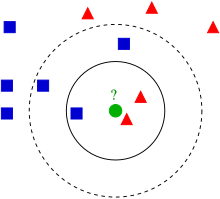
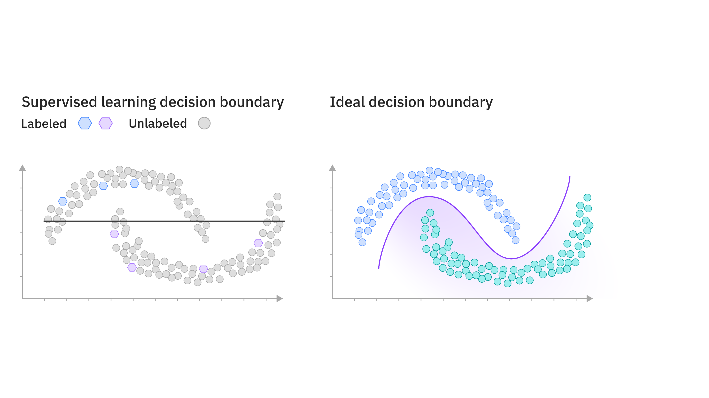
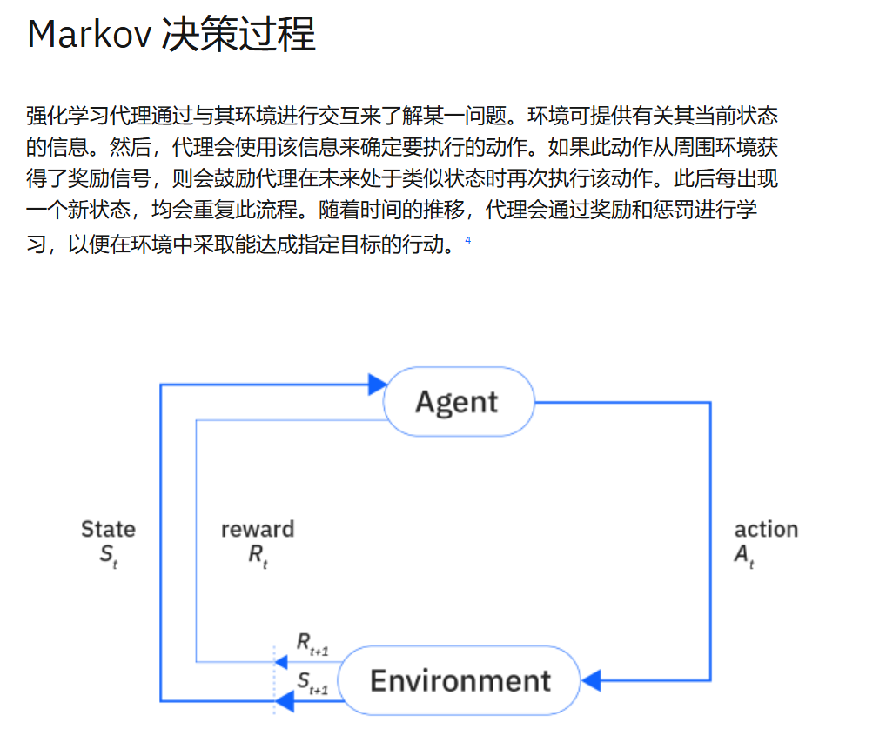

# **1.引言**

## **0.学习目的**

机器学习的含义;机器学习系统的计算流程;模式识别和机器学习

qguo2010@126.com 在3203实验室

>   **可咨询论文**

课堂成绩(考勤+上机[占比更大])40%+期末成绩60%）

## **1.基本概念**

###### **1.模式**

模式:数据中蕴含的规律

模式识别:从数据中识别和发现这些规律

>   执行方式:通过计算设备进行编程实现,这种计算设备就是机器

机器学习:机器从不具备某方面能力 到具备此能力 的学习过程

>   **这里的学习过程其实是优化问题**
>
>   **根据不同的学习过程,划分了不同的模型**
>
>   **机器学习的理论来源于实践(技术贡献大于理论贡献),并可以进一步反馈指导**
>
>   **机器学习的方法由人设计:其中包含借鉴人类的智能行为**

**(两者的区别只在于前者是工程的角度,后者是计算设备的角度)**

###### **2.投票选举**

**机器学习中的近邻法:根据当前样本最近的一个或多个样本的类别标签进行类别预测**

>   **绿色圆心就是预测结果**

###### **3.集成学习**

**解释:考虑学习多个预测器,并且将它们的预测结果进行集成的思路**

**问题:使用多少集成器?/加权参数?**

**deepseek的MoE架构:Mixture of Experts**

###### **4.主动学习**

**先标注少量重要样本,然后对未标注样本的主动选择性标注,减少人工标注的成本**

## **2.典型的机器学习系统**

###### **1.医学图像诊断(分类器)**

>   **a.人为提取图像特征(FE特征工程)**
>
>   **b.直接设计分类器隐式提取特征**
>
>   >   **确定分类器模型参数的过程是用数据进行训练的过程**

###### **2.时间序列识别(概率模型or not)**

>   **灵感:人体行为表现为一系列随时间连贯且具有依赖关系的轨迹**
>
>   **->对每类时间序列建立序列模型(通过概率模型或非概率模型)**
>
>   **a.运用隐马尔可夫模型/隐条件随机场模型/高斯过程动态系统(比较似然相对大小)**
>
>   **b.循环神经网络+监督学习(打好的标签就是监管信息)**

###### **3.对话系统(NLP+token)**

>   **对话系统定义:一种人与机器的双向信息交换系统**
>
>   **对话系统分类:领域任务对话系统(完成具体一项任务)/开放域对话系统(闲聊)**
>
>   **对话系统是多轮问答系统:**
>
>   >   **输入文本或语音->自然语言理解->对话管理->自然语言生成**
>
>   **对话系统涉及:语音识别/词性标注/命名实体识别/情感分析/强化学习/语言生成**

###### **4.异常检测(时序检测)**

>   **在线异常检测(计算并输出决策结果)+在线学习进行更新(概念漂移)**
>
>   **a.通过时间序列检测:对时间序列的异常值和真实值的偏离程度进行判定**

## **3.前沿方向举例**

###### **1.多视图机器学习(多模态)**

>   **复杂数据(自然语言处理:融合知识库+训练文本库的问答系统)中提取有用信息**
>
>   **a.对视图间相关关系的建模与发掘****建立正则化约束或概率依赖关系**
>
>   **多视图学习的复杂性(存在额外考虑)**
>
>   >   **学习任务的充分性/视图间的互补性/视图间噪音类型与量级的差异性**
>   >
>   >   **视图间异质导致的模型与算法的特异性/视图间时时序数据不同步/部分数据缺失**
>
>   

###### **2.强化学习(序列+决策)**

>   **定义:研究智能体(机器学习算法)如何同外部的交互中进行学习,其学习结果往往体现在什么状态下采取什么样的动作**
>
>   **解决的问题类型是序列决策问题**
>
>   **通过最大化收益->进行函数或策略的学习**
>
>   **根据不同动作所取得的效果选用不同的奖励值(最常见的马尔科夫决策)**
>
>   

###### **3.可信人工智能(机器学习缺点)**

>   **产生原因:数据(过度依赖数据)/训练(黑盒)/推理(掺入噪音)**

****

**后序安排**

**1.贝叶斯学习和概率图模型**

>   **贝叶斯学习基础/逻辑回归/概率图模型/隐马尔可夫模型/条件随机场**

**2.场景**

>   **监督/非监督+回归/分类/降维:**
>
>   **SVM/NN/DL/GP/Clustering/PCA**

**3.近似推理和强化学习**

>   **确定性近似推理/随机近似推理/强化学习**