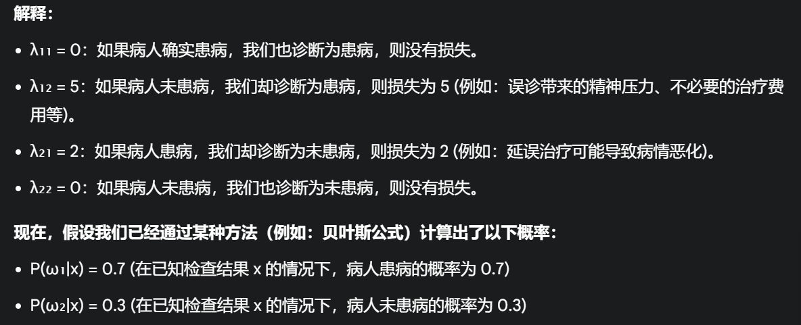

# **2.贝叶斯学习基础**

**<font color=red>只讲最基础的</font>**

>   **贝叶斯公式+贝叶斯决策(二分类)+贝叶斯分类器**

## **0.引言**

###### **1.机器学习的不确定性**

**(训练涉及不确定性)观测数据中学习模型->对未进行学习的数据进行预测**

**(数据涉及不确定性)带有噪声的数据**

**(模型涉及不确定性)训练的模型中的参数和模型结构是不确定的**

**(回答涉及不确定性)应该给出相关答案的概率,而不是错误的答案**

**<font color=red>概率理论为建模提供了不确定的框架可以量化这种不确定性</font>**

****

###### **2.基于概率模型的学习和预测**

**学习的定义:推理出合理的模型 用于解释观测数据的过程**

**预测的定义:利用学习好的模型对==未观测数据==进行相关推理,得到预测结果的概率分布**

>   **也就是说这里训练出的模型形式就是概率分布**

****

###### **3.贝叶斯决策定义**

**贝叶斯理论:贝叶斯公式+贝叶斯决策+贝叶斯参数估计**

**贝叶斯公式:贝叶斯学习的核心**

**贝叶斯决策:概率框架下进行统计决策的基本方法(分类决策+回归决策)**

**贝叶斯参数估计:对概率模型中参数进行估计的方法(最大似然估计+最大后验估计+贝叶斯参数估计)<font color=red>基于高斯分布的贝叶斯决策和朴素贝叶斯分类器</font>**

****

## **1.贝叶斯公式**

###### **1.贝叶斯公式组成**

**定义:贝叶斯公式也称为逆概率公式,为了计算逆向概率<font color=red>(计算后验概率)</font>**

>   ==**隐**==:无法量化的变量(存在但未知的内容)
>
>   **正向概率:根据建模假设中 隐含的因果关系 评估 观测数据的概率分布**
>
>   **逆向概率:根据和建模中的 观测数据 反推 相关的==隐变量==的概率分布**

**成分:(假设$\omega$是模型参数,$x$是变量参数)**

>   **先验概率(prior probability):没有观测数据情况下的概率:$\ p(\omega) $**
>
>   **似然概率(likelihood probability):给定变量$\ \omega $的条件下观测到x的概率$\ p(x|\omega) $** 
>
>   **后验概率(posterior probability)给定x的条件下观测到$\ \omega $的概率$\ p(\omega|x) $**
>
>   $$
>   p(\omega|x) = p(\omega)p(x|\omega)
>   $$

**按照变量存在的形式进行划分:**

>   **联合分布(joint probability):多个变量的联合 $\ p(\omega,x) $**
>
>   **边缘分布(marginal probability)单一变量的概率 $\ p(\omega)\  p(x) $**
>
>   **条件概率(conditional probability)条件下概率 $\ p(\omega|x)\ p(x|\omega) $**
>
>   **联合分布公式:<font color=Deeppink>(乘法公式)</font>**
>   $$
>   p(\omega,x)=p(x|\omega)p(\omega)\quad p(x,\omega)=p(\omega|x)p(x)
>   $$
>   **边缘分布公式:<font color=Deeppink>(除了改变了以外的变量求和)(连续则求积分)</font>**
>   $$
>   p(x) = \sum_x p(\omega,x)\quad p(\omega) = \sum_x(\omega,x)
>   $$
>   **贝叶斯公式:<font color=deeppink>主要通过联合分布公式进行推导</font>**
>   $$
>   p(\omega|x) = \frac{p(\omega,x)}{p(x)}(生成模型) = \frac{p(x|\omega)p(\omega)}{\sum_\omega p(\omega,x)}(标准先验似然)
>   $$

###### **2.贝叶斯存在的概率及其分类**

>   **1.是否有观测数据:先验概率/似然概率/后验概率**
>
>   **2.变量存在形式:联合分布/边缘分布/条件概率**

###### **小插曲:求解贝叶斯问题**

**1.明确问题**

>   **(a)明确问题**
>
>   **首先要明确问题是什么，我们想知道什么概率。是求条件概率还是后验概率(贝叶斯)**

>   **(b)寻找关键词：题目中通常会包含一些关键词，**
>
>   **例如 "已知...的条件下"、"在...的情况下"、"概率" 等**
>
>   **==需要求解的是条件概率或后验概率。==**

****

**2. 找出先验概率和似然概率**

>   **先验概率 P(ω)：** 
>
>   **指在没有观测值 (或证据) 的情况下，我们对某个事件发生的概率的预先估计。**
>
>   例如，在医学诊断例子中，P(ω₁) 可能表示在人群中，患病率是多少。
>
>   **<font color=red>(这个概率是根据以往经验或统计数据得到的，与本次具体的病人检查结果无关)</font>**

>   **似然概率 P(x|ω)：** 
>
>   **指在某个事件发生的情况下，我们观察到特定观测值 (或证据) 的概率。**
>
>   例如，P(x|ω₁) 表示在病人患病的情况下，我们观察到检查结果 x 的概率。
>
>   **<font color=red>(这个概率反映了疾病和检查结果之间的关联性)</font>**

>   **如何区分先验概率和似然概率？**
>
>   **时间顺序： 先验概率是 "先" 验，似然概率是 "后" 验。**
>
>   >   先验概率是我们事先已知的，似然概率是我们在事件发生后观察到的。
>
>   **条件关系： 先验概率不是条件概率，似然概率是条件概率。**
>
>   **实际意义： 先验概率通常表示我们对事件发生概率的预先估计，<font color=red>似然概率表示在事件发生的情况下，我们观察到特定证据的概率。</font>**

****

**3. 如何列出式子**

在列贝叶斯公式时，我们需要明确：

**哪个是事件 (ω)：** 我们想知道哪个事件的概率。

**哪个是观测值 (x)：** 我们已知哪些信息。

然后，根据贝叶斯公式：
$$
P(ω|x) = \frac{P(x|ω) \times P(ω)}{P(x)}
$$


将相应的概率填入公式即可。

**总结:如果通过某个事件得到某个概率,则确定为条件概率,进一步是贝叶斯求先验概率**

## **2.贝叶斯决策**

#### **1.贝叶斯决策**

###### **1.贝叶斯决策的定义**

**定义:一种概率框架下实施决策的基本方法**

**<font color=red>依据！！：通过决策的后验分布和错误决策的损失做出决策</font>**

**<font color=red>前提:==可以用概率分布的形式描述+与决策相关的概率分布是可计算的==</font>**

###### **Eg1:贝叶斯决策**

假设通过血糖水平（特征x）判断是否患糖尿病，分为两类：患病C1和健康C2。已知：

先验概率:$P(C_1)=0.01,P(C_2)=0.99$

条件概率:$p(x|C_1)$~$N(\mu= 140.\sigma^2=25)$,$p(x|C_2)$~$N(\mu= 100.\sigma^2=25)$ 

求x=130时是否患病:

>   1.计算条件概率
>   $$
>   p(x=130|C_1) = \frac{1}{\sqrt{2\pi\cdot 25}}e^{-\frac{(130-140)^2}{2\cdot 25}}\approx 0.0242
>   $$
>
>   $$
>   p(x=130|C_2) = \frac{1}{\sqrt{2\pi\cdot 25}}e^{-\frac{(130-100)^2}{2\cdot 25}}\approx 0.003
>   $$
>
>   2.计算后验概率
>   $$
>   P(C_1|x) = \frac{P(C_1)}{P(C_1,C_2)} = \frac{p(x|C_1)p(C_1)}{p(x|C_1)p(C_1)+p(x|C_2)p(C_2)} \approx 0.45
>   $$
>
>   $$
>   P(C_2|x) = 1-P(C_1|x) = 0.55
>   $$
>
>   3.决策
>   $$
>   P(C_1|x)<P(C_2|x)\quad \therefore 健康
>   $$

****

#### **2.最小错误率贝叶斯决策**

>   **解释:目标是希望决策的平均错误率尽可能小**

###### **Eg1:最小错误率贝叶斯决策(双样本)**

**方法:对于相同样本的p(x)相同,直接比较 $p(x,ω)$,并划分于P更大的$\omega$区域 **

>   **即$h(x) = \underbrace{argmax}_c\  p(\omega = c|x) $**

>   **在熊猫性别分类问题中,以下被认为是分类错误:**

>   **(<font color=red>使用$\ \omega $表示熊猫的雌雄,使用$\ x $表示熊猫是否干净 </font>)**
>
>   **若样本类别是1,被分为类别2**
>
>   **若样本类别是2,被分为类别1**
>   $$
>   p(error|x)=
>   \begin{cases}
>   p(\omega=1|x),& 如果x被判定为雄性(\omega = 2) \\
>   \\
>   p(\omega=2|x),& 如果x被判定为雄性(\omega = 1)
>   \end{cases}
>   \\
>   \\
>   \begin{equation}
>   p(error) = \int^{\infty}_{-\infty}p(error|x)p(x)dx =
>   \int_{R_1}p(x,\omega=2)dx+\int_{R_2}p(x,\omega=1)dx
>   \end{equation}
>   \\
>   
>   解释:应该划分R1类但是分为2;应该划分R2类但是分为1\\
>   $$
>
>   >   **<font color=Deeppink>注意这里R表示通过决策划分的不同区域</font>**
>   >
>   >   **所以如果希望 平均分类错误率 尽量小.则 $p(error)$也应该足够小**

###### **Eg2:最小错误率贝叶斯决策(多样本)**

**对于多分类问题,假设存在C个类别,特征空间被划分成c个R区域,那么决策的平均错误率**
$$
p(error) =[\int_{R_2}p(x,\omega=1)+\int_{R_3}p(x,\omega=1)+\cdots + \int_{R_C}p(x,\omega=1)]
\\
+[\int_{R_1}p(x,\omega=2)+\int_{R_3}p(x,\omega=2)+\cdots +\int_{R_3}p(x,\omega=2)]
\\
+\cdots+
\\
+[\int_{R_1}p(x,\omega=C)+\int_{R_2}p(x,\omega=C)+\cdots+\int_{R_{C-1}}p(x,\omega=C)]
\\
\Leftrightarrow p(error) =\sum^{C}_{i=1}\sum^{C}_{j=1,j\not =i}\int_{R_j}p(x,\omega = i)dx
$$
**<font color=red>正向求:如果有C个区域,一共需要求C(C-1)种</font>**

**<font color=red>反向求:只需要求C次</font>**

****

###### **Eg3:使用平均正确率$p(correct)$计算平均错误率$p(error)$**

$$
p(error)=1-p(correct) = 1-[\int_{R_1}p(x,\omega = 1)+\int_{R_2}p(x,\omega=2)dx \ + \ \cdots \ + \int_{R_C}p(x,\omega=C)dx  ] = 1-\sum^{C}_{c=1}\int_{R_C}p(x.\omega = c)dx
$$

>   **想要错误率$p(error)$最小,则$p(correct) $最大**
>
>   **最大化$\ p(correct)$等价于:**
>
>   **a.将x判别为联合概率$p(x,\omega) $最大类别**
>
>   >   **解释:如果某个类别与数据点x同时出现的概率最高，那么x最有可能属于该类别。**
>
>   **b.判别为后验概率$p(\omega|x) $最大的类别**
>
>   >   **解释:直接考虑了在已知数据点x的情况下.选择可能性最高的类别作为预测结果**
>

**<font color=red>最大正确率=最大联合概率</font>**

**<font color=red>p(x)数据的概率分布给定 = 最大化后验概率 = 算出所有后验概率取最大值,即</font>**
$$
(决策输出)h(x)=\underbrace{argmax}_c \ p(\omega = c|x)
$$

>   **如果是连续型,求极值找最大值/凸优化**

#### **3.最小风险贝叶斯决策**

**<font color=red>定义:将选取使得条件风险最小的决策,该决策也会使总体风险最小</font>**

**(直接使用风险乘以概率)**

**损失的定义:考虑多类分类问题.样本的真实类别为第j类,被误判为第i类的损失是:**
$$
\lambda_{ij} = \lambda(h(x)=i|\ \omega = j)
$$
>   **根本就是在识别错误的表达式前面加一个$\lambda $的风险(本来是j类,分到i类)**

**损失矩阵:对于C类分类问题,损失矩阵是一个$C \times C$的矩阵,==对角元素通常为0==**

**损失的含义:**

>   **a.条件风险:获得观测值后,决策造成的损失对实际所属类别的各种可能的平均**
>   $$
>   R(h(x)|x) = \sum_i \lambda(h(x)|\omega = i)\ p(\omega =i|x)
>   $$
>   **b.总体风险:条件风险对x的数学期望**
>   $$
>   R(h(x)) = \mathbb{E}(R(h(x))|x) = \int R(h(x)|x)p(x)dx
>   $$

**<font color=DodgerBlue>流程:给定损失矩阵的条件下计算每个决策的风险,选取最小的</font>**

**<font color=red>最小风险是使后验概率最小(风险矩阵是常量)</font>**

>   **<font color=red>风险计算公式:</font>**
>   $$
>   h(x) = \underbrace{argmin}_j \sum_i \lambda(h(x)=j|\omega = i)p(\omega = i |x)
>   $$
>   **λ(h(x)=j|ω=i)**  
>
>   表示当真实类别为ω=i时，做出决策h(x)=j(将x判为类别j)所产生的损失。
>
>   **p(ω=i|x)**  
>
>   表示在给定观测值x的情况下，x属于类别ω=i的后验概率。

###### **Eg1:根据风险计算公式计算最小风险贝叶斯决策(二分类)**

>   **使用$a_1$表示第一类,$a_2$表示第二类.所以损失矩阵是一个$2 \times 2$的损失矩阵**
>   $$
>   R(a_1|x) = \lambda_{11}p(\omega = 1|x)+\lambda_{12}p(\omega = 2|x)
>   \\
>   \\
>   R(a_2|x) = \lambda_{21}p(\omega = 1|x)+\lambda_{22}p(\omega = 2|x)
>   $$
>
>   ****
>
>   (假设我们使得第一类的风险最小,使用上面的2式减去1式)
>
>   **如果满足以下条件,则判断为第一类,否则为第二类**
>   $$
>   (\lambda_{21}-\lambda_{11})p(\omega =1|x)>(\lambda_{12}-\lambda_{22})p(\omega =2|x)
>   \\
>   或根据贝叶斯公式,将后验概率转换为似然概率和先验概率,即:
>   \\
>   (\lambda_{21}-\lambda_{11})p(x|\omega =1)p(\omega =1)>((\lambda_{12}-\lambda_{22})p(x|\omega =2)p(\omega =2)
>   $$
>   
>
>   
>
>   
>
>   

#### **4.最小错误率和最小风险贝叶斯的关系**

(在已知损失矩阵的条件下,优先使用最小风险)<font color=red>注意两类的判别</font>

**当决策定义为0-1损失时,条件风险等于条件错误率**
$$
\lambda(a_i|\omega=j)=
\begin{cases}
0,& i=j \\
\\
1,& i\not =j
\end{cases}
\\
\\
此时条件风险等于错误率,公式为:
\\
R(a_i|x) = \sum^{C}_{i=1}(a_i|\omega = j)p(\omega = j|x) = \sum_{j\not =i}p(\omega = i|x)
$$
**当损失函数为 0-1 分布时，最小风险贝叶斯决策、最小错误率贝叶斯决策和最大后验概率决策是等价的。<font color=Deeppink>我们选择后验概率最大的类别作为预测结果，就可以使分类错误率最小化。</font>**


****

**<font color=red>所以现在的主要问题就是求后验概率,然而后验概率同时也取决于数据的分布(一般使用性质好的正态分布,和可以无限求导的$e^x $来表示概率分布,同时可以使用数量频率)</font>**

#### **5.总结**

**最小错误率贝叶斯决策：**

-   **比较后验概率：** 选择**后验概率**最大的类别作为预测结果。
-   **决策规则：** h(x) = argmaxᵢ P(ωᵢ|x)
-   **直观解释：** 在已知观测值x的情况下，哪个类别出现的可能性最大，就将x归为哪个类

**最小风险贝叶斯决策：**

-   **计算条件风险：** 根据损失矩阵和后验概率，计算每个决策的条件风险。
-   **选择风险最小的决策：** 选择条件风险最小的决策作为预测结果。
-   **决策规则：** h(x) = argminⱼ ∑ᵢ λ(h(x)=j|ω=i) p(ω=i|x)
-   **直观解释：** 考虑不同决策带来的不同损失，选择平均损失最小的决策。

****

#### **6.Eg**

一个医学研究团队正在研究一种新的疾病诊断方法。他们已经收集了一些病人的数据，包括他们的年龄、性别和三项血液指标 (x₁, x₂, x₃)。现在他们想开发一个分类器，根据这些数据判断病人是否患有该疾病。**<font color=red>三维正态分布</font>**

**数据：**

```TXT
类别：ω₁：患病ω₂：未患病

先验概率：
P(ω₁) = 0.4 (人群中患病率为 40%)
P(ω₂) = 0.6 (人群中未患病率为 60%)

似然概率：
P(x|ω₁) 服从正态分布 N(μ₁ = [60, 150, 20], Σ₁ = I) (患病人群的血液指标分布)
P(x|ω₂) 服从正态分布 N(μ₂ = [40, 120, 10], Σ₂ = I) (未患病人群的血液指标分布)
(其中 I 为单位矩阵)
```

**损失矩阵**

| 决策/真实类别     | ω₁ (患病) | ω₂ (未患病) |
| ----------------- | --------- | ----------- |
| a₁ (诊断为患病)   | λ₁₁ = 0   | λ₁₂ = 5     |
| a₂ (诊断为未患病) | λ₂₁ = 2   | λ₂₂ = 0     |

**问题：**现在有一位病人的血液指标为 x = [50, 140, 15]。请使用最小风险贝叶斯决策，判断该病人是否患有该疾病。

>**解:**
>$$
>代入 x = [50, 140, 15]，μ_1 = [60, 150, 20]，μ_2 = [40, 120, 10]
>\\
>\\
>P(ω_1|x) =\frac{p(x|\omega_1)p(\omega_1)}{p(x)} = p(x|\omega_1)p(\omega_1)(相同样本)
>\\
>\Leftrightarrow (\frac{1}{\sqrt{2\pi^3}}) \times e^{-\frac{1}{2}(x-\mu_1)^T{(x-\mu_1)}}\times 0.4 \approx 0.143
>\\
>\\
>P(ω_2|x) =\frac{p(x|\omega_2)p(\omega_2)}{p(x)} = p(x|\omega_2)p(\omega_2)(相同样本)
>\\
>\Leftrightarrow (\frac{1}{\sqrt{2\pi^3}}) \times e^{-\frac{1}{2}(x-\mu_2)^T{(x-\mu_2)}}\times 0.4 \approx 0.857
>\\
>\\
>\therefore R(a₁|x) = λ₁₁ P(ω₁|x) + λ₁₂ P(ω₂|x) = 0 * 0.143 + 5 * 0.857 ≈ 4.285
>\\
>\\
>\therefore R(a₂|x) = λ₂₁ P(ω₁|x) + λ₂₂ P(ω₂|x) = 2 * 0.143 + 0 * 0.857 ≈ 0.286
>\\
>\\
>由于 R(a₂|x) < R(a₁|x)，因此我们选择 a₂ (诊断为未患病)。
>$$

****

## **3.分类器的相关概念**

#### **0.引入**

**机器学习需要设计分类器对图像加以判别,并且需要指定标准,并且对分类器加以评估**

**构建分类器:判别函数+决策面**

**评估分类器:计算分类器错误率**

#### **1.分类器/判别函数/决策面**

###### **分类器/判别函数/决策面**

**1.分类器:一个计算系统;计算一系列判别函数的值进行分类决策**

>   **<font color=red>即分类器 = 判别函数+决策面</font>**

**2.判别函数:输入特征的函数,结果可以直接用于分类决策(多个简单的or单个复杂的)**

**3.决策面:多个决策区域的边界**

###### **分类器处理流程**

>   a.**<font color=red>先提取特征向量x(比如通过图像的SIFT/SURF/LBP方法)</font>**
>
>   **b.将特征向量x划分为类别C**
>
>   **c.再输入空间中,使得$g_c(x) = g_{c'}x ,\forall c' \not= c$成立的超平面就是决策面**
>
>   (机器学习:构建C个决策函数,组合成分段函数)
>
>   (深度学习:直接使用一个连续函数)

###### **<font color=Purple>分类器的构建方法（三种方法）</font>**

**a.生成式模型构建分类器<font color=Deeppink>(朴素贝叶斯)</font>:**(基于概率框架和==联合分布==)

>   ==(不直接构建数据的概率分布,而是先构建联合分布,只要知道联合就知道似然...(最强大的,但是要N+1维[x是N维,Y是1]))==
>
>   只要学习后就十分灵活/但是需要大量数据)
>
>   1.构建学习输入特征和输出类别的 **联合分布**
>
>   2.贝叶斯公式 推导出输出类别的**后验分布**
>
>   3.结合 **决策损失函数** 构建 **判别函数** 进行分类决策

**b.判别式模型构建分类器<font color=Deeppink>(逻辑回归)</font>:**(基于概率框架和==条件分布==)

>   1.直接构建并学习 输出类别在输入条件下的 **条件分布**
>
>   2.结合 **决策损失函数** 构建 **判别函数** 进行分类决策

**c.直接构建判别函数<font color=Deeppink>(Fisher线性判别)</font>:**(不用概率表示)

==(输入一个x,输出一个类别,直接映射(最好理解的,但是可解释性差[没有显式表达式],相当于ANN)==

>   1.**构造函数** 直接建模输入特征和判别结果的关系
>
>   2.直接使用 构造函数 **进行决策**

#### **2.分类器错误率的计算**

###### **1.根据错误率的定义计算<font color=Deeppink>(如果联合分布条件分布有显式表达式)</font>**

>   计算要素:先验概率/类条件概率/判别函数
>
>   分类器:使用**正态分布**作为类条件似然的分类器

###### **2.计算错误率的上界<font color=Deeppink>(如果联合分布条件分布有显式表达式)</font>**

>   Radmacher复杂度理论/PAC-Bayes理论

###### **3.通过测试数据上进行分类试验来估计错误率<font color=Deeppink>(分类错误率复杂理论计算)</font>**

>   选取样本:使用独立于训练样本集的**测试集**进行估计
>
>   公式:只有0-1的平均值
>   
>   **<font color=red>只是相对于测试集,不一定正确</font>**
>
>   >   $$
>>   Error = \frac{1}{M}\sum^{M}_{i=1}I[h(x)\not = y_i]
>   >   \\
>>   (其中I[\cdot]表示单位函数.括号内条件满足则取1,否则取0)
>   >   \\
>>   
>   >   \therefore反过来,正确率为\quad 
>   >   
>   >   correct= \frac{1}{M}\sum^{M}_{i=1}I[h(x) = y_i]
>   >   $$

****

## **4.基于高斯分布的贝叶斯分类器**

###### **<font color=red>1.使用高斯分布的原因</font>**

>   **a.大多数数据是连续的数值,需要对 类条件分布 进行建模**
>
>   **b.变量最常用的分布就是高斯分布(正态分布)**
>
>   **c.使用高斯分布:观测值的多因素可以使用中心极限定理近拟正态分布/好算/可以用多个高斯分布线性组合近似**
>
>   (类似泰勒展开使用多项式逼近,分布也可以使用多个不同性质的正态分布进行逼近,即==高斯混合分布==)

###### **2.图像分类中的高斯分布**

>   **图像经特征提取后->得到特征向量->得到不同类特征向量的概率密度(这里是高斯分布)**
>
>   >   图像:由像素块构成的信息元
>   >
>   >   特征向量:来纳许的多元变量
>   >
>   >   类条件概率:不同类别的图像 特征向量的概率密度

###### **3.高斯密度函数**

>   **a.一元高斯密度函数**(期望是连续域的,均值是离散域的)==注意分母是sigma的平方,注意方差和标准差英语不同==
>
>   (线性代数中的$A_{MN}$无法计算行列式)
>   $$
>   p(x) = \frac{1}{\sqrt{2\pi}\sigma}e^{-\frac{1}{2}[\frac{x-\mu}{\sigma}]^2}\\\mu = EX = \int xp(x)dx\\\sigma^2 = E[(x-\mu)^2] = \int(x-\mu)^2p(x)dx
>   $$
>   **线性代数补充:**
>
>   **1.||x||表示长度**
>   $$
>   ||x|| =||x-0||= x^T x = \sqrt{x_1^2+x_2^2+\cdots +x_N^2} = ||x||_2(二范数)
>   $$
>   **2.内积$x^T y $**
>
>   >   $$
>   >   x_n\times y_n = x_1y_1+x_2y_2+\cdots + x_ny_n
>   >   $$
>
>   **3.矩阵可逆的必要条件**
>
>   >   行列式不等于0->如果行列式等于0,证明矩阵是奇异的
>   >
>   >   ->证明列向量之间是线性相关的
>
>   >   **一个矩阵的秩是1的意义**:所有向量可以用1组向量表示
>   >
>   >   ->如果存在矩阵,只用一列基向量和一行系数来表示(一行乘一列等于一个值,一列乘一行等于一个矩阵)
>
>   **4.秩:等于k化为三角行列式,表示最大线性无关组的个数就是k**
>
>   ->最大线性无关组可以通过线性组合表示出所有向量
>
>   5.线性表达式无穷解(空间)的通解就是最大线性无关组,就是空间的坐标(空间坐标不一定正交->施密特正交->只要正交化就可以使用新的向量在直角坐标系中表示)
>
>   **6.(复习的时候计算行列式的方法:化上三角矩阵通过对角线/X形法)**
>
>   **7.求逆矩阵(基于伴随矩阵初等行变化):一系列初等矩阵的乘积->计算机如何求小的逆矩阵**
>
>   **8.特征值和特征向量**
>
>   
>
>   ****
>
>   **b.多元高斯密度函数**
>   $$
>   p(x) = \frac{1}{(2\pi)^{\frac{d}{2}}|\sum|^\frac{1}{2}}e^{[-\frac{1}{2}(x-\mu)^T]\sum^{-1}(x-\mu)}
>   \\
>   \\
>   (其中\mu是均值,\sum是协方差,∣\sum_i|是协方差矩阵的行列式,d是数据维度)
>   $$
>   注意使用协方差表示数据之间的波动情况

###### **4.基于高斯分布的贝叶斯决策**

**a.假设类条件概率分布为高斯分布,即:**
$$
p(x|\omega = i) = \N (\mu_i,\sum_i)(i=1,2,\cdots,C)
$$
**b.贝叶斯决策得到的判别函数为:<font color=Deeppink>(避免数值下溢/简化计算/提高数值稳定性)</font>**
$$
g_i(x)=  p(x|\omega = i)\times p(\omega = i)
\\
\\
g_i(x)= ln \ p(x|\omega = i)+ln \ p(\omega = i)(对数转换)
\\
\\
\because p(x|\omega_i)=\frac{1}{(2\pi)^{\frac{d}{2}}|\sum_i|^{\frac{1}{2}}}e^{-\frac{1}{2}(x-\mu_i)^T\sum^{-1}_{i}(x-\mu_i)}
\\
\therefore g_i(x)=ln(\frac{1}{(2\pi)^{\frac{d}{2}}|\sum_i|^{\frac{1}{2}}}e^{-\frac{1}{2}(x-\mu_i)^T\sum^{-1}_{i}(x-\mu_i)})+ln \ P(\omega_i)(代入多元高斯函数)
\\
\Leftrightarrow 
\\
(书上到此位置)
\\
\Leftrightarrow g_i(x) = ln\frac{1}{(2\pi)^{\frac{d}{2}}}-\frac{1}{2}ln|\sum_i|+ln \ P(\omega_i)-\frac{1}{2}(x-\mu_i)^T\sum^{-1}_{i}(x-\mu_i)
\\
\Leftrightarrow g_i(x) =-\frac{d}{2}ln2\pi-ln|\sum_i|^{\frac{1}{2}}+ln\ P(\omega_i)-\frac{1}{2}(x-\mu_i)^T\sum^{-1}_i(x-\mu_i)
\\

\\
结果:
$$

>**避免数值下溢：** 对数函数是单调递增的，因此取对数不会改变概率的大小关系。
>
>**简化计算：** 对数函数可以将乘法运算转换为加法运算，简化了计算过程。
>
>**提高数值稳定性：** 对数函数可以展平概率分布，提高数值计算的稳定性。

**c.得到决策面:<font color=Deeppink>令$g_i(x) = g_j(x)$</font>**
$$
令g_i(x) = g_j(x):
\\

-\frac{1}{2}[(x-\mu)^T \sum^{-1}_{i}(x-\mu_i)-(x-\mu_j)^T\sum^{-1}_{j}(x-\mu_j)]+ln\frac{p(\omega_i)}{p(\omega_j)}-\frac{1}{2}ln\frac{|\sum_i|}{|\sum_j|}=0
$$

****

**当协方差相等时,当先验概率又相同时,当先验概率不同的时候,中点x0需要移动**

>   将判别函数问题估计联合密度函数问题->转化为估计协方差矩阵问题
>   $$
>   \begin{align}
>   \therefore g(\mathbb{D},A) &= -\sum^{k}_{i=1}(\frac{|D_i|}{|D|})ln(\frac{|D_i|}{|D|}) - \sum^{v}_{j=1}(\frac{|D_i|}{|D|)(-\sum^{k}_{i=1}(\frac{|D^j_i|}{|D^j|})ln(\frac{|D_i|}{|D|}))\\&= -sum^{k}_{i=1}(\frac{|D_i|}{|D|})ln(\frac{|D_i|}{|D|})+\sum^{v}_{j=1}\sum^{k}_{i=1}(\frac{|D^j_i|}{|D|})ln(\frac{|D^j_i|}{|D^j|})
>   \end{align}
>   $$
>   

## **5.基于高斯分布的贝叶斯分类器(特殊情况)**

**当所有类别的协方差矩阵都相同时**

###### **1.决策公式和决策面**

$$
\because \sum_1 = \sum_2 = \cdots = \sum_n
\\
(从代入高斯多元函数后开始)
\\
\because g_i(x) =-\frac{d}{2}ln2\pi-ln|\sum_i|+lnp(\omega = i)-\frac{1}{2}(x-\mu_i)^T\sum^{-1}_i(x-\mu_i)
\\
(忽略常数项-\frac{d}{2}ln2\pi-ln|\sum_i|)
\\
\therefore g_i(x)= -\frac{1}{2}(x-\mu_i)^T \sum^{-1}(x-\mu_i)+lnp(\omega = i)
\\
(进一步忽略i无关项,转置展开)
\\
\because (A-B)^T = A^T - B^T
\\
\therefore g_i(x)  =-\frac{1}{2}(x^T\sum_{-1}x - 2x^T\sum^{-1}+\mu^T_i \sum^{-1} \mu_i)+lnp(\omega = i)
\\

\therefore  g_i(x) = (\sum^{-1}\mu_i)^Tx - \frac{1}{2}\mu_i^t\sum^{-1}\mu_i + lnp(\omega = i)
$$

**<font color=Deeppink>此时判别函数是x的线性函数,决策面是一个超平面</font>**
$$
(将g_i(x) = g_j(x)代入等式)
\\
\therefore (\sum^{-1}\mu_i)^Tx - \frac{1}{2}\mu_i^t\sum^{-1}\mu_i + lnp(\omega = i) = 
(\sum^{-1}\mu_j)^Tx - \frac{1}{2}\mu_j^t\sum^{-1}\mu_j + lnp(\omega = j)
\\
(提取公因子\sum^{-1})
\\
\therefore(\sum^{-1}(\mu_i-\mu_j))^T x = \frac{1}{2}(\mu^T_i \sum^{-1}\mu_i - \mu^T_j\sum^{-1}\mu_j)+ ln\frac{P(\omega = j)}{P(\omega =i)}
\\
(左右各自假设)
\\
\omega^{T}_{ij}x = c_{ijj}
$$

###### **2.错误率公式(最小错误率)**

$$
p_1(error) = \int^{\infty}_{r_B}p(r|\omega=1)dr = \int^{\infty}_{\frac{r_B+m}{\sigma}}(2\pi)^{-\frac{1}{2}}e^{-\frac{1}{2}\sigma^2}d\sigma
\\
p_2(error) = \int^{r_B}_{-\infty}p(r|\omega=2)dr = \int^{\frac{r_B-m}{\sigma}}_{-\infty}(2\pi)^{-\frac{1}{2}}e^{-\frac{1}{2}\sigma^2}d\sigma
\\
(r_B = ln\frac{p(\omega = 1)}{p(\omega = 2)},\sigma = \sqrt{2m})
$$


## **6.决策面性质**

**<font color=Deeppink>$\omega^{T}_{ij}x = c_{ijj}$</font>**

>**如果特征空间是二维的 (x 是二维向量)**，则决策面是一条 **直线**。
>
>**如果特征空间是三维的 (x 是三维向量)**，则决策面是一个 **平面**。
>
>**在更高维度中**，它仍然是一个超平面，是线性子空间。

**<font color=Deeppink>$\omega^{T}_{ij}x$</font>**

>**这个向量的方向垂直于决策面。它指向从类别$ ω_j $的均值$ μ_j $到类别$ ω_i $的均值$ μ_i $的方向，并且通过协方差矩阵$ ∑_{−1} $进行了调整。**
>
>**$ ∑_{−1} $的作用可以理解为对特征进行了“白化”或者缩放，考虑到了数据在不同方向上的 spread。**

**<font color=Deeppink>$ c_{ijj}$</font>**

>**这个标量决定了超平面的位置**。
>
>$\frac{1}{2}(\mu^T_i \sum^{-1}\mu_i - \mu^T_j\sum^{-1}\mu_j)$与均值$ μ_i $和$ μ_j $到原点的马氏距离有关，并由$ ∑_{−1} $加权。
>
>$ln\frac{P(\omega = j)}{P(\omega =i)}$反映了先验概率的影响

## **7.朴素贝叶斯分类器**

###### **0.引入问题**

**传统贝叶斯分类器:<font color=Deeppink>类条件概率分布+类先验概率</font>**

>   **类条件概率分布:需要所有特征的联合概率分布->数据特征多,维度就大(大小为$2^D$)**
>
>   **类条件概率数值:存在概率分布极小,甚至为0(离散型))**

###### **1.解决问题**

**朴素贝叶斯分类器:<font color=red>前提是假设"特征条件独立"(相互不影响)</font>(目的是不用再重新计算联合分布)**

>   **<font color=Navy>D个元素间相互条件独立:D个元素的联合分布->D个独立概率分布相乘</font>**

$$
p(\omega|x) = \frac{p(\omega)p(x|\omega)}{p(x)}\Rightarrow p(x_1,x_2,\cdots,x_d|\omega) \Rightarrow p(\omega)\prod^D_{d=1}p(x_d|\omega)(表示和p(x_d|\omega)正相关)
$$

>   通过条件独立,将d维降维d个1维

###### **2.分类器结果**

$$
argmax_w p(\omega)\prod^{D}_{d=1}p(x_d|\omega)
\\
Eg:P(x_1|\omega)P(x_2|\omega)\cdots P(x_n|\omega) = ln(x_1+x_2+\cdots+x_n|\omega)
$$


## **8.参数估计**

###### **0.参数估计以及概率论补充**

**作用:在概率模型训练中的使用<font color=Deeppink>通过已有的数据预估位置参数</font>**

**分类:最大似然估计(MLE)/最大后验估计(MAP)/贝叶斯估计(BE)**

**相关概念补充:**

>**概率:在已知参数的情况下,描述事件发生的可能性**
>
>**似然:在已知事件发生的情况下,反过来衡量不同的参数值**
>
>**似然函数:条件概率(已知事件发生作为条件),找到一个参数值,使得L(p)最大**
>
>>   因为 L(p) 越大，就意味着在这个 p 值下，这个结果的可能性最大
>>
>>   因此我们更有理由相信这个 p 值是“真实的”参数值。

**类条件概率分布的估计:**

>   **策略1:最大似然估计/最大的后验估计->确定唯一参数值<font color=Deeppink>(得到参数值)</font>**
>
>   **策略2:贝叶斯参数估计得到参数的后验分布<font color=Deeppink>(得到参数后验分布)</font>**

###### **1.最大似然估计(MLE)**

**核心思想:找到一组参数,在这些参数下,观测到现有数据的可能性越大==(最大化似然函数)==**

**<font color=Deeppink>核心方法:</font>**

>   **1.根据事件写出似然函数$L(\theta|D) $**
>
>   **2.最大化似然函数$\theta_{MLE}^{MAX} = \underbrace{argmax}_{\theta}\quad p(D|\theta) = \mathbb{N}(D|\mu,\sum) $(涉及$\mu$向量和协方差)**
>
>   >   **<font color=Deeppink>通常通过最大化对数似然函数$LogL(\theta|D) $,求导数使其为0</font>**
>>
>   >   **(对数函数单调递增,且可以转换乘积变为求和)**

**(如果事件之间是独立的,一般是数据集中所有数据点概率的乘积(独立同分布))**
$$
lnp(D|\theta) = \sum^{N}_{i=1}lnp(x_i|\theta)
$$
**(如果分布式基于高斯分布)**
$$
\sum^{N}_{i=1}lnp(x_i|\theta) = \sum^{N}_{i=1}ln\mathbb{N}(x_i|\mu,\sum)
$$


**基于高斯分布的贝叶斯分类器的MLE似然估计:**

>   $$
>   类条件密度公式:\sum^N_{i=1}lnp(x_i|\theta) = \sum^N_{i=1}ln \N(x_i|\mu,\sum)(参数:均值和协方差矩阵)
>   \\
>   \therefore \mu_{m1} = \frac{1}{N}\sum^{N}_{i=1}x_i \quad \sum_{m1} = \frac{1}{N}\sum^{N}_{i=1}(x_i-\mu_{m1})(x_i-\mu_{m1})^T
>   $$
>
>   **涉及矩阵求导:matrix cookbook**

**特点:简单直观/数据量大的情况下性质优良/数据量小容易过拟合/未考虑先验知识**

###### **2.最大后验概率(MAP)**

**核心思想:在MLE的基础上==考虑参数的先验分布==,通过贝叶斯公式获取参数的后验分布**

>   **<font color=red>最大后验估计:给定观测数据条件下找到*后验概率*分布最大的模型参数</font>**

**贝叶斯公式变形**

>   $$
>   argmax_\theta P(\theta|D) = argmax_\theta \frac{P(D|\theta)P(\theta)}{P(D)} = argmax_\theta lnp(D|\theta)+lnp(\theta)
>   \\
>   \\
>   P(\theta|D) 是后验概率:给定数据下参数\theta的概率(最大化目标)
>   \\
>   P(D|\theta)是似然:给定参数\theta的情况下,数据D的概率
>   \\
>   P(\theta)是先验概率:在观测数据前,对\theta的认知
>   \\
>   P(D)是证据(归一化常数):不作为影响常数部分
>   \\
>   \\
>   
>   \therefore 只需要P(\theta|D) = P(D|\theta)P(\theta)\rightarrow让分子最大化
>   $$

**<font color=Deeppink>核心方法:</font>**

>   **1.选择先验分布:常见的有t分布/f分布/beta分布(二项分布)/高斯分布**
>
>   **2.写出后验概率的分子:$P(D|\theta)P(\theta)$**
>
>   **3.最大化后验概率分子:$\theta_{MAP} = log[P(D|\theta)P(\theta)] = logP(D|\theta)+logP(\theta) $**

**特点:结合先验知识/数据量大:正则化效果降低过拟合风险**

**基于高斯分布的贝叶斯分类器的MLE似然估计:**

>   $$
>   首先估计先验分布:协方差已知,给出均值的最大后验估计
>   \\
>   (均值范围没有约束,假设其服从高斯分布\mu:\N(0,\sum_\mu)\ )
>   \\
>   \\
>   \therefore lnp(\mu|D) = \sum^{N}_{i=1}ln\mathbb{N}(x_i|\mu)+ln\mathbb{N}(\mu,\sum+\mu)+ln\mathbb{N}(\mu,0)
>   \\
>   \Leftrightarrow \sum^{N}_{i=1}ln\N(x_i|\mu,\sum)+ln\N(\mu|0,E_{\mu})-lnp(D)
>   $$

###### **3.MLE和MAP**

**性质:==在均匀分布(无信息先验时)估计相等==**

###### **4.期望最大算法(EM)<font color=red>(存在隐变量[Latent variable]时使用)</font>**

>   **隐变量:一个数据点可能来源于多个分布,包含隐变量的数据叫不完整数据**
>
>   **核心思想:通过迭代优化算法,求解带有隐变量的概率模型的最大似然/最大后验估计**
>
>   ()
>
>   **核心方法:考虑概率模型,X是观测变量集,Z是隐变量集.$\theta$是模型参数**
>
>   >   **对数似然函数**
>   >   $$
>   >   L(\theta) = lnp(X|\theta) = ln \int_P(X,Z|\theta)dZ
>   >   $$
>   >   **<font color=Deeppink>交替迭代E-M步骤,直到模型参数收敛到一个稳定值，或者达到预设的迭代次数。</font>**
>   >
>   >   **E步:<font color=red>给定模型参数估计值情况下->估计隐变量的期望值(或后验分布)</font>**
>   >
>   >   **M步:<font color=red>给定隐变量的期望值(或后验分布)情况下->估计模型参数估计值</font>**
>   >
>   >   (收敛条件$||\theta^{t+1}-\theta^{t}||<\epsilon_1,或 ||Q(\theta^{t+1})-Q(\theta^{t})||<\epsilon_1$)

###### **5.贝叶斯参数估计(BE)**

**<font color=red>不能得到准确的点估计值,而是给出参数的完整后验分布</font>**

**核心思想:将参数视为随机变量,关注参数整个后验分布**

**<font color=Deeppink>核心方法:</font>**

>   **1.选择合适的先验分布(和MAP一样)**
>
>   **2.计算后验分布(和MAP一样)$P(D|\theta)P(\theta)$**
>
>   **<font color=red>3.不再最大化似然函数,而是分析后验分布(均值/中位数/置信区间/预测分布)</font>**
>
>   **4.贝叶斯预测分布:对所有可能的参数进行加权平均**
>
>   (重新写P38页的公式)
>   $$
>   P(y_{new}|x_{new},D) = \int P(y_{new}|x_{new},\theta)P(\theta|D)d\theta
>   $$

**特点:完整的后验分布/预测更加稳健/理论上更完备/但计算复杂(蒙特卡洛方法)**

>   **对于超级复杂的后验分布的归一化积分,就没有解析解了**
>
>   **(使用马尔科夫链蒙特卡洛方法(MCMC))/Metropolis-Hastings算法或Gibbs采样**
>
>   

****

## **2023-2024期末考试**

**预测传送带传过来的时鲈鱼还是鲑鱼,其中鲈鱼c1和鲑鱼c2两类的先验概率分布分别为:0.72和0.28.现有一待识别的鱼,其光泽度为x,从条件概率表上查得:鲈鱼光泽度较为明亮,P(x|c1)=0.3;鲑鱼较为灰暗,P(x|c2)=0.1.** 

****

 **(1)简述朴素贝叶斯分类器的原理** 

>   **<font color=Deeppink>朴素贝叶斯分类器是一种基于"贝叶斯定理"和"特征条件独立性假设"的分类算法。</font>**
>
>   **贝叶斯定理:**
>   $$
>   P(c|x) = \frac{P(x|c)P(c)}{P(x)}
>   \\
>   P(c|x)是后验概率
>   \\
>   P(x|c)是条件概率
>   \\
>   P(c)是先验概率
>   \\
>   P(x)是证据/归一化因子
>   $$
>   **特征条件独立性假设:**
>
>   **<font color=Deeppink> “朴素”之处在于它假设所有特征在给定类别下是条件独立的</font>**

****

 **(2)给出后验概率P(c|x)和朴素贝叶斯分类器的表达式** 

>$$
>P = {argmax}_{D}P(c|x),D\in(c1,c2)
>\\
>\\
>如果 P(c1∣x)>P(c2∣x)，则预测为 鲈鱼 (c1)
>\\
>如果 P(c2∣x)>P(c1∣x)，则预测为 鲑鱼 (c2)
>$$

 **(3)使用贝叶斯决策对鱼的类别进行预测并进行分析(要求具体的计算过程和结果)**

>   **1.计算证据P(x)**
>
>   >   $$
>   >   P(x) = P(x|c1)P(c1)+P(x|c2)P(c2)=
>   >   \\
>   >   (0.3\times0.72)+(0.1\times 0.28)=0.244
>   >   $$
>
>   **2.计算鲈鱼的后验概率$P(c1|x) $:**
>
>   >$$
>   >P(c1|x) = \frac{P(x|c1)P(c1)}{P(x)} = \frac{0.3\times0.72}{0.244}\approx 0.8852
>   >$$
>
>   **3.计算鲈鱼的后验概率$P(c2|x) $:** 
>
>   >   $$
>   >   P(c2|x) = \frac{P(x|c2)P(c2)}{P(x)} = \frac{0.1\times0.28}{0.244}\approx 0.1148
>   >   $$
>
>   **4.比较后验概率得出结论**
>
>   >   **$P(c1|x)>P(c2|x) $,所以应该是鲈鱼c1**

**<font color=Deeppink>(在基本事件相同的前提下可以只比较分子)</font>**

****

## **Gemini的调侃**

**1.“朴素” 贝叶斯，其实一点都不“傻白甜”！**

> **“朴素” 只是说它假设特征之间“在给定类别下是条件独立的”，**

**2.选择先验，可是个技术活儿，得结合你的领域知识和直觉，不能太任性哦！ 😉**

**3. 证据虽然在分类决策时可以简化，但在其他时候，比如你想计算真实的后验概率，或者想评估模型好坏，证据就跳出来刷存在感了！  它可是模型好坏的“照妖镜”，别忘了它的重要性！  🧐**

4.决策边界，“线性”虽好，但“世界是弯的”！ 线性贝叶斯分类器虽然好用，但也要看场合，别指望它能解决所有问题！ 😅

5.蒙特卡洛方法，“算不过就靠抽” 的 “歪门邪道” ，但真香！


Local-Scale Invariant Feature 局部尺度不变特征
