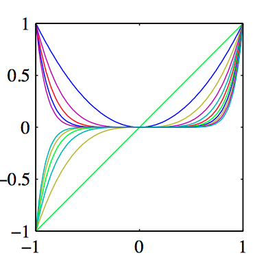
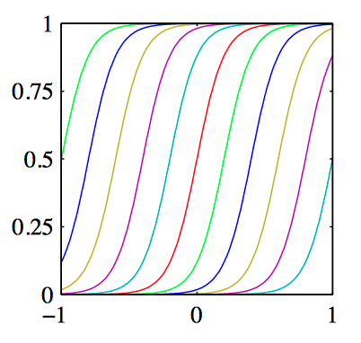

# **3.逻辑回归**

## **0.引入**

###### **1.判断任务类型**

**监督学习定义:都是通过训练有标注的样本 学习输入输出的关系**

**监督学习任务分类:分类和回归**

>   **分类:输出取值是==有限个离散值==->特殊的取值为1和0时为二分类**
>
>   **回归:输出取值是==连续值==**

**逻辑回归:是一种分类方法,而不是回归方法**

>   **传统的逻辑回归:处理二分类问题**
>
>   **新式的逻辑回归:引入softmax函数可处理多分类问题**

**逻辑回归:从线性回归转变而来,通过引入sigmoid函数实现输出的非线性转换**

## **1.线性回归**

#### **1.线性回归定义**

**N个样本的数据集,线性回归模型假设自变量x和因变量y之间是线性关系,并由回归系数构建**

对应线性代数里面Ax=b（注意解释x的意义）

下面的式子$\beta_0 $可以表示偏移，$x^T_i $表示内积（内积的计算在本学期最后的时候进行讲解）

$\beta$的计算方式：==(通过线性代数$ n\not= D+1 $一定不存在唯一解)==5
$$
\begin{bmatrix}
y_1\\y_2\\\vdots \\y_n
\end{bmatrix}
=
\begin{bmatrix}
\beta_1\\\beta_2\\\vdots\\\beta_{D+1}
\end{bmatrix}
\begin{bmatrix}
x_1\\x_2\\\vdots\\\ x_D
\end{bmatrix}
$$
**如果存在没有解的情况，需要求出近似解**

**如果存在自由变量，则有无数个解，叫欠定方程**

>   **但是机器学习中存在特征数远小于数据集x个数的情况，叫做超定方程（约束条件太多了，没有解）**
>
>   解决方法：求近似解
>
>   >   所以需要引入高斯噪声进一步逼近真实解
>   >   $$
>   >   y_i = \beta_01+\beta_1x_1+\cdots+\beta_Dx_D +\epsilon = \Phi(x)^T\beta+\epsilon\quad(i=1,2,\cdots N)
>   >   \\\\
>   >   (其中\beta_0称作截距项或偏置项,\Phi(x)是基函数向量,\epsilon是高斯随机噪声)
>   >   $$

实际应用中自变量不一定是直接是x和y，而是处理后的数据（比如图片大小不同，它们的维数就不同）/非线性变换后的数据（比如sigmoid）

#### **2.基函数的非线性映射变换**

###### **0.基函数**

**基函数:对输入特征进行变换的函数,使得线性回归拓展到非线性**

**基函数的作用:线性模型拓展到非线性,特征工程的一种形式**

**常见的基函数:**

###### **1.多项式基函数**

$$
\Phi_j(x) = x^2_j,x^3_j,\cdots,x^d_j(捕捉非线性关系)
$$

###### **2.高斯基函数**

$$
\Phi_j(x) = e^{-\frac{(x_j-\mu_j)^2}{2s^2}}(用于局部逼近)
$$

###### **3.Sigmoid基函数**

$$
\Phi_j(x) = \sigma(\frac{x-\mu_j}{s}) = \frac{1}{1+e^{-x_j}}(引入非线性)
$$

###### **4.傅里叶基函数**

$$
\Phi_j(x) = sin(2\pi_jx_j),cos(2\pi_jx_j)(用于周期性数据建模)
$$

###### **5.高斯噪声**

**噪声项$\epsilon$是服从均值为0的高斯分布,即$\sigma ;N(0,\sigma^2) $**

**主要目的:简化观测误差/添加随机性/高斯分布的可解释性强,可使用中心极限定理逼近**

#### **3.最小二乘法与最大似然估计(MLE)**

###### **1.最小二乘法**

**定义:最小二乘指最小化误差的平方和**

**最小二乘问题描述:**

>   **N个数据点($x_i,y_i$)的数据集,模型函数$f(x,\beta)$中$\beta$包含了D个可调整的参数**
>
>   **最小二乘法的目的:使得调整模型函数的参数,使得函数拟合数据集**
>
>   **误差:因变量的真实值和模型预测值之间的差**

**核心思想:通过最小化平方误差和S学习最优参数值**

>   **为什么是平方而不是绝对值，因为|x|的导数是-+1不连续**  
>
>   **$x^2 $是严格凸函数，可以求关于$\beta$的偏导数等于0得到最小值对应的$\beta$**
>
>   **损失函数：误差的平方（平方误差函数）**
>   $$
>   S = \sum^{N}_{i=1}e^2_i = \sum^{N}_{i=1}(y_i- f(x_i,\beta))^2
>   \\
>   SSE(\beta) =\sum^{N}_{i=1}(y_i-\beta^T \Phi(x_i))^2
>   \\
>   几何解释:寻找最佳拟合直线或超平面使得数据点和直线的垂直距离平方和最小
>   $$

==**求解最小二乘问题**==

>   **平方和的最小化可通过"==将优化目标关于参数的导数设为0求解=="->推广到D个参数**
>   $$
>   \frac{\partial S}{\partial \beta_d} = 0 ,d=1,2,\cdots,D
>   $$
>   **代入S:**
>   $$
>   -2\sum^{N}_{i=1}(y_i -f(x_i,\beta))\frac{\partial f(x_i,\beta)}{\partial \beta_d} = 0
>   $$

###### **2.最大似然估计**

**目标:在找到一组模型参数 $ (\beta,\sigma^2)$使得似然函数($LogL(\beta,\sigma^2) $)最大化**
$$
高斯概率密度：f(x|\mu,\sigma^2) = \frac{1}{\sqrt{2\pi\sigma^2}}e^{-\frac{(x-\mu)^2}{2\sigma^2}}
\\ \\
假设数据点符合均值为\beta^T \Phi(x_i),方差为\sigma^2
\\ \\
似然函数：L_i(\beta,\sigma^2) = \frac{1}{\sqrt{2\pi\sigma^2}} e^{-\frac{(y_i - \beta^T\Phi(x_i))^2}{2\sigma^2}}
\\ \\
又所有整个数据集的似然函数是每个数据点似然度的乘积
\\ \\
L(\beta,\sigma^2) = \prod^N_{i=1}L_i(\beta,\sigma^2) = \prod^N_{i=1}[\frac{1}{\sqrt{2\pi\sigma^2}} e^{-\frac{(y_i - \beta^T\Phi(x_i))^2}{2\sigma^2}}]
\\ \\
(对数化)lnL(\beta,\sigma^2) = -\frac{1}{2\sigma^2}\sum^{N}_{i=1}(y_i-\beta^T \Phi(x_i))^2-\frac{N}{2}ln(2\pi\sigma^2)
\\ \\
\Leftrightarrow -\frac{1}{2\sigma^2}SSE-\frac{N}{2}ln\sigma^2 - \frac{N}{2}ln(2\pi)（全部都是常数项都可以消去）
$$

###### **3.最小二乘法和最大似然估计的等价性**

**在最大似然估计的分布是高斯分布的前提下！！**
$$
-\frac{1}{2\sigma^2}\sum^{N}_{i=1}(y_i-\beta^T \Phi(x_i))^2-\frac{N}{2}ln(2\pi\sigma^2)
\\
\Leftrightarrow -\frac{1}{2\sigma^2}SSE-\frac{N}{2}ln\sigma^2 - \frac{N}{2}ln(2\pi)\\（全部都是常数项都可以消去）
$$

###### **4.最小二乘法求解最优参数值$\beta $**

$$
\begin{align}
SSE(\beta)&=\sum^{N}_{i=1}(y_i - f(x_i,\beta))^2 =\sum^{N}_{i=1}(y_i-\beta^T \Phi(x_i))^2(数据点角度)\\
\\
SSE(V)&= (y-\Phi\beta)^T(y-\Phi\beta)(向量角度)\\
\\
求导：\frac{dS}{d\beta}&= \frac{d((y-\Phi\beta)^T(y-\Phi\beta))}{d\beta} = 0(这里0也是向量)\\
\\
\therefore \beta &= (\Phi^T\Phi)^{(-1)}\Phi^T y(最小二乘法和最大似然同解)
\\
 \\ \sigma^2 &= \frac{1}{N}\sum^{N}_{i=1}(y_i - f(x_i,\beta))^2(额外的,将\beta带回得到最大似然的分布)
\end{align}
$$

****

#### **4.正则化最小二乘与最大后验**

###### **1.欠拟合和过拟合**

欠拟合：对于多项式回归而言，回归系数的数量过少，无法拟合

过拟合：对于多项式回归而言，回归系数的数量过多，模型过于复杂

###### **2.正则化以及求解正则化最小二乘**

**1.正则化**

将参数$\beta$代入需要优化的损失函数，在准确度和模型复杂度间进行trade-off

其中$\beta$过小，惩罚项越没有作用；$\beta$过大，过于参考惩罚项
$$
(带有正则化的损失函数)\sum^{N}_{i=1}(y_i-f(x,\beta))^2+\lambda\beta^T\beta
$$
**2.求解正则化最小二乘**
$$
\begin{align}
S'&=\sum^{N}_{i=1}(y_i-f(x,\beta))^2+\lambda\beta^T\beta
\\ \\
\frac{dS'}{d\beta} &= \frac{d((y_i-f(x,\beta))^2+\lambda\beta^T\beta)}{d\beta} = 0
\\ \\ 
\therefore \beta&= (\lambda I+\Phi^T\Phi)^{-1}\Phi^T y
\end{align}
$$

###### **3.L1正则化(Lasso Regression,Lasso回归)**

**本质：关闭部分参数元（限制数量）所以正则化效果最强**
$$
L1目标函数: J(\beta)=\frac{1}{2}\sum^{N}_{i=1}(y_i-\beta^T\Phi(x_i))+\lambda||\beta||_1
$$
**缺点：凸不光滑不可导（四个点上不可导，并且受方向约束（求导后存在分段函数））**

###### **4.L2正则化(Ridge Regression,岭回归)**

**本质：将参数元大小限制在一定范围内（限制大小）**
$$
L2目标函数:J(\beta) = \frac{1}{2}\sum^{N}_{i=1}(y_i - \beta^T \Phi(x))^2+\frac{\lambda}{2}||\beta||^2_2
$$

>   **作用:减小模型复杂度/降低过拟合风险/提高模型的泛化能力**

###### **5.(补充)p范数**

$$
||p||=(|x_1|^p+|x_2|^p+...+|x_n|^p)^p
$$

>   p=4时，可能存在较好的性质（需要研究）
>
>   $p= \frac{1}{2},\frac{1}{3},\frac{2}{3}$可能存在较好的性质(只能得到局部最优解，但是也比全局最优解强)
>
>   >对应图解的话就是小于1的幂函数对应的四象限
>   >
>   >得到的$\beta$是极端稀疏的（比L1还要稀疏）

###### **6.(补充)凸函数**

**判断方式：能找到一条直线，图像在一侧**

###### **7.正则化最大后验估计**

$$
假设\alpha = \frac{\lambda}{\sigma^2}的时候
\qquad先验分布:p(\beta|\alpha) = \mathbb{N}(\beta|0,\alpha^{-1}I)
\\ \\
lnp(\beta|X,y,\alpha,\sigma^2) = -\frac{1}{2\sigma^2}\sum^{N}_{i=1}(y_i-f(x_i,\beta))^2 - \frac{\alpha}{2}\beta^T\beta + const
\\ \\
\therefore \beta= (\lambda I+\Phi^T\Phi)^{-1}\Phi^T y(和正则化最小二乘同解)
$$

## **2.贝叶斯线性回归**

###### **0.前提**

对于求得的$\beta$直接代入线性回归公式得到预测值

**缺点:数据集小$\beta$不准确, 不能再使用点估计,而是需要求出y的分布估计**

**使用场景:供应链存储预测存储量**

###### **1.贝叶斯线性回归**

**回归系数$\beta$假设为有特定先验分布的随机变量(也是一种先验分布)**

**(也是对beta的一种约束,和正则化的约束意义相同)**

**最后可以根据分布进行预测,也可以根据均值方差进行预测**
$$
给定线性回归：y_i = x_i^T+\epsilon\quad \therefore \epsilon = y_i-x^T_i
\\ \\
假设随机变量独立同分布,则\epsilon服从(0,\sigma^2)高斯分布
\\ \\
L(\beta,\sigma^2) = \prod^N_{i=1}L_i(\beta,\sigma^2) = \prod^N_{i=1}[\frac{1}{\sqrt{2\pi\sigma^2}} e^{-\frac{(y_i - \beta^T\Phi(x_i))^2}{2\sigma^2}}]
\\ \\
\therefore 似然函数\quad p(y|X,\beta,\sigma^2)\Theta(\sigma^2)^{-\frac{N}{2}}e^{-\frac{1}{2\sigma^2}(y-X\beta)^T(y-X\beta)}(向量形式)
$$

>   (参数的先验概率为模型提供了额外信息)
>
>   **因为后验分布可能没有解析解，==可以设置似然函数的共轭先验==（参数是$\beta,\sigma^2$）**
>
>   **1.设置联合先验:$p(\beta,\sigma^2) = p(\sigma^2)p(\beta|\sigma^2)$**
>
>   **2.设立等式**
>   $$
>   \begin{cases}
>   p(\sigma^2)服从逆伽马分布 &  p(\sigma^2)\Theta(\sigma^2)^{-a_0-1}e^{-\frac{b_0}{\sigma^2}}\\
>   \\
>   p(\beta|\sigma^2)服从正态分布\mathbb{N}(\mu_0,\sigma^2\Alpha^{-1}_0)
>   & p(\beta|\sigma^2)\Theta e^{-\frac{1}{2\sigma^2}(B-\mu_0)^T\mathbb{A}_0(\beta-\mu_0)}\\
>   \\
>   p(\beta,\sigma^2|y,X) =  p(\beta|\sigma^2,y,X)p(\sigma^2|y,X)&p(y|X,\beta,\sigma^2)p(\beta|\sigma^2)p(\sigma^2)
>   \end{cases}
>   $$
>
>   **3.代入联合先验公式得到贝叶斯后验分布**
>
>   **4.得到最后的参数**

**现实中都不是指数为底的分布的时候(正态分布/逆伽马分布/拉普拉斯分布)**

>   **使用多个简单分布叠加/使用泰勒展开(使用多项式逼近)->逼近论**

## **3.逻辑回归**

**逻辑回归本身是回归模型,但是其特性可以满足分类任务**

>   **本身不执行分类,而是输出一个概率->进一步处理,选择概率更大的作为分类结果**

#### **1.二类逻辑回归**

###### **1.sigmoid函数**

**不仅需要这个函数,还需要设置一个阈值**
$$
sigmoid(x) = \frac{1}{1+e^{-x}}\\
\\
x属于正类的概率:p(x=1|x) = \sigma(\theta^T x) = \frac{1}{1+e^{-\theta^T x}}\\
\\
x属于负类的概率:p(x=0|x) = 1-p(x=1|x) = \frac{1}{1+e^{\theta^T x}}\\
\\
$$

###### **2.sigmoid函数的最大似然**

**标签是二分类,所以服从0-1分布(伯努利分布)**
$$
\begin{align}
\therefore p(y|\theta) &= \prod^{N}_{i=1}p(y_i=1|x_i)^{y_i}(1-p(y_i=1|x_i))^{(1-y_i)}\\
\\
(对数化去乘法)-lnp(y|\theta)&=-\sum^{N}_{i=1}[y,lnp(y_i=1|x_i)]+(1-y_i)ln(1-p(y_i=1|x_i))\\
\\
&(最后还需要代入1.中的概率就可以得到参数\beta)
\end{align}
$$

###### **3.sigmoid函数的损失函数**

信息论需要学

上机作业:解释熵\交叉熵\使用代码实现交叉熵

刻画离散值的差异:直接做差

刻画分布之间的差异:交叉熵

熵小一致:即两个分布逐渐相似
$$
\begin{align}
预测分布&:p(y_i|x_i)\\
\\
真实分布&:q(y_i=1|x_i) = y_i\qquad q(y_i=0|x_i) = 1-y_i\\
\\
交叉熵&:L(q(y_i|x_i),p(y_i)|x_i)) = -\sum_{y_i}q(y_i|x_i)lnp(y_i)|x_i)\\
\\
交叉熵损失函数J(\theta)&=-\sum^{N}_{i=1}[y_ilnh_\theta(x_i)+(1-y_i)ln(1-h_{\theta}(x_i))]\\
\\
&h(x)就是sigmoid函数
\end{align}
$$

**最大似然估计和信息论得到的目标函数是一样的**

###### **4.sigmoid的参数优化方法**

**一阶:梯度下降法/二阶:牛顿法**(开销过大,计算海森矩阵)

得不到闭式解只能得到数值解(近似的向量)
$$
\grad_\theta J(\theta) = (\frac{dJ(\theta)}{d\theta})^T = [\frac{\sum^{N}_{i=1}[(\sigma(\theta^T x_i)-y_i)x^T_i]d\theta}{d\theta}]^T
 = \sum_i x_i[h_\theta(x_i)-y_i]\\
\\
d\sigma(x) = \sigma(x)(1-\sigma(x))dx
$$

**如果甚至梯度都求不出来,就需要==逼近论==**

#### **2.多类逻辑回归**

###### **1.softmax函数**

$$
对于c个标签C\in\{1,2,\cdots,C\}\\
\\
p(y_i=c) = \frac{e^{\theta^T_k x_i}}{\sum^{C}_{k=1}e^{\theta^T_k x_i}}
$$

**还是需要得到概率以后进行处理,选择最大的概率**

(使用指数函数进行映射的原因:区分程度大)

(使用C个概率的和进行归一化)

###### **2.softmax函数的最大似然**

对于N个样本,每个样本对C个标签都有对应的值(不一定非是One-hot),加起来等于1

**==可以进一步求对数似然函数==**
$$
p(y|\theta_1,\theta_2,\cdots,\theta_C) = \prod^{N}_{i=1}\prod^{C}_{i=1}p(y_i = c|x_i)^{I(y_i=c)}
$$

###### **3.softmax函数的损失函数**

对于N个样本,每个样本对C个标签都有对应的值,正确的只有一组参数解

所以$I(y_i=c)$表示完全匹配的解,$p(y_i=c|x_i)$表示其它解

**==进一步通过逼近或下降法==**
$$
-lnp(y|\theta_1,\theta_2,\cdots,\theta_k) = -\sum^{N}_{i=1}\sum^{C}_{c=1}I(y_i=c)lnp(y_i=c|x_i)
$$

## **4.贝叶斯逻辑回归**

学习出参数的逻辑分布,后验分布$p(\theta|X,y) $难以有解析解,使用典型分布$q(\theta)$来近似后验分布

**使用近似分布进行预测:$p(y=1|x)\approx \int\sigma(\theta,x)q(\theta)d\theta $(求期望的公式)**

**求近似的方法**

>   1.首先后验=先验\times 似然(书上的是二类似然分布)
>
>   2.使用拉普拉斯近似->得到近似高斯分布
>
>   3.预测分布需要对sigmoid和高斯分布的乘积求积分,十分麻烦->使用逆probit函数近似

**拉普拉斯近似:有个协方差矩阵**

**逆probit函数近似:先换元,引入Dirac delta函数进行近似**

>   Dirac函数:在某个区间激增,常用于取样(理论分析)

## **5.信息论(熵和交叉熵)**

## **需要回忆的内容**

对于$S = (y-\Phi B)^T(y-\Phi B)  $

>   注意$a^Ta = ||a|| = \sqrt{a^2_1+a^2_1+\cdots+a^2_n}  = \sqrt{(y-y_1)^2+(y-y_2)^2+ \cdots (y-y_n)^2} $ 
>
>   ||a||可以说成a的范数，也可以说成a的长度
>
>   需要了解向量的求导

对于概率方向，对连乘求导数的好处：连乘变成连加，e的指数被带出来了

Ridge-Regression & James-Stein:就是岭回归的求解

