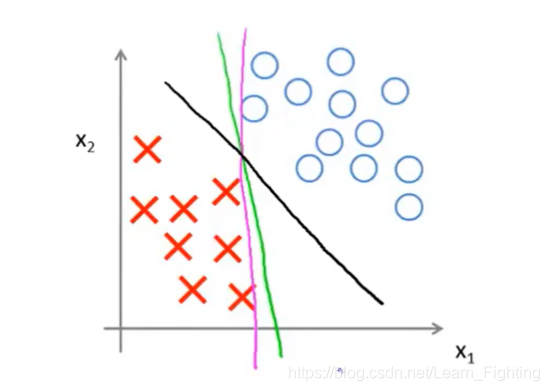
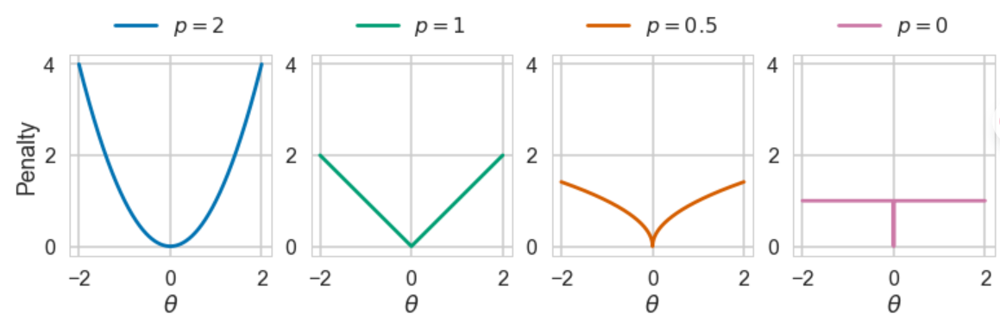

# **SVM 支持向量机**

## **0.Intro**

**再往前推一点：寻找超平面区分标签($h(x)=sign(wx+b)$)**

>**给定数据集$\mathbb{D} = \{(x^{(n)},y^{(n)})\}^N_{n=1} $,$y_n \in \{+1.-1\} $**
>
>**==如果样本是线性可分的,即存在超平面==$\omega^T x+b = 0 $**
>
>>   两类样本分开,则对于每个样本,都有$y^{(n)}(\omega^T x+b)>0 $
>>
>>   (则同号证明预测正确)

**支持向量机的思想:结构风险最小化原理(带有正则化项的)**

>   **(结构风险)从正则化的角度看**
>   $$
>   \therefore \mathbb{R}(\omega) = \frac{1}{2}||y-X^T\omega||^2 + \lambda||\omega||
>   $$
>   **(结构风险)从风险的角度看**
>
>   >   再训练的时候损失低+结构足够简单=在处理样本分布的时候最优
>   >
>   >   (奥卡姆剃刀原理:Occam's Razor)
>
>   **如何判断函数的复杂程度(避免过拟合):==VC拓展维==**
>
>   >   对于已经标注好的数据点,能划分两者间的线性分类器有很多(横着竖着斜着)
>   >
>   >   **然而大间隔原理就能保证,VC拓展维度最小,也就是函数复杂度最小,也就满足奥卡姆**
>   >
>   >   
>
>   **大间隔原理**
>
>   >   对于给定不同标签的数据点,可以存在多个超平面进行划分,但是只有最大间隔的超
>   >
>   >   平面是最优的(即到不同标签的最近样本点的距离是最远的	

**半监督学习\多视图学习\多任务学习结合的benchmark**

## **1.基本支持向量机SVM**

###### **1.初始化**

**对于面向二分类的==线性可分==的训练集,包含N个样本**

###### **2.超平面以及间隔距离**

**分类超平面的参数表示:$f(x) = w^T x +b $(w是超平面的==法向量==,b是偏差)**

**分类输出(使用0-1函数):**

>   $$
>   h(w) = sign(w^T x+b) 
>   \\ \\
>   \therefore h(w)\begin{cases}
>   1&if\ w^Tx_0+b>0\\
>   \\
>   0&if\ w^Tx_0+b\leq0
>   \end{cases}
>   $$

**任意点x到该超平面的距离是:**

>   $$
>   d = \frac{|w^T x+b|}{||w||} =\frac{y|w^T x+b|}{||w||} =  y|w^T x+b|(保证距离为正数)
>   $$

**距离和间隔距离**

>   **==假设点到超平面的距离为M==,则有**
>   $$
>   \begin{align}
>   w^T x+b &= M
>   \\
>   \\
>   w^T x+b &= -M
>   \end{align}
>   $$
>   **则间隔距离应该是$M-(-M)=2M$**

###### **3.构建基本SVM**

>   **通过约束||w||=1来固定法向量模长**
>   $$
>   \begin{align}
>   max_{w,b}\qquad& M\\
>   \\
>   s.t.\qquad &  y_i(w^Tx_i+b)\geq M\\
>   \\
>   &||w||=1
>   \end{align}
>   $$
>
>   ****
>
>   **通过除以M使得距离从M变成了1$\therefore\frac{|w^T x+b|}{||w||}= \frac{1}{||w||} $真正的集合距离是$2M$,也就是$\frac{2}{||w||} $**
>   $$
>   \begin{align}
>   max_{w,b}\qquad & \frac{2}{||w||}\\
>   \\
>   s.t.\qquad & y_i(w^Tx_i+b)\geq 1\\
>   \\
>   &\qquad ||w||=1
>   \end{align}
>   $$
>   **目标函数求导求解(所以再变化一下),带约束的函数->拉格朗日求解**
>
>   ==**SVM核心公式**==
>   $$
>   \begin{align}
>   max_{w,b}\qquad&\frac{1}{2}||w||^2\\
>   \\
>   s.t.\qquad &y_i(w^Tx_i+b)\geq 1\\
>   \end{align}
>   $$

==存在约束大于1==

###### **4.拉格朗日对偶优化**

**对于约束写成标准形式:**
$$
y_i(w^Tx_i+b)\geq 1\Rightarrow 1-y_i(w^Tx_i+b)\leq 0
$$
**拉格朗日函数L(w,b,a)在原目标函数加上约束项乘以对应的乘子:**
$$
g(a)=L(w,b,a) = \frac{1}{2}||w||^2-\sum^{N}_{i=1}a_i(y_i(w^T x_i+b)-1)
$$

**使用前提:带有约束的最优化问题(此处只有一个约束)**

**使用依据：g(a)一定小于或等于原优化问题的最优解**

**存在问题：无法求解拉格朗日问题的a**

>   **原问题是最小化问题->转化为极大化最大化问题（对偶问题）**
>
>   $min_{w,b}L(w,b,a) \Rightarrow max_{a_i\geq 0}min_{w,b}L(w,b,a)$
>
>   几何解释:引入了惩罚项a,不满足支持向量的数据点会设置为$+\infty $

$$
\frac{\partial L}{\partial w} = 0\Rightarrow \sum^{N}_{i=1}a_iy_ix_i\\
\frac{\partial L}{\partial b} = 0\Rightarrow \sum^{N}_{i=1}a_iy_i
$$

>**其中$a_i $可以确定学习时候的支持向量(SVM的核心)**
>
>**将两个偏导结果带回拉格朗日函数$L(w,b,a)$**

$$
\begin{align}
\therefore g(a) &= \frac{1}{2}||w||^2-\sum^{N}_{i=1}a_iy_iw^Tx_i+\sum^{N}_{i=1}a_i\\
& = \sum^{N}_{i=1}a_i-\frac{1}{2}
\sum^{N}_{i=1}\sum^{J}_{j=1}a_ia_jy_iy_jx_ix_j
\end{align}
$$

**最后原问题的变形,得到以下内容**
$$
\begin{align}max \qquad&
g(a) = \sum^{N}_{i=1}a_i-\frac{1}{2}
\sum^{N}_{i=1}\sum^{J}_{j=1}a_ia_jy_iy_jx_ix_j
\\
\\
s.t.\qquad & a_i \geq 0,\sum^{N}_{i=1}a_iy_i=0
\end{align}
$$
**迭代求解a**

****

**得到a以后带回公式:**
$$
\begin{align}
w* &= \sum^{N}_{i=1}a^*_i y_ix_i(代入公式)
\\
\\
b* &= y_k-w^{*T}x_k(代入一个支持向量)
\end{align}
$$

****

**模型推理:**
$$
h(x)=sign[wx+b]=sign[\sum^{N}_{i=1}y_ia_ix^Tx_i+b](代入x_i)
$$

## **2.线性不可分的分类**

#### **1.线性不可分的策略** 

**主要策略:(1,3)是同一种测类**

>   **使用非线性分类器:隐式表达式(FNN)**
>
>   ==**强行使用存在bias的线性分类SVM**==
>
>   **修改原数据点分布:高维映射**

#### **2.软间隔SVM**

###### **1.L0范数和Hinge损失**

**允许误差的SVM:引入损失函数铰链损失(Hinge Loss)**

==**目标:最小化误差+最小化误差样本个数(避免关闭过多数据点)**==

>   (相当于引入)$L_0$范数:判断N个样本中是否大于0
>
>   但是L0范数是分段函数
>   $$
>   ||\theta||_0 = \sum^{|\theta|}_{j=1}z_j
>   $$
>   
>
>   

>   **所以引入Hinge损失,等价于L0范数**
>   $$
>   \mathbb{l}(y) = max(0,1-t\cdot y) = max(0,1-y_i(wx_i+b))
>   $$
>   引入损失函数的目的是构造软SVM同时避免排除过多数据点

**==但即使这样还需要避免硬间隔->引入松弛变量==**

>   $$
>   \begin{align}
>   (hard)y_i(wx_i+b)&\geq 1
>   \\
>   \\
>   (soft)y_i(wx_i+b)&\geq 1-\xi
>   \end{align}
>   $$
>

###### **2.软间隔SVM的标准公式**

$\therefore $ 软间隔SVM的标准公式

>   $$
>   \begin{align}
>   min &\qquad \frac{1}{2}||w||^2+c\sum^{N}_{i=1}\xi_i
>   \\
>   \\
>   s.t. &\qquad y_i(w^Tx_i+b)\geq 1-\xi_i
>   \\
>   \\
>& \xi_i\geq 0(i=1,2,\cdots,N)
>   \end{align}
>   $$
>   (c是超参,需要grid_search或者bayes_search)
>   
>   在目标函数中引入$\xi $的原因,让模型更偏向于准确率

###### **3.软间隔SVM参数学习**

(引入了$\xi $和其对应解除约束的乘子$\beta $)

>
>   $$
>   L(w,b,\xi,a,\beta) = \frac{1}{2}||w||^2+C\sum^{N}_{i=1}\xi_i-\sum^{n}_{i=1}a_i(y_i(wx_i+b)-1+\xi_i)-\sum^{N}_{i=1}\beta_i\xi_i
>   \\
>   \\
>   \therefore\qquad
>   \begin{align}
>   \frac{\partial L}{\partial w}&\Rightarrow w =\sum^{N}_{i=1}a_iy_ix_i
>   \\ \\
>   \frac{\partial L}{\partial b}&\Rightarrow \sum^{N}_{i=1}a_iy_i
>   \\ \\
>   \frac{\partial L}{\partial \xi}&\Rightarrow C-a_i-\beta_i
>   \\ \\
>   \end{align}\
>   $$
>
>   **带回原SVM公式,得到对偶问题,使用QP方法求解a**
>   $$
>   \begin{align}
>   max\qquad & \sum^{N}_{i=1}a_i-\frac{1}{2}\sum^{N}_{i=1}\sum^{N}_{j-1}a_ia_jy_iy_jx_i^Tx_j
>   \\
>   \\
>   s,t & \qquad 0\leq a_i\leq C,\sum^{N}_{i=1}a_iy_i=0
>   \end{align}
>   $$
>
>   **带回得到w和b**
>   $$
>   \begin{align}
>   w^* &= \sum^{N}_{i=1}a^*_i y_ix_i\\
>   b^* &= y_k-\sum^{N}_{j=1}a^*_jy_j(x_j\cdot x_k)(解析解偏置)
>   \\
>   &=\frac{1}{|S|}\sum_{k\in S}\bigg(y_k-\sum^{N}_{j=1} a^*_jy_j(x_j\cdot x_k)\bigg)(均值偏置)
>   \end{align}
>   $$

###### **4.模型预测**

>   $$
>   h(x) = sign(\sum^{N}_{i=1}y_ia_ix^Tx_i+b)
>   $$

**非线性SVM的训练时间更长并且存在误差**

****

#### **3.非线性的高维映射(核函数策略)**

###### **1.核心思想**

**通过非线性的换将数据映射到特征空间,在特征空间中学习线性模型**

**采用线性变换将数据映射到特征空间,可以拟合线性关系.==通过将核函数和线性方法的设计进行解耦,增强SVM的模块化特点==**

###### **2.核函数**

设x和z来自空间$\Tau$,满足下式的函数k称为核函数:
$$
k(x,z) = <\Phi(x),\Phi(z)>(内积)
$$

**其中$\phi $是从空间$\Tau $到希尔伯特空间F的映射(F是特征空间)**

>   希尔伯特空间:一种完备的正定性的内积空间(内积结果大于等于0)
>
>   如果不满足核函数的性质可能无法解题(对偶目标函数可能非凹,优化问题非凸)
>
>   内积$a = (a_1,a_2,\cdots,a_n),b=(b_1,b_2,\cdots,b_n),<a,b>= a_1\times b_1+\cdots a_n\times b_n $

###### **3.判断核函数**

**1.定义法**

代入任意两个输入后是否等于先映射再内积的结果

**2.有限半正定性**

正定:$x^T Ax>0$,半正定:$x^T Ax\geq 0$,不定:$(x^T Ax)(y^T Ay)?$

对于空间中任意**==有限子集==**,通过代入核函数构造对称矩阵K,如果矩阵式半正定的

>   1.选择**==有限数据集==**($x_1,x_2,\cdots,x_n $)
>
>   2.构建核矩阵(第i行第j列对应的是两个点的集合($x_i,x_j $))
>
>   3.检查核矩阵是否对称:$K(x_i,x_j) = K(x_j,x_i) $
>
>   4.检查核矩阵是否半正定:计算特征值大于等于0

**半正定对核函数的影响**

>   1.保证了数据集都分布再希尔伯特特征空间
>
>   2.保证了对偶问题优化的凸性

**如果是非线性可分的数据,低维度基本无法使得其线性可分**

###### **4.核技巧**

**找核映射十分困难,使用核技巧**

如果机器学习算法,关于输入样本的运算,可以完全通过样本间的内积表示,那么可以假设这种内积作用于输入样本的某种映射(也就是看作已经经过内积了,直接内积即可)

>   避免查找映射
>
>   其中f(x)=wx+b中wx的计算就是内积操作
>
>   $\therefore $
>   $$
>   wx\Rightarrow w\Phi(x) = \sum^{N}_{i=1}a_iy_i\mathbb{K}(x_i,x)
>   $$
>   $\therefore $原目标函数
>   $$
>   \begin{align}
>   max\qquad & \sum^{N}_{i=1}a_i-\frac{1}{2}\sum^{N}_{i=1}\sum^{N}_{j-1}a_ia_jy_iy_j\mathbb{K}(x_i^Tx_j)
>   \\
>   \\
>   s,t & \qquad 0\leq a_i\leq C,\sum^{N}_{i=1}a_iy_i=0
>   \end{align}
>   $$

之前K是超参数,现在变成映射了,所以存在以下核函数

高斯核函数

>   $$
>   x_ix_j = e^{-\frac{(||x_i-x_j||^2)}{2\sigma^2}}(\sigma需要自行设定)
>   $$

****

模型拓展:回归问题和多分类问题
