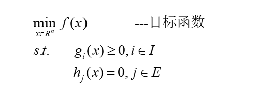

# **OPT**

## **0.课程设置**

平时成绩:40%(主要是作业/随堂测)

考试成绩:60%

xppanxiao@163.com

**教材:最优化理论与算法 陈宝林/运筹学与最优化 吴祈宗**

**参考书:数学规划 清华大学出版社**

## **1.运筹学的定义**

**运筹学:为决策机构在对齐控制下的业务活动进行决策时,提供的量化为基础的科学方法**

**运筹学部分:运用分析理论/竞争理论/随机服务理论**

## **2.运筹学的应用原则**

**合伙原则:和有关人员合作**

**催化原则:善于引导人们改变一些常规看法**

**互相渗透原则:多部门彼此渗透考虑**

**独立原则:不受特殊情况所左右**

**宽容原则:不局限在某一特定方法上**

**平衡原则:考虑各种矛盾得平衡/关系的平衡**

## **3.运筹学解决问题的步骤**

**提出问题:目标/约束/决策变量/参数**

**建模:变量/参数/目标间关系**

**模型求解:数学方法及其它方法**

**解的检验:指定检验准则**

**灵敏性分析:参数扰动对解的影响情况**

**解的实施:回到实践中**

**后评估:考察问题有无圆满解决**

## **4.(对模型)运筹学模型的构造思路和评价**

**将目标变量和关系表示出来**

**1.直接分析法**

**2.类比方法**

**3.模拟方法**

**4.数据分析法**

**5.试验分析法**

**6.构想法**

**评价:易于理解/易于探查错误/易于计算**

## **5.最优化的定义**

**定义:在所有可能方案中血案则最合理的一种方案,达到最佳目标的科学**

**实现方式:寻找最优方案,即通过最优化方法**

**是运筹学的方法论之一,并不是分开的学科**

## **6.最优化的组成**

**1.最优化/数学规划方法**

>   **连续优化:线性规划/非线性规划/非光滑优化/全局优化/变分法/二次规划/分式规划**
>
>   **离散优化:组合优化/网络优化/整数规划**
>
>   **几何规划**
>
>   **动态规划**
>
>   **不确定规划:随机规划/模糊规划**
>
>   **多目标规划**
>
>   **对策论**

**2.随机过程方法(研究生用)**

>   **统计决策理论**
>
>   **马氏过程**
>
>   **排队论**
>
>   **更新理论**
>
>   **仿真方法**
>
>   **可靠性理论**

**3.统计学方法(数学专业用)**

>   **回归分析**
>
>   **群分析**
>
>   **模式识别**
>
>   **试验设计**
>
>   **因子分析**

## **7.最优化的发展历程**

**1.费马1638,牛顿1670**
$$
min \ f(x) ,\frac{df(x)}{dx}=0
\\
(其中f(x)是公式,x是数)
$$

>   **缺陷:只能求凸函数的最小值(求导等于0的点)**

****

**2.欧拉1755**
$$
Min \ f(x_1,x_2,\cdots,x_n),\grad f(x)=0
$$

>   **缺陷:梯度下降法(求偏导)**

****

**3.拉格朗日1797**
$$
Min \ f(x_1,x_2\cdots,x_n)
\\
s.t.g_k(x_1,x_2,\cdots,x_n)=0,k=1,2,\cdots,m
\\
s.t是约束条件
$$

>**欧拉拉格朗日:无穷维问题,变分学**
>
>**柯西:最早应用最速下降法**

## **8.电子计算机的最优化**

**线性规划->单纯型方法->动态规划/最优性原理->非线性规划->Cook理论/组合优化**

## **9.最优化基本形式**

**注意这里约束函数有n个:有`等式约束`和`不等式约束`**
