# **第1章 引言**

## **1.简述(看ppt)**

#### **1.食谱问题(线性规划)**

>| 维生素    | 奶中含量 | 蛋中含量 | 每日需求 |
>| --------- | -------- | -------- | -------- |
>| $V_c$(mg) | 2        | 4        | 40       |
>| $V_B$(mg) | 3        | 2        | 50       |
>| 单价(US)  | 3        | 2.5      |          |
>
>**目标:最低可能的花费购买这些事物,满足最低限度的维生素需求量**

>   **解:**
>
>   1.下定义:x是牛奶的量,y是蛋的量
>
>   2.目标函数:
>   $$
>   Min \quad Z = 3x+2.5y
>   $$
>   3.线性规划:
>   $$
>   s.t. \quad 2x+4y \geq 40
>   \\
>   3x+2y \geq 50
>   \\
>   且 x\geq 0,y\geq 0
>   $$
>   4.图解法(15,2.5)

****

#### **2.运输问题(双变量约束)**

>   **某物资有m个产地$A_1,A_2,\cdots,A_n $,各地的产量为$a_1,a_2,\cdots,a_m $,有n个销地$B_1,B_2,\cdots,B_n $ **
>
>   **假如从产地$A_i$到销地$B_j$运输单位的物品运价是$c_{ij}$,如何调运使得总运费最小?**

>   1.设变量:
>
>   个数为$x_{ij} $
>
>   2.目标函数
>   $$
>   min Z = \sum^{n}_{i=1}\sum^{m}_{j=1}c_{ij}x_{ij}
>   $$
>   3.约束条件
>   $$
>   \sum^{n}_{i=1}x_{ij}= a_i,i=1,2,\cdots,m\\
>   \sum^{m}_{j=1}x_{ij}= b_j,j=1,2,\cdots,n\\
>   其中x_{ij}\geq 0 \begin{cases}
>   i=1,2,\cdots,m \\
>   j=1,2,\cdots,n
>   \end{cases}
>   $$

****

#### **3.税下投资问题(三级时间约束)**

>   **以价格$q_i$买到了$s_i$个股票,股票i的现价是$p_i$,一年后股价为$r_i$**
>
>   **出售的时候支付税金=收益的30%**
>
>   **扣除税金后现金仍然比购买股票前增多**
>
>   **支付1%的交易费用**

>1.设变量:
>
>$x$:当前抛出股票i的数量
>
>$q_i$:买入的价格 $p_i$:股票的现价 $r_i$:一年后股票的价格
>
>2.目标函数:
>$$
>max \ 
>\sum^{n}_{i=1} r_i(s_i-x_i
>)
>\\
>s.t.\sum^{n}_{i=1}p_ix_i - 0.30\sum^{n}_{i=1}(p_i-q_i)x_i-0.10\sum^{n}_{i=1}p_ix_i\geq c
>\\
>a.股票的现价 \quad b.利益的30\%(现价-买入) \quad
>c.手续费(买入价格的10\%)
>$$
>
>

****

#### **4.选址问题(可行域不平衡)**

>   **已知:一组潜在位置,一组顾客集合,相应的利润和费用数据**
>
>   **解:设施开放的数量,位置,具体方案**
>
>   **目标:总利润最大化**

>   1.设变量:
>
>   $J=\{1,2,...,n\}$是可能的位置集合,$I=\{1,2,...,n\}$是顾客集合
>
>   ($c_{ij}$是设施$j$服务顾客$i$所得利润,$f_{ij}$是开设设施所需费用,$y_{ij}$是是否开设)
>
>   2.目标函数:
>   $$
>   首先有\
>   y_{ij} = \begin{cases}
>   1,& 顾客i在j处设施服务 \\
>   0,否则
>   \end{cases}
>   \ i\in I,j\in J
>   \\
>   目标函数理解:所有开设的设施利润-顾客使用设施的损失
>   \\
>   (注意:这里可以开设多个,顾客只使用一部分)
>   \\
>   max \ \sum_{i\in I}\sum_{j\in J}c_{ij}y_{ij} - \sum_{j\in J}f_jx_j
>   \\
>   s.t \sum_{j\in J}y_{ij} = 1,\forall i \in I
>   \\
>   y_{ij}\leq x_{ij},\forall i \in I,\forall j \in J
>   \\
>   x_j \in \{0,1\},\forall j \in J
>   \\
>   y_{ij}\in \{0,1\},\forall i \in I,\forall j \in J
>   $$
>

## **2.线性与非线性规划问题**

**线性规划问题:目标函数和约束函数都是线性的**

**非线性规划问题:数学模型中含有非线性函数**

**可行点:满足约束条件的点**

**可行集/域:全体可行点**

>   **特殊的,如果问题的可行集时整个空间,则为无约束问题**

**最优解:**

**设f(x)是目标函数,S为可行域$\hat{x}\in S $,若对每个$x \in S $,都有$ f(x)\geq f(\hat{x}) $,则$\hat{x} $是全局极小点**

**局部最优解:**

**设f(x)是目标函数,S为可行域,若存在$\hat{x}\in S $的$\epsilon > 0 $,若存在x的邻域$  N(\hat{x},\epsilon)c=\{x| ||x- \hat{x}||<\epsilon \} $,使得每个$ x \in S \bigcap N(\hat{x},\epsilon)$成立 $f(x)\geq f(\hat{x]}) $,则称$\hat{x} $为f(x)在S上的一个局部极小点**

>   **人话:x0是可行域也是领域(可行域的边界和凹函数的点)**

**全局极小点也是局部极小点,在特殊情况(凸规划):局部极小点也是全局极小点**

****

## **3.数学概念**

#### **1.线性空间**

###### **1.群/阿贝尔群**

**a.群:`<G,+> `给定非空集合G以及G上的一种代数运算`+`:$G\times G \rightarrow G $**

>   $$
>   (1)\forall a,b,c\in G,a+(b+c) = (a+b)+c\\
>   \\
>   (2)\exists 0\in G,\forall a\in G,a+0=0+a=a\\
>   \\
>   (3)\forall a\in G,\exists -a\in G,a+(-a)=(-a+a)=0
>   $$

****

**b.阿贝尔群(&交换群):`<G,+>`**

>   $$
>   (1)\forall a,b,c\in G,a+(b+c) = (a+b)+c\\
>   \\
>   (2)\exists 0\in G,\forall a\in G,a+0=0+a=a\\
>   \\
>   (3)\forall a\in G,\exists -a\in G,a+(-a)=(-a+a)=0\\
>   \\
>   (4)a+b = b+a
>   $$

****

**c.解释**

>   **1.群:直接的解释是再集合中进行某些运算规则**
>
>   >   **其中的运算规则包括:**
>   >
>   >   **0.运算封闭性:在G中进行"+"运算,结果还在G中**
>   >
>   >   **a.结合律:做"+"运算时不考虑运算顺序**
>   >
>   >   **b.单元律:和单位元"0"进行"+"运算时,保持不变**
>   >
>   >   **c.逆元律:每个元素都必须有一个相反元素,进行"+"运算时结果为"0"**
>
>   **2.阿贝尔群:群+交换律**
>
>   **3.注意结合律和交换律的不同**
>
>   >   **结合律:在多次运算中的先后顺序**
>   >
>   >   **交换律:在一次运算中的先后顺序**
>   >
>   >   **比如矩阵满足结合律但是不满足交换律**

****

###### **2.线性空间和线性子空间**

**定义:找到一个集合V在域F关于`加法`和`数乘`运算构成的线性空间,满足以下条件,则V为F上的`线性空间`,称为V(F),其子集S称为F的`线性子空间`**

>   **a.给定非空集合V和一个域F**
>
>   **b.给定一种加法和数乘**
>
>   >   `+`$\quad V+V\rightarrow V$(它们的和 $u + v$ 仍然在 $V$ 中。)
>   >
>   >   `x`$\quad F\times V\rightarrow V $(它们的标量乘积 $ cu $ 仍然在 V 中。)
>
>   **c.满足交换律(组成了阿贝尔群)**
>
>   **d.满足下列性质(八大定理)**
>
>   >**加法公理：**
>   >
>   >$(交换律) u + v = v + u$
>   >
>   >$(结合律) (u + v) + w = u + (v + w)$
>   >
>   >$(单位元) 存在一个零元素 0 ∈ V，使得对于任意 u ∈ V， u + 0 = u$
>   >
>   >$(逆元) 对于任意 u ∈ V，存在一个元素 -u ∈ V，使得 u + (-u) = 0$
>
>   >**标量乘法公理：**
>   >
>   >$(结合律) a(b** u) = (a b)u$
>   >
>   >$(单位元) 1u = u (这里的 1 是域 F 的乘法单位元)$
>
>   >**加法和标量乘法的混合公理 (分配律):**
>   >
>   >$(分配律1) a (u + v) = a** u + a** v$
>   >$(分配律2) (a + b) u = a** u + b** u$

**需要注意:线性空间的核心是`向量加法`和`标量乘法`**

**Eg:**

>   **1.$R^n$是实数域R上的线性空间**
>
>   >   **所有的实数 关于 实数的加法 和 实数的乘法 构成线性空间**
>
>   **2.$R[x]_n$是系数在实数域R上次数小于n的全体多项式的集合**
>
>   >   **所有的多项式系数 关于 多项式的加法 和 实数与多项式的乘法 构成线性空间**
>
>   **3.$R^{m\times n}$是实数域R上$m\times n$矩阵的集合**
>
>   >   **所有的矩阵 关于 矩阵的加法 和 实数与矩阵的标量乘法 构成线性空间**
>   >
>   >   **注意:矩阵和矩阵的乘法不满足交换律**

****

###### **3.线性空间集合的公式**

**1.交和合**
$$
S_1\bigcap S_2 = \{x|x\in S_i,i=1,2\}
\\
S_1+S_2 = \{x|x^1+x^2,x^i \in S_i,i\in 1,2\}
$$
**对于这个公式,同样可以拓展到子空间**

****

###### **4.线性空间线性相关和线性无关**

**判断方式:若一组向量可以被另一组`线性无关向量`线性表示,则这两组向量线性相关**

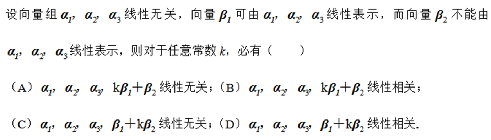

>   **A**
>
>   **快速解法:$\beta_2 $不能被线性表示,所以和$\beta_2 $的组合基本上都线性无关**
>
>   >   **但是对于C选项,k可以等于0,导致相关方程变成线性有关的**

****

###### **5.线性扩张和线性空间**

**线性扩张:**

>   **从S中取出部分元素拿出来做线性组合,得到的所有的集合,称为线性扩张L(S)**

**最小子空间:**

>   线性空间V(F)的非空子集S的线性扩张是V中包含S的最小子空间,记作span

****

###### **6.基**

**整个线性空间的任意一个向量可以由线性无关的向量组V进行线性扩张表示**

>   **比如高中的立体几何的三维向量,坐标都可以使用基向量表示**
>
>   **==使用的线性无关向量的个数==就是维数 $dim V = k$**

**直和:**

>   **一般的,对于两个子空间的相加:**
>   $$
>   dim \ L_1+dim \ L_2 = dim(L_1+L_2)+dim(L_1 \bigcap L_2)
>   $$
>   **如果$dim(L_1 \bigcap L_2) =0即L_1 \bigcap L_2 = \{0\} $,则结果称作直和,记作$L_1 \bigoplus L_2 $**

****

###### **7.内积和实内积空间**

**二元函数的结果==是一个实数(或者域)==**

**内积:(满足以下性质)**

>   **1.正定性:向量和自身做内积的结果是非负的**
>
>   **2.对称性:$ \alpha\beta = \beta\alpha $  **
>
>   **3.加法线性性:$(\alpha + \beta, \gamma) = (\alpha, \gamma) + (\beta, \gamma)) $**
>
>   **4.乘法线性性:$(\lambda \alpha, \beta) = \lambda (\alpha, \beta)) $**

**实内积空间:在实数域上的线性空间V(R)满足内积的性质**

****

###### **8.正交补**

注意Df1.9是针对向量的乘法(表示垂直,正交补空间)

正交补 $(L^{\perp}) $可以理解为 “补充”  (L) 的部分，使得整个空间 $(R^n) $可以被分解为 (L) 和 $(L^{\perp}) $的直和。  更具体地说，对于 $(R^n)$ 中任意向量$ (z)$，都可以唯一地分解为 $(z = z_L + z_{L^{\perp}})$，其中 $(z_L \in L) $ 且 $(z_{L^{\perp}} \in L^{\perp})$

****

#### **2.范数**

###### **1.范数的定义以及性质**

**是一系列函数,满足三种性质(正定性/三角不等式/齐次性)**

>   **正定性:对于任意范数一定大于等于0,==如果范数等于0等价x等于0==**
>
>   **三角不等式:(根据向量)两边之和大于第三边**
>
>   **齐次性:||ax||=绝对值a||x||**

###### **2.范数的形式**

**对于$\hat{x} = (x_1,x_2,\cdots,x_n) $**

**1-范数:$||x||_1 =  \sum^{n}_{i=1}|x_i| = |x_1|+|x_2|+\cdots + |x_n| $**

**2-范数:$||x||_2 = (\sum^{n}_{i=1})^{\frac{1}{2}} = (x^2_1+x^2_x+\cdots + x^2_n)^{\frac{1}{2}} $**

**$\infty $范数:$||x||_\infty = max|x_i|  $**

**p范数:$||x||_p = (\sum^{n}_{i=1}x^p_i)^{\frac{1}{p}},1<p<+\infty  $**

#### **3.集合与序列**

###### **1.有界与边界**

>   **有界集:集合$S \subseteq R^n $称为有界集合**
>
>   **紧集:集合内部所有元素都严格小于边界**

###### **2.边界与确界**

>   **边界:集合内所有元素都小于==该实数==**
>
>   **确界:最小上界/最大下界**
>
>   **关系:集合S存在边界,则一定存在对应的确界**
>
>   **注意:边界点不属于内点,也不是内部**

###### **3.内部与边界**

>   **$\epsilon $邻域:$N_\epsilon(x^0) = \{x| ||x - x^0|| < \epsilon \} $**
>
>   **内点:在范围S内,在实数的子集内部的点**
>
>   **内部:由内点全体组成的域,记作$int(S) $**

###### **4.开集和边界**

>   **开集:不封闭的集合**
>
>   **闭集:开集的反面**
>
>   **闭包:包含最小闭集**
>
>   **边界:S的闭包(S全部包含边界),S的补集的闭包(一个包含外界封闭的区域)**

>   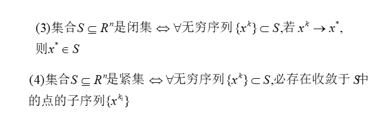

>   **收敛点一定在区域内部**

****

#### **4.函数的可微性与展开**

###### **1.梯度和方向导数**

**梯度:f(x)在不同维度上的偏导得到的向量组**

>   $$
>   \grad f(x) = (\frac{\partial f(x)}{\partial x_1},\frac{\partial f(x)}{\partial x_2},\cdots,\frac{\partial f(x)}{\partial x_n})^T
>   $$
>
>   

**方向导数:是求导不是求偏导**

>   $$
>   lim_{t\rightarrow o+}\frac{f(x^0+ne^i)-f(x^0)}{x}(导数定义)\rightarrow \frac{f(x^0+te^i)-f(x^0)}{t}(方向导数定义)
>   $$

**梯度和方向导数的关系:==投影关系==**

>   **注意:p不是常数,而是一种方向,求投影的方法是点乘**

###### **2.Hesse矩阵**

>   $$
>   \grad^2 f(x) = (\begin{matrix} 
>   \frac{\partial^2f(x)}{\partial x^2_1} \cdots \frac{\partial^2f(x)}{\partial x_1x_n}\\
>   \frac{\partial^2f(x) }{\partial x_2x_1} \cdots \frac{\partial^2f(x) }{\partial x^2_1}\\  
>   \vdots \quad \quad\quad\vdots \\
>   \frac{\partial^2f(x) }{\partial x_nx_1} \cdots \frac{\partial^2f(x) }{\partial x^2_n}
>   \end{matrix})
>   (其中\frac{\partial^2f(x) }{\partial x_ix_j} = \frac{\partial}{\partial x_j}(\frac{\partial f(x)}{\partial x_i}) )
>   $$

###### **3.泰勒公式**

**主要内容:设$f:R^n \rightarrow R $**连续可微,向量$p \in R^n $

>   (==主要目的:使用多项式函数[比如二项式函数]对该函数进行逼近==)
>   $$
>   f(x+p) = f(x)+\grad f(x)^T p + o(||p||)(一阶可导公式)
>   $$
>
>   $$
>   f(x+p) = f(x)+ \grad f(x)^T p + \frac{1}{2}p^T \grad^2 f(x)p + o(||p||)^2
>   \\
>   (\because \grad f(x+p) = \grad f(x) + \grad^2 f(x) + o(||p||)\ 当二阶可导时)
>   $$

###### **4.Jacob矩阵**

**对向量函数$F = (f_1,f_2,\cdots,f_n):R^n \rightarrow R^m $**

**若每个分量函数是连续可微的,则称函数F是连续可微的.**

**向量函数F在x的导数是它在x点的`Jacob矩阵`记作$F'(x)或者J_F(x) $**

>   **即定义Jacob矩阵的转置为F在x点的梯度**
>   $$
>   \grad F(x) = J_F(x)^T = (\grad f_1,\grad f_2,\cdots,\grad f_n)
>   \\
>   和泰勒公式联立:
>   \\
>   F(x+p) = F(x)+ \int^{1}_{0}J_F(x+tp)^T pdt
>   $$

###### **5.lipschitz常数**

两个差的二范数 小于 两个差值的二范数,则称为勒普斯兹连续

#### **5.链式法则**

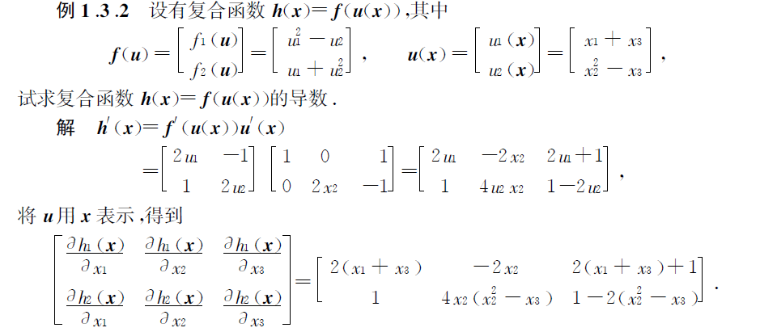

## **4.凸集**

#### **1.凸集定义**

==S中任意两个点满足凸组合(凸集定义前半部分)==

**设S为n维欧氏空间$R^n$中的一个集合,若对S中任意两点,联结它们的线段仍属于S**

(对S中任意两点$x^{(1)},x^{(2))} $,以及每个实数$\lambda \in [0,1] $,都有)

**两点的凸组合表达式**
$$
\lambda x^{(1)}+(1-\lambda)x^{(2)}\in S
$$

>   也就是说根据连线,线所在的位置进行的判断(欧氏空间指不同维度的空间)
>
>   **可能的凸集:实心圆/实心正方形/线段/==点==/二维平面**
>
>   **可能的非凸集:月牙形/空心圆环/U字形**
>
>   
>
>   注意第三个也是一种凸集

####  **2.推广定义**

$$
分界线(面)表达式:p^T x = \alpha
\\
射线表达式:\{x|x = x^{(0)} + \lambda d,\lambda \geq 0 \},其中x^{(0)}是射线的顶点
$$

>   **$H = \{x|p^T x=\alpha \} $:n维列向量和向量x的乘积等于$\alpha $组成的集合**(所有x称作超平面)
>
>   >   **定义了一个超平面(二维中是直线,三维中是平面),超平面都是凸集**
>
>   **$H^{\_} = \{x|p^T x\leq a \} $ :n维列向量和x的乘积小于$\alpha $的集合**(线性不等式:半空间)
>
>   >   **定义了一个半空间(二维中是直线的平分),半空间都是凸集**
>   >
>   >   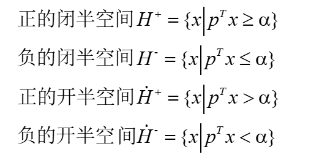
>
>   **$L = \{x|x = x^{(0)} + \lambda d,\lambda \geq 0\} $:d是非零向量,$x^{(0)} $是定点**(射线)
>
>   >   **定义了一个$x^{(0)} $为原点,$\lambda $为方向的射线,射线都是凸集**
>   >
>   >   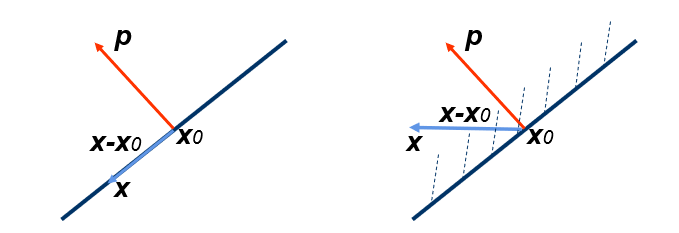

#### **3.推广到m个向量的凸集**

==凸集定义的后半部分==

>   $$
>   S\subseteq R^n\ , \lambda_1 x^1 + \lambda_2 x^2 + \cdots + \lambda_m x^m\in S(其中 \sum^{m}_{i=1}\lambda_i =1,\lambda_i>0)
>   $$

#### **4.根据集合的性质推广凸集**

**如果$S_1$和$S_2$为$R^n $中的两个凸集,$\beta $是实数**

>   **1.$\beta S_1 = \{\beta x | x\in S_1 \} $也是凸集**
>
>   **2.$S_1 \bigcup S_2 $也是凸集**
>
>   **3.$S_1 + S_2  = \{x^{(1)}\in S_1,x^{(2)} \in S_2 |x^{(1)}+x^{(2)}\} $**
>
>   **4.$S_1 - S_2  = \{x^{(1)}\in S_1,x^{(2)} \in S_2 |x^{(1)}-x^{(2)}\}  $**

#### **--------------**

#### **5.凸包**

**凸包指所有包含T的凸集的交集,记作conv T**

>   **也就是这组凸集的最小凸集**

>   $$
>   conv \ T = \bigcap_{C\supseteq T}C,C也是凸集
>   $$

#### **6.多胞体和单纯形**

**多胞体:**

>   **有限点集$\{x^0,x_1,\cdots,x^m \}\subset R^n $的凸包称为多胞体**
>
>   **有限半空间的有界交集**
>
>   **线段/三角形(2维多胞体)/四面体(3维多胞体)/立方体(3维多胞体)**

**单纯形:有限点集$\{x^0,x_1,\cdots,x^m \}\subset R^n $==仿射独立==的凸包**

>    **定义:n维单纯形是由n+1个仿射独立的点构成的凸包。**
>
>   **(仿射独立:向量之间线性独立)(每个向量就是一个顶点)**
>
>   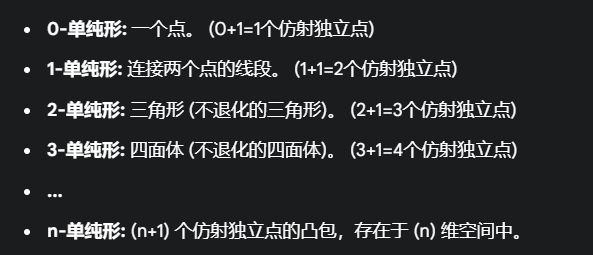
>
>   **特点:最简性/任何多胞体可以三角剖分**

**多面体:有限闭半空间的交,可表示为$Ax \leq b $**

****

#### **7.锥和凸锥**

>和射线表达式差不多,但是这里是$\lambda x $
>
>**凸锥定义:**
>
>>   **设集合$C \subset R^n $,若对C中每一个点x,当$\lambda $取任何非负数时,都有 $\lambda x\in C $,则称C为锥,如果C为凸集,又称C为凸锥**
>>
>>   (所以凸锥的==关于正数的加法乘法运算都属于这个锥C==)
>>
>>   (更严格的:对于非负的线性组合封闭)
>
>(考虑从一个顶点出发,无限延伸的角的凸版本)
>
>**凸锥公式:**
>
>>$a^{(1)},a^{(2)},\cdots,a^{(k)} $的所有**非负线性组合**构成的集合==为凸锥==
>
>$$
>\{\sum^{k}_{i=1}\lambda_i \alpha^{(i)}| \lambda_i \geq 0,i=1,2,\cdots,k \}
>$$
>
>**凸锥性质:**
>
>>   1.凸性:如果$(x^{(1)},x^{(2)}\in C) $,则凸公式$(\lambda x^{(1)}+(1-\lambda)x^{(2)} \in C) $也成立
>>
>>   2.锥性(正齐次性):如果$(x \in C)$,则存在$(\alpha x \in C )$(对于所有$\alpha \geq0 $)

#### **8.多面锥**

>   **有限个半空间的交集称为多面集,其中$A为m \times n $的矩阵,0为零向量**
>   $$
>   \{x|Ax\leq 0\}
>   $$
>
>   它被定义为可以表示成 **齐次线性不等式组** 解集的集合

#### **--------------**

#### **9.极点(多边形的顶点)**

>   **定义:当x可以表示成$x=\lambda x_1 + (1-\lambda)x_2 $($\lambda\in(0,1),x_1x_2\in S $)**
>
>   >   **则必然有$x  = x_1 = x_2 $**
>
>   (极点:==比如多边形的顶点,不可以通过多边形内部的其它两个点表示出来==)
>
>   (非极点:比如多边形边上的点/多边形内部的点)
>
>   >   **线段:两个端点AB都是极点,除了端点以外的点都是非极点**
>   >
>   >   **圆盘(实心):圆周上的所有点都是极点,圆盘内部的点都是非极点**
>   >
>   >   **正方体:8个顶点是极点,面上的/棱上的/内部的都是非极点**

#### **10.方向**

**方向定义:设非空凸集$S\subset R^n $,$R_n $的中间量$d \not = 0 $称为S的一个方向**

>   **一个集合里任何一个点做射线,仍然属于这个集合,称这个射线的方向为方向**

**回收锥定义:$x\in S,R(x,d) = \{x+\lambda d|\lambda \geq 0\}\subset S $,S的所有方向称为S的回收锥**

**不同方向定义:$\forall \lambda >0,d_1\not = \lambda d_2 $**

**极方向定义:不能被两个不同方向的线性组合表示**

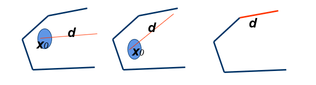

>   **第一个第三个是方向,第二个不属于**

#### --------------

#### **11.表示定理**

**对于存在于S中的任意点,x可以表示为极点的凸组合和方向的非负线性组合**

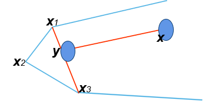

#### **12.凸集分离定理**

**对于超平面$H = \{x|p^T = \alpha \} $**(S1和S2是闭集)

>   **对$\quad \forall x \in S_1,p^T x>\alpha $**
>
>   **对$\quad \forall x \in S_2,p^T x\leq\alpha $**
>
>   **则称超平面H分离集合S1和S2**

**如果S1和S2都是开半区间,则H强分离S1和S2**

#### **\*13.支撑超平面**

支撑超平面是在集合边界点定义的概念，它像一个“切面”，在边界点“支撑”着集合，使得集合完全位于超平面的一侧。 正常支撑超平面则进一步要求集合不能完全“贴在”支撑超平面上，而是仅仅在边界处接触。

>   比如圆的切线,椭圆的切线

#### **14.点到集合的距离**

**点到集合的距离表示为点到集合点的最小距离(inf表示下确界)**

>   $$
>   dist(y,S) = inf||y-x||(x \in S)
>   $$

****

## **5.凸函数**

#### **1.基本性质**

>   **"点的凸组合的函数值"小于"函数值的凸组合"**
>   $$
>   f (\lambda x_1+(1-\lambda)x_2)\leq \lambda f(x_1)+(1-\lambda)f(x_2)
>   $$
>   如果将小于等于换成小于,则证明严格凸函数

>   凸函数/凹函数/都不是
>
>   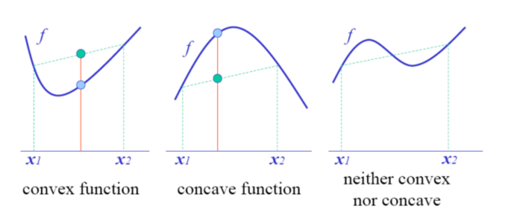

#### **2.水平集/上镜图(epif/hypf)**

使用碗的思想:水平集(切割碗)/上镜图(碗里面的内容[不包括碗])

**水平集:用一个水平面在某高度处切割函数图像,水平集就是下方在定义域的投影**

>   **所以水平集也是凸集之一**

**上镜图:函数图像上方的区域(上镜图也是凸集之一)**

>   >   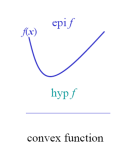

#### **3.全局最优解性质(可能考证明)**

**定义:如果f是定义在S上的凸函数,则f在S上的局部极小点也是整体最小点**

**证明方法:反证法**

>   **1.如果$\overline{x}$不是整体最小解,则存在$f(\hat{x})<f(\overline{x}) $ **
>   $$
>   \therefore \forall \lambda\in[0,1],\lambda\hat{x}+(1-\lambda)\overline{x}\in S \\
>   f(\lambda\hat{x}+(1-\lambda)\overline{x})\leq\lambda f(x)+(1-\lambda)f(\overline{x})(表示定理)
>   \\
>   当\lambda足够小,\Leftrightarrow \lambda f(\overline{x})+(1-\lambda)f(\overline{x})\in S \bigcap N_\epsilon(\overline{x})
>   $$
>   **2.证明了$\hat{x} $是局部最小解,然后原命题$\overline{x} $是局部最小解**
>
>   **3.得证**

#### **4.凸函数的判别(考试考证明)**

**1.定义本体**

设S是$R^n$中的非空开凸集,f(x):$S \in R$是可微的函数,则f(x)是凸函数,当且仅当$x^k \in S$
$$
f(x)\geq f(x^*)+\grad f(x*)(x-x*)\\
\\
(更严格的)f(x)> f(x^*)+\grad f(x*)(x-x*)
$$
**2.证明(反证法)**

>   **1.必要性:设f是凸函数,对$\forall \alpha,0\leq \alpha \leq 1 $**
>
>   >   $$
>   >   f(\alpha y+(1-\alpha)x)\leq \alpha f(y)+(1-\alpha)f(x)(表示定理)
>   >   \\
>   >   \therefore  0<\alpha<1时,\frac{f(x+\alpha(y-x))-f(x)}{\alpha}\leq f(y)-f(x)
>   >   \\
>   >   a\rightarrow0并且根据方向导数定义,\grad f(x)^T(y-x)\leq f(y)-f(x)
>   >   $$
>
>   **2.充分性:任取$x_1,x_2\in S ,x = \alpha x_1+(1-\alpha )x_2 $**
>
>   >   $$
>   >   (梯度不等式)\\
>   >   f(x_1)\geq f(x)+\grad f(x)^T(x_1-x)\\
>   >   f(x_2)\geq f(x)+\grad f(x)^T(x_2-x)\\
>   >   \therefore\alpha f(x_1)+(1-\alpha)f(x_2)\geq f(x)+\grad f(x)^T(\alpha x_1 + (1-\alpha)x_2-x)\\
>   >   \Leftrightarrow f(x) = f(\alpha x_1+(1-\alpha)x_2)
>   >   $$

#### **5.凸函数的可微**

**定义:设S是$R^n$中的非空开凸集,f(x):$S \in R$是可微的函数,则f(x)是凸函数,当且仅当$x_1,x_2 \in S$**
$$
(\grad f(x_2) - \grad f(x_1))(x_2-x_1)\geq 0 
\\
(更严格的)(\grad f(x_2) - \grad f(x_1))(x_2-x_1)> 0 
$$
**证明:**

>   **1.设f凸函数,$\forall x_1,x_2\in S $ **
>
>   **2.梯度不等式**
>   $$
>   f(x_1)\geq f(x_2)+\grad f(x_2)^T(x_1-x_2)(1)
>   \\
>   f(x_2)\geq f(x_1)+\grad f(x_1)^T(x_2-x_1)(2)
>   \\
>   将(1)和(2)相加\\
>   (\grad f(x_2)-\grad f(x_1))^T(x_2-x_1)\geq 0
>   \\
>   \Leftrightarrow f(x_2)-f(x_1) =\grad f(x)^T(x_2-x_1)(中值定理)
>   \\
>   其中 x=\lambda x_1+(1-\lambda)x_2,\lambda \in (0,1)
>   \\
>   \because (\grad f(x_2)-\grad f(x_1))^T(x_2-x_1)\geq 0
>   \\
>   \therefore (1-\lambda)(\grad f(x_2)-\grad f(x_1))^T(x_2-x_1)\geq 0
>   \\
>   \therefore f(x_2)\geq f(x_1)+\grad f(x_1)^T(x_2-x_1)
>   $$

#### ------------

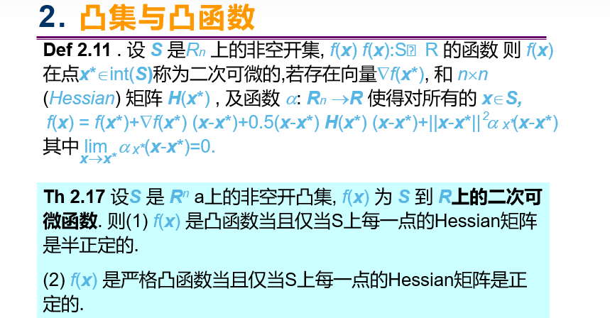

## **Homework:**

建筑公司需要用5m长的塑钢材料制作A、B两种型号的窗架．

两种窗架所需材料规格及数量如表所示：

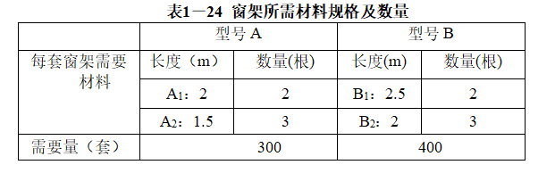

（1）问怎样下料使得用料最少？
（2）问怎样下料使得余料最少？

****

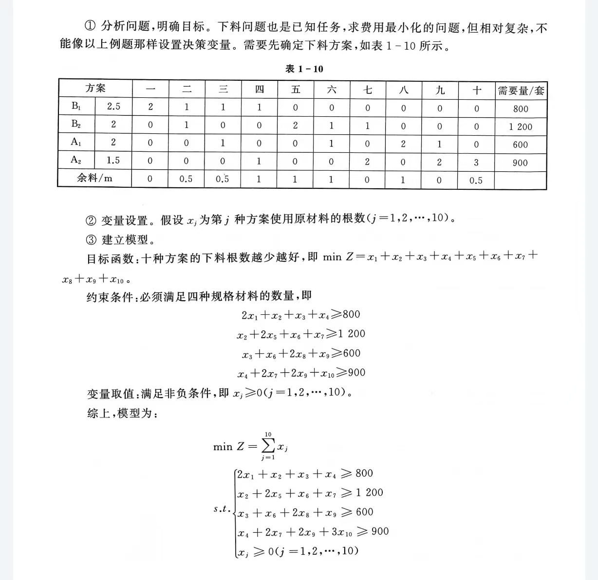

余料最少的数学模型:
$$
min Z = 0x_1+0.5x_2+0.5x_3+x_4+x_5+x_6+0x_7+x_8+0x_9+0.5x_{10}
\\
\begin{cases}
x_1 +x_2+x_3+x_4\geq800 \\
x_2+2x_5+x_6+x_7 \geq 1200 \\
x_3+x_6+2x_8+x_9 \geq 600 \\
x_4 + 2x_7 + 2x_9 +3x_{10}\geq 900 \\
x_j \geq 0,j=1,2,\cdots,10

\end{cases}
$$
