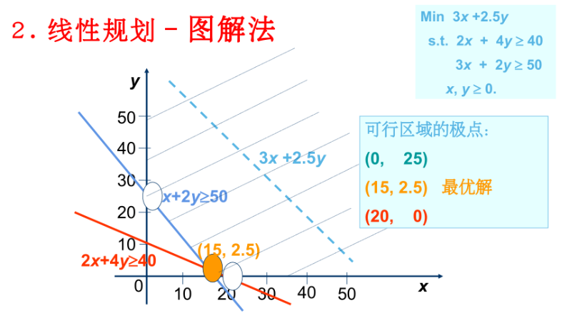
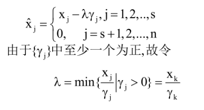
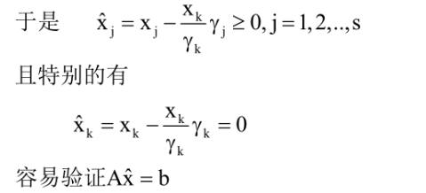

# **第2章 标准形式以及图解法**

## **1.标准形式及图解法**

**如果目标函数和限制函数都是线性的,就是线性规划**

#### **1.线性规划的标准形式(公式表示)**

$$
min \sum^{n}_{j=1}c_jx_j \\
s.t.. \quad \sum^{n}_{j=1}a_{ij}x_j = b_i, i =1,2,\cdots m\\
x_j\geq 0,j=1,2,\cdots,n\\
$$

#### **2.线性规划的标准形式(矩阵表示)**

$$
min \ cx \\
s.t. Ax=b \\
x\geq 0
$$

>   **其中A是$m\times n $的矩阵,c是n维行向量,b是m维列向量**

#### **3.化为标准形式(默认min公式形式)**

###### **1.化简规则**

$$
min \quad c_1x_1+c_2x_2+\cdots +c_nx_n\\
\begin{aligned}
s.t. & \ a_{11}x_1+a_{12}x_2+\cdots + a_{1n}x_n\leq b_1\\
& \ a_{21}x_1+a_{22}x_2+\cdots + a_{2n}x_n\leq b_1 \\
& \cdots \cdots\cdots\cdots\cdots\cdots\cdots\cdots\cdots\cdots\\
& \ a_{m1}x_1+a_{m2}x_2+\cdots + a_{mn}x_n\leq b_m \\
\end{aligned}\\
x_j \geq 0,j=1,2,\cdots,n
$$

****

**引入松弛变量$X_{n+1},X_{n+2},\cdots,X_{n+m} $**
$$
min \quad c_1x_1+c_2x_2+\cdots +c_nx_n\\
\begin{aligned}
s.t. & \ a_{11}x_1+a_{12}x_2+\cdots + a_{1n}x_n+(x_{n+1})=b_1\\
& \ a_{21}x_1+a_{22}x_2+\cdots + a_{2n}x_n+(x_{n+2})=b_1 \\
& \cdots \cdots\cdots\cdots\cdots\cdots\cdots\cdots\cdots\cdots\\
& \ a_{m1}x_1+a_{m2}x_2+\cdots + a_{mn}x_n+(x_{n+m})= b_m \\
\end{aligned}\\
x_j \geq 0,j=1,2,\cdots,n
\\
$$

>   **如果变量无非负限制在,则引入$\quad x_j =x^{'}_{j}-x^{''}_{j} $**
>
>   **如果有上下界限制,需要变形:比如$\quad x_j\geq l_j\leftrightarrow x^{'}_{j} = x_j  -l_j,x^{'}_{j}\geq=0 $**

>   **如果是通过引入松弛变量的方法,约束函数要化成小于等于**
>
>   **(目标函数换成最小化,st乘以-1)**
>
>   如果最小化,但是对于大于等于,可以乘以-1或者减去松弛变量

###### **2a.Eg**

$$
min\quad x_1+5x_2-2x_3 \\
\begin{aligned}
s.t.x_1+x_2+x_3 & \leq 4\\
x_1 		&\leq2 \\
x_3 		&\leq3 \\
3x_2+x_3	&\leq6
\end{aligned}
\qquad
x_i\geq0,i=1,2,3
$$

$$
min\quad x_1+5x_2-2x_3 \\
\begin{aligned}
s.t.x_1+x_2+x_3+x_4 & \leq 4\\
x_1+x_5 		&\leq2 \\
x_3+x_6 		&\leq3 \\
3x_2+x_3+x_7	&\leq6
\end{aligned}
\qquad
x_i\geq0,i=1,2,\cdots,7
$$

###### **2b.Eg2**

#### **4.线性规划的性质**

>   **1.(最优点)线性规划如果存在最优解,==最优解可在某极点上达到==**
>
>   **2.(可行点)任意可行点可表示为:极点的凸组合+极方向的非负线性组合(表示定理)**
>
>   **3.(无限最优化问题，可行域无穷):将标准线性规划公式代入**
>   $$
>   cx = \sum^{k}_{i=1}\lambda_i(cx^{(i)}) +\sum^{t}_{i=1}\mu_i(cd^{(i)}) (表示定理)\ (\sum^{t}_{i=1}\lambda_i = 1)\\
>   比如最小化问题：如果存在\mu使得\ cd^{(j)}\mu_j \rightarrow -\infty,使得cx\rightarrow -\infty \\
>   则不存在有限最优解
>   $$
>   **4.(求解线性规划):即考察所有极点,无效极点取0即可**
>   $$
>   cx^{(p)} = \sum^{k}_{i=1}\lambda_i(cx^{(i)}) +\sum^{t}_{i=1}\mu_i(cd^{(i)}) (表示定理)\ (\sum^{t}_{i=1}\lambda_i = 1)\\ 
>   \Leftrightarrow cx^{(p)} = min cx^{(i)}
>   $$
>   **5.（证明极点即最优解）：使用了结论2的表示定理**
>   $$
>   cx = \sum^{k}_{i=1}(cx^{(i)})\lambda_i + \sum^{t}_{i=1}(cd^{(i)})\mu_i\geq \sum^{k}_{i=1}(cx^{(i)})\geq\sum^{k}_{i=1}(cx^{(p)})\lambda_i = cx^{(p)}
>   \\
>   (\lambda_i \geq 0 ,i=1,2,\cdots,k\quad\mu_i \geq 0 ,i=1,2,\cdots,t)
>   $$
>   **6.(存在最优解的条件)：**
>
>   **比如最小化问题：**
>
>   >   **存在最优解的充要条件是所有$cd^{(i)} $非负，其中$d^{(j)} $是可行域的极方向 **
>   >
>   >   (对于最小化问题要有下确界，对于最大化问题要有上确界)
>
>   ****
>
>   **7.（矩阵解释线性规划）**
>   $$
>   \begin{align}
>   对于A & :rank(A)=m,A=[B,N]，B是M阶可逆的\\
>   对于变量向量x & :x =(
>   \begin{matrix}
>   x_B
>   \\x_N
>   \end{matrix}
>   )
>   \end{align}
>   \\
>   $$
>
>   $$
>   其中x_B的分量与B中列对应(基变量向量)\\
>   其中x_N的分量与N中列对应(非基变量向量)
>   $$
>
>   >   **rank=m 表示矩阵中m行是线性无关的**
>   >
>   >   (从A中选取M可逆列组成B,剩余N-M列组成N)
>   >
>   >   (强调可逆的原因:保证使用单纯形法能对B进行迭代)
>
>   **8.(基本解的表示形式)**
>   $$
>   \therefore Ax=b\Leftrightarrow (B,N)(\begin{matrix}x_B\\x_N\end{matrix}) =b
>   \\
>   \therefore Bx_B+Nx_N =b\rightarrow x_B = B^{-1}Nx_N(解基变量) \\
>   (当x_N=0,即Ax=b则x = [\begin{matrix}x_B\\x_N\end{matrix}] =[\begin{matrix}B^{-1}b\\0\end{matrix}],称作一个基本解)
>   $$
>   **9.(基矩阵基变量/可行解可行基)**
>   $$
>   x = [\begin{matrix}x_B\\x_N\end{matrix}] =[\begin{matrix}B^{-1}b\\0\end{matrix}]\\
>   B是基矩阵,x_B的各分量称为基变量,x_N的各分量称为非基变量\\
>   \\
>   若B^{-1}b\geq 0
>   \begin{align}\{
>   \begin{matrix}
>   &称x为约束条件Ax=b,x\geq 0的一个基本可行解\\
>   &称B为可行基矩阵\\
>   &称x_{B_1},x_{B_2}.\cdots,x_{B_m}为一组可行基变量
>   \end{matrix}
>   \end{align}
>   $$
>   **9.退化与非退化**
>   $$
>   x = [\begin{matrix}x_B\\x_N\end{matrix}] =[\begin{matrix}B^{-1}b\\0\end{matrix}]\\
>   B^{-1}b >0,称基本可行解是非退化的 \\
>   B^{-1}b \geq 0,称基本可行解是退化的(存在分量0)\rightarrow 可能会产生循环
>   $$
>

## **2.求解基本解**

**求解基本解把前面所需的内容都串联起来了**

###### **1.基本方法**

>   **a.将线性规划问题标准化(化为最小化问题,引入松弛变量,所有变量非负)**
>
>   **b.写出约束方程组的矩阵形式:Ax=b**
>
>   **c.确定基变量和非基变量:**
>
>   **(在m个线性无关约束方程的系统,一个基本解包含m个基变量和n-m个非基变量)**
>
>   **d1.选择一个基矩阵B(由系数矩阵A中选取的m个线性无关列向量)需验证线性无关(基矩阵是否可逆)**
>
>   **d2.求解基本解:把非基变量设置为0,得到基变量的值**
>
>   **d3:验证可行性:检查基变量是否非负,满足则为一个基本可行解**
>
>   (d1~d3一直循环)

###### **2.Eg**

$$
\begin{align}
\begin{matrix}
x_1+x_2+x_3 &=1\\
x_1-x_2 &= \frac{1}{2}\\
(x_1,x_2,x_3 &\geq 0)
\end{matrix}
\end{align}
$$

**m=2(两个约束方程),n=3(三个变量)**
$$
\therefore
A = 
\begin{pmatrix}
1 & 1 & 1 \\
1 & -1 & 0
\end{pmatrix}

b = 
\begin{pmatrix}
1 \\
\frac{1}{2}
\end{pmatrix}
\\
(需要选择2个线性无关的列(向量),组成基矩阵B)\\
B_1= 
\begin{pmatrix}
1 & 1  \\
1 & -1
\end{pmatrix}
B_2= 
\begin{pmatrix}
1  & 1 \\
1  & 0
\end{pmatrix}
B_3= 
\begin{pmatrix}
 1 & 1 \\
 -1 & 0
\end{pmatrix}
\\
(三个预选矩阵的行列式都不等于0,因此都可逆)
\\
对于B_1\begin{pmatrix}
1 & 1  \\
1 & -1
\end{pmatrix}:B^{-1} = \frac{1}{-2}
\begin{pmatrix}
-1 & -1  \\
 -1& 1
\end{pmatrix}=\begin{pmatrix}
\frac{1}{2} & \frac{1}{2}  \\
\frac{1}{2} & -\frac{1}{2}
\end{pmatrix}\\
\therefore x_1 = \begin{pmatrix}
\frac{1}{2} & \frac{1}{2}  \\
\frac{1}{2} & -\frac{1}{2}
\end{pmatrix}\
\begin{pmatrix}
1 \\
\frac{1}{2} 
\end{pmatrix} = \begin{pmatrix}
\frac{3}{4} \\
\frac{1}{4} 
\end{pmatrix}
>0
\\
\\对于B_2\begin{pmatrix}
1 & 1  \\
1 & 0
\end{pmatrix}:B^{-1} = \frac{1}{-1}
\begin{pmatrix}
0 & -1  \\
 -1& 1
\end{pmatrix}=\begin{pmatrix}
 0 & 1  \\
 1 & -1
\end{pmatrix}\\
\therefore x_2 = \begin{pmatrix}
 0 & 1  \\
 1 & -1
\end{pmatrix}\
\begin{pmatrix}
1 \\
\frac{1}{2} 
\end{pmatrix} = \begin{pmatrix}
\frac{1}{2} \\
\frac{1}{2} 
\end{pmatrix}>0 \\
对于B_3= 
\begin{pmatrix}
 1 & 1 \\
 -1 & 0
\end{pmatrix}
B_3^{-1} = \frac{1}{1}\begin{pmatrix}
 0 & -1 \\
 1 & 1
\end{pmatrix}
=\begin{pmatrix}
 0 & -1\\
 1 & 1
\end{pmatrix}
\\
\therefore x_3 = \begin{pmatrix}
 0 & -1  \\
 1 & 1
\end{pmatrix}\
\begin{pmatrix}
1 \\
\frac{1}{2} 
\end{pmatrix} = \begin{pmatrix}
-\frac{1}{2} \\
\frac{3}{2} 
\end{pmatrix}<0 
$$

>   **所以只有x_1和x_2是非退化的基本可行解**

S

###### (判断可逆)

**如果行列式不等于0,就可逆**

###### (计算逆矩阵)

>   **a.计算矩阵B的行列式**
>
>   **b.根据行列式判断是否存在逆矩阵(如上)**
>
>   **c.如果矩阵可逆,则存在(主对角线换位,负对角线变号)**
>   $$
>   B^{-1} = \frac{1}{det(B)}[\begin{matrix}
>   d & -b\\
>   -c &a\end{matrix}]
>   $$

###### (计算矩阵乘法)

$$
\therefore x_1 = \begin{pmatrix}
\frac{1}{2} & \frac{1}{2}  \\
\frac{1}{2} & -\frac{1}{2}
\end{pmatrix}\
\begin{pmatrix}
1 \\
\frac{1}{2} 
\end{pmatrix} = \begin{pmatrix}
\frac{3}{4} \\
\frac{1}{4} 
\end{pmatrix}
\
$$

>   取第一个矩阵的第一行： **`[1/2, 1/2]`**
>
>   取第二个矩阵的第一列： **`[1, 1/2]`**
>   
>   将对应元素相乘并相加： 
>   
>   **`(1/2) × 1 + (1/2) × (1/2) = 1/2 + 1/4 = 2/4 + 1/4 = 3/4`**
>   
>   取第一个矩阵的第二行： **`[1/2, -1/2]`**
>
>   取第二个矩阵的第一列： **`[1, 1/2]`**
>   
>   将对应元素相乘并相加： 
>   
>   **`(1/2) × 1 + (-1/2) × (1/2) = 1/2 - 1/4 = 2/4 - 1/4 = 1/4`**

## **3.线性规划基本可行解的性质**

###### **1.(基本解的个数,基本可行解和极点等价)**

>   **基本解的个数不超过**
>   $$
>   (\begin{matrix}
>   n\\m
>   \end{matrix}) = C^n_m = \frac{n!}{m!(n-m)}
>   $$
>   **同时基本可行解和极点是等价的,所以在基本可行解中寻找最优值就行**

###### **2.(基本可行解和极点等价)**

>   **令$K = \{x|Ax=b,x\geq 0\} $,A是$m\times n$矩阵,$r(A)=m$ **
>
>   **则K的极点集与$Ax=b,x\geq 0$的基本可行解等价**

>   **证明(双向证明充分性和必要性)**
>
>   >   **充分性:x是极点,x是基本可行解**
>   >
>   >   (先证极点x的正分量所对应的A的列线性无关)
>   >
>   >   >   (x中可能有0的量,取出正分量,并且对应原来所对应的A[p1])
>   >   >
>   >   >   假设线性相关
>   >   >
>   >   >   列出两个新的变量xj1和xj2(构造两个点可以通过凸组合表示x)
>   >   >
>   >   >   然后代入进行相乘,又线性相关等于0,则Ax=b
>   >   >
>   >   >   x是极点,但是又存在两个点的凸组合表示,产生矛盾
>   >
>   >   所以线性无关
>   >
>   >   >   再代入x得到基本可行解
>
>   >   **必要性:x是基本可行解,x是极点**
>   >
>   >   >   (如果不是极点,直接根据两点x1x2写出x的凸组合)
>   >   >
>   >   >   x1x2都用可行解和不可行解表示出来
>   >   >
>   >   >   然后代入凸组合表达式,求解x1x2,发现两者都等于0
>   >   >
>   >   >   ****
>   >
>   >   >   又因为都是可行解,代入线性表达式,得到x1x2相等
>   >   >
>   >   >   所以不能通过凸组合表示,所以x是极点

###### **3.基本可行解的存在定理**

如果存在可行解,则一定存在基本可行解

>   设$A(p_1~p_n)$,X(x_1,x_2,...000),如果是线性无关的,则可以扩充为一组基
>
>   因为前面非0对应的A和x相乘已经等于b了
>
>   从而得x,即基本可行解

>   如果是线性相关,构造$\hat{x}_j$
>
>   
>
>   
>
>   (需要迭代,每次都减去一个正分量,直到线性无关)

## **For all**

线性规划存在最优解,目标函数的最优值一定能在某极点上达到,可行域的极点就是其基本可行解

所以求线性规划的最优解,之一奥求出最优基本可行解即可
