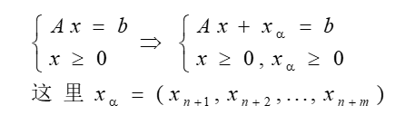
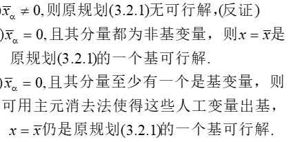
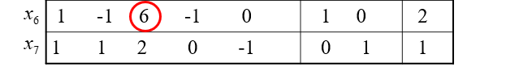

# **第3章 单纯型方法**

## **1.单纯型方法原理**

**看笔记**

## **2.两阶段法与大M法**

###### **1.一阶段:找到基本可行解**

**对于多约束的条件,基本可行解不好找**

**1.标准LP构造基本可行解)**

>   (增加人工变量$ x_\alpha $)
>
>   
>
>   (其中很容易找到基本可行解$x_\alpha=b $)

**2.辅助LP**

==上面的做法会修改约束条件,则通过添加$e^T $==

(只要得到$x_\alpha=0 $则找到原问题的解;如果$x_\alpha $不全为0,则无最优解)

###### **2.二阶段:使用单纯形法**

将第一阶段计算得到的最终表，除去人工变量，从该初始基本可行解开始，用单纯形法求原问题的最优解或判定原问题无界。

2/6->1/2,选x3和x7

## **3.退化情形**

## **4.修正单纯形法**

## **5.变量有界的情形**

## **6.分解算法**