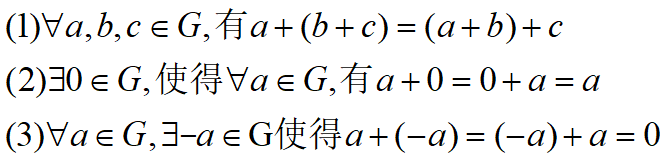
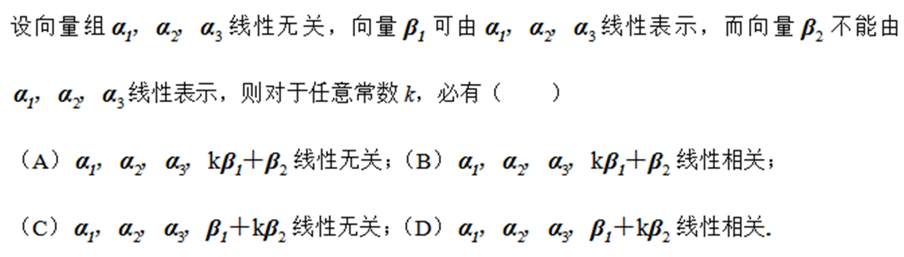
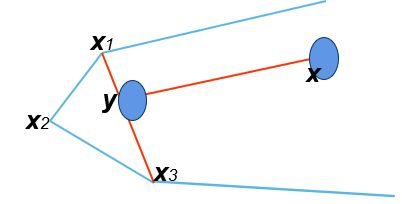
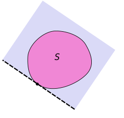
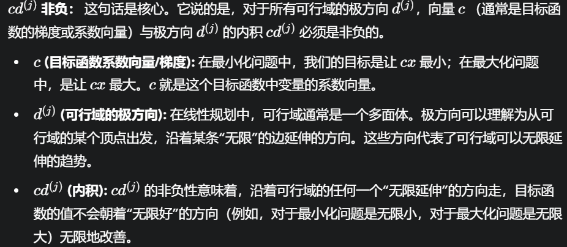
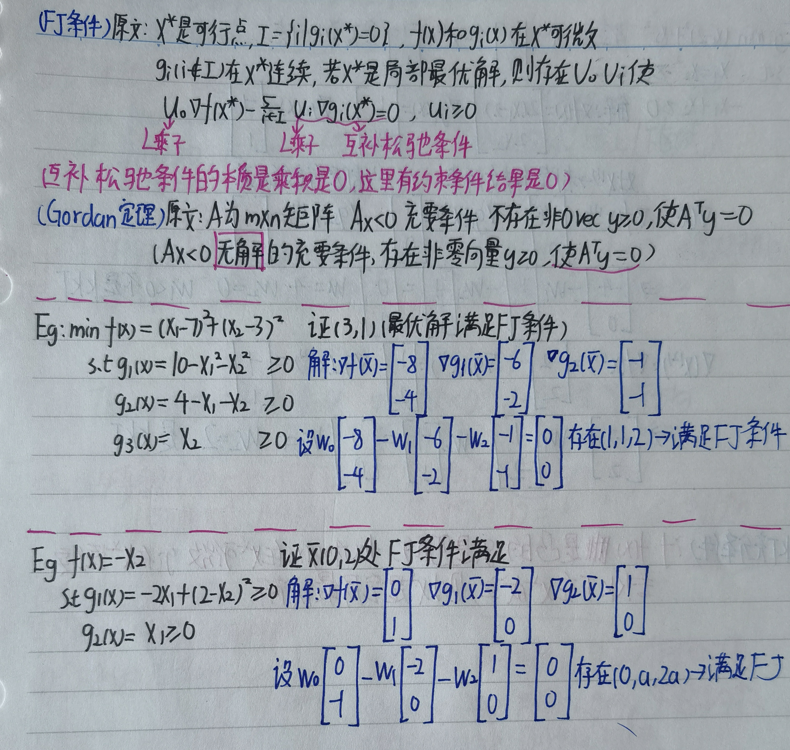
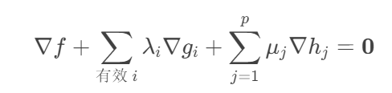
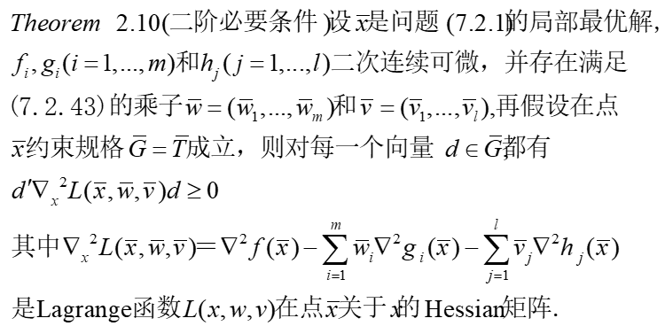

# **Final Revision**

## 0.题型

期末考试占比60%,包括选择+证明+计算

计算题:

1.数学建模

>   (必考)数学建模(Chap1)

2.求得最优解 ==<-线性规划问题/无约束极值问题==

>   (可能)计算基本可行解(Chap4)$B^{-1}b =x$ [Eg](#2.Eg)
>
>   (必考)线性规划的标准化和单纯形表法求解(Chap5)
>
>   (必考)对偶问题的转化和对偶问题求解(Chap6)
>
>   (必考)求无约束非线性规划问题的最优解(Chap7)

3.和误差$\epsilon $相关的优化 <-没有特殊要求

>   (很小概率)单峰判断+**一维搜索**[0.618法](#4.0.618法)(Chap9)
>
>   (可能)最速下降法减小误差($x^{(k+1)} = x^{(k)}+-\grad f(x^*) d$)
>
>   (可能)牛顿法减误差($x^{(k+1)} =x^{(k)}-\grad^2f(x^{(k)})^{-1}\grad f(x^{(k)})$)  

4.证明点的性质(极小值点/FJ点/KKT点) ==<-约束极值问题==

>(可能)判断FJ点/KKT点[FJ条件(判断FJ点)](#2.FJ条件(判断FJ点))
>
>(可能)判断FJ点/KKT点(带有等式约束的)[带有等式约束的](#4.拓展到等式)
>
>(可能)判断局部最优解(KKT+严格最优解)[局部最优解](#7.通过必要条件判断局部最优解)
>
>(很小概率)Zoutendijk[Zoutendijk求最优解](#Eg:使用Zoutendijk求最优解)

证明:

>   范数的证明(Chap1)正定性/三角不等式/齐次性[范数](3.范数)
>
>   (必考)线性规划的极点最优性质(Chap3&)使用表示定理+凸组合系数选择 [极点最优定理](#4.极点最优定理)
>
>   (可能)凸函数局部极小值就是全局最优解(Chap3)使用表示定理
>
>   (可能)凸函数的判别(Chap3)<-通过函数值<-使用表示定理[凸函数的判断](#凸函数的判断)
>
>   (可能)下降方向的证明(一阶泰勒展开)[下降方向的定义](#1.下降方向的定义)
>
>   (可能)UNLP极小点的必要条件(二阶泰勒展开)[无约束的必要条件](#2.无约束的必要条件)
>
>   (可能)单峰的判断(闭区间求导找到唯一的极小点)
>
>   (极小概率)有约束极值极小值必要条件证明(交集为空集)(反证法)

## **Chap1.绪论**

###### **1.什么是运筹学**

>   **运筹学是为决策机构在对其业务活动进行决策的时候**
>
>   **提供的==量化==为基础的科学方法**

###### **2.运筹学的应用原则**

>1)   合伙原则：应善于同各有关人员合作
>
>2)   催化原则：善于引导人们改变一些常规看法
>
>3)   互相渗透原则：多部门彼此渗透地考虑
>
>4)   独立原则：不应受某些特殊情况所左右
>
>5)   宽容原则：思路宽、方法多，不局限在某一特定方法上
>
>6)   平衡原则：考虑各种矛盾的平衡、关系的平衡

###### **3.运筹学的应用步骤**

==注意第一步提出问题并非直接建模==

>1.   提出问题：目标、约束、决策变量、参数
>
>2.   建立模型：变量、参数、目标之间的关系的表示
>
>3.   模型求解：数学方法及其他方法
>
>4.   解的检验：制定检验准则，讨论与现实的一致性
>
>5.   灵敏性分析：参数扰动对解的影响情况
>
>6.   解的实施：回到实践中
>
>7.   后评估：考察问题是否得到圆满解决

###### **4.模型构造思路(略)**

###### **5.OR和OPT的关系**

**运筹学和最优化的关系:最优化是运筹学的一条分支**

###### **6.数学建模(计算题必考)**

$$
min\quad 25x_1+30x_2+20x_3+24x_4
\\ \\
\begin{cases}
&x_1+x_2+x_3+x_4=2000
\\ \\
& x_1+x_3-x_2-x_4=0
\\ \\
& x_1+x_2\geq700
\\ \\
& x_3+x_4\geq450
\end{cases}
$$

>   ==**建模的话没要求不用解;注意至少应该是$\geq$而不是=**==
>
>   **变量随便拉,反正满足题目即可**

###### **7.问题的分类**

>有的目标函数和约束函数都是线性的,称之为**线性规划问题**
>
>有的模型中含有非线性函数**称之为非线性规划问题**

>   如果一个问题的可行域是整个空间,则称此问题为**无约束问题**

## **Chap2 数学知识**

###### **1.群和线性空间**

==基本性质+判断线性空间==

**基本逻辑:群+可交换->交换群+可数乘运算->线性空间**

**基本概念**

>>   群:如果给定非空集合G以及G上的代数运算+
>>
>>   **满足加法的换括号不变律,可加0律,正负抵消得0律,则称之为==群==**
>>
>>   
>
>>   **==交换群==(阿贝尔群):进一步的如果满足交换律(a+b=b+a)**
>
>>   线性空间V(F):**进一步如果满足加法和数乘(乘法交换律,乘法分配律)**
>>
>>   **需要注意:线性空间的核心是向量加法和标量乘法(和参数$\lambda,\mu$的)**
>>
>>   
>
>>   线性子空间:其中如果V(F)的非空子集也满足条件

**判断线性空间**

**1.$R^n$是实数域R上的线性空间**(实数满足)

>   **所有的实数 关于 实数的加法 和 实数的乘法 构成线性空间**

**2.$R[x]_n$是系数在实数域R上次数小于n的全体多项式的集合**(多项式满足)

>   **所有的多项式系数 关于 多项式的加法 和 实数与多项式的乘法 构成线性空间**

**3.$R^{m\times n}$是实数域R上$m\times n$矩阵的集合**(矩阵不满足)

>   **所有的矩阵 关于 矩阵的加法 和 实数与矩阵的标量乘法 构成线性空间**
>
>   **注意:矩阵和矩阵的乘法不满足交换律**

****

###### **2.线性相关性**

**若一组向量可以被另一组`线性无关向量`线性表示,则这两组向量线性相关**

>   答案A**快速解法:$\beta_2 $不能被线性表示,所以和$\beta_2 $的组合基本上都线性无关**
>
>   >   **但是对于C选项,k可以等于0,导致相关方程变成线性有关的**

###### **3.范数**

**1.范数的定义以及性质**

**是一系列函数,满足三种性质(正定性/三角不等式/齐次性)**

>   **正定性:对于任意范数一定大于等于0,==如果范数等于0等价x等于0==**
>
>   **齐次性:||ax||=$\big|a\big|$ ||x||(a是常数)**
>
>   **三角不等式:(对于向量)两个向量的模之和大于等于两个向量和的模**

**2.范数的判断**

>判断函数$f(x,y)=∣x∣+2∣y∣$是否是范数
>
>1.正定性:带绝对值显然都满足
>
>2.齐次性:$∣ax∣+2∣ay∣ = ∣a∣(∣x∣+2∣y∣)=∣a∣f(x,y) $满足
>
>3.三角不等式:$u=(x1,y1)，v=(x2,y2),u+v=(x1+x2,y1+y2)$
>
>>$$
>>\begin{align}
>>f(u+v)&=∣x1+x2∣+2∣y1+y2∣
>>\\ \\
>>f(u)+f(v)&=(∣x1∣+2∣y1∣)+(∣x2∣+2∣y2∣)
>>\\ \\
>>&= \ ∣x1∣+∣x2∣+2∣y1∣+2∣y2∣ \end{align}
>>$$
>
>>根据三角不等式得到:$f(u)+f(v)>f(u+v)$得证

**3.常见的范数**

>**对于$\hat{x} = (x_1,x_2,\cdots,x_n) $**
>
>**1-范数:$||x||_1 =  \sum^{n}_{i=1}|x_i| = |x_1|+|x_2|+\cdots + |x_n| $**
>
>**2-范数:$||x||_2 = (\sum^{n}_{i=1})^{\frac{1}{2}} = (x^2_1+x^2_x+\cdots + x^2_n)^{\frac{1}{2}} $**
>
>**$\infty $范数:$||x||_\infty = max|x_i|  $**
>
>**p范数:$||x||_p = (\sum^{n}_{i=1}x^p_i)^{\frac{1}{p}},1<p<+\infty  $**

###### **4.集合和序列**

**1.有界与边界**

>   **有界集:集合$S \subseteq R^n $称为有界集合**
>
>   **紧集:集合内部所有元素都严格小于边界**

**2.边界与确界**

>   **边界:集合内所有元素都小于==该实数==**
>
>   **确界:最小上界/最大下界**
>
>   **关系:集合S存在边界,则一定存在对应的确界**
>
>   **注意:边界点不属于内点,也不是内部**

**3.内部,开集,补集,闭集,==闭包$cls$,边界$\partial S0$==,集合的性质**

>   **$\epsilon $邻域:$N_\epsilon(x^0) = \{x| ||x - x^0|| < \epsilon \} $**
>
>   **内点:在范围S内,在实数的子集内部的点**
>
>   **内部:由内点全体组成的域,记作$int(S) $**

>   **开集:不封闭的集合(本身等于内部:$S=int(S)$)**
>
>   **闭集:封闭的集合**
>
>   **闭包:包含集合S的最小闭集**
>
>   **边界:S闭包和S非闭包的交集部分(S内部和S外部的交集)$cls\bigcap clsc$**

>**如果集合S由下界且下确界inf(S)存在,则S所有元素都大于inf(S)**
>
>>   但是存在一个极小值,下确界inf(s)加上以后能超过
>
>**如果集合S是闭集,无序序列xk在S内,xk的映射还是在S内部**
>
>**如果集合S是紧集,无序序列xk在S内,存在收敛于S的子序列xk**
>
>>**收敛点一定在区域内部**

###### **5.梯度**

**梯度:f(x)在不同维度上的偏导得到的向量组**

>   $$
>   \grad f(x) = (\frac{\partial f(x)}{\partial x_1},\frac{\partial f(x)}{\partial x_2},\cdots,\frac{\partial f(x)}{\partial x_n})^T
>   $$
>

**方向导数:是关于指定方向求导不是求偏导**

>   $$
>   \lim_{t\rightarrow o+}\frac{f(x^0+ne^i)-f(x^0)}{x}(导数定义)
>   \\ \\
>   \lim_{t\rightarrow o+}\frac{f(x^0+te^i)-f(x^0)}{t}(方向导数定义)
>   $$

**梯度和方向导数的关系:==投影关系==**

>   **注意:p不是常数,而是一种方向,求投影的方法是点乘**

**2.Hesse矩阵**

>   $$
>   \grad^2 f(x) = (\begin{matrix} 
>   \frac{\partial^2f(x)}{\partial x^2_1} \cdots \frac{\partial^2f(x)}{\partial x_1x_n}\\
>   \frac{\partial^2f(x) }{\partial x_2x_1} \cdots \frac{\partial^2f(x) }{\partial x^2_1}\\  
>   \vdots \quad \quad\quad\vdots \\
>   \frac{\partial^2f(x) }{\partial x_nx_1} \cdots \frac{\partial^2f(x) }{\partial x^2_n}
>   \end{matrix})
>   (其中\frac{\partial^2f(x) }{\partial x_ix_j} = \frac{\partial}{\partial x_j}(\frac{\partial f(x)}{\partial x_i}) )
>   $$

###### **6.泰勒级数**

**主要内容:设$f:R^n \rightarrow R $**连续可微,向量$p \in R^n $

>   (==主要目的:使用多项式函数[比如二项式函数]对该函数进行逼近==)
>
>   **一阶泰勒公式:**
>   $$
>   f(x+p) = f(x)+\grad f(x)^T p + o(||p||)
>   $$
>
>   **二阶泰勒公式:**
>   $$
>   f(x+p) = f(x)+ \grad f(x)^T p + \frac{1}{2}p^T \grad^2 f(x)p + o(||p||)^2
>   $$

###### **7.Jacob矩阵和Lipschitz连续(略)**

###### **8.链式法则**

$$
\begin{align}
y&=f(g(x))
\\ \\
\frac{dy}{dx} &= f'(g(x))g'(x)
\\ \\
\frac{dy}{dx} &= \frac{dy}{du}\frac{du}{dx}
\end{align}
$$

## **Chap3 凸集和凸组合**

###### **1.凸集的定义**

在欧式空间中,对S中任意两点$x^{(1)},x^{(2))} $,以及每个实数$\lambda \in [0,1] $,都有
$$
\lambda x^{(1)}+(1-\lambda)x^{(2)}\in S
$$

>对两个点进行连线,只要在S内(包括边界),则满足凸组合

**凸包:所有包含集合T的凸集->的交集,记作conv T**

###### **2.多个点的凸组合**

$$
\lambda_1 x^1 + \lambda_2 x^2 + \cdots + \lambda_m x^m\in S( \sum^{m}_{i=1}\lambda_i =1,\lambda_i>0)
$$

只要$S_1$和$S_2$是凸集,他们作为集合的交集和加减都是凸集

###### **3.超平面的概念(超平面都是凸集)**

**n维列向量和向量x的乘积等于$\alpha $组成的集合**(所有x称作超平面)

**$H = \{x|p^T x=\alpha \} $等价于Ax+by+c...**

**n维列向量和x的乘积小于$\alpha $的集合**(线性不等式:负半空间)

**$H^{\_} = \{x|p^T x\leq a \} $负闭半空间,$H^{\_} = \{x|p^T x< a \} $负开半空间 **

**n维列向量和x的乘积小于$\alpha $的集合**(线性不等式:正半空间)

**$H^+ = \{x|p^T x\geq a \} $正闭半空间,$H^{\_} = \{x|p^T x> a \} $正开半空间 **

###### **4.射线的概念(射线都是凸集)**

$L = \{x|x = x^{(0)} + \lambda d,\lambda \geq 0\} $,是非零向量,$x^{(0)} $是定点

###### **5.多胞体和单纯形**

**多胞体:**

>   **有限点集$\{x^0,x_1,\cdots,x^m \}\subset R^n $的凸包称为多胞体**
>
>   **有限半空间的有界交集**
>
>   **线段/三角形(2维多胞体)/四面体(3维多胞体)/立方体(3维多胞体)**

**单纯形:有限点集$\{x^0,x_1,\cdots,x^m \}\subset R^n $==仿射独立==的凸包**

>    **定义:n维单纯形是由n+1个仿射独立的点构成的凸包。**
>
>    **(仿射独立:向量之间线性独立)(每个向量就是一个顶点)**
>
>    
>
>    **特点:最简性/任何多胞体可以三角剖分**

**多面体:有限闭半空间的交,可表示为$Ax \leq b $**

###### **6.判断凸集和凸组合**

**凸集的判断:一般都是直观通过某两个点的连线判断**

>   但是**直线/线段/射线/超平面/半空间/多面体**都是凸集

**凸组合的判断:判断向量x是否是向量集合S的凸组合**

>   **判断依据:根据系数的非负性和系数和等于1判断的**
>
>   1.列出线性方程:将向量x的分量展开成一个线性方程组
>
>   >   $x =a_1s_1+a_2s_2+\cdots,s_nx $
>   >
>   >   且$s_1+s_2+\cdots s_n = 1 $
>
>   2.高斯消元法:求出$s_i$
>
>   3.**判断非负性,判断和是否为1**

###### **多面体/锥/凸锥/多面锥(略)**

###### **7.极点的定义**

**定义:不能被S中两个不同点通过凸组合表示出来的点(极点的判断)**

>   反过来,极点的凸组合可以表示有界凸集的任一点
>
>   例子:多边形的顶点,不可以通过多边形内部的其它两个点表示出来

**8.方向和极方向**

**方向定义:$R(x,d)={x+λd∣λ≥0}$中的d**

>   一个集合里任何一个点做射线,如果仍然属于集合,称射线的方向为方向
>
>   
>
>   (第二个不是,因为延长以后出边界了)

**极方向:不能被两个方向的线性组合表示**

###### **9.表示定理**

**存在于S中的任意点,可以表示为极点的凸组合和方向的==非负==线性组合**

**(用于证明凸函数的性质,线性规划的性质)**

###### **10.分离定理**

**对于超平面$H = \{x|p^T x = \alpha \} $**(S1和S2是闭集)

>   **对$\quad \forall x \in S_1,p^T x>\alpha $**
>
>   **对$\quad \forall x \in S_2,p^T x\leq\alpha $**
>
>   **则称超平面H分离集合S1和S2**

**如果S1和S2都是开半区间,则H强分离S1和S2**

###### **11.支撑超平面**

>   (这里虚线就是支撑超平面,存在一个边界点 $p^T(x-\overline{x})=0 $)
>
>   **所以凸集在每个边界点都有一个支撑超平面**
>
>   S 完全包含在由超平面界定的两个闭半空间之一中
>
>   S 在超平面上至少有一个边界点
>
>   

###### **12.点到集合的距离下确界inf**

**点到集合的距离:点到集合点的最小距离(inf表示下确界)**
$$
dist(y,S) = inf||y-x||(x \in S)
$$
**投影定理(到闭凸集的最短距离点存在唯一性定理):**

>**在凸集的前提下,到y的最短距离的$\overline{x}$是唯一确定的,即**
>$$
>||y-\overline{x}|| = \inf_{x\in S}||y-x||
>$$
>(这里有证明,但是通过柯西数列证明极限存在于S,然后又用矛盾法证明)

###### **13.凸函数**

设$S\subset R^n$是非空凸集,对任意$x_1,x_2\in S$和$\lambda \in(0,1)$,都有
$$
f (\lambda x_1+(1-\lambda)x_2)\leq \lambda f(x_1)+(1-\lambda)f(x_2)
$$

>   **"点的凸组合的函数值"小于"函数值的凸组合"**
>
>   如果将小于等于换成小于,则证明**严格凸函数**
>
>   **凸函数的局部极小点就是全局最小点**

>   凸函数/凹函数/都不是
>
>   

###### **水平集和上镜图(略)**

>使用碗的思想:水平集(切割碗)/上镜图(碗里面的内容[不包括碗])
>
>**水平集:用水平面在某高度处切割函数,水平集就是下方在定义域的投影**
>
>>   **所以水平集也是凸集之一**
>
>**上镜图:函数图像上方的区域(上镜图也是凸集之一)**
>
>>   

###### **凸函数的判断**

设S是$R^n$中的非空开凸集,f(x)是凸函数,当且仅当$x^k \in S$
$$
f(x)\geq f(x^*)+\grad f(x*)(x-x*)\\
\\
f(x)> f(x^*)+\grad f(x*)(x-x*)
$$

>   ==几何角度:凸函数的图像总是位于其任意切线的上方==

**证明(反证法)**

>**1.必要性:设f是凸函数,对$\forall \alpha,0\leq \alpha \leq 1 $**
>
>>   $$
>>   f(\alpha x^*+(1-\alpha)x)\leq \alpha f(x^*)+(1-\alpha)f(x)(表示定理)
>>   \\ \\
>>   \frac{f(x+\alpha(x^*-x))-f(x)}{\alpha}\leq f(x)-f(x^*)
>>   \\ \\
>>   \therefore \grad f(x)^T(y-x)\leq f(x)-f(x^*)
>>   \\ \\
>>   \therefore \grad f(x)^T(y-x)+f(x^*)\leq x^*
>>   $$
>
>**2.充分性:任取$x_1,x_2\in S ,x = \alpha x_1+(1-\alpha )x_2 $**
>
>==(直观:如果一阶条件成立,图像在切线的上方的条件也成立,设两个点)==
>
>$$
>f(x_1)\geq f(x)+\grad f(x)^T(x_1-x)\\ \\
>f(x_2)\geq f(x)+\grad f(x)^T(x_2-x)\\ \\
>(对f(x_1)乘以\alpha,对f(x_2)乘以(1-\alpha),然后相加)
>\\ \\
>\therefore\alpha f(x_1)+(1-\alpha)f(x_2)\geq f(x)+\grad f(x)^T(\alpha x_1 + (1-\alpha)x_2-x)\\ \\
>(根据凸组合x = \alpha x_1+(1-\alpha)x_2,所以梯度项等于0)
>\\ \\
>\therefore af(x_1)+(1-a)f(x_2)\geq f(x)$$

## **Chap4 线性规划的性质**

###### **1.线性规划问题形式**

$$
min \sum^{n}_{j=1}c_jx_j \\
s.t.. \quad \sum^{n}_{j=1}a_{ij}x_j = b_i, i =1,2,\cdots m\\
x_j\geq 0,j=1,2,\cdots,n\\
$$

>   (直观看就是目标函数+变量线性组合的等式约束)

###### **2.线性规划化为标准公式**

[化为标准形式参考](.\线性规划化为标准型.pdf)

###### **3.线性规划的解题方法**

**图解法**

###### **线性规划的性质框架**

>1.可行域是凸集(直线是凸集,划分的两个半空间也是凸集)
>
>2.极点最优定理(表示定理证明)
>
>>   其中有一个无限优化问题注意
>
>3.基本可行解和极点的关系:一一对应
>
>4.最优解就是基本可行解
>
>(SELECTIVE)最优解存在的充要条件:所有$cd^{(i)} $非负
>
>(SELECTIVE)基本可行解存在定理：存在可行解则一定有基本可行解
>
>(其它的都可以省略)

###### **4.极点最优定理**

**线性规划如果存在最优解,最优解可在某极点上达到**

>   证明:表示定理表示出x
>   $$
>   x = \sum^{k}_{i=1}\lambda_ix^{(i)}+\sum^{t}_{i=1}\mu_id^{(i)}\quad(\sum^{k}_{i=1}\lambda_i=1)
>   $$
>   线性规划问题转化
>   $$
>   \begin{cases}
>   min\quad cx
>   \\ \\
>   s.t. \quad Ax=b,x\geq0
>   \end{cases}
>   
>   \begin{cases}min\quad \sum^{k}_{i=1}\lambda_i(cx^{(i)})+\sum^{t}_{i=1}\mu_i(cd^{(i)})
>   \\ \\
>   s.t. \quad \sum^{K}_{i=1}\lambda_i=1,\lambda_i,\mu_i\geq0
>   \end{cases}
>   $$
>   问题判断(只需要最小化cx)+简化($\mu_i<0$可以无限优化,此时无解)
>   $$
>   \begin{cases}min\quad \sum^{k}_{i=1}\lambda_i(cx^{(i)})
>   \\ \\
>   s.t. \quad \sum^{K}_{i=1}\lambda_i=1,\lambda_i,\mu_i\geq0
>   \end{cases}
>   $$
>   **显然当$\lambda_p=1,\lambda_j=0 $的时候存在最小值(凸组合的系数之和等于1)**
>
>   ==**只需要取得极点就能保证cx最小**==

>   **大致流程(数学语言):**
>
>   **1.(可行点)任意可行点可表示为:极点的凸组合+极方向的非负线性组合(表示定理)**
>
>   **2.(无限最优化问题，可行域无穷):将标准线性规划公式代入**
>   $$
>   cx = \sum^{k}_{i=1}\lambda_i(cx^{(i)}) +\sum^{t}_{i=1}\mu_i(cd^{(i)}) (表示定理)\ (\sum^{t}_{i=1}\lambda_i = 1)\\
>   比如最小化问题：如果存在\mu使得\ cd^{(j)}\mu_j \rightarrow -\infty,使得cx\rightarrow -\infty \\
>   则不存在有限最优解
>   $$
>   **3.(求解线性规划):即考察所有极点,无效极点取0即可**
>   $$
>   cx^{(p)} = \sum^{k}_{i=1}\lambda_i(cx^{(i)}) +\sum^{t}_{i=1}\mu_i(cd^{(i)}) (表示定理)\ (\sum^{t}_{i=1}\lambda_i = 1)\\ 
>   \Leftrightarrow cx^{(p)} = min cx^{(i)}
>   $$
>   **4.（证明极点即最优解）：使用了结论2的表示定理**
>   $$
>   cx = \sum^{k}_{i=1}(cx^{(i)})\lambda_i + \sum^{t}_{i=1}(cd^{(i)})\mu_i\geq \sum^{k}_{i=1}(cx^{(i)})\geq\sum^{k}_{i=1}(cx^{(p)})\lambda_i = cx^{(p)}
>   \\
>   (\lambda_i \geq 0 ,i=1,2,\cdots,k\quad\mu_i \geq 0 ,i=1,2,\cdots,t)
>   $$

###### **7.(最优解存在的条件)比如最小化问题：**

>   **存在最优解的充要条件所有$cd^{(i)} $非负，其中$d^{(j)} $是可行域的极方向 **
>
>   ==(人话:对于最小化问题要有下确界，对于最大化问题要有上确界)==
>
>   

###### **8.基本可行解**

$$
\begin{align}
&\because Ax=b\Leftrightarrow (B,N)(\begin{matrix}x_B\\x_N\end{matrix}) =b
\\ \\
&\therefore x  = \begin{pmatrix}X_B\\ X_N\end{pmatrix}
=\begin{pmatrix}X_B\\ 0\end{pmatrix}
\end{align}
$$

>   **基本可行解就是极值(假设$x_1,x_2$)**
>   $$
>   \begin{pmatrix}B^{-1}b\\ 0\end{pmatrix} = \lambda\begin{pmatrix}X^{(1)}_B\\ X^{(1)}_N\end{pmatrix}+(1-\lambda)\begin{pmatrix}X^{(2)}_B\\ X^{(2)}_N\end{pmatrix}
>   $$
>   又由于$x_1,x_2$都是基本可行解,即$X^{(1)}_N,X^{(2)}_N$都等于0
>   $$
>   \therefore Ax^{(1)} = Ax^{(2)} =b
>   \\ \\
>   x = x^{(1)} = x^{(2)}得证
>   $$

###### **9.基本可行解的退化(计算最后的时候验证)**

###### **10.计算基本可行解**

>**a.将线性规划问题标准化(化为最小化问题,引入松弛变量,所有变量非负)**
>
>**b.写出约束方程组的矩阵形式:Ax=b**
>
>**c.确定基变量和非基变量**
>
>**d.计算基本可行解(循环)**
>
>>   d1.选择一个基矩阵B(由系数矩阵A中选取的m个线性无关列向量)
>>
>>   >   需验证线性无关(基矩阵是否可逆)
>>   >
>>   >   验证是否可逆:行列式的值是否等于0
>>   >
>>   >   计算逆矩阵:如果是二维的:移动变号;二维以上手动化E
>>   >
>>   >   **(主对角线换位,负对角线变号)**
>>   >   $$
>>   >   B^{-1} = \frac{1}{det(B)}[\begin{matrix}
>>   >   d & -b\\
>>   >   -c &a\end{matrix}]
>>   >   $$
>>
>>   >   计算矩阵乘法:
>>   >   $$
>>   >   \therefore x_1 = \begin{pmatrix}
>>   >   \frac{1}{2} & \frac{1}{2}  \\
>>   >   \frac{1}{2} & -\frac{1}{2}
>>   >   \end{pmatrix}\
>>   >   \begin{pmatrix}
>>   >   1 \\
>>   >   \frac{1}{2} 
>>   >   \end{pmatrix} = \begin{pmatrix}
>>   >   \frac{3}{4} \\
>>   >   \frac{1}{4} 
>>   >   \end{pmatrix}
>>   >   \
>>   >   $$
>>   >   取第一个矩阵的第一行： **`[1/2, 1/2]`**
>>   >
>>   >   取第二个矩阵的第一列： **`[1, 1/2]`**
>>   >
>>   >   将对应元素相乘并相加： 
>>   >
>>   >   **`(1/2) × 1 + (1/2) × (1/2) = 1/2 + 1/4 = 2/4 + 1/4 = 3/4`**
>>   >
>>   >   取第一个矩阵的第二行： **`[1/2, -1/2]`**
>>   >
>>   >   取第二个矩阵的第一列： **`[1, 1/2]`**
>>   >
>>   >   将对应元素相乘并相加： 
>>   >
>>   >   **`(1/2) × 1 + (-1/2) × (1/2) = 1/2 - 1/4 = 2/4 - 1/4 = 1/4`**
>>
>>   d2.求解基本解:把非基变量设置为0,得到基变量的值
>>
>>   d3:验证可行性:检查基变量是否非负,满足则为一个基本可行解

###### **2.Eg**

$$
\begin{align}
\begin{cases}
x_1+x_2+x_3 &=1\\ \\
x_1-x_2 &= \frac{1}{2}\\\\
(x_1,x_2,x_3 &\geq 0)
\end{cases}
\end{align}
$$

**m=2(两个约束方程),n=3(三个变量)**
$$
\begin{align}\therefore
&A = 
\begin{pmatrix}
1 & 1 & 1 \\
1 & -1 & 0
\end{pmatrix}
b = 
\begin{pmatrix}
1 \\
\frac{1}{2}
\end{pmatrix}
\\
&(需要选择2个线性无关的列(向量),组成基矩阵B)\\
&B_1= 
\begin{pmatrix}
1 & 1  \\
1 & -1
\end{pmatrix}
B_2= 
\begin{pmatrix}
1  & 1 \\
1  & 0
\end{pmatrix}
B_3= 
\begin{pmatrix}
 1 & 1 \\
 -1 & 0
\end{pmatrix}
\\
&(三个预选矩阵的行列式都不等于0,因此都可逆)
\\
&对于B_1\begin{pmatrix}
1 & 1  \\
1 & -1
\end{pmatrix}:B^{-1} = \frac{1}{-2}
\begin{pmatrix}
-1 & -1  \\
 -1& 1
\end{pmatrix}=\begin{pmatrix}
\frac{1}{2} & \frac{1}{2}  \\
\frac{1}{2} & -\frac{1}{2}
\end{pmatrix}\\
&\therefore x_1 = \begin{pmatrix}
\frac{1}{2} & \frac{1}{2}  \\
\frac{1}{2} & -\frac{1}{2}
\end{pmatrix}\
\begin{pmatrix}
1 \\
\frac{1}{2} 
\end{pmatrix} = \begin{pmatrix}
\frac{3}{4} \\
\frac{1}{4} 
\end{pmatrix}
>0
\\
\\&对于B_2\begin{pmatrix}
1 & 1  \\
1 & 0
\end{pmatrix}:B^{-1} = \frac{1}{-1}
\begin{pmatrix}
0 & -1  \\
 -1& 1
\end{pmatrix}=\begin{pmatrix}
 0 & 1  \\
 1 & -1
\end{pmatrix}\\
&\therefore x_2 = \begin{pmatrix}
 0 & 1  \\
 1 & -1
\end{pmatrix}\
\begin{pmatrix}
1 \\
\frac{1}{2} 
\end{pmatrix} = \begin{pmatrix}
\frac{1}{2} \\
\frac{1}{2} 
\end{pmatrix}>0 \\
&对于B_3= 
\begin{pmatrix}
 1 & 1 \\
 -1 & 0
\end{pmatrix}
B_3^{-1} = \frac{1}{1}\begin{pmatrix}
 0 & -1 \\
 1 & 1
\end{pmatrix}
=\begin{pmatrix}
 0 & -1\\
 1 & 1
\end{pmatrix}
\\
&\therefore x_3 = \begin{pmatrix}
 0 & -1  \\
 1 & 1
\end{pmatrix}\
\begin{pmatrix}
1 \\
\frac{1}{2} 
\end{pmatrix} = \begin{pmatrix}
-\frac{1}{2} \\
\frac{3}{2} 
\end{pmatrix}<0
\end{align}
$$

>   **所以只有$x_1$和$x_2$是非退化的基本可行解**

## **Chap5 单纯形法**

###### **1.判断最优解的方法**

>1.约束方程$Ax=b$
>
>2.变量分解:$Bx_B + Nx_N = b\rightarrow$$\therefore X_B  = B^{-1}b -B^{-1}N{X_N}$
>
>3.目标函数:$z = c^T x= c_B^T B^{-1}b + (c_N^T - c_B^T B^{-1}N)x_N$
>
>($c_B$是基变量系数,$c_N$是非基变量系数,$N$是非基矩阵,$x_N$是非基变量)

**约化费用(通过基变量非基变量推导)**
$$
\bar{c}_j = c_j - c_B^T B^{-1} A_j
$$

>   目标是使得所有约化费用分量都大于0

**边方向:$-B^{-1}A_j $,如果d>0无界无解**

**单纯形法是收敛的,经过有限次迭代会得到最优解**

###### **2.单纯形表法做题**

在基变量x_B的系数为0,系数为单位阵或者可以化为单位阵的时候有以下关系
$$
f+ 0\cdot X_B+(C_B B^{-1}N-C_N)X_N = C_B B^{-1}b
$$

>   约化费用(其实是入基)要求"最负""最小"
>
>   边方向(其实是出基)要求"最小""为正"

## **Chap6 对偶理论**

###### **1.对偶问题的转化(转化表)**

###### **2.对偶理论**

>   min min > max max
>
>   最小化问题的最小值一定大于最大化问题的最大值

###### **3.对偶理论性质**

>(双次转化):对偶问题的对偶问题等于原问题
>
>(最优解一致):最大化问题和对偶的最小化问题的解一致
>
>(无界):如果原问题在可行域无界,对偶也无界无解
>
>(最优解):原问题和对偶问题的解一致,那么这个解就是最优解

###### **4.互补松弛定理**

要不代入当前约束等于0,不等于0则对偶问题的x为0

###### **5.求解对偶问题**

**1.化简对偶形式**

**2.通过对偶最优解求原问题的解**

>   ->如果最优解的分量都大于0,那么可以直接把分量代入约束方程
>
>   (->如果最优解的分量存在小于0,那么算错了)
>
>   -->要么对偶约束代入后相等,那么原问题该分量大于0
>
>   -->要么对偶约束代入后不相等,那么原问题的该分量等于0
>
>   --->原问题对偶问题同解:原问题的**写成等式约束**代入对偶最优解,得到原问题的最优解
>
>   ---->验证:代入原问题和对偶问题的目标函数
>
>   

## **Chap7 无约束最优条件**

(无约束问题就是纯的无约束问题,没有s.t.)
$$
min \quad f(x),x\in E
$$

###### **1.下降方向的定义**

**存在方向d,使得$\grad f(x^*)'d<0$,使得$f(x^* +\lambda d)<f(x^*)$**

>   **证明:**泰勒一阶展开(最后一项是高阶无穷小)
>   $$
>   \begin{align}f(x^*+\lambda d) &= f(x^*)+\lambda\grad f(x^*)d+(\lambda ||d||a)
>   \\ \\
>   \frac{f(x^*+\lambda d)-f(x^*)}{\lambda} &= \grad f(x^*)d+(||d||a) =k
>   \end{align}
>   $$
>   **所以让$\grad f(x^*)'d<0$**即可

###### **2.UNLP极小点的必要条件**

**(一阶可微)梯度=0**

>   证明:反证法,当前x\*是极小值梯度不等于0的话$\grad f(x^*)'d<0$
>
>   还存在更小的值,矛盾

**(二阶可微)梯度=0,海森矩阵半正定,当前是极小点,梯度=0**

>**证明:**泰勒二阶展开(最后一项是高阶无穷小)
>$$
>\begin{align}f(x^*+\lambda d) &= f(x^*)+\lambda\grad f(x^*)d+\lambda^2dH(x^*)d/2+(\lambda^2 ||d||^2a)
>\\ \\
>&\frac{f(x^*+\lambda d)-f(x^*)}{\lambda^2} = dH(x^*)d/2+(\lambda^2 ||d||^2a)
>\end{align}
>$$
>($dH(x^*)d/2\geq 0 $,一个二次型,所以海森矩阵半正定)

###### **3.UNLP极小点的充分条件**

**UNLP不存在一阶充分条件**

>   (仅仅梯度等于0可能是鞍点)

**二阶条件:梯度等于0,海森矩阵正定**

###### **4.UNLP极小点的充要条件**

**可微凸函数梯度=0**

###### **5.求解UNLP问题**

->求驻点(一阶偏导等于0)->**注意会得到一系列驻点**

-->求海森矩阵,看哪个严格大于0,(可以通过迹判断正定)

--->判断刚刚的驻点是否为局部极小点

海森矩阵是常数矩阵,原函数是凸函数

## **Chap8 算法(仅了解)**

[PPT](F:\desktop\复习资料\(6.28 2 46)运筹学与最优化\8.第八章 算法.pptx)

## **Chap9 一维搜索**

###### **1.单峰函数**

定义1:通过点来定义

>   x1<x2,在极小值左侧f(x1)>f(x2),在极小值右侧f(x1)<f(x2)
>
>   

定义2:通过区间定义(区间内是单峰区间)

>   

###### **2.单峰函数的性质**

**极值和函数值的关系**

###### **3.单峰函数的判断**

**1.明确区间:只有闭区间才能判断单峰**

**2.一阶导=0+划分增减区间**

**3.单峰条件:在极小点左侧单调递减,极小点右侧单调递增**

>   **多个极小点(多峰),非严格单调,单调性不对,则不是**

**(特殊情况)**

>   **极小点是左端点:整个区间单调递增**
>
>   **极小点是右端点:整个区间单调递减**

###### **4.0.618法**

 

>$\lambda_1 = a+0.382(b_1-a_1) = -1+0.382\cdot 2 = -0.236$
>
>$\mu_1 = a+0.618(b_1-a_1) = -1+0.618\cdot 2 = 0.236$
>
>$\phi(\lambda_1)=-0.653,\phi(\mu_1)=-1.125$
>
>$\because\phi(\lambda_1)<\phi(\mu_1),\therefore [\lambda_1,b],a = \lambda_1=-0.236,b=1 $
>
>****
>
>$\lambda_2 = a+0.382(b_2-a_2) = -0.236+0.382\cdot(1+0.236) = 0.236$
>
>$\mu_2 = a+0.618(b_2-a_2) = -0.236+0.618\cdot (1+0.236) =0.528$
>
>$\phi(\lambda_2)=-1.125,\phi(\mu_1)=-0.97$
>
>$\because\phi(\lambda_2)>\phi(\mu_2),\therefore [a,\mu_2],b = \mu_2=0.528,b=-0.236 $
>
>****
>
>...

**Fibonacci法**

**进退法**

****

**牛顿逼近法(没有题目)**

>   逼近函数的最小点->展开->继续找到最小点->展开...
>
>   

**割线法**

## **Chap10 使用导数的优化**

###### **1.最速下降法的推导以及流程**

###### **2.最速下降法例题**

$d  = -\grad f(x^{(k)})$

==$\lambda$直接代入后得到$x^{(k+1)}$,然后代入原式得到$\phi(x)$,然后$\phi'(x)=0 $求解==

###### **3.最速下降法的性质**

>   收敛函数/锯齿现象

###### **3.牛顿法**

$$
x^{(2)} =x^{(1)}-\grad^2f(x^{(k)})^{-1}\grad f(x^{(k)})
$$

根据该式得到新的点,代入一阶导向量判断该向量的模

>   再求出海森矩阵继续迭代

###### **4.牛顿法的性质**

###### **5.阻尼牛顿法和修正牛顿法**

****

## **Chap11 带约束的最优性条件**

==**没有证明题**==

###### **0.带约束问题的形式**

###### **1.最优条件:交集为空集**

==有约束极值极小值的必要条件:**有效**可行方向和下降方向交集为空集==

###### **2.FJ条件(判断FJ点)**

**==对任何局部最优解，FJ 条件必成立==**

**和KKT的不同在于$\grad f(x^{*})$前面拉格朗日乘子$\lambda$也可以加系数 **

>   并且乘子要求不全为0

**FJ要求所有的梯度分量都在同一侧**

**对目标函数和起作用的约束求偏导,代入求解点**

>   根据gordan定理,如果存在分量不全为0的非负解,则满足

###### **3.KKT条件(判断KKT点)**

**和FJ的不同在于$\grad f(x^{*})$前面拉格朗日乘子$\lambda$固定为1 **

>   并且仅需约束乘子非负

**KKT的写法是减法,并且配合约束是大于等于**

**对目标函数和起作用的约束求偏导,代入求解点**

>   根据gordan定理,如果存在分量不全为0的非负解,则满足
>
>   (可以有0)

###### **4.拓展到等式**

**就是多了一个等式项,==但是等式的参数$\mu$没有限制(可正可负)==**

**1.带有等式约束的最优性**

**2.带有等式的FJ条件(==但是还是需要乘子不全为0==)**

**3.带有等式的KKT条件**

###### **5.一般约束问题的局部最优解一阶最优性条件(略)**

**1.FJ条件**

**2.KKT条件**

**充分条件**

###### **6.一般约束问题的局部最优解二阶必要条件/充分条件(略)**

###### **7.通过必要+充分条件判断局部最优解**

**一阶的目的:检查必要特征,如果连KKT都不满足就直接排除**

>   **相当于判断KKT点(==所以只能作为候选点的证明==)**

**二阶的目的:满足KKT的基础上检查是否是严格的局部最优解**

>   **额外计算海森矩阵,并且判断海森矩阵正定(==可以严格证明==)**

**算法框架**

>1.可行性:将点代入约束方程验证(满足即可,不需要都有效)
>
>2.KKT条件(一阶):
>
>>(1)检查有效约束
>>
>>(2)对目标函数和有效约束求导
>>
>>(3)建立线性方程,计算是否存在一个解(注意$ w_0=1,\mu_i $的限制)
>
>3.计算临界锥(二阶):
>
>>
>>
>>解释:
>>
>>->有效约束代入目标点=0 / 有效约束代入目标点$\geq$0
>>
>>-->构造$\grad g^Td\geq 0 $ / 构造$\grad g^Td=0 $ / 等式构造$\grad h^Td=0 $
>>
>>--->代入得到的约束的导数矩阵和d分量
>>
>>---->通过多个有效约束的答案得到d分量的答案
>>
>>if都是0:直接判断是严格的局部最优解(也叫Sylvester准则)
>>
>>if非0:计算Hessian矩阵判断是否正定
>
>4.Hessian矩阵条件(二阶)
>
>>**==临界锥非空才计算,并且之后计算,全局正定没有意义==**
>>
>>**(因为该点可能是无法移动的局部最优)**
>>
>>(1)计算Hessian矩阵
>>
>>(2)判断正定性
>
>
>
>>
>>
>>
>>
>>**==这里不等式约束和等式约束产生两个d的方程==**
>>
>>

## **Chap12 可行方向法**

**对于非线性约束**
$$
min \quad f(x)
\\ \\
s.t. \quad Ax\geq b
\\ \\
Ex=e
$$

###### **下降可行方向如何求?**

**下降方向:$\grad f(x)^T d<0 $**

**可行方向:$A_1 d\geq 0,Ed=0 $(A1是起作用约束,E是等式约束)**

**所以可知下降可行方向:(转化为了线性规划问题)**
$$
\begin{align}
min &\quad \grad f(x)^T d
\\ \\
s.t.&\quad A_1 d\geq 0
\\\\&Ed=0 
\end{align}
$$

>   **==如果$\grad f(x)^T d=0$,证明该点是KKT点(终止目标)==**
>
>   **==如果$\grad f(x)^T d<0$,一种下降可行方向==**

###### **步长怎么求?**

$$
x^{(k+1)} = x^{(k)}+\lambda d^{(k)}
$$

所以可以转化为一维搜索直接代入表达式
$$
\begin{align}
min &\quad f(x^{(k)}+\lambda d^{(k)})
\\ \\
s.t.&\quad A(x^{(k)}+\lambda d^{(k)})\geq b
\\ \\
&\quad E(x^{(k)}+\lambda d^{(k)})=e
\\ \\
&\quad\lambda\geq 0
\end{align}
$$

>   进一步优化(Ed=0,第二个约束可以忽略)

$$
\begin{align}
min &\quad f(x^{(k)}+\lambda d^{(k)})
\\ \\
s.t.&\quad A(x^{(k)}+\lambda d^{(k)})\geq b
\\ \\
&\quad\lambda\geq 0
\end{align}
$$

>划分起作用的约束和不起作用的约束

$$
\begin{align}
min &\quad f(x^{(k)}+\lambda d^{(k)})
\\ \\
s.t.&\quad A_1(x^{(k)}+\lambda d^{(k)})\geq b
\\ \\
&\quad A_2(x^{(k)}+\lambda d^{(k)})\geq b
\\ \\
&\quad\lambda\geq 0
\end{align}
$$

>   进一步优化(起作用的约束代入后自然成立)

$$
\begin{align}
min &\quad f(x^{(k)}+\lambda d^{(k)})
\\ \\
&\quad A_2(x^{(k)}+\lambda d^{(k)})\geq b
\\ \\
&\quad\lambda\geq 0
\end{align}
$$

>   又可以得到$\lambda$存在一个上界,简化后

$$
\begin{align}
min &\quad f(x^{(k)}+\lambda d^{(k)})

\\ \\
&\quad\overline{\lambda}\geq\lambda\geq 0
\end{align}
$$

###### **算法框架**

1.给定初始点$x^{(0)} $允许误差$\epsilon_1>0,\epsilon_2>0 $

2.在$x^{(k)}$处将A和b分块(按照起作用不起作用)

>   $$
>   A= \begin{bmatrix}A_1\\ \\A_2\end{bmatrix}\qquad
>   b= \begin{bmatrix}b_1\\ \\b_2\end{bmatrix}
>   $$
>
>   $A_1x^{(k)}=b_1, A_2x^{(k)}>b_2$

3.通过$\grad f(x^{(k)})^Td $以及$A_1$矩阵求出d

4.求上界:$\hat d上界 = A_2d^{k},\hat{b}上界 = b_2-A_2x^{(k)} $

5.$min \ f(x+\lambda d)$得$\lambda$

###### **Eg:使用Zoutendijk求最优解**

注意公式:$\hat d上界 = A_2d^{k},\hat{b}上界 = b_2-A_2x^{(k)} $,下界是0

###### **Eg:使用Zoutendijk求最优解(详细)**

$$
\begin{align}
min &\quad f(x) = (x_1-6)^2+(x_2-2)^2
\\ \\
s.t  &\quad x_1-2x_2\geq -4
\\ \\
&\quad -3x_1-2x_2\geq -12
\\ \\ 
&\quad x_1,x_2\geq 0

\end{align}
x^{(0)}=(2,3)^T
\\ \\\quad
\epsilon=0.001
$$

1.判断约束条件

>   $$
>   \begin{cases}
>   g_1(x^{(0)}) = 2-2\times 3=-4
>   \\ \\
>   g_2(x^{(0)}) =-3\times2-2\times3=-12
>   \\ \\
>   g_3(x^{(0)}) =2>0
>   \\ \\
>   g_4(x^{(0)}) =3>0
>   \end{cases}
>   $$
>
>   前两个都是起作用的约束
>   $$
>   A_1= \begin{bmatrix}1&-2 \\ -3&-2\end{bmatrix},
>   
>   b_1= \begin{bmatrix}-4\\ -12\end{bmatrix}
>   \\\\
>   A_2= \begin{bmatrix}1&0\\0&1\end{bmatrix},
>   
>   b_2= \begin{bmatrix}0\\0\end{bmatrix}
>   $$
>
>   >   注意:$x_1\geq 0$,可以写成$x_1+0\cdot x_2\geq 0$

2.确定搜索方向d

>令$d= \{d_1,d_2\}^T$
>$$
>\begin{align}
>min &\quad \grad f(x^{(0)})^T d
>\\ \\
>s.t.&\quad A_1 d\geq 0
>\\\\&\quad Ed=0 
>\\\\
>&-1\leq d_1,d_2\leq1
>\end{align}
>$$
>**由于没有等式约束,所以E=0,进一步化简并且代入梯度**
>
>$\grad f(x^{(0)}) = (-8,2)$ $||\grad f(x^{(0)})|| = \sqrt{68}$
>$$
>\begin{align}
>min &\quad =-8d_1+2d_2
>\\ \\
>s.t.&\quad d_1-2d_2\geq 0
>\\\\&\quad -3d_1-2d_2\geq 0
>\\\\
>&-1\leq d_1,d_2\leq1
>\end{align}
>$$
>**可以通过单纯形表法求出**
>$$
>d_1=\frac{2}{3},d_2=-1 \rightarrow d=\begin{bmatrix}\frac{2}{3}\\ -1\end{bmatrix}
>$$

3.一维搜索求$\lambda $

>$$
>x^{(1)} = x^{(0)}+\lambda d^{(0)} = \begin{bmatrix}2\\3\end{bmatrix}+\lambda\begin{bmatrix}\frac{2}{3}\\-1\end{bmatrix} = \begin{bmatrix}2+\frac{2}{3}\lambda\\3-\lambda\end{bmatrix}
>$$

###### **zoutendijk的收敛性**

**不收敛,因为它的下降可行映射不是闭映射->是合成映射**

->==Topkis-Veinott修正==,考虑了所有的约束

