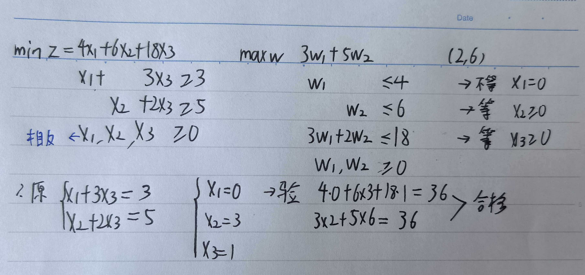
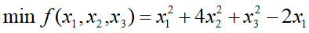
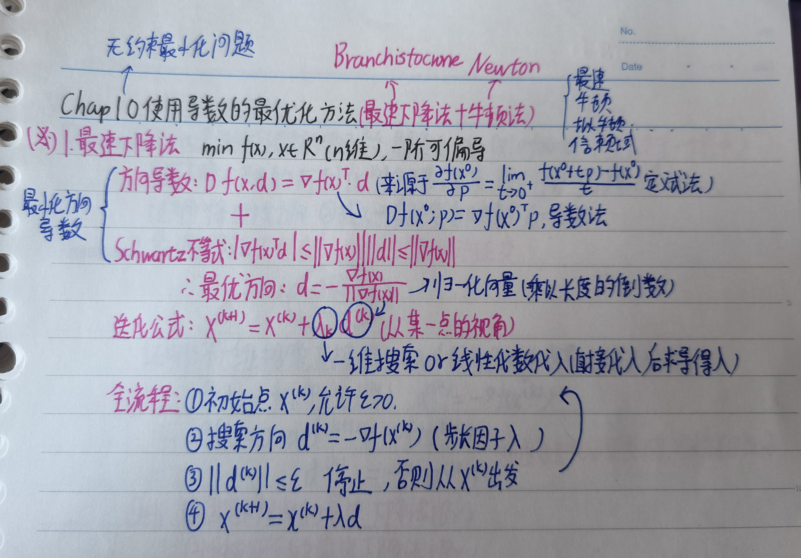
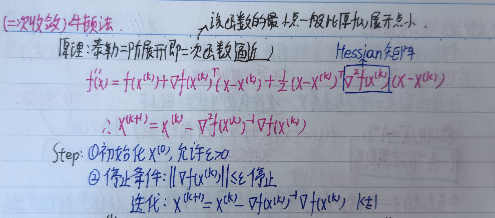
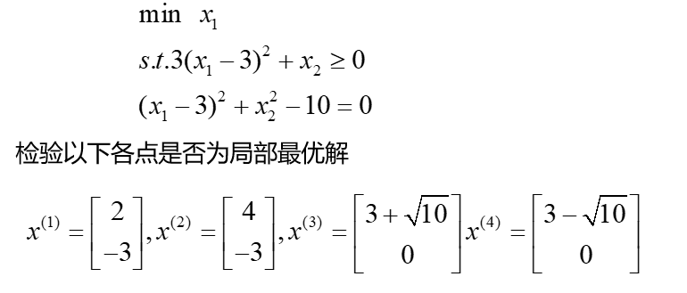
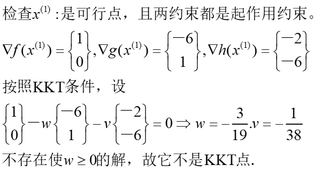
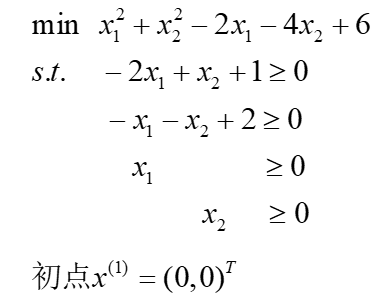
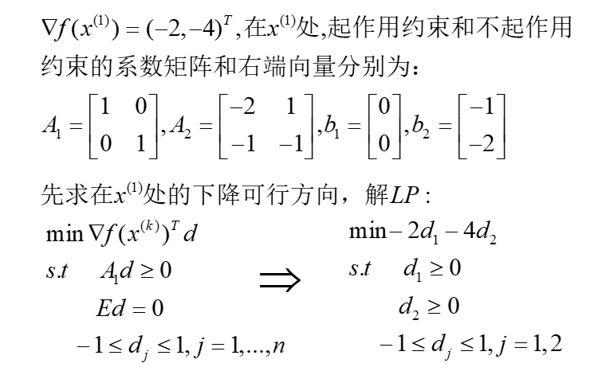
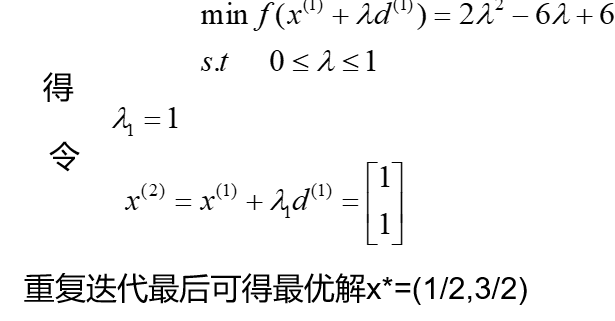
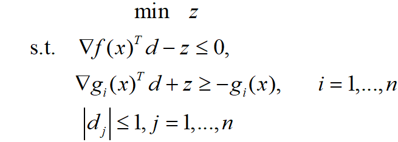

## **Chap1 概论**

**1.运筹学的定义:量化为基础的科学方式**

**2.运筹学的应用原则**

**3.运筹学的应用步骤**

**4.最优化是运筹学的一个分支**

**5.数学建模**

**6.问题的分类:线性规划问题/非线性规划问题/无约束问题**

## **chap2 数学**

**1.群:非空集合G 满足 代数运算+**

**2.交换群(阿贝尔群):非空集合G 满足 代数运算+,交换律**

**3.线性空间:非空集合AB 满足 代数运算+,交换律,代数运算$\times$(标量乘法)**

>   ==判断线性空间:基本上除了矩阵都满足(实数/多项式...)==

**4.线性相关性:**

>   若一组向量可以被另一组线性无关向量线性表示,则这两组向量线性相关

**5.范数的性质:正定性(大于0)/齐次性(|ax|)/三角不等式**

>

**6.常见的范数$||x||_p = (\sum^{n}_{i=1}x^p_i)^{\frac{1}{p}},1<p<+\infty  $$**

**7.梯度:    f(x)在不同维度上的偏导数(向量组)**

**8.方向导数: f(x)在指定方向的导数(导数中极限定理)**

**9.海森矩阵:二阶偏导数矩阵**

==**10.泰勒级数**==

>**主要内容:设$f:R^n \rightarrow R $**连续可微,向量$p \in R^n $
>
>(主要目的:使用多项式函数[比如二项式函数]对该函数进行逼近)
>
>**一阶泰勒公式:**
>$$
>f(x+p) = f(x)+\grad f(x)^T p + o(||p||)
>$$
>**二阶泰勒公式:**
>$$
>f(x+p) = f(x)+ \grad f(x)^T p + \frac{1}{2}p^T \grad^2 f(x)p + o(||p||)^2
>$$

## **Chap3 凸集和凸组合**

**1.凸集**

>在欧式空间中,对S中任意两点$x^{(1)},x^{(2))} $,以及每个实数$\lambda \in [0,1] $,都有
>$$
>\lambda x^{(1)}+(1-\lambda)x^{(2)}\in S
>$$
>
>**判断:对两个点进行连线,只要在S内(包括边界),则满足凸组合**

**2.凸组合**

>$$
>\lambda_1 x^1 + \lambda_2 x^2 + \cdots + \lambda_m x^m\in S( \sum^{m}_{i=1}\lambda_i =1,\lambda_i>0)
>$$
>
>只要$S_1$和$S_2$是凸集,他们作为集合的交集和加减都是凸
>
>**判断:展开后求参数和是否等于1**

**3.凸包:所有包含集合T的凸集->的交集,记作$conv \  T$**

**4.超平面**:$H = \{x|p^T x=\alpha \}$->超平面/负半空间/正半空间 

**5.射线:$L = \{x|x = x^{(0)} + \lambda d,\lambda \geq 0\} $,是非零向量,$x^{(0)} $是定点**

**6.多胞体:有限点集$\{x^0,x_1,\cdots,x^m \}\subset R^n $的凸包**(线段三角形四面体)

**7.单纯形:有限点集$\{x^0,x_1,\cdots,x^m \}\subset R^n $==仿射独立==的凸包**(==点==线段三角四面体)

**8.极点:不能被S中两个不同点通过凸组合表示出来的点**

**9.方向:一个集合里任何一个点做射线,如果仍然属于集合,称射线的方向为方向**

**10.极方向:不能被两个方向的线性组合表示**

**11.表示定理存在于S中的任意点,可以表示为极点的凸组合和方向的==非负==线性组合**

**12.分离定理对于超平面$H = \{x|p^T x = \alpha \} $**(S1和S2是闭集)

>**对$\forall x \in S_1,p^T x>\alpha $,对$\forall x \in S_2,p^T x\leq\alpha $则称超平面H分离集合S1和S2**
>
>**如果S1和S2都是开半区间,则H强分离S1和S2**

**13.支撑超平面:这里虚线就是支撑超平面,存在一个边界点 $p^T(x-\overline{x})=0 $**

**14.点到集合的距离:点到集合最小距离(下确界)$dist(y,S) = inf||y-x||(x \in S)$**

**15.投影定理:到闭凸集的最短距离点是唯一性$||y-\overline{x}|| = \inf_{x\in S}||y-x||$**

**16.凸函数**

>==设$S\subset R^n$是非空凸集,对任意$x_1,x_2\in S$和$\lambda \in(0,1)$,都有==
>$$
>f (\lambda x_1+(1-\lambda)x_2)\leq \lambda f(x_1)+(1-\lambda)f(x_2)
>$$
>点的凸组合的函数值"小于"函数值的凸组合"
>
>凸函数/凹函数/都不是
>
>
>
>**判断:$f(x)> f(x^*)+\grad f(x*)(x-x*)$,凸函数图像总是位于其任意切线上方**

**17.凸函数的判别(表示定理)**

>$$
>f(\alpha x^*+(1-\alpha)x)\leq \alpha f(x^*)+(1-\alpha)f(x)(表示定理)
>$$
>
>**1.必要性(直接化简到一边即可)**
>$$
>\frac{f(x+\alpha(x^*-x))-f(x)}{\alpha}\leq f(x)-f(x^*)
>\\ \\
>\therefore \grad f(x)^T(y-x)\leq f(x)-f(x^*)
>\\ \\
>\therefore \grad f(x)^T(y-x)+f(x^*)\leq x^*
>$$
>**2.充分性:==证图像在切线上方的条件成立,设两个点==(凸组合化简为表达式)**
>$$
>f(x_1)\geq f(x)+\grad f(x)^T(x_1-x)\\ \\f(x_2)\geq f(x)+\grad f(x)^T(x_2-x)\\ \\
>(对f(x_1)乘以\alpha,对f(x_2)乘以(1-\alpha),然后相加)
>\\ \\
>\therefore\alpha f(x_1)+(1-\alpha)f(x_2)\geq f(x)+\grad f(x)^T(\alpha x_1 + (1-\alpha)x_2-x)\\ \\
>(根据凸组合x = \alpha x_1+(1-\alpha)x_2,所以梯度项等于0)
>\\ \\
>\therefore af(x_1)+(1-a)f(x_2)\geq f(x)
>$$

## **Chap4 线性规划**

**1.线性规划的问题形式(目标函数和约束都是线性组合)**

**2.线性规划化为标准形式**

**3.线性规划的解决方法:图解法**

**4.线性规划的性质**

>1.可行域是凸集
>
>2.极点最优定理
>
>3.基本可行解和极点一一对应
>
>4.基本可行解就是最优解

**5.极点最优定理:最优点一定是极点(表示定理)**

>$$
>x = \sum^{k}_{i=1}\lambda_ix^{(i)}+\sum^{t}_{i=1}\mu_id^{(i)}\quad(\sum^{k}_{i=1}\lambda_i=1)
>$$
>
>线性规划问题转化
>$$
>\begin{cases}
>min\quad cx
>\\ \\
>s.t. \quad Ax=b,x\geq0
>\end{cases}
>
>\begin{cases}min\quad \sum^{k}_{i=1}\lambda_i(cx^{(i)})+\sum^{t}_{i=1}\mu_i(cd^{(i)})
>\\ \\
>s.t. \quad \sum^{K}_{i=1}\lambda_i=1,\lambda_i,\mu_i\geq0
>\end{cases}
>$$
>问题判断(只需要最小化cx)+简化($\mu_i<0$可以无限优化,此时无解)
>$$
>\begin{cases}min\quad \sum^{k}_{i=1}\lambda_i(cx^{(i)})
>\\ \\
>s.t. \quad \sum^{K}_{i=1}\lambda_i=1,\lambda_i,\mu_i\geq0
>\end{cases}
>$$
>**显然当$\lambda_p=1,\lambda_j=0 $的时候存在最小值(凸组合的系数之和等于1)**

**6.基本可行解的拆分(不会单独考)**

>$$
>\begin{align}
>&\because Ax=b\Leftrightarrow (B,N)(\begin{matrix}x_B\\x_N\end{matrix}) =b
>\\ \\
>&\therefore x  = \begin{pmatrix}X_B\\ X_N\end{pmatrix}
>=\begin{pmatrix}X_B\\ 0\end{pmatrix}
>\\ \\
>&\begin{pmatrix}B^{-1}b\\ 0\end{pmatrix} = \lambda\begin{pmatrix}X^{(1)}_B\\ X^{(1)}_N\end{pmatrix}+(1-\lambda)\begin{pmatrix}X^{(2)}_B\\ X^{(2)}_N\end{pmatrix}
>\end{align}
>$$

**7.基本可行解的计算:主要是分块然后$x = B^{-1}b $,然后判断>0为答案**

## **Chap5 单纯形法**

(**单纯形法是收敛的,经过有限次迭代会得到最优解**)

**1.判断最优解的方法**

>1.约束方程$Ax=b$
>
>2.变量分解:$Bx_B + Nx_N = b\rightarrow$$\therefore X_B  = B^{-1}b -B^{-1}N{X_N}$
>
>3.目标函数:$z = c^T x= c_B^T B^{-1}b + (c_N^T - c_B^T B^{-1}N)x_N$
>
>($c_B$是基变量系数,$c_N$是非基变量系数,$N$是非基矩阵,$x_N$是非基变量)

**约化费用(通过基变量非基变量推导)**
$$
\bar{c}_j = c_j - c_B^T B^{-1} A_j
$$

>   目标是使得所有约化费用分量都大于0

**边方向:$-B^{-1}A_j $,如果d>0无界无解**

**2.单纯形表法做题**

在基变量x_B的系数为0,系数为单位阵或者可以化为单位阵的时候有以下关系
$$
f+ 0\cdot X_B+(C_B B^{-1}N-C_N)X_N = C_B B^{-1}b
$$

>   约化费用(其实是入基)要求"最负""最小"
>
>   边方向(其实是出基)要求"最小""为正"

**注意表格纵列非基变量名/注意标准型->min和$\leq $**

**注意对于出基变量除以pivot,对于Oth变量乘以-col**

## **Chap6 对偶理论**

**1.对偶问题的转化(转化表)**

(等号$\Leftrightarrow $无约束)

原问题约束的符号和对偶问题的符号 **相反**

原问题变量的约束和对偶问题的变量 **相同**

**2.对偶理论**

>   min min > max max
>
>   最小化问题的最小值一定大于最大化问题的最大值

**3.对偶理论性质**

>(双次转化):对偶问题的对偶问题等于原问题
>
>(最优解一致):最大化问题和对偶的最小化问题的解一致
>
>(无界):如果原问题在可行域无界,对偶也无界无解
>
>(最优解):原问题和对偶问题的解一致,那么这个解就是最优解

**4.互补松弛定理**

要不代入当前约束等于0,不等于0则对偶问题的x为0

**5.求解对偶问题**

>**1.化简对偶形式**
>
>
>
>**2.通过对偶最优解求原问题的解**
>
>>   ->如果最优解的分量都大于0,那么可以直接把分量代入约束方程
>>
>>   (->如果最优解的分量存在小于0,那么算错了)
>>
>>   -->要么对偶约束代入后相等,那么原问题该分量大于0
>>
>>   -->要么对偶约束代入后不相等,那么原问题的该分量等于0
>>
>>   --->原问题对偶问题同解:原问题的**写成等式约束**代入对偶最优解,得到原问题的最优解
>>
>>   ---->验证:代入原问题和对偶问题的目标函数
>>
>>   

## **Chap7 无约束最优条件**

**0.UNLP的形式**

**1.下降方向的定义**

>   **存在方向d,使得==$\grad f(x^*)'d<0$==,使得$f(x^* +\lambda d)<f(x^*)$**
>
>   $\grad f(x^*)'d<0$**的证明:**泰勒一阶展开(最后一项是高阶无穷小)
>   $$
>   \begin{align}f(x^*+\lambda d) &= f(x^*)+\lambda\grad f(x^*)d+(\lambda ||d||a)
>   \\ \\
>   \frac{f(x^*+\lambda d)-f(x^*)}{\lambda} &= \grad f(x^*)d+(||d||a) =k
>   \end{align}
>   $$

**2.UNLP极小点的必要条件**

**(一阶可微)梯度=0**

>   证明:反证法,当前x\*是极小值梯度不等于0的话$\grad f(x^*)'d<0$
>
>   还存在更小的值,矛盾

**(二阶可微)梯度=0,海森矩阵半正定,当前是极小点,梯度=0**

>**证明:**泰勒二阶展开(最后一项是高阶无穷小)
>$$
>\begin{align}f(x^*+\lambda d) &= f(x^*)+\lambda\grad f(x^*)d+\lambda^2dH(x^*)d/2+(\lambda^2 ||d||^2a)
>\\ \\
>&\frac{f(x^*+\lambda d)-f(x^*)}{\lambda^2} = dH(x^*)d/2+(\lambda^2 ||d||^2a)
>\end{align}
>$$
>($dH(x^*)d/2\geq 0 $,一个二次型,所以海森矩阵半正定)

**3.UNLP极小点的充分条件**

>**一阶条件:UNLP不存在一阶充分条件**
>
>>   (仅仅梯度等于0可能是鞍点)
>
>**二阶条件:梯度等于0,海森矩阵正定**

**4.UNLP极小点的充要条件**

>   **可微凸函数梯度=0**

**5.求解UNLP问题**

>->求驻点(一阶偏导等于0)->**注意会得到一系列驻点**
>
>-->求海森矩阵,看哪个严格大于0,(可以通过迹判断正定)
>
>--->判断刚刚的驻点是否为局部极小点
>
>
>
>
>
>海森矩阵是常数矩阵,原函数是凸函数

## **Chap8 算法(仅了解)**

[PPT](F:\desktop\复习资料\(6.28 2 46)运筹学与最优化\8.第八章 算法.pptx)

## **Chap9 一维搜索**

**1.单峰函数的定义(通过点的定义/通过区间的定义)**

**2.单峰函数的性质**

**3.单峰函数的判断:==闭区间==+一阶导+单增减区间**

**4.一维搜索的形式:试探法/函数逼近法**

>试探法:0.618法,Fibonacci法,进退法
>
>函数逼近法:牛顿法,割线法,抛物线法,插值法

**4.0.618法(计算中间点->中心点代入函数->比较迭代[取端点到小的0.618段])**

**5.牛顿法(知道迭代算法即可)**

>

## **Chap10 使用导数的优化**

**1.最速下降法的推导以及流程**

==**2.最速下降法例题**==

>1.求导矩阵
>
>2.计算d($ d  = -\grad f(x^{(k)})$)/并且判断d模的大小
>
>3.代入迭代公式,梯度等于0,求出步长
>
>4.步长再带回求出下一个点
>
>

**3.牛顿法**

**4.牛顿法例题**
$$
d=-\grad^2f(x^{(k)})^{-1}\grad f(x^{(k)})(牛顿方向)
$$

>1.求一阶矩阵(代入点)
>
>2.求二阶海森矩阵(代入点)
>
>2.直接代入迭代公式($ x^{(2)} =x^{(1)}-\grad^2f(x^{(k)})^{-1}\grad f(x^{(k)})$)
>
>3.新点代入一阶矩阵,判断对于模的误差
>
>4.(新点代入海森矩阵,继续迭代)
>
>

**5.局部收敛定理**

>   **==牛顿法使用前提是:初始点足够靠近极小点->才会收敛==**
>
>   **如果原函数是二次凸函数,一次迭代就到极小点了**

**6.阻尼牛顿法和修正牛顿法**

>**阻尼牛顿法:将牛顿方向看作整体->一维搜索**
>
>**修正牛顿法:在阻尼牛顿法的前提下->引入单位矩阵判断是否正定**

## **Chap11 带约束的最优性条件**

**有效约束指的是代入测试点,结果为等于的约束**

**0.带约束问题的形式(不等式和等式约束)**

**1.最优条件:交集为空集**

==有约束极值极小值的必要条件:**有效**可行方向和下降方向交集为空集==

**2.判断某点是否是极小点**

>1.求目标函数梯度
>
>2.目标函数求导得到一阶矩阵->代入测试点->下降方向d的线性方程
>
>3.有效约束求导得到一阶矩阵->可行方向d的线性方程
>
>4.找是否存在一个d满足,如果满足则不是极小点
>
>

**3.FJ点**==(对任何局部最优解，FJ 条件必成立)==**

>   **书写标准:和KKT的不同在于$\grad f(x^{*})$前面拉格朗日乘子$\lambda$也可以加系数 **
>
>   并且仅需约束乘子非负(可以有0,但是非负)
>
>   **FJ要求所有的梯度分量都在同一侧**
>
>   

**4.判断某点是否是FJ点**

>1.对目标函数求导,代入测试点
>
>2.对有效约束求导,代入测试点
>
>3.建立FJ线性公式
>
>4.如果存在一个**不全为0的非负**解,则满足FJ
>
>

**5.KKT点**

>**书写标准:和FJ的不同在于$\grad f(x^{*})$前面拉格朗日乘子$\lambda$固定为1 **
>
>并且仅需约束乘子非负(可以有0,但是非负)
>
>**KKT的写法是减法,并且配合约束是大于等于**
>
>

**6.判断某点是否是KKT点**

>1.对目标函数求导
>
>2.对有效约束求导
>
>3.建立KKT线性公式
>
>4.如果存在一个**不全为0的非负**解,则满足KKT点
>
>**图片还有一个KKT全局最优解 充分条件(凸函数) 的判定**
>
>

**7.拓展到等式(就是多了个等式项,==但是等式的参数$\mu$没有限制(可正可负)==)**

**8.通过一阶条件(FJ/KKT)和二阶条件判断严格局部极小点**

>   1.一阶KKT条件
>
>   2.临界锥(二阶)
>
>   >(主要看算出来的系数$w_i$,如果大于0就安排强等式约束,否则就小于等于)
>   >
>   >
>
>   3.如果d的答案都是0,则下结论
>
>   4.如果d的答案存在非0,则计算海森矩阵是否正定
>
>   
>
>   >
>
>   >
>
>   >**==这里不等式约束和等式约束产生两个d的方程==**
>
>   >

## **Chap12 可行方向法**

**Zoutendijk是用来分析其它算法是否收敛的工具.避免无限迭代**

>   

**1.目标函数形式**

>$$
>min \quad f(x)
>\\
>s.t. \quad Ax\geq b \\
>Ex=e
>$$

**2.求下降可行方向**

>**下降方向:$\grad f(x)^T d<0 $**
>
>**可行方向:$A_1 d\geq 0,Ed=0 $(A1是起作用约束,E是等式约束)**
>
>**所以可知下降可行方向:(转化为了线性规划问题)**
>$$
>\begin{align}
>min &\quad \grad f(x)^T d
>\\ \\
>s.t.&\quad A_1 d\geq 0
>\\\\&Ed=0 
>\end{align}
>$$
>
>>   **==如果$\grad f(x)^T d=0$,证明该点是KKT点(终止目标)==**
>>
>>   **==如果$\grad f(x)^T d<0$,一种下降可行方向==**

**3.算法框架**

>1.给定初始点$x^{(0)} $允许误差$\epsilon_1>0,\epsilon_2>0 $
>
>2.在$x^{(k)}$处将A和b分块(按照起作用不起作用)
>
>>   $$
>>   A= \begin{bmatrix}A_1\\ \\A_2\end{bmatrix}\qquad
>>   b= \begin{bmatrix}b_1\\ \\b_2\end{bmatrix}
>>   $$
>>
>>   $A_1x^{(k)}=b_1, A_2x^{(k)}>b_2$
>
>3.通过$\grad f(x^{(k)})^Td $以及$A_1$矩阵求出d
>
>4.求上界:$\hat d上界 = A_2d^{k},\hat{b}上界 = b_2-A_2x^{(k)} $
>
>5.$min \ f(x+\lambda d)$得$\lambda$
>
>

**4.使用Zoutendijk求最优解**

>1.目标函数求导得到一阶矩阵,代入点
>
>2.划分起作用的约束和不起作用的约束,以及对应的AB向量
>
>3.求下降可行方向(表达式构造d的线性规划)
>
>4.求$\lambda$ (1.求上界2.建立$\lambda$的线性规划3.一维搜索)
>
>5.迭代

注意公式:$\hat d上界 = A_2d^{k},\hat{b}上界 = b_2-A_2x^{(k)} $,下界是0

**5.zoutendijk的收敛性**

**不收敛,因为它的下降可行映射不是闭映射->是合成映射**

->==Topkis-Veinott修正==,考虑了所有的约束

