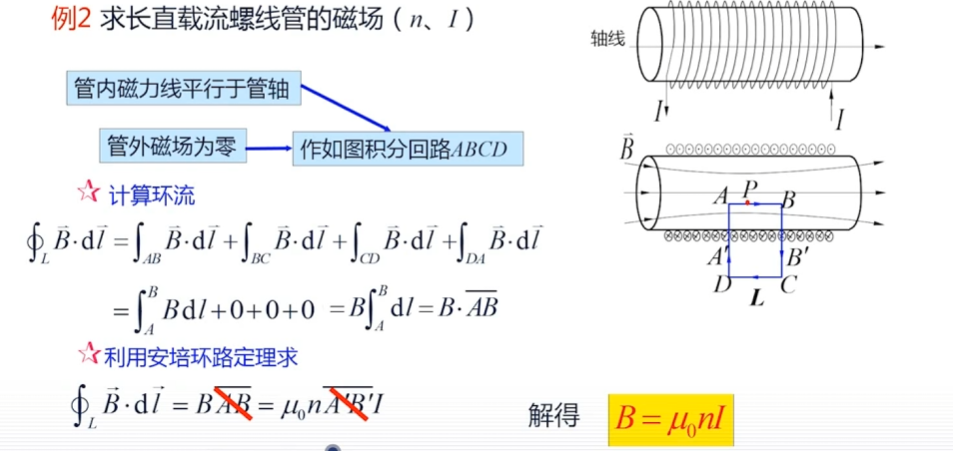
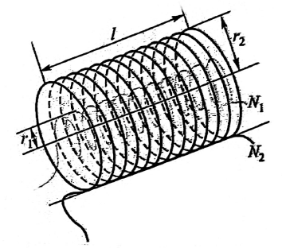
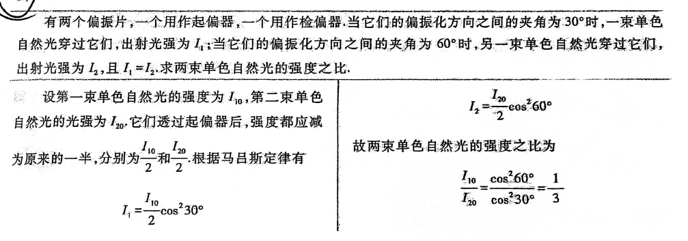

# 期末复习

## **题型**

单选 15*2 = 30

填空 5*2 = 10

简答 5*2 = 10

计算 5*10 =50

## **主观题**

#### **Chap9 求电场强度(标量)**

(由高斯定理推出来的,封闭物体内有电荷才存在电通量.**存在4个场景**)

>   无限长直导线:确定对象是线状:(l是直线长度,C是圆环周长)
>   $$
>   \lambda = (\frac{Q}{L}) = (\frac{Q}{2\pi R})
>   $$
>   无限大平面:比如异形平行板电容器(S就是面的面积,因为面是对称的)
>   $$
>   \sigma= \frac{Q}{S}
>   $$

###### **Eg1 E点电荷场强**

>   1.求 电偶极子 沿延长线上一点的电场强度
>
>   2.求 电偶极子 轴线中垂线上点的电场强度

>**==两个电场强度->叠加->电矩和距离的约化==**
>
>1.在两个点电荷激发的电场强度
>$$
>-q: E_{-q}= \frac{1}{4\pi\epsilon_0}\frac{q}{(x+\frac{r_0}{2})^2}i
>\\
>+q: E_{+q}= \frac{1}{4\pi\epsilon_0}\frac{q}{(x-\frac{r_0}{2})^2}i
>$$
>2.在点a的叠加场强
>$$
>\begin{align}
>E= E_{+q}-E_{+q} &=\frac{1}{4\pi\epsilon_0}\frac{q}{(x-\frac{r_0}{2})^2}-\frac{1}{4\pi\epsilon_0}\frac{q}{(x+\frac{r_0}{2})^2}i
>\\ \\
>&=\frac{q}{4\pi\epsilon_0}\frac{2\pi r_0}{(x^2- \frac{r_0^2}{4})^2}i
>\end{align}
>$$
>3.根据电矩的定义:$p=qr_0 i$,距离简化$(x^2- \frac{r_0^2}{4})^2\approx x^3$
>$$
>E =\frac{1}{4\pi \epsilon_0 }\frac{2p}{x^3}
>$$

>(两个电荷在下方)
>
>
>
>**计算电荷到B的距离->代入公式后叠加(单位矢量提一嘴)->电矩和距离优化**
>$$
>-q: E_{-q}= \frac{1}{4\pi\epsilon_0}\frac{q}{r_{-}^2}
>\\
>+q: E_{+q}= \frac{1}{4\pi\epsilon_0}\frac{q}{r_{+}^2}
>\\ 
>r_{+} = r_{-} = \sqrt{y^2+(\frac{r_0}{2})^2}
>\\ 
>\cdots
>\\
>E =\frac{1}{4\pi \epsilon_0 }\frac{p}{y^3}
>$$

###### **Eg2  E圆环场强**

**计算x轴上任一点P的电场强度**

>1.计算电荷元场强:电荷线密度:$ \lambda =\frac{q}{2\pi R} $,线段元$dl$
>$$
>dE = \frac{1}{4\pi \epsilon_0}\frac{\lambda d}{r^2} e_r
>$$
>
>>   这里$\lambda dl$就是单位元所携带的电荷量Q($ e_r$是单位矢量,忽略)
>
>2.电场强度(注意cos会多一个次方)
>$$
>E= \int_l dE =\int_l dEcos\theta  = \frac{1}{4\pi \epsilon_0}\frac{\lambda dl}{r^2}\frac{x}{r}
>\\ \\
>\therefore E = \frac{1}{4\pi \epsilon_0}\frac{\lambda }{(\sqrt{x^2+R^2})^3}\int^{2\pi R}_0 dl \quad= \frac{1}{4\pi \epsilon_0}\frac{qx }{(\sqrt{x^2+R^2})^3}
>$$
>3.讨论
>
>>如果P的距离足够远,分母简化: $\frac{1}{4\pi \epsilon_0}\frac{qx }{x^2}$
>>
>>如果P的距离足够近,$E\approx 0$
>>
>>在$-\frac{\sqrt{2}}{2}R $和$\frac{\sqrt{2}}{2}R$处有最大场强

###### ==**Eg3.E带电球面球内外电场强度(高斯定理)**==

1.r<R:高斯面内没有电荷:0

2.r>R:高斯面内有电荷:$E = \frac{1}{4\pi \epsilon_0}\frac{Q}{r^2} $

3.r=R:需要讨论,只有内外两种情况

###### **Eg4.E无限长均匀带电直线(高斯定理)**

电通量:E向外射的不是向上,所以电场线密度$\lambda$积累了$h$

>   $$
>   E \cdot 2\pi rh = \frac{\lambda h}{\epsilon_0}\Rightarrow E = \frac{\lambda}{2\pi \epsilon_0 r}e_r
>   \\ V_R = \int^{r_B} E\cdot dl = \frac{\lambda }{2\pi \epsilon_0}\int^{r_B}_{r}\frac{dr}{r} = \frac{\lambda}{2\pi \epsilon_0}ln\frac{r_B}{r}
>   $$

###### **Eg5.E无限大均匀带电平面(高斯定理)**

电荷面密度为$\sigma$,求距离该平面$r$处的电场强度

(==双面都射所以线条数×2,通过的面积是S==)

>   总电场线条数量:$2\times (E \times S)$
>   $$
>   \therefore 2ES= \frac{ES}{\epsilon_0}\Rightarrow E =\frac{\sigma}{2\sigma_0}
>   $$
>   
>
>   所以双板问题:板外:$E=0$;板内:$E = \frac{\sigma}{2\sigma_0}+\frac{\sigma}{2\sigma_0} = \frac{\sigma}{\sigma_0}$

#### **Chap10 计算电势差(标量)和能量**

$$
V_A - V_B= \int^{B}_{A}\overrightarrow{E}\cdot d\overrightarrow{l}
$$

>   解释:本质上是q从A到B做正功,电势降低,公式优化把试探电荷q去掉了
>
>   积分的时候,远的点设置为B,上界是B,下界是A

###### **Eg1.V带电球面电势差**

**只有球面外需要算,球面内都是固定值**

>

1.球面外任意两点间电势差

>$$
>\because E = \frac{1}{4\pi \epsilon_0}\frac{Q}{r^2}e_r ,V_A - V_B= \int^{r_B}_{r_A}\overrightarrow{E}\cdot dr
>\\ 
>\therefore V_A-V_B = \frac{Q}{4\pi\epsilon_0}(\frac{1}{r_A}-\frac{1}{r_B})
>$$

2.球面内任意两点间电势差

>$$
>\because E = 0
>
>\therefore V_A-V_B =0
>$$

3.球面外任意一点的电势

>$$
>V(r) = \frac{Q}{4\pi\epsilon_0 r}(r\geq R)
>$$

4.球面内任意一点的电势

>$$
>V(r) = \frac{Q}{4\pi\epsilon_0 r}
>$$

###### **Eg2.V无限长均匀带电直线**

(选取B为0电势点,求P的电势)**这里是无限长均匀带电直线**

>$$
>V_p= -\int^R_rE\cdot dr = \int^r_R E\cdot dr
>\\
>\because E = \frac{\lambda}{2\pi\epsilon_0 r}
>\\
>\therefore V_p= \int^r_R E\cdot dr = \frac{\lambda}{2\pi\epsilon_0}ln\frac{r_b}{r}
>$$

###### **Eg3.V平行板电容器(从高斯定理开始)**

两板面积均为S,两板内间距为d,两板内电介质$\epsilon_r $.电场线D

1.高斯定理求电场强度

>   (只有正极板表面有通量)
>   $$
>   \int D\cdot dS= \sigma S\Rightarrow D=\sigma
>   \\
>   E = \frac{Q}{\epsilon_0\epsilon_rS}(介质的影响)
>   $$

2.求电势差(也可以用电容公式反推)
$$
V = \int_{\lambda B}E\cdot dl = \frac{Q}{\epsilon_0\epsilon_r S}d
$$
3.平行板电容
$$
C = \frac{Q}{U} = \frac{\epsilon_0\epsilon_r S}{d}(和高中的\frac{\epsilon s}{4\pi kd}不同)
$$

###### **Eg4.V圆柱形电容器(从高斯定理开始)**

(无限长直导线)

1.电场强度(λ是电荷线密度)

>   $$
>   E =\frac{1}{2\pi \ \epsilon_0\epsilon_r}\frac{\lambda}{r} = \frac{1}{2\pi r \ \epsilon_0\epsilon_r}\frac{Q}{l}\frac{1}{r}
>   $$

2.电势差

>$$
>\begin{align}U = \int_l E\cdot dr &= \int^{R_B}_{R_A}\frac{Q}{2\pi\epsilon_0\epsilon_rl}(\frac{1}{r}dr)
>\\ \\
>&=\frac{Q}{2\pi\epsilon_0\epsilon_rl}ln\frac{R_B}{R_A}
>\end{align}
>$$

3.电容

>$$
>C = \frac{Q}{U}  = \frac{2\pi\epsilon_0\epsilon_rl}{ln\frac{R_B}{R_A}} =  \frac{2\pi\epsilon_0\epsilon_rlR_A}{d}(d足够大)\approx \frac{\epsilon_0\epsilon_r S}{d}
>$$ { }

###### **Eg5.V球形电容器(从高斯定理开始)**

同心圆导体的球壳组成,半径分别为$R_1,R_2 $ **(所以是均匀球面问题)**

1.电场强度

>   $$
>   E = \frac{Q}{4\pi\epsilon_0\epsilon_r r^2}e_r
>   $$

2.电势差

>   $$
>   U= \int_lE\cdot dl = \frac{Q}{4\pi\epsilon_0\epsilon_r }\int^{R_1}_{R_1}\frac{1}{r^2} = \frac{Q}{4\pi\epsilon_0\epsilon_r }(\frac{1}{R_1}-\frac{1}{R_2})
>   $$

3.电容

>$$
>C= \frac{Q}{U} =4\pi\epsilon_0\epsilon_r(\frac{R_1R_2}{R2-R_1})
>$$

###### **Eg6.W球形电容器存储能量(从高斯定理开始)**

(内外半径为$R_1,R_2 $,电荷分别为$+-Q $,电容率$\epsilon$)**(所以是均匀球面问题)**

1.电场强度

>   $$
>   E=\frac{Q}{4\pi\epsilon r^2}e_r
>   $$

==2.**能量密度公式**($W = \frac{1}{2}\frac{Q^2}{C} = \frac{1}{2}QU$也能用)==
$$
W = \frac{1}{2}\epsilon E^2  \quad W_{all}= \int_RdW \qquad(J/m^2)
$$

>   $$
>   w =\frac{1}{2}\epsilon E^2 = \frac{Q^2}{32\pi^2\epsilon r^4}
>   $$

**3.积分总能量**(这里公式==球对称:$dV = 4\pi r^2 dr $==)

>$$
>dW = wdV =\frac{Q^2}{32\pi^2\epsilon r^4}4\pi r^2 dr = \frac{Q^2}{8\pi\epsilon r^2}dr
>$$
>
>$$
>W_{all} = \int dW =\frac{Q^2}{8\pi\epsilon}\int^{r_2}_{r_1}\frac{1}{r^2}dr = \frac{Q^2}{8\pi\epsilon}(\frac{1}{R_1}-\frac{1}{R_2})=\frac{1}{2}\frac{Q^2}{4\pi\epsilon \frac{R_2R_1}{R_2-R_1}}
>$$

**4.约化**

>   $$
>   W_c= \frac{Q^2}{8\pi \epsilon R_1}
>   $$

#### **Chap11 毕奥-萨伐尔定律**

**==主要考点是求B(磁感应强度)/F(洛伦兹力)/H(磁场强度)==**

>B:毕奥-萨伐尔定律
>
>>适用于**任意电流分布**（直导线、圆环、螺线管)仅适用于真空或非磁性介质)
>
>H:安培环路定理
>
>>   在**高度对称**的恒定电流分布情况下
>
>F:F=qvb

!

**毕奥-萨伐尔定律**

**给一个导线,求某个点产生的B**

>   
>
>   (一个电流元Idl在空间中某点P产生的磁感应元dB为)
>   $$
>   \begin{align}
>   dB &=\frac{\mu_0}{4\pi}\frac{I\cdot dl\times \overline{r}}{r^3}
>   \\ \\&= \frac{\mu_0}{4\pi}\frac{I\cdot  dl\times \overline{r}}{r^2}
>   (最常用的形式)
>   \\ \\&=(\frac{\mu_0}{4\pi}\frac{I\cdot sin\theta dl}{r^2})
>   (磁感应微元方向相同)
>   \\ \\
>   \Rightarrow B&=\int dB
>   \end{align}
>   $$
>   ($\mu_0$是真空磁导率:$4\pi\times 10^{-7}T\cdot m/A $)(r是从电流元指向考察点的位移矢量)

**主要也就三种场景**

>|      (场景)      |                 对于轴线上某个点                  | 特殊情况                                       |
>| :--------------: | :-----------------------------------------------: | ---------------------------------------------- |
>| **载流长直导线** | $\frac{\mu_0I}{4\pi a}(cos \alpha_1-cos\alpha_2)$ | 无限长直导线:$B = \frac{\mu_0 I}{2\pi\alpha} $ |
>| **载流圆形导线** |   $\frac{\mu_0 IR^2}{2(R^2+x^2)^{\frac{3}{2}}}$   | 圆心处:$B = \frac{\mu_0 I}{2R}$                |
>|  **载流螺线管**  |    $\frac{\mu_0 nI}{2}(cos\beta_1-cos\beta_2)$    | 无限长螺线管$\mu_0nI$                          |
>

###### **Eg1.B载流长直导线**

>   $$
>   dB =  \frac{\mu_0}{4\pi}\frac{I\cdot  dl\times \overline{r}}{r^2}=\frac{\mu_0}{4\pi}\frac{Ilsin\theta dl}{r^2}\\ 
>   B = \int dB = 
>   \frac{\mu_0I}{4\pi a}\int^{\alpha_2}_{\alpha_1}sinada = \frac{\mu_0I}{4\pi a}(cos \alpha_1-cos\alpha_2)
>   $$
>
>   $a$:场点到直导线的垂直距离
>
>   $a_1$:(沿电流方向,电流始点,到场点p)角度
>
>   $a_2$:(沿电流方向,电流末点, 到场点p)角度
>
>   if 无限长直导线:$B = \frac{\mu_0 I}{2\pi\alpha} $
>
>   if 半无限长直导线:$B = \frac{\mu_0 I}{4\pi\alpha} $
>
>   if p在导线上:B=0

###### **Eg2.B载流圆形导线轴线上的磁场**

>   $$
>   \begin{align}dB &= \frac{\mu_0}{4\pi}\frac{Idl\times \overline{r}}{r^2} = \frac{\mu_0}{4\pi}\frac{Idl\times e_r}{r^2}(\theta=90\degree)
>   \\ 
>   dB_{//} &= dBsin\theta = \ \frac{\mu_0}{4\pi}\frac{Idl}{r^2}sin\theta = \frac{\mu_0}{4\pi}\frac{Idl}{r^2}
>   \\ 
>   dB_{垂直} &= dBsin\theta = \ \frac{\mu_0}{4\pi}\frac{Idl}{r^2}sin\theta = \frac{\mu_0}{4\pi}\frac{Idl}{r^2}
>   \\ 
>   &(因为垂直对称性,只需要讨论平行部分)
>   \\
>   B &= \int_l dB_{//} =   \frac{\mu_0}{4\pi}\frac{IR}{r^3}\int_ldl = \frac{\mu_0IR^2}{2r^3}
>   \\ 
>   &=\frac{\mu_0 IR^2}{2(R^2+x^2)^{\frac{3}{2}}}
>   \end{align}
>   $$
>
>   圆心处:$x=0,B = \frac{\mu_0 I}{2R}$
>
>   圆心角为$\theta$的**圆心处**圆弧电流:$\frac{\theta}{2\pi}=\frac{\mu_0 I}{2R}$

###### **安培环路定理**

>
>
>
>
>
>
>
>
>
>
>>   只有L1-L2,L3和L4没有组成套链(没有贡献)
>
>
>
>
>
>>   ==只有I2在环路内部==

###### **Eg3.B载流直螺线管内部的磁感强度**

$$
B = \frac{\mu_0 nI}{2}(cos\beta_1-cos\beta_2) =\mu_0nI(无限长螺线管)
$$

长度为l,半径为R,总匝数N

**螺线管元:$\frac{N}{l}dx $**

>
>
>
>
>

**极限情况**

>
>
>>   

###### **Eg4.B载流螺线管环==中心线==上任意点处的磁感强度**

>   
>
>   
>
>   

###### **Eg5.B无限长载流圆柱体的磁场**

>   **无限长直导线和无限长圆柱体不同**
>
>   
>
>   
>
>   >圆柱体内外侧
>   >
>   >

###### **Eg6.B无限长同轴圆筒形导体(之间充斥磁介质)**

>   两个圆筒都是导体,之间的磁导率是$ \mu_r $,H是磁场强度(A/M)
>
>   $d_1$是轴线到p点的距离,$d_2$是轴线到Q的距离,R是大圆柱体R,r是小圆柱体r
>
>   **1.点p处的B(p夹在两个圆筒之间)**
>   $$
>   \int H\cdot dl = H\int^{2\pi d_1}_{0}dl = H\cdot 2\pi d_1 = I\therefore B= \frac{I}{2\pi d_1}
>   \\ 
>   \therefore B = \mu H  =\frac{\mu_0\mu_rI}{2\pi d_1}
>   $$
>   **2.点Q处的B(点Q在两个圆筒之外)**
>
>   **以$d_2 $为半径做一圈,显然闭合路径所包围的传导电流代数和为0**
>
>   所以B=0

###### **Eg7:带电粒子在磁场中的受力F = qvB**

>
>
>回旋加速器:
>$$
>f = \frac{qB}{2\pi m}\ v = \frac{qBR_0}{m}  \ E_k = \frac{1}{2}mv^2 = \frac{q^2B^2R^2_0}{2m}
>$$
>(例子质量和速率的关系,$m_0 $是静质量)
>$$
>m = \frac{m_0}{\sqrt{1-(\frac{v}{c})^2}}\ f = \frac{qB}{2\pi m_0}\sqrt{1-(\frac{v}{c})^2}
>$$
>
>
>

#### **Chap12 电磁感应**

###### **法拉第电磁感应定律**

**感应电动势$\epsilon_i$和 (穿过回路的磁通量 对 时间的变化率 的负值成正比)**

>   $$
>   \epsilon_i = -\frac{d\Phi_m}{dt}
>   $$
>
>   (需要注意磁条插入和抽出会影响$\Phi$,从而影响$\epsilon$的正负)
>
>   
>
>   

###### **Eg1:求旋转感应电动势**

>   **1.通过单匝的磁通量:$\Phi = B\cdot S = BScos\theta  = BScos(\omega t) $**($\theta$是B和S的夹角)
>
>   **2.总磁链:$\Psi = N\Phi = NBScos(\omega t) $**
>
>   **3.法拉第定律:$\epsilon_i= NBS\omega sin(\omega t)  = NBS\omega sin(2\pi f t)$**
>
>   **4.电流:$i = \frac{\epsilon_i}{R} = i_{max} sin\omega t $**

###### **Eg2.求圆环上感应电流的大小**

**半径为r,电阻为R,在圆环所围成的平面相垂直的均匀磁场,B变化($\frac{dB}{dt}$)**

>1.元的感应电动势:$\int_s \frac{dB}{dt}\cdot dS$
>
>2.代入变化量和平面面积:$\frac{dB}{dt}\pi r^2 $
>
>3.电流:$I = \frac{e_i}{R} = \frac{\pi r^2}{R}\frac{dB}{dt}$

###### **Eg3.自感**

**线圈自身电流变化在自身产生感应电动势的能力。**

自感系数:$L = \frac{\Psi}{I} $,自感电动势$\epsilon_1 = -L\frac{dI}{dt} $,方向:阻碍自身电流的变化

长直密螺线管长度为l,横截面积是S,线圈的总匝数为N,管中磁介质导率$\mu$

>1.螺线管B:$B = \mu nI = \mu \frac{N}{l}I $
>
>2.磁通量$\Phi $:$\Phi = BS = \mu\frac{N}{l}IS　$
>
>3.磁链$\Psi = N\Phi = \mu\frac{N^2}{l}IS $
>
>4.自感:$L = \frac{\Psi}{I} = \mu\frac{N^2}{l}S  = \mu n^2 V$

###### **Eg4.互感**

**一个线圈电流变化在邻近另一个线圈产生感应电动势的能力。**

互感系数:$M = \frac{\Psi_{21}}{I_1} = \frac{\Psi_{12}}{I_2} $,互感电动势$\epsilon_{21} = -M\frac{dI_1}{dt} $,方向:阻碍引起它电流变化

>1.螺线管B:$B_1 = \mu_0 nI = \mu_0 \frac{N_1}{l}I_1 = \mu_0n_1I_1 $
>
>2.磁通量$\Phi $:$\Phi = BS = B_1(\pi r^2_1) $
>
>3.在$N_2$产生的磁链$\Psi $:$\Psi = N\Phi = n_2l B_1(\pi r^2_1)=\mu_0n_1n_2l(\pi r^2)l_1 $
>
>4.互感:$M_{21}  = \frac{N_2\Phi_{21}}{L_1}= \mu_0n_1n_2l(\pi r^2_1) $
>
>**对两个螺线管产生的互感都是相同的**

###### **Eg5:能量和自感**

**同轴电缆金属芯线的半径为$R_1$,共轴金属圆筒的半径是$R_2$,中间磁介质$\mu $**

>

>1.距离为r处的B:$B = \frac{I}{2\pi r}$
>
>2.元能量密度:$w = \frac{1}{2}\mu H^2 = \frac{\mu}{2}(\frac{I}{2\pi r})^2 = \frac{\mu l^2}{8\pi^2 r^2} $
>
>3.总能量:$W = \int_V wdV = \frac{\mu l^2}{8\pi^2 }\int_V\frac{1}{r^2}dV $
>
>4.区域能量: $\frac{\mu l^2}{8\pi^2 }\int^{R_2}_{R_1}\frac{2\pi r dr}{r^2}  =\frac{\mu I^2}{4\pi}ln\frac{R_2}{R_1} $
>
>5.自感:$w = \frac{L_1^2}{2}\therefore L = \frac{\mu}{2\pi}ln\frac{R_2}{R_1} $

#### **Chap14 杨氏双缝干涉**

###### **Eg1.求波长,相邻两暗纹中心间的距离**

****

1.中心点坐标公式:
$$
x_k = \pm\frac{d'}{d}k\lambda
$$

>1.
>
>$\therefore \Delta x_{14} = x_4-x_1 = \frac{d'}{d}(k_4-k_1)\lambda$
>
>$\therefore \lambda = \frac{d}{d'}\frac{\Delta x_{14}}{(k_4-k_1)} $(d是双缝间距,d'是双缝到屏幕距离)
>
>2.
>
>$\Delta x = \frac{d'}{d}\lambda = 30mm $

###### **Eg2.干涉条纹以及干涉条纹的明暗**

>   1.增大折射率,条纹向上平移,但是间距依然不变
>
>   2.依然是明条纹

###### **Eg3.求波长**

$$
2nd+\frac{\lambda}{2} = k\lambda\Rightarrow \therefore \lambda = \frac{2nd}{k-\frac{1}{2}}
$$

>   k=1,\lambda = 1800nm 红外波不可见
>
>   k=2,\lambda = 600nm  橙红色
>
>   k=3.\lambda = 360nm  紫外波不可``见

###### **Eg4.反过来求d**

$$
2nd+\frac{\lambda}{2} = k\lambda\Rightarrow \therefore d =  \frac{k+\frac{1}{2}\lambda}{2n_2} (k=0最小)
\\
d = \frac{\lambda}{4n_2} = \frac{550nm}{4\times 1.38}\approx 10^2nm
$$

$$
F / L = \frac{\mu_0 I_1 I_2}{2\pi a}\\ F_{12} = I_2 (L \hat{\mathbf{dl_2}} \times \mathbf{B_{12}})
$$
