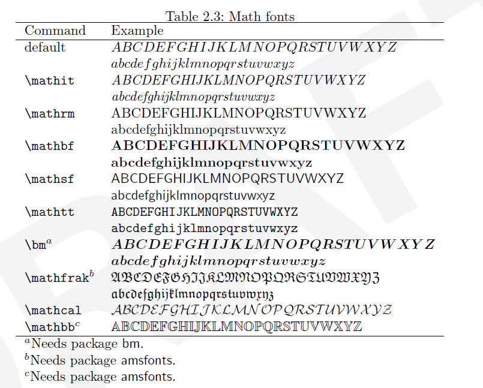

## **1.基础公式**

**0.空格符号**

>   \,\\\,\quad,\qquad,\qquad

###### **1.简单的括号/文字输入**

$$
-a+2b=3c-4d(5e+6f)
\\ \\
\{a,b,c,d,e\}
\\ \\
(x+y)/(x-z)
$$

###### **2.`begin`和`end`进行换行**

$$
\begin{equation}
\delta\times\varepsilon=\theta
\end{equation}
$$

$$
\begin{equation*}
\varphi - \rho \neq \kappa
\end{equation*}
$$

###### **3.上下标**

$$
x^2,x^2y^2,x_1^2,x^2_n
\\
x^{x^{x^{x^{x^2}}}}
$$

###### **4.开方`root`**

$$
\sqrt{x+y}
\\
\sqrt[(\beta+\epsilon)^{x^2}]{x+y}
\\
\sqrt[3]{x+y}
\\
\sqrt{1+\sqrt{1+\sqrt{1+\sqrt{1+x}}}}
$$

###### **5.inline模式(displaystyle/textstyle)**

$$
\frac{1}{2}\\
\dfrac{1}{2}\\
\\
\tfrac{1}{2} \ (inline \ mode)
\\
\displaystyle{\sum^{1}_{2}}
\\
\textstyle{\sum^{1}_{1}}
\\
$$

###### **6.连加符号`sum`,连乘符号`prod`,积分符号`int`**

$$
\sum^{k}_{n=1}\quad \prod^{k}_{n=1}\quad \int^b_a
\\
length:\qquad\iiiint(4i_{is\ max})
\\
limits:\qquad \iiint\limits_V
\\
oint:\oiiint(3i_{is\ max})
$$

###### **7.连乘符号下标叠加`substack`**

$$
\sum_{\substack{formula1 \\ formula2 \\ formula3 \\ \vdots\\formulan}}
$$

###### **8.使用big修饰括号类**

###### **9.修改文本显示格式**

$$
\mathbf{i}^2 = -1
\\
i^2 = -1
\\
\mathbb{R} \\
\R \C \ \H \ \N \O  \P  \Q \S \Z 
\\
$$

>

###### **10.对齐`align`以及左右括号** 

$$
\begin{equation}
\left.
\begin{aligned}

\end{aligned}
\right\}
\text{Maxwell's}
\end{equation}
$$

###### **11.LateX作业**

$$
\begin{equation}
\begin{aligned}

\lim_{x\to 0}\frac{1-cosx}{x^2} &= \lim_{x\to0}\frac{2sin^2\frac{x}{2}}{x^2}\\
&=\frac{1}{2}\lim_{x\to 0}\frac{sin^2\frac{x}{2}}{(\frac{x}{2})^2}\\
&=\frac{1}{2}\lim_{x\to 0}\bigg(\frac{sin\frac{x}{2}}{\frac{x}{2}}\bigg)^2 = \frac{1}{2}

\end{aligned}
\end{equation}
$$

$$
\left\{\
\begin{aligned}
x = \rho(\theta)cos\theta\\
y = \rho(\theta)sin\theta
\end{aligned}
\right.\
(\alpha \leq \theta \leq\beta)
$$

$$
\det \mathbf{A} = \det \begin{pmatrix}
a_{11} & a_{12} & \cdots & a_{11} \\
a_{21} & a_{22} & \cdots & a_{21} \\
a_{31} & a_{32} & \cdots & a_{31} \\
\vdots & \vdots & \vdots & \vdots \\
a_{m1} & a_{m2} & \cdots & a_{m1}
\end{pmatrix} = \begin{vmatrix}
a_{11} & a_{12} & \cdots & a_{11} \\
a_{21} & a_{22} & \cdots & a_{21} \\
a_{31} & a_{32} & \cdots & a_{31} \\
\vdots & \vdots & \vdots & \vdots \\
a_{m1} & a_{m2} & \cdots & a_{m1}
\end{vmatrix}
$$

