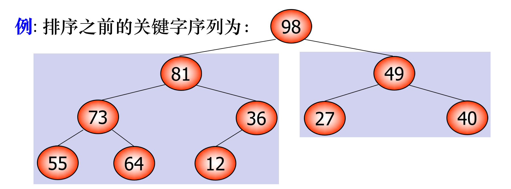

# **数据结构与算法分析**

## **考试题型**

判断题 1*20 -> 20

单选题 1*20 -> 20

多选题 1*10  ->10

分析题 5*2 ->10

理解题 5*2 ->10

设计题 30*1 -> 30

(复习资料:MOOC试卷,测验题,慕课练习题)

(分析和理解题:要求步骤和结果)

**复习要求:理解,概念方法,举例子,算法的实例计算**

对于(Chap3枚举算法)(Chap4贪心算法)(Chap6分治问题)(Chap8A回溯问题)(Chap8B分支限界问题)(Chap10网络流设计策略)需要掌握

>   **基本思想,基本要素,适用条件,算法框架,算法步骤(额外补充)**
>
>   **相同和之间的区别**

## **Chap1 算法与问题**

###### **<font color=deeppink>1.算法的概念</font>**

**算法是一步一步正确解决问题的方法和策略,具有分步/有序/有穷/有目的/可操作的特点**

>   其中有穷指的是代码指令的数量是有穷的

###### **<font color=deeppink>2.算法的性质</font>**

**1.输入:算法有 0个 或 多个 输入**

**2.输出:算法有 1个 或 多个 输出**

**3.确定性:算法的每条指令(步骤)都要有明确的含义,清楚且无歧义**

**4.有穷性:算法中的指令有限,执行次数有限,执行时间有限**

(一下是算法的表示形式:流程图,**程序**,自然语言,伪代码)

###### **3.算法与程序**

**1.算法与程序的区别**

>   (目的不同)和上面说到一样,程序是算法的表示形式之一
>
>   (性质不同)算法需要有穷性,但是程序可以具有无穷性   ->(等待用户的响应,使用While(1))

**(SELECTIVE)2.算法与操作系统的区别**

>   操作系统是一个无限执行的程序,由子程序组成,**子程序可以满足算法的4个性质所以是算法**

###### **4.算法与问题**

**问题:问题是一个要求给出解答的提问**

**问题的要素:输入和输出(需要严格的描述)**

>   输入的作用:描述问题的所有参量,也称作实例0
>
>   输出的作用:描述解决问题的格式和满足的性质,也称作询问
>
>   (因此计算机的每次求解只是针对问题的一个实例求解,如果一个算法能应用于这个实例,那么称这个算法解答了该问题)

###### **5.问题的规模(书上没提)**

**问题规模:特指输入数据的大小**

###### **6.问题的处理时间计算(不涉及复杂度)(书上没提)**

**问题的处理时间:特指通过time.time()记录算法的执行时间**

###### **7.问题的求解过程**

>   1.提出问题
>
>   2.分析问题:对问题进行数学建模
>
>   3.解决问题:主要是进行算法及分析
>
>   >   (1)设计算法:选择可行的数据结构以及算法
>   >
>   >   (2)证明算法:证明使用该算法的正确性
>   >
>   >   (3)分析算法:分析算法的性能(有穷步终止+结果正确)->回到(1)再设计
>   >
>   >   (4)实现算法+调试测试

###### **8.问题的变换**

**1.复杂的问题转化为简单的问题**

>   比如预排序再进行完整排序
>
>   比如在多次查找中使用折半查找
>
>   比如求解线性方程组转化为上三角矩阵

**2.难解的问题转化为易解的问题**

>   比如使用合并排序而不是堆排序(降低空间复杂度)
>
>   比如使用AVL和红黑树而不是二叉查找树(避免性能降低)
>
>   比如使用霍纳法则(嵌套多项式)求解多项式

**3.隐式的问题转化为显式的问题**

>   比如使用状态空间图描述问题

**4.未知的问题转化为已知的问题**

>   比如通过最大公约数求最小公倍数:
>   $$
>   lcm(a,b) = \frac{a\times b}{gcd(a,b)}
>   $$

###### **9.稳定匹配问题**

**1.稳定匹配的基本思想**

>   对于两个集合,通过偏好排序列表,找到一种配对方案,使得所有人都有匹配

**2.稳定匹配的前提**

>   **<font color=red>(1)需要两个等大的集合   (书上要求所有人都有匹配)</font>**
>
>   **<font color=red>(2)每个参与者对于对方的成员都有完整的偏好   (不存在空的偏好)</font>**

**3.稳定匹配的算法**

>   (1)初始化
>
>   (2)对于每个男生
>
>   >   a.如果当前高偏好女生没有配对,则配对
>   >
>   >   b.如果当前高偏好女生有配对,分手/依然单身
>
>   (3)直到稳定匹配

## **Chap2 算法分析**

###### **1.复杂度理解**

**时间复杂度T(n):算法效率的度量:算法所需的时间资源量**

**空间复杂度S(n):算法空间的度量:算法所需的空间资源量**

>   **<font color=red>这里 空间复杂度 特指算法 需要的额外的辅助存储空间</font>**
>
>   (但是算法占据的空间包括:输入输出+程序+辅助空间)

>   问题的规模n是问题的输入量
>
>   时间复杂度是规模n的函数
>
>   多项式时间复杂度是有效算法

###### **2.复杂度分类**

>   和上文说的一样,分为时间复杂度T(n)和空间复杂度S(n)

###### **3.复杂度分析的方法和阶段**

**算法分析的方法**

>   **分析方法1:事后统计法**
>
>   >   问题1:算法在不同环境下表现不同(人/机器/编程语言)
>   >
>   >   问题2:输入实例的范围频率未知
>   >
>   >   问题3:不可控因素导致偏差太大(执行过程草率)
>
>   **分析方法2:事前分析法**
>
>   >   主要思想:统计每条基本运算各自的时间然后求和(理论值)
>   >
>   >   基本运算时间:幂乘>除法>乘法>加减>移位

**==算法分析的阶段==**

>   **阶段1:粗粒度比较:直接比较算法的数量级**
>
>   **阶段2:细粒度比较:数量级相同,进行细化比较各种内容**

**算法分析的简化**

>   1.基本运算时间简化为1
>
>   2.使用最坏时间复杂度作为算法的时间复杂度
>
>   3.选取程序最复杂部分的基本运算次数作为次数的数量级

###### **4.符号与性质**

**1.符号(在算法分析中出现的)**

>   1.    $O_i $: 表示基本运算
>   2.    $t_i $:  表示单个基本运算所需的时间
>   3.    $e_i$:  表示单个基本运算的运行次数
>   4.    算法时间:  $ \sum e_it_i $->$\sum e_i $只考虑数量级
>   5.    $n$: 求解问题的输入量(规模)
>   6.    $k$: 输入的二进制编码长度(或二叉树的层数)

**2.符号(在渐进复杂度中出现的)**

>   1.    $O$:表示算法的上界
>   2.    $\Omega$:表示算法的下界
>   3.    $\Theta$:表示算法的紧界(正相关)
>   4.    $o$:表示算法的低阶
>   5.    $\omega$:表示算法的高阶
>
>   (都具有传递性:$f=符号(g),g=符号(h),则f=符号(h)$)
>
>   渐进时间复杂度的要点
>
>   >   1.低阶比高阶有效->==在问题规模较大的时候成立==
>   >
>   >   2.算法运行的时间和实例有关,存在算法退化的情况
>   >
>   >   3.渐进复杂度阶数相同的时候,需要额外考虑表达式的常数因子

###### **5.复杂度比较方法**

**<font color=red>必考,建议练题为主</font>**

**1.对数法**

>   两个函数表达式包含乘积+幂次+阶乘的复杂形式,可以通过对数变成加法
>
>   小技巧:
>   $$
>   log(n!)\approx nlogn -n \qquad log(2^n)\approx nlog2
>   $$

**2.积分法**

>处理求和式,一般无法得到解析式,而是得到相关式比如$\Theta(n) $

**3.极限法**

>   一般直觉就是极限法,通过极限可以看出阶数关系
>   $$
>   \lim_{n\rightarrow\infty}\begin{cases}
>   0&f(n) = o(g(n))\\ \\
>   c>0&f(n) =\Theta(g(n))\\ \\
>   \infty&f(n) = \omega(g(n))
>   \end{cases}
>   $$

**4.放大法**

>   找到该算法表达式的上界下界(比如去除小阶)

**<font color=red>注意O(n)比O(nlogn)的效率高,后者适用于大规模数据</font>**

###### **6.如何解决时空矛盾**

**当需要较少空间时,一般可以通过重复计算/数据压缩的方法(时间换空间)**

**当需要较少时间时,一般可以通过预处理/预构造/动态规划(空间换时间)**

>   **预处理:存储额外的知识(先验知识)**
>
>   **预构造:使用额外空间进行更快的信息存储(避免重复计算地址)**
>
>   **动态规划:将子问题存储在表中,下次直接调用而非重新计算**
>
>   **图的构造:稀疏图使用邻接表($O(n) $)而不是邻接矩阵($O(n^2)$)**

**(SELECTIVE)大数据的处理**

>   大数据使用亚线性空间和亚线性时间算法
>
>   使用:并行计算/众包计算/云计算/近似算法/随机算法/在线算法/外存算法
>
>   智能算法:遗传算法/蚁群算法/模拟退火/局部搜索/粒子群/神经网络

###### **7.查找方法比较(预构造部分)**

**假设存在一个n元非有序数组**

>   哈希表:
>
>   >   成功平均查找长度 = (竖着看)层数对应次数的加权和 / 元素的个数n
>   >
>   >   失败平均查找长度 ->(横着看)所有元素都要查1遍  =  n/n+1
>
>   顺序查找:
>
>   >   成功平均查找长度 = $(n+1)/2$
>   >
>   >   失败平均查找长度 = $n+1=13$
>
>   二分查找:
>
>   >   成功平均查找长度 = $\sum n_i t_i/n$(按照二叉树划分以后逐层计算)
>   >
>   >   失败平均查找长度 = 二叉树的深度

###### **---算法部分--**

###### **8.折半查找(二分查找)(主要思想+会分析复杂度)**

**主要思想:适用于在<font color=red>有序</font>的数组中进行查找(分治思想)**

**算法框架:**

>   1.划分边界:从[low,high]
>
>   2.查找中间元素mid的索引:$(index_{low}+index_{high})/2 $
>
>   3.重新划分区域进行查找
>   $$
>   \begin{cases}
>   A[mid] < key &[mid+1,high]
>   \\ \\
>   A[mid]==key&return
>   \\ \\
>   A[mid] > key &[low,mid-1]
>   \\ \\
>   (low>high)&不存在
>   \end{cases}
>   $$

**复杂度分析:**

>   时间复杂度:最好$O(1),$最坏$O(logn)$,平均$O(logn)$
>
>   空间复杂度:迭代实现$O(1)$,递归实现$O(logn)$

###### **9.分块查找(索引顺序查找)(主要思想+会分析复杂度)**

**主要思想:**

>   结合了顺序查找和二分查找的方法,将数据分为若干块
>
>   **<font color=red>块内可以无序,但是块之间必须有序</font>**

**算法框架:**

>   1.分块:将线性表分块,注意块间有序
>
>   2.建立索引:至少包含最大字最小字,以及块的起始位置
>
>   3.建立索引表:所有的索引项构成一个新的索引表
>
>   4.查找:**在块间进行二分查找,在块内进行顺序查找**

**复杂度分析:**

>   时间复杂度:$O(log_2m+\frac{N}{m}) $(块间二分+块内线性)或则$O(log2n) $
>
>   空间复杂度:额外空间存放索引表$O(m)$

###### **9.计数排序(主要思想+会分析复杂度)**

**适用于整数的排序(会统计重复的元素个数)**

>   1.计算最小值和最大值之间的元素个数,开一个辅助数组
>
>   
>
>   2.压缩:线性遍历数组,出现一次,辅助数组对应元素记录的个数+1
>
>   
>
>   3.解压
>
>   

**复杂度分析**

>   时间复杂度:初始化O(k),遍历压缩O(n),总时间复杂度O(n+k)
>
>   空间复杂度:额外的压缩数组O(k),输出数组O(n),总空间复杂度O(n+k)

## **Chap3 枚举算法**

###### **1.枚举的主要思路**

**枚举是一种暴力求解方法,它从问题所有可能的解中一一枚举个元素,用题目约束判断是否符合条件,查找最优元素**

>   可行解:满足约束条件的解
>
>   解空间:所有可行解
>
>   最优解:使得目标函数最优的解

**枚举的算法框架**

>   1.找到解的表示形式并构建解空间
>
>   2.逐个评价解,选出满足约束的元素
>
>   3.查找满足要求的具有特殊属性的元素

###### **2.枚举的优化方法**

>   **1.减少枚举变量(元素间关系/预处理)**
>
>   **2.减少枚举变量的值域(取值范围0)**
>
>   **3.优化算法模型和数据结构**

###### **3.集合与排列的生成方法**

**1.排列的生成方法(生成比如ABC BAC这种排列)**

>   1.按字典序输出全排列:      dfs(index)      $O((n+2)!)\approx O(n^2)$
>
>   >   (检查元素是否使用为$O(n^2) $,n个元素的排列数$n! $)
>
>   2.按照最小变化输出全排列:  引入箭头以及调转箭头 $O((n+1)!)\approx O(n^2)$
>
>   >   (调转箭头并且移动元素为$O(n) $,n个元素的排列数$n!$)
>
>   3.库函数生成全排列:        next_permutation**<font color=red>必须先排序</font>**

**2.集合的生成方法(生成比如{1,5,9}{1,5}{1}这种子集)**

>   1.增量构造法:            dfs(index)      $O(n2^n)$
>
>   >   (n个元素有$2^n $个子集,每次调用的时间为O(n))
>
>   2.位向量法:通过位向量(0/1构成)来判断该子集是否有该元素
>
>   >   (完全二叉树的结点$2^{n+1} $,每个子集需要调用的时间n次) $n2^{n+1} $
>
>   3.二进制法:类似位向量,使用二进制判断该子集是否有该元素
>
>   >(主程序调用子程序$O(2^n) $,子程序的运行时间$O(n) $)  $O(n2^n) $
>   >
>   >二进制可以实现更加灵活的集合操作(交集并集对称差集)

## **Chap4 贪心算法**

###### **1.贪心算法的基本要素**

>   1.贪心选择的性质
>
>   >   通过一系列局部最优的选择(贪心选择)达到全局最优
>
>   2.无后效性
>
>   >   多阶段决策过程(未来和过去无关,未来也不会影响过去)
>
>   3.最优子结构
>
>   >   原问题的最优解包含子问题的最优解

###### **2.证明贪心算法的方法**

>   1.领先方法:证明每一步决策至少和最优解的决策一样好甚至更好
>
>   >   活动选择:选择数量最多互不冲突的活动->总是选择最早结束的活动
>
>   2.反证法:假设贪心算法不是最优解,那么至少存在一个最优解,导出矛盾
>
>   >   哈夫曼编码的反证法
>
>   2.界方法:用于证明贪心算法能够达到某个理论的上界/下界
>
>   >   区域覆盖问题的证明
>
>   3.交换论证:找出当前解G和最优解的不同的决策点进行交换,证明新的解更好
>
>   >   最小生成树MST的证明:每次都加一条边
>
>   **证明框架:证明第一步正确->最优子结构(加一个会更好)->归纳得证**

###### **3.区间调度问题**

**区间调度问题(活动安排问题):**

>区间调度问题背景:如何安排可以使被安排的活动最多
>
>区间调度问题贪心准则:
>
>>   1.最早开始优先:可能一开始的活动占据过长时间
>>
>>   **2.最早结束优先**
>>
>>   3.区间最短优先:可能同时影响多个活动的排列
>>
>>   4.冲突最小优先:冲突和最优序列无关
>
>区间调度问题**最早结束优先**的证明:交换论证
>
>>即交换活动以后最优解是否变得更好->并没有

###### **4.区间划分问题**

**区间划分问题(活动)**

>   区间划分问题背景:给定n个活动时间区间(s,f)求安排的最少房间数
>
>   **定理:区间划分贪心算法的房间数就是区间的深度**
>
>   (是通过引理得到的贪心准则,需要的房间数大于等于区间深度)
>
>   **界方法证明:使用的房间数一定等于当前活动重叠的叠数**

###### **5.区间选点问题**

>   区间选点问题背景:覆盖所有岛屿的最小雷达数
>
>   **领先方法证明:第一个岛屿一定需要一个雷达,后序再添加会逐渐满足条件**
>
>   (即子问题+当前姐=最优解)

###### **6.区间覆盖问题**

>   区间覆盖问题背景:对于n个闭区间,使用尽量少的区间覆盖一段直线
>
>   **领先方法证明:第一个区间肯定是对的,后序就是[end-t,end]的覆盖**
>
>   (即子问题+当前解=最优解)

###### **7.MST最小生成树问题**

**MST问题:求无向连通赋权图的最小权值生成树**

**MST结论:MST一定包含图的最小权重边,一定不包含图的最大权重边**

>   Prim算法:每次选择当前节点的最小权重边->更适合稠密图
>
>   Kruskal算法:每次选择全图的最小权重边->更适合稀疏图
>
>   算法复杂度都是:$O((n+m)logn)$
>
>   **MST的证明方法:领先法和交换论证法都可以,交换论证更严谨**

###### **8.哈夫曼编码**

**哈夫曼树:WPL(带权路径长度最短的二叉树)->满二叉树不一定是哈夫曼树**

**哈夫曼树的基本构建方法:贪心+领先(子问题最优)**

>   

## **Chap5 递归算法(编程技术)**

###### **1.递推和递归**

**递推:递推也叫正推,从小规模问题解出大规模问题的一种方法**

**递归:直接或间接调用自身的算法**

>   递归函数:用函数自身给出定义的函数
>
>   >   递归函数的组成1:边界条件
>   >
>   >   递归函数的组成2:递归方程
>
>   **递归算法的执行:递推+回归**
>
>   >   递推:将大问题化简为若干个子问题
>   >
>   >   回归:将子问题的解依次返回
>
>   **递归算法适用的问题:**
>
>   >   数据是按递归定义的:斐波那契函数,n的阶乘
>   >
>   >   问题的解法是递归实现的:回溯算法
>   >
>   >   数据结构是递归的:二叉树的遍历/图的搜索

**递推和递归的比较**

>   **求解方法**
>
>   >   递推:从简单问题触发,最终得到问题的最优解
>   >
>   >   递归:从最终目标触发,逐渐将问题化为简单问题,然后回溯求解
>
>   **求解方向:递推是正向的,递归是逆向的(并且会自己调用自己)**
>
>   **求解效率:递推的效率高于递归**
>
>   **迭代算法可以转化为递归算法,递归算法无法转化为迭代算法**

###### **2.循环与递归**

**循环:通过循环不变式执行重复的工作(循环不变式就是递推公式)**

>   理论上任何一个递归算法都可以用循环方式实现(**双向都可以转换**)
>
>   递归本身就是维护一个stack将单步地址保存,然后按照LIFO顺序进行运算

###### **3.递归的转化(递归和非递归)**

>   | 算法   | 可读性 | 代码量 | 时间   | 空间   | 适用范围 | 设计难度 |
>   | ------ | ------ | ------ | ------ | ------ | -------- | -------- |
>   | 递归   | 易     | 小     | ==长== | ==大== | 广       | 易       |
>   | 非递归 | 难     | 大     | 短     | 小     | 窄       | 难       |
>
>   1.人工栈法:使用用户定义的栈而非系统工作栈(优化效果不明显)
>
>   2.递推替换:用递推来实现递归函数
>
>   3.尾递归:将递归转化为尾递归,迭代求出结果

###### **4.正推和倒推**

**正推:从小规模问题解出大规模问题的方法**

**倒推:从后向前推解问题的方法**

>   1.不知道前提条件,从后向前递推
>
>   2.由于存储的要求,从后向前计算
>
>   3.问题的要求从后向前计算更易于理解

###### **<font color=red>5.递推方程的求解</font>**

(这里称作递推方程/递归方程都是正确的,前者偏向数学,后者偏向编程)

**求解递推方程的主要目的:==确定算法的复杂度==**

**1.迭代法求解递推方程**

>   1.直接迭代法:方程右侧的T()展开得到新表达式代入原始方程,求解求和式
>
>   >   **例子:**
>   >   $$
>   >   \begin{align}
>   >   &T(n)=T(n-1)+c,T(1)=c
>   >   \\ \\
>   >   \because &T(n)=T(n-1)+c
>   >   \\ \\
>   >   \therefore&\begin{cases}
>   >   T(n-1) = T(n-2)+c
>   >   \\ \\
>   >   T(n-2) = T(n-3)+c
>   >   \\ \\
>   >   T(n-3) = T(n-4)+c
>   >   \end{cases}
>   >   \qquad
>   >   \cdots
>   >   \\ \\
>   >   \therefore&T(n) = T(n-k)+nc,代入T(1)=c
>   >   \\ \\
>   >   \therefore&T(n) = O(n)
>   >   \end{align}
>   >   $$
>
>   2.差消迭代法:将递推方程变形,(通过比如相加)中间有些项可以抵消
>
>   >   **形如:$T(n) = T(n-1)+f(n) $的递推形式**
>   >
>   >   **例子:**
>   >   $$
>   >   \begin{align}
>   >   T(n) &= T(n-1)+n,T(n)=1
>   >   \\ \\
>   >   &\begin{cases}
>   >   T(n) - T(n-1) = n
>   >   \\ \\
>   >   T(n-1) - T(n-2) = n-1
>   >   \\ \\
>   >   T(n-2) - T(n-3) = n-2
>   >   \end{cases}
>   >   \qquad \cdots
>   >   \\ \\
>   >   \therefore 
>   >   &T(n)-T(1) = \sum^{n}_{i=2}i = \frac{n(n+1)}{2}
>   >   \\ \\
>   >   \therefore
>   >   &T(n) = O(n^2)
>   >   \end{align}
>   >   $$
>
>   3.换元迭代法:复杂的**递推关系式**引入新的变量来简化递推方程
>
>   >   **形如:$T(n) = aT(\sqrt{n})+f(n) $或者$T(n) = aT(n/b)+nlogn... $**
>   >
>   >   **例子:**
>   >   $$
>   >   \begin{align}
>   >   T(n) &= T(\sqrt{n})+c,T(2) = c
>   >   \\ \\
>   >   \therefore n&=2^m\rightarrow\sqrt{n} = 2^\frac{m}{2},m=log_2n
>   >   \\ \\
>   >   \therefore T(2^m)&=T(w^\frac{n}{2})+c\Rightarrow S(m) = S(m/2)+c
>   >   \\ \\
>   >   \therefore T(n)&= O(loglogn)
>   >   \end{align}
>   >   $$

**2.递归树求解递推方程(这个只能看书过一遍)**

>   **递归树是一种可视化递推方程展开的过程(还需要代入证明)**
>
>   1.画出递归树的层(表示出每个节点对应的子问题和该节点自身代价)
>
>   2.计算每一层的总代价
>
>   3.找到树的高度(叶子节点的层数)和叶子节点的总代价
>
>   4.计算所有的层的代价(包括叶子节点)组成求和式求解
>
>   (需要注意的是,子问题数量倍增,每个子问题代价减半)
>
>   

**3.归纳法求解递推方程**

>   **主要思想是根据经验对算法复杂度进行猜测(上界/下界/紧界)**
>
>   1.对于小的n值,猜测解是成立的,如果有对数需要对log0进行修正
>
>   2.通过上界/下界/紧界来证明可以拓展到n个元素

**4.主定理方法求解递推方程(只要有递归方程)**

>   **主要思想是通过现成公式直接计算**
>
>   **==对于形如:$T(n) = aT(\frac{n}{b})+f(n)$的标准递归方程==  <font color=red>主要计算$n^{log_ba} $</font>**
>
>   **主定理1:$f(n)<n^{log_ba}$(阶数的比较为主然后是数值比较),$T(n) = \Theta(n^{log_ba})$**
>
>   **主定理2:$f(n)=n^{log_ba}$(阶数的比较为主然后是数值比较),$T(n) = \Theta(n^{log_ba}logn)$**
>
>   **主定理3:$f(n)>n^{log_ba}$(阶数的比较为主然后是数值比较),$T(n) = \Theta(f(n))$**
>
>   **<font color=red>它是一种万金油,只要存在递归方程就可以应用</font>**
>
>   >   数据结构包含递归:平衡AVL树以及和堆相关的操作
>   >
>   >   算法中包含递归:dfs/bfs/dp
>
>   **参数f(n)的确定**
>
>   >   如果当前的分解合并操作-只涉及赋值/比较/运算:常数c
>   >
>   >   如果当前的分解合并操作-涉及到遍历所有/部分数据:线性时间n
>   >
>   >   如果当前的分解合并操作-涉及到嵌套循环/复杂计算:平方时间n^2^
>
>   **例子(归并排序):**
>
>   >   $$
>   >   \begin{align}
>   >   T(n) &= 2T(\frac{n}{2})+n
>   >   \\ \\
>   >   \therefore a&=2,b=2,f(n)=n
>   >   \\ \\
>   >   n^{log_ba} &=n^{log_22} = n = f(n)
>   >   \\ \\
>   >   \therefore T(n) &=\Theta(n^{log_ba}logn) = \Theta(n^{log_22}logn) = \Theta (nlogn) 
>   >   \end{align}
>   >   $$
>
>   **例子(Strassen矩阵乘法):**
>
>   >   $$
>   >   \begin{align}
>   >   T(n)&=7T(\frac{n}{2})+n^2
>   >   \\ \\
>   >   a=7&,b=2,f(n) = n^2
>   >   \\ \\
>   >   n^{log_ba} &=n^{log_27}>n^2 
>   >   \\ \\
>   >   \therefore T(n)&=\Theta(n^{log_27})
>   >   \end{align}
>   >   $$

###### **6.约瑟夫问题**

**问题背景:$ n $个人围成一圈从第一个人开始报数，每到第$ m $个人这个人就被淘汰。**

**递推关系式推导**

>   1.第一次淘汰:b个人,淘汰编号为m的人,剩下n-1个人
>
>   2.新旧编号关系:$(k-m+1)(mod n)+1$(还原编号)
>
>   3.递推关系推导:编号从0开始
>
>   >   剩下的人的旧编号:<font color=red>$f(n-1,m) = (f(n-1,m)+m)(mod n)$</font>
>   >
>   >   边界条件:$f(1,m)=0 $(最后一个人一般都是第一个报号的,最后淘汰了)

**复杂度分析**

>   **1.时间复杂度:O(n)->n次递归调用**
>
>   **2.空间复杂度:O(n)->如果使用函数调用栈/O(1)->如果使用循环**

**Eg:n=5,m=3(5个人,数到3的淘汰)**

>$$
>\begin{align}
>f(1,3)&=0
>\\ \\
>f(2,3)&=(f(1,3)+3)(mod2)=(0+3)(mod2)=1
>\\ \\
>f(3,3)&=(f(2,3)+3)(mod3)=(1+3)(mod3)=1
>\\ \\
>f(4,3)&=(f(3,3)+3)(mod4)=(1+3)(mod4)=0
>\\ \\
>f(5,3)&=(f(4,3)+3)(mod5)=(0+3)(mod5)=3
>\end{align}
>$$

###### **7.博弈问题**

**核心思想是倒推法(状态+目标+终局状态+倒推决策+递归/记忆化搜索)**

>   **递归在博弈的作用1:最优子结构和重叠子问题->划分好可以减少计算量**
>
>   **递归在博弈的作用2:自顶向下的实现方式**
>
>   (记忆化搜索和递归不一样,使用记忆化搜索才能保存子问题的解答方案)

## **Chap6 分治问题**

###### **0.分治算法**

**<font color=red>区分递归算法和分治算法:</font>**

>   分治可以用递归来实现,但是递归不一定是分治

>   分治是一种策略(做什么),递归是一种手段(怎么做)

>   **主要思想:将较大规模的问题分割为k个更小规模的子问题,子问题又可以分割**
>
>   **分治算法设计步骤**
>
>   >   1.分解:将原问题分解为**规模较小/==相互独立==/和原问题相似**的子问题
>   >
>   >   >   (子问题之间的相互独立是区分分治算法和动态规划算法的核心区别)
>   >
>   >   2.解决:直接求解/递归求解
>   >
>   >   3.合并:将子问题的解合并为原问题的解

>   **分治算法的特征**
>
>   >   1.可解:问题缩小到一定规模可以容易解决
>   >
>   >   2.可分:问题可分解为若干个性质相同的子问题(具有最优子结构)
>   >
>   >   3.可并:问题的子问题可以被合并为该问题的解
>   >
>   >   4.独立:问题的子问题间相互独立(不存在重叠子问题)
>   >
>   >   **这几个特征是逐级递增的**
>   >
>   >   >   如果满足(1):一个标准的n上升计算复杂性上升
>   >   >
>   >   >   如果满足(1)(2):一个可以使用递归思想的问题(贪心/动态规划)
>   >   >
>   >   >   如果满足(1)(2)(3):一个可以使用动态规划的问题
>   >   >
>   >   >   如果满足(1)(2)(3)(4):一个可以使用分治思想的问题

###### **1.分治类型**

**1.不相似分治:残缺棋盘问题(不同k对应的子问题不同)**

>   问题背景:使用6-3的三格板覆盖更大的**残缺棋盘**
>
>   

**2.不独立分治:最大字段和问题(分治问题之间存在查询重叠而不是子问题重叠)**

>   问题背景:给定一个整数序列,求最大字段和
>
>   >比如数组 $ a = [-2, 1, -3, 4, -1, 2, 1, -5, 4]$
>   >
>   >最大子段和是$6$对应的子数组是$[4, -1, 2, 1]$
>
>   1.枚举算法:计算每个字节,两个for循环用于遍历所有子序列,1个for循环用于计算结果 $O(n^3) $
>
>   2.优化算法:判断每个字节,两个for循环用于遍历所有子序列,if判断当前是否是最大结果 $O(n^2) $
>
>   3.分治算法:分为前后两个子问题,计算子问题的最大结果,将最后结果相加 $O(n)　$(两个n/2相加)
>
>   4.最大子段和分治算法:分治处理左右子段,然后再处理重叠部分,需要$O(nlogn) $不如O(n)
>
>   5.动态规划:通过滚动数组优化只需要O(n)->对当前最大连续字段和进行优化

**3.三分法**

>   **三分法常用于凹凸函数的极值问题以及次品问题**
>
>   基本结论:n=1,该球就是次品;n=2,谁重谁是次品;n=3,比较两个,有异常则异常
>
>   **因此将这个结论推广到3n,3n+1,3n+2.视角也从"个"变成"堆"**

###### **2.减治**

**主要思想:通过问题的特性减少问题规模(n-k),但是这种优化方式也有限(==减去的是常数==)**

>   1.减去一个常量
>
>   2.减去一个常数因子
>
>   3.减去可变规模(比如二叉树的数据结构将复杂度从O(n)降到O(logn))

###### **3.分治公式**

**<font color=red>这里表示的是分治算法的递推方程</font>**
$$
T(n) = aT(\frac{n}{b})+f(n)
$$

###### **4.改进分治算法的方法**

**1.减少子问题个数(k-对应递推方程的参数a)**

**2.改进分治均衡度(m-对应递推方程的参数b)**

**3.减少分解合并时间(f-对应递推方程的参数f(n))**

###### **5.k中的算法(减少子问题个数)**

**主要思想:减少子问题个数可以减少递归的次数**

==**1.二分搜索:(需要在有序数组中)搜索空间减半,减少了一半的问题数量**==

**==2.大整数乘法:将两个n位的大数(X和Y)做乘法==**

>   **(1)朴素的大整数乘法:**
>
>   | X的前半段                 | X的后半段 | Y的前半段                 | Y的后半段 |
>   | ------------------------- | --------- | ------------------------- | --------- |
>   | $A\cdot 10^{\frac{n}{2}}$ | $B$       | $C\cdot 10^{\frac{n}{2}}$ | $D$       |
>
>   4次n/2的乘法(AC,AD,BC,BD)和一次加法:
>   $$
>   X\cdot Y  = AC\cdot 10^n+(AD+BC)\cdot 10^{\frac{n}{2}}+BD
>   \\ \\
>   T(n) = 4T(\frac{n}{2})+O(n)
>   $$
>   主定理:$n^{log_ba} = n^{log_24} = O(n^2)>O(n) $得到算法复杂度为$O(n^2) $
>
>   **(2)Karatsuba算法**
>
>   | X的前半段                 | X的后半段 | Y的前半段                 | Y的后半段 |
>   | ------------------------- | --------- | ------------------------- | --------- |
>   | $A\cdot 10^{\frac{n}{2}}$ | $B$       | $C\cdot 10^{\frac{n}{2}}$ | $D$       |
>
>   通过引入$P = (A+B)(C+D) = AC+AD+BC+BD$减少了子问题
>
>   3次n/2的乘法(AD,BC,P)和一次加法
>   $$
>   T(n) = 3T(\frac{n}{2})+O(n)
>   $$
>   主定理:$n^{log_ba} = n^{log_23} = O(n^{1.585})>O(n) $得到算法复杂度为$O(n^{1.585}) $

==**3.矩阵乘法**==

>   (1)暴力算法:每个元素要进行n次乘法和n-1次加法->(2n-1),$n^2$个元素->$O(n^3) $
>
>   >   从子矩阵的角度:2个矩阵分为8个子矩阵->$O(log_28)$->$O(n^3) $
>
>   (2)Stassen算法:通过矩阵的加减引入中继矩阵->只需要计算7次乘积$O(log_27)$

###### **6.m中的算法(改进分治均衡度)**

>   **1.快速排序**
>
>   >   主要是pivot的选取(交换操作),如果是当前数组的最大/最小值情况最坏$(n^2)$
>   >
>   >   **引入随机初始化,尽量维持快排的好情况$O(nlogn) $**(三分随机的效果是最好的)
>
>   **2.线性时间选择(k小元素问题)**
>
>   >   主要是pivot的选取(划分操作),分为三个部分(最坏情况三个pivot相邻)
>   >
>   >   **引入中间数的中位数算法,尽量维持三分的好情况$O(n)$**

###### **7.f中的算法(减少分解合并时间)**

**主要思想:优化除了递归调用之外的所有操作(尤其是分解和合并的时间)**

>   **1.最接近点对**
>
>   >   背景:将n个点按x坐标排序后递归找出左右两半的最近点对距离
>   >
>   >   朴素的计算方法:计算每个点对的距离($O(n^2)$)
>   >
>   >   >   $T(n) = 2T(\frac{n}{2})+O(n^2) $
>   >
>   >   优化合并计算方法:预排序/维护y坐标的列表($O(n) $)
>   >
>   >   >$T(n) = 2T(\frac{n}{2})+O(n) $
>
>   **2.计数逆序**
>
>   >   背景:计算一个数组A中有多少对(i,j)满足i<j且A[i]>A[j] (大的在前面)
>   >
>   >   基本方法:分为两半,递归计算两半的逆序对数量,然后计算跨越(合并)部分
>   >
>   >   >   $T(n) = 2T(\frac{n}{2})+O(n^2) $
>   >
>   >   优化方法:如果满足逆序的要求L[i]>R[j],那么R[j]和L[i]右边的所有元素都构成逆序
>   >
>   >   >$T(n) = 2T(\frac{n}{2})+O(n) \qquad \Rightarrow$  $O(nlogn)$

###### **8.二分搜索技术**

给定已按<font color=red>**升序**</font>排好序的n个元素a[0:n-1]，现要在这n个元素中找出一特定元素**x**。

```cpp
int recursionBS(int a[], int x, int left, int right) {
    if (left > right) {                                      
        return -1;
    }
    int middle = (left + right) / 2;                         
    num += 1;
    cout << "二分搜索技术步骤，第" << num << "次选取的中间元素为：" << a[middle] << endl;
    if (x == a[middle]) {                                    
        return middle;
    }
    else if (x > a[middle]) {                               
        return recursionBS(a, x, middle + 1, right);
    }
    else {                                                  
        return recursionBS(a, x, left, middle - 1);
    }
}
```

###### **9.合并排序**

>
>
>**时间复杂度:$O(nlog_2n)$,空间复杂度$O(n)$(递归栈)**

###### **10.堆排序**

**堆排序的定义**

>   将无序序列建成一个堆，得到关键字最小（大）的记录；
>
>   **堆排序:输出堆顶元素后，将剩余的$ n-1 $个元素重又建成一个堆，则可得到关键字次小（大）的记录；如此重复执行，直到堆中只有一个记录为止，便可得到一个有序序列。**
>
>   
>
>   
>
>   

###### **11.排序算法的比较**


**稳定:对于相同大小的多个数字的位置是保持不变的**

## **Chap7 动态规划问题**

###### **1.动态规划基本概念**

**基本思想:将复杂问题分解为更小的子问题,每个子问题只求一次,后序直接调用结果**

>   适用于**最优子结构**和**==重叠子问题==**,并且使用了**记忆化子问题**

**优点:直接计算组成全局最优解的局部最优解/前后子问题存在递推关系/效率高**

###### **(SELECTIVE)子问题存在递推关系&子问题重叠**

>   **子问题存在递推关系:指的是问题可以被分解为更小的子问题(==必须计算出前项==)**
>
>   **子问题重叠:指的是子问题被计算了重复次(==子问题是否只用算一次==)**

###### **2.动态规划与备忘录方法(记忆化搜索方法)**

**<font color=red>动态规划:自底向上,计算出的子问题结果进行记忆化保存</font>**

**备忘录方法:自顶向下,记录子问题,并对==需要求解的子问题进行求解==,不需要可以不求**

###### **3.动态规划与分治算法比较**

**相同点:划分子问题/计算子问题/回归得到原问题的解/子问题存在递推关系(可分)**

**不同点:主要是分治算法的子问题独立,dp的子问题重叠**(并且dp的子问题是常数级别)

>   解题方法:分治自顶向下求解子问题后回归dp可以自顶向下(记忆化搜索)自底向上(迭代)
>
>   状态存储:分治存储的是递归栈(可以忽略);dp存储子问题结果(数组/表)
>
>   复杂度分析:分治通过递推方程+主定理;dp通过状态数量乘以状态转移的成本

###### **4.动态规划时间复杂度分析**

取决于状态转移方程的数量和单个处理时间:

>   所有状态的时间复杂度是$O(a)$,单个状态时间复杂度是$O(b)$,总体是$O(ab)$
>
>   Eg:线性dp的状态数量是$O(n)$,状态转移的复杂度是$O(1)/O(n)/O(log_2n)$看具体情况

###### **5.动态规划的正推与反推**

**正推:自底向上,一般使用==循环(迭代)==实现,dp[i]依赖于前面所有项**

>   优点:无递归开销更易于理解实现
>
>   缺点:可能需要计算所有子问题,但是有些不需要计算

**反推:自顶向下,一般使用==记忆化存储==实现**

>   优点:代码直观,只需要计算需要计算的部分
>
>   缺点:存在函数调用栈的开销,会栈溢出

###### **6.动态规划的带权区间调度**

背景:给一系列区间$[s_i,e_i,v_i]$,在选中区间权重之和最大的前提下保证不重叠

**主要思路:**

>   1.排序:根据**结束时间**进行排序
>
>   2.dp状态定义:dp[i]考虑定义前i个区间后能得到的最大权重
>
>   3.查找:对于每个区间i,都要找到它(1)之前(2)不冲突的最后一个区间j
>
>   4.状态转移方程:$dp[i] = max(dp[i-1],dp[j]+v_i)$
>
>   >   情况1:不选择当前区间,那么当前权重就是dp[i-1]
>   >
>   >   情况2:选择当前区间i,那么当前权重就是dp[j]+v(上一个区间+当前权)
>
>   5.边界条件:dp[0] = 0(没有满足条件的区间)

时间复杂度:$O(NlogN)$(排序)+$O(logN)$(二分查找)+dp遍历$O(N)$ = $O(NlogN)$

###### **7.动态规划的数字三角形**

背景:一个数字三角形,每一步只能移动相邻(正下/右下),找到数字和最大的路径

**主要思路:**

>   自底向上:dp[i]\[j]表示从第i行第j列的数字开始,到底部的最大路径和
>
>   状态转移方程:$dp[i][j] = pos[i][j]+max(dp[i+1][j],dp[i+1][j+1])$
>
>   边界条件:$dp[0][0] = pos[0][0]($三角形的顶部)

时间复杂度:$O(N^2$)($N\times N$的dp表)

空间复杂度:$O(N^2)$(全部位置)$O(N)$(相对位置)

###### **8.动态规划的最大子段和**

背景:给定整数数组A,找到具有最大和的连续子数组

**主要思路:**

>   状态转移方程:
>
>   >   $max = max(A[i],max+A[i])$(要么是本身,要么加上以前的信息)
>   >
>   >   $result = max(result,max)$(判断是否是真正的最大值)
>
>   边界条件:$max=0,result=0 $(数组可能是全负数)

时间复杂度:$O(N)$单次遍历数组

###### **9.动态规划的最长公共子序列**

背景:给定两个字符串S1和S2,找到最长公共子序列的长度

主要思路:

>   状态转移方程:
>
>   >   $if \quad S1[i-1] = S2[j-1]:dp[i][j] = dp[i-1][j-1]+1$
>   >
>   >   $else \quad dp[i][j] = max(dp[i-1][j],dp[i][j-1])$
>
>   边界条件:$dp[i][0]=0,dp[0][j]=0$ (任意一个是空字符串)

时间复杂度:$O(N\times M) $(需要填充$N\times M$的dp表)

空间复杂度:$O(N\times M)($全部信息) $O(min(N,M))$(前一行和当前行)

###### **10.动态规划的矩阵连乘**

背景:n个矩阵的序列,确定乘法顺序使得计算所有矩阵乘积所需的乘法次数最少

主要思路:在某个地方一定有最终的乘法操作,分为两端以后进行递归

>   状态定义:$dp[i][j]$表示矩阵链所需的最小乘法次数
>
>   状态转移方程:(从$A_i,\cdots,A_j $)
>   $$
>   dp[i][j] = min(dp[i][k]+dp[k+1][j]+p_{i-1}\times p_k \times p_j)
>   $$
>   (在分界点k出分为两段,然后递归计算两个子链的最小成本,加上最后一次成本)

时间复杂度 :$O(N^3) $(两个外层循环一个内层循环)

空间复杂度:$O(N^2)$

###### **11.动态规划的DAG问题**

DAG是有向无环图,对DAG进行拓扑排序

状态转移方程:最长路径/最短路径:

>   $$
>   dp[u] = \begin{cases}
>   max(dp[v]+weight(v,u))
>   \\ \\
>   min(dp[v]+weight(v,u))
>   \end{cases}
>   $$
>
>   路径计数:$dp[u] = sum(dp[v]) $

时间和空间复杂度:O(V+E)(V是顶点数量,E是边的数量)

###### **12.动态规划的最短路径算法比较**

**1.Bellman-Ford算法(负权图)**

背景:在有向图中,找到从单个源点到所有其它顶点的最短路径

变量:V:顶点总数/E:边总数/dist[x]:数组存储最短路径长度/w(u,v):u到v的权重

>   **额外要求可以处理负权边,也能检测是否存在负权环**

主要思想:使用松弛操作,如果图中有N个顶点,那么最多经过N-1条边就能找到最短路

>   状态定义:dist[v]表示从源点到顶点v的最短距离
>
>   状态转移方程:$dist[v] = min(dist[v],dist[u]+w)$
>
>   >   解释:从1.之前找到的路径;2.新的可能路径 中挑选出最小的作为结果
>
>   边界条件:$dist[source] = 0,dist[v] = \infty$
>
>   >   其中设置为无穷表示已经探索过的路径,不再探索

2.FLOYD算法

背景:在有向图中,找到从单个源点到所有其它顶点的最短路径

变量:V:顶点总数/E:边总数/dist[x]:数组存储最短路径长度/w(u,v):u到v的权重

>   **额外要求可以处理负权边,也能检测是否存在负权环**

主要思想:最短路径只能经过中间顶点集合$\{1,2,\cdots,k\}$

>   状态定义:$dp[k][i][j]$:表示从顶点i到j只能通过顶点集合中的顶点
>
>   状态转移方程:
>   $$
>   dp[i][j][k] = min(dp[k-1][i][j],dp[k-1][i][k]+dp[k-1][k][j])
>   $$
>
>   >   解释:要不经过顶点k保存原值;要不经过顶点k更新为新权重
>
>   边界条件:$dp[0][i][j]$为初始的邻接矩阵

时间复杂度:$O(N^3)$(三层迭代循环,迭代k/i/j)

空间复杂度:$O(N^2) $

## **Chap8 回溯算法(和Chap9)**

**<font color=red>回溯算法常和分支限界问题一起出现</font>**

**回溯算法的主要思想:按照选优条件向前搜索以达到目标**

>   如果没有达到选优目标则回退一步重新查找

###### **(SELECTIVE)回溯算法的基本组成**

**对于问题的一个实例,满足显式约束条件的所有解向量组成解空间,又称为搜索空间**

**回溯算法的解空间以树或图的形式表示,以dfs的方式生成解空间**

>   拓展节点:正在产生子节点的节点
>
>   活节点:自身已经生成,但是子节点还没有全部生成的节点
>
>   死节点:所有子节点都已经生成节点

>   dfs:子节点不断生成拓展节点,拓展节点又生成子节点
>
>   bfs:在扩展结点变成死结点之前一直扩展

**算法框架:**

>   1.定义问题的解空间
>
>   2.确定易于搜索的解空间结构,比如排序树和子集树
>
>   3.对解空间进行dfs,并且进行优化加快搜索
>
>   >   剪枝函数:剪去无效搜索
>   >
>   >   约束函数:剪去不满足约束的子树
>   >
>   >   限界函数:剪去得不到最优解的子树

###### **1.排序树与子集树算法**

**排序树:生成所有可能排列的数据结构**

>   (树的每个节点都代表一个部分排列,从根节点到叶节点为一个完整的排列)
>
>   问题:旅行商问题(给定n个城市节点找经过所有城市仅一次后回到起始的最短路)

**子集树:生成一个集合的所有子集**

>   (树的每个节点代表一个部分子集，从根节点到叶节点代表一个完整的子集)
>
>   问题:0/1 背包问题、子集和问题

###### **2.回溯与分支限界的比较**

**相同点:都是在解空间树T上进行搜索的算法**

|          | 回溯算法                         | 分支限界                   |
| -------- | -------------------------------- | -------------------------- |
| 搜索方法 | dfs                              | bfs                        |
| 目标     | 满足要求的所有解                 | 满足约束条件的一个解       |
| 拓展方式 | 活结点所有可行解遍历后弹出stack  | 扩展结点一次生成所有子节点 |
| 实现方式 | stack                            | queue/prior_queue          |
| 优点     | 在某个结点的时候判断是否继续搜索 | 根据限界函数选出拓展节点   |
| 剪枝     | 可行性剪枝/优化剪枝              | 限界剪枝                   |
| 解决问题 | 解空间较大的(迷宫/八皇后)        | 优化问题(背包/旅行商)      |
| 最后的解 | 找到所有可行解                   | 找到的解就是最优解         |

###### **3.剪枝函数**

>   1.可行性剪枝:检查当前部分解是否满足问题的可行性约束(保证问题的合法)
>
>   2.优化剪枝(限界函数:下界函数(旅行商)上界函数(背包问题)约束函数(n皇后)

###### **4.结点回溯算法效率与改进**

**影响回溯算法的因素:<font color=red>主要取决于剪枝后节点的个数</font>**

>   1.产生拓展节点的时间
>
>   2.满足**显式约束**的拓展节点的个数
>
>   3.计算可行性约束函数/限界函数的是u见
>
>   4.满足**可行性约束**和**限界函数**的的拓展节点的个数
>
>   (当回溯算法使用$C_w+r $作为限界函数,变成A*搜索)

**==算法效率改进==**

>   1.使用接近解值的限界函数
>
>   >   比如背包问题使用$C_p+b $代替$C_P+r $($C_p$是当前总价值)
>   >
>   >   也就是使用更小的上界提前剪枝
>
>   2.利用对称性
>
>   >   比如n皇后问题利用y轴对称性减少一半的计算
>
>   3.使用分治法
>
>   >   虽然解决不了$c2^n $的计算时间,但是分治法可以降低c的大小
>
>   4.利用重排原理
>
>   >   为了使用更少的拓展节点产生更多的子节点,可以进行重排(类似B树)

###### **5.优先队列分支限界**

**首先优先队列在分支限界中使用(找到只有一个最优解)**

>   优先队列的优先级是和节点的限界值决定的
>
>   (通过优先扩展“看起来最有希望”的节点，可以更快地找到最优解)

**算法框架**

>   1.初始化优先队列，将根节点（初始状态）加入队列。
>
>   2.维护一个当前找到的最优解及其值。
>
>   3.循环直到优先队列pq为空：
>
>   >   从优先队列中取出优先级最高的节点。
>   >
>   >   如果该节点的限界值不如最值，则剪枝（不扩展该节点）
>   >
>   >   如果该节点代表一个完整解:更新最值和方法
>   >
>   >   如果该节点代表一个部分解:生成所有子节点,计算其限界值(依据)->加入pq

###### **6.重排原理**

**通过节点多叉使得消去与1个拓展节点的时候能删除更多的多元组**


###### **7.背包问题**

**看Chap9**

###### **8.旅行商问题**

使用了排序树

https://visualgo.net/en/tsp

###### **9.n皇后问题**

使用了子集树

## **Chap9 背包问题(单独专题)**

###### **0.背包问题和0-1背包问题的朴素算法**

直接枚举出所有组合,筛选出价值最大的$O(n^2) $

###### **1.背包问题和0-1背包问题的动态规划算法**

状态转移方程:

>   $$
>   f[i][j] = \begin{cases}
>   f[i-1][j])&\leq j
>   \\\\
>   max(f[i-1][j], f[i-1][j - w[i]] + v[i])&>j
>   \end{cases}
>   $$
>
>   (其中w[i]：代表第i个物品的体积,v[i]：代表第i个物品的价值)
>
>   要不装不下:此时和前i-1个的价值是一样的
>
>   要不装得下:此时考虑装入后是否达到最优价值,**否则依然不装/加入更新**
>
>   ```cpp
>   for (int i = 1; i <= n; i++) {
>       for (int j = 0; j <= V; j++) { 
>           if (w[i] > j) {
>               dp[i][j] = dp[i-1][j];
>           } else {
>        dp[i][j] = std::max(dp[i-1][j], dp[i-1][j - w[i]] + v[i]);
>           }
>       }
>   }
>   ```
>
>   

**一维优化**

>   

边界条件:V(0,j)=V(i,0)=0(重量为0或价值为0的都是0)

**<font color=red>手写背包问题:</font>**

>   N＝4，j＝8,w[i]：代表第i个物品的体积,v[i]：代表第i个物品的价值
>
>   | i（物品编号） | 1    | 2    | 3    | 4    |
>   | ------------- | ---- | ---- | ---- | ---- |
>   | w（体积）     | 2    | 3    | 4    | 5    |
>   | v（价值）     | 3    | 4    | 5    | 6    |
>
>   1.确定边界条件,补0
>
>   >| V    | j=0  | j=1  | j=2  | j=3  | j=4  | j=5  | j=6  | j=7  | j=8  |
>   >| ---- | ---- | ---- | ---- | ---- | ---- | ---- | ---- | ---- | ---- |
>   >| i=0  | 0    | 0    | 0    | 0    | 0    | 0    | 0    | 0    | 0    |
>
>   2.填表:==**当前的背包容量$j$是否足够装下第$ i $个物品？**==
>
>   >   **(标黄的部分是状态转移方程max第一种情况,标红的是第二种)**
>   >
>   >   没标的表示塞不下照抄上方的,标红的说明需要上一行的[0]开始+var比较
>   >
>   >   物品$ i=1 (w=2, v=3)$:
>   >
>   >   | V    | j=0  | j=1  | j=2  | j=3  | j=4  | j=5  | j=6  | j=7  | j=8  |
>   >   | ---- | ---- | ---- | ---- | ---- | ---- | ---- | ---- | ---- | ---- |
>   >   | i=0  | 0    | 0    | 0    | 0    | 0    | 0    | 0    | 0    | 0    |
>   >   | i=1  | 0    | 0    | 3    | 3    | 3    | 3    | 3    | 3    | 3    |
>   >
>   >   物品$ i=2 (w=3, v=4)$:
>   >
>   >   | V    | j=0  | j=1  | j=2   | j=3                         | j=4                      | j=5                      | j=6                      | j=7                      | j=8                      |
>   >   | ---- | ---- | ---- | ----- | --------------------------- | ------------------------ | ------------------------ | ------------------------ | ------------------------ | ------------------------ |
>   >   | i=0  | 0    | 0    | 0     | 0                           | 0                        | 0                        | 0                        | 0                        | 0                        |
>   >   | i=1  | 0    | 0    | 3     | 3                           | 3                        | 3                        | 3                        | 3                        | 3                        |
>   >   | i=2  | 0    | 0    | **3** | <font color=red>4[0]</font> | <font color=red>4</font> | <font color=red>7</font> | <font color=red>7</font> | <font color=red>7</font> | <font color=red>7</font> |
>   >
>   >   物品$ i=3 (w=4, v=5)$:
>   >
>   >   | V    | j=0  | j=1  | j=2   | j=3  | j=4                         | j=5                      | j=6                      | j=7                      | j=8                      |
>   >   | ---- | ---- | ---- | ----- | ---- | --------------------------- | ------------------------ | ------------------------ | ------------------------ | ------------------------ |
>   >   | i=0  | 0    | 0    | 0     | 0    | 0                           | 0                        | 0                        | 0                        | 0                        |
>   >   | i=1  | 0    | 0    | 3     | 3    | 3                           | 3                        | 3                        | 3                        | 3                        |
>   >   | i=2  | 0    | 0    | **3** | 4    | 4                           | 7                        | 7                        | 7                        | 7                        |
>   >   | i=3  | 0    | 0    | 3     | 4    | <font color=red>5[0]</font> | <font color=red>7</font> | <font color=red>8</font> | <font color=red>9</font> | <font color=red>9</font> |
>   >
>   >   >   注意第一个7是max(7,0+5)=7
>   >
>   >   物品$ i=4(w=5, v=6)$:
>   >
>   >   | V    | j=0  | j=1  | j=2   | j=3  | j=4  | j=5  | j=6  | j=7  | j=8  |
>   >   | ---- | ---- | ---- | ----- | ---- | ---- | ---- | ---- | ---- | ---- |
>   >   | i=0  | 0    | 0    | 0     | 0    | 0    | 0    | 0    | 0    | 0    |
>   >   | i=1  | 0    | 0    | 3     | 3    | 3    | 3    | 3    | 3    | 3    |
>   >   | i=2  | 0    | 0    | **3** | 4    | 4    | 7    | 7    | 7    | 7    |
>   >   | i=3  | 0    | 0    | 3     | 4    | 5    | 7    | 8    | 9    | 9    |
>   >   | i=4  | 0    | 0    | 3     | 4    | 5    | 7    | 8    | 9    | 10   |

****

一些公式

```
1. 问能否能装满背包（或者最多装多少）：

	dp[j] = max(dp[j], dp[j - nums[i]] + nums[i])

2. 问装满背包有几种方法：

	dp[j] += dp[j - nums[i]]

3. 问背包装满最大价值：

	dp[j] = max(dp[j], dp[j - weight[i]] + value[i])

4. 问装满背包所有物品的最小个数：

	dp[j] = min(dp[j], dp[j - coins[i]] + 1)

```

###### **2.背包问题和0-1背包问题的的回溯算法**

这里使用回溯算法的原因不是得到最优解,**而是反推最优解商品的组成**

>   如果f[i,j]=f[i-1,j]则没有选择第i个商品,返回到f[i-1,j]
>
>   如果f[i,j]=f[i-1]\[j-w[i]]+v[i],则选择了该商品,回到f[i-1]\[j-w[i]]
>
>   和上方相同的,选上方的,不相同的则选
>
>   | V    | j=0   | j=1  | j=2   | j=3   | j=4  | j=5  | j=6  | j=7  | j=8    |
>   | ---- | ----- | ---- | ----- | ----- | ---- | ---- | ---- | ---- | ------ |
>   | i=0  | ==0== | 0    | 0     | 0     | 0    | 0    | 0    | 0    | 0      |
>   | i=1  | ==0== | 0    | 3     | 3     | 3    | 3    | 3    | 3    | 3      |
>   | i=2  | 0     | 0    | **3** | ==4== | 4    | 7    | 7    | 7    | 7      |
>   | i=3  | 0     | 0    | 3     | ==4== | 5    | 7    | 8    | 9    | ==9==  |
>   | i=4  | 0     | 0    | 3     | 4     | 5    | 7    | 8    | 9    | ==10== |
>
>   首先V[4]\[8] (10),所以选择了i=4
>
>   i=4,v=6,V(4,8)=10->10-6=4,找i=3和i=3-1=2等于4的->选i=2
>
>   i=2,v=4,V(2,3)=4->4-4=0,找i=1和i=1-1=0等于0的->选i=0(没有)
>
>   综上,只选了2和4

###### **3.背包问题和0-1背包问题的贪心算法(不适合)**

算法框架

>1.  计算每种物品**单位重量的价值**vi/wi
>2.  依贪心选择策略，将尽可能多的**单位重量价值**最高的物品装入背包。
>3.  若将这种物品全部装入背包后，背包内的物品总重量未超过C，则选择单位重量价值次高的物品并尽可能多地装入背包。
>4.  依此策略一直地进行下去，直到背包装满为止。

对于0-1背包问题，**==贪心选择之所以不能得到最优解==**, 是因为在这种情况下，无法保证最终能将背包装满，部分闲置的背包空间使每公斤背包空间的价值降低了。

在考虑0-1背包问题时，应比较选择该物品和不选择该物品所导致的最终方案，然后再作出最好选择。

由此导出许多互相重叠的子问题。这正是该问题可用动态规划算法求解的另一重要特征。

###### **4.背包问题和0-1背包问题的优先队列分支限界法**

**分支限界(==子集树方法==)**

>1.初始化根节点:从堆中选择一个节点（根节点）作为当前可扩展结点。
>
>>   依据:子树最大价值上界
>
>2.分支节点生成子节点:
>
>>   如果左儿子结点是可行结点，则将它加入到子集树和活结点优先队列中。
>>
>>   如果右儿子结点一定是可行结点，仅当右儿子结点满足上界函数约束时,才将它加入子集树和活结点优先队列。
>>
>>   当扩展到叶节点时，算法结束，叶子节点对应的解即为问题的最优值。
>>
>>   (**左节点表示选择当前物品,右节点表示不选择当前物品**)

**算法框架**

>对输入数据进行预处理，将各物品依其**单位重量价值**从大到小进行排列。
>在实现时，由Bound计算当前结点处的上界。
>
>在解空间树的当前扩展结点处，
>
>仅当要进入右子树时才计算右子树的上界Bound，以判断是否将右子树剪去。
>
>进入左子树时不需要计算上界，因为其上界与其父节点上界相同。

**<font color=red>如果不剪枝就是完全穷举了</font>**

>   优先放单位价值高的;如果一个节点小于等于当前已知的局部最优解那么可以剪枝

###### **5.完全背包问题**

背景:N种物品和容量为V的背包,每种物品的数量是无限件(第i种体积$v_i $价值$w_i$)

**递推方程:**

>   如果选择第i个物品k次，那么状态转移方程为
>   $$
>   f[i][j] = \begin{cases}
>   f[i-1][j])&\leq j
>   \\\\
>   max(f[i-1][j], f[i][j - w[i]] + v[i])&>j
>   \end{cases}
>   $$
>   **<font color=red>区别就在这个f[i]和f[i-1]上了</font>**
>
>   >   f[i]表示从所有种类中选(可以选无数次)
>   >
>   >   f[i-1]表示从剩余的i-1个种类中选(只能选一次)

###### **6.多重背包问题**

背景:N种物品和容量为V的背包,每种物品的数量是$s_i $件(第i种体积$v_i $价值$w_i$)

**递推方程:不固定!!多重背包需要转化为0-1背包**

>   0-1背包:$dp[i][j] = max(dp[i-1][j], dp[i-1][j - w[i]] + v[i])$
>
>   直接背包:$dp[i][j] = max(dp[i-1][j], dp[i-1][j - k\times w[i]] + k\times v[i])$
>
>   (转化为0-1:单种物品有多个,直接看作多个多种物品用0-1背包,取一次)
>
>   (转化为直接背包:直接按照单种有多个的转移方程取用,取k次)
>
>   前者适合数量大,后者适合数量少

## **Chap10 网络流算法**

**网络流算法（Network Flow Algorithms）是指**

>   **在给定的网络中，寻找一种从源点到汇点的流量分配方式，**
>
>   **使得某个目标函数达到最优，同时满足网络中的容量约束。**

###### **1.网络和流的定义**

（1）网络：由节点和边组成的有向图。
（2）源点：网络中流量产生的节点。
（3）汇点：网络中流量汇聚的节点。
（4）流量：沿着边的资源分配量。
（5）容量：边上允许通过的最大流量。
（6）目标函数：最大化流量或最小化费用等。

###### **2.网络和流的性质**

**设f(u,v)为实际流量，c(u,v)为容量**

（1）容量限制：(最大容量限制)

>   对于任意uv，都有f(u,v)<= c(u,v)即任意时刻流量都不超过容量；

（2）流守恒性：(流入流出相同)

>   **除了源点与汇点之外，其余任意一点**，都满足 流入该点总量 = 流出该点总量，节点自身不会产生或者消耗流量，只是中转媒介；

（3）反对称性：(容量自反性)

>   对于任意的u,v一定有f(u,v)= -f(v,u)

###### **3.最大流和最小割算法**

**最大流最小割定理**

>(割定义为边割集中所有边的容量之和)
>
>（1）任意一个流都小于任意一个割：
>
>>   任意一个边割集内的边被删掉以后，都会使图不联通，使流断掉；
>>
>>   所以任意一个流肯定都小于任意一个割。
>
>（2）构造出的一个流等于一个割；
>
>（3）最大流等于最小割

**最大流问题**

>   **最大流问题**：在给定的网络中找到从源点到汇点的最大可能流量。
>
>   **基本思想:增广路定理**
>
>   >   **网络达到最大流当且仅当残留网络中没有增广路**
>   >
>   >   **增广路:在残余网络中，一条从源点到汇点的路径，其路径上所有边的残余容量都大于 0。沿着这条路径可以增加流量。**
>   >
>   >   **残余网络：一个辅助图，它表示了原始网络中每条边还可以承载多少额外的流量，以及可以“反悔”多少流量。**
>   >
>   >   >   比如从u到v容量为c、当前流量为f的边 (u,v)
>   >
>   >   沿着图中的一个可行流开始，从源点往汇点不断寻找增广路，每找到一条就处理一次。不断重复寻找直到图中不存在增广路。
>
>   **算法框架:**
>
>   1.  初始化:设置所有初始流量为0并且增加反向边作为原始容量
>   2.  主循环寻找增广路
>
>   >   如果选择DFS:标准的Ford-Fulkerson,可能导致算法运行过长(Z字形)
>   >
>   >   如果选择BFS:Edmonds-Karp算法**可以在多项式时间完成**,O(VE)
>   >
>   >   **计算增广路的所有边的最小残余容量就是可以增加的容量**
>   >
>   >   **更新容量:找到增广路(正向的流量增加瓶颈，反向边的流量减少瓶颈)**

**试试看网站**https://visualgo.net/zh/maxflow

```
8 16
1 2 2 
1 3 2 
1 4 3 
2 5 2 
2 6 2 
2 7 1 
3 6 1 
4 6 2 
5 2 1 
5 8 1 
6 2 2 
6 3 1 
6 4 2 
6 8 1 
7 2 1 
7 8 1 
```

###### **4.最大流算法优化**

**最大流基本算法FF算法的时间复杂度是O(mnC)**

**1.最大瓶颈容量增广路算法:选择瓶颈容量最大的路径增广,减少迭代次数**

>   优化到$O(m^2logC))$的容量缩放算法
>
>   优化到$O( m^2lognlogC)$的最大容量增广路算法

**2.最短增广路算法:选择边数最少的路径增广**

>   优化到$O(nm^2)$的EK算法
>
>   优化到$O(n^m)$的Dinic算法:用BFS和DFS找所有的增广路然后一起更新
>
>   优化到$O(n^2m)$的ISAP算法

###### **5.网络流推广变换**

1.多源多汇点问题

2.无向图的最大流问题

3.顶点容量限制问题

4.带需求的流通问题

5.带需求和下界的流通

6.调查设计问题

###### **6.预流推进算法**

背景:前面全是1,只有最后一层需要流处理


**基本思想:从源点触发,每条边的流量等于其容量,不断将溢出的盈余向后推进直到t**

(**推送 (Push) 和重标记 (Relabel)** 来将流量从源点逐渐“推”向汇点，直到所有顶点都没有溢流（除了源点和汇点）。)

###### **7.最小费用路算法**

连续寻找最小费用路并增流

###### **8.二分测试算法**

**二分图:一个图是二分图，如果它的所有顶点可以分成两个不相交的集合 U 和 V，使得所有边的两个端点一个属于 U，另一个属于 V。**


###### **9.二分匹配算法**

**给定一个二分图，寻找一个最大的匹配。**

>   一个匹配是图中边的子集，其中任意两条边都没有共同的顶点。
>
>   (目标是找到一个包含边数量最多的匹配)

**网络流算法**

>
>
>

###### **10.匈牙利算法**

**核心思想：**通过不断寻找**增广路径** 来增大当前匹配。

**增广路径：**

 **在当前匹配 M中，一条增广路径是一条连接两个非匹配顶点（一个在 U中，一个在 V中）的路径，并且路径上的边在匹配 M和不在 M之间交替出现。**

-   **如果路径上的非匹配边是 (u,v)，那么 u 和 v 都是未匹配顶点。**
-   **如果路径上的匹配边是 (u,v)，那么 u 和 v 是匹配顶点。**

**增广操作： 找到一条增广路径后，将路径上的匹配边变为非匹配边，非匹配边变为匹配边，这样匹配的边数就会增加 1。**

****

1.初始化一个空匹配 M。

2.重复以下步骤，直到找不到增广路径： 

>   a.从 U 集合中选择一个**未匹配**的顶点 u。 
>
>   b.从 u 开始，尝试用 DFS 或 BFS 寻找一条增广路径。在搜索时，优先走非匹配边，如果遇到匹配边，则必须走（意味着该匹配点暂时“退让”）。 
>
>   c.如果找到一条增广路径，就更新匹配 M（增广操作）。

3.最终的匹配 M 就是最大匹配。

###### **11.二分匹配公式与引用**


###### **12.最佳匹配**


## **Chap11 随机算法**

###### **1.随机算法的分类及各自特点**

**1.数值随机算法:随机投点(MC思想)->计算数值的随机算法(计算$\pi $,定积分)**

**2.舍伍德随机算法:设法消除最坏情况和特定实例的关联性,保证正确性**

**3.蒙特卡洛算法:在大样本的情况下的性能很好,算法复杂度很小**

**4.拉斯维加斯算法:增加对问题求解的次数,要不有一个正确解,要不无解**

| 算法类型           | 结果正确性   | 运行时间   | 典型应用/目的                              |
| ------------------ | ------------ | ---------- | ------------------------------------------ |
| **舍伍德随机算法** | **总是正确** | **随机的** | 消除特定最坏输入，将最坏情况转化为平均情况 |
| **拉斯维加斯算法** | **总是正确** | **随机的** | 寻找正确解不容忍错误，但接受时间上不确定性 |
| **蒙特卡洛算法**   | **近似正确** | **确定的** | 在时间有限制时，快速得到高概率正确的近似解 |
| **数值随机算法**   | **近似正确** | **确定的** | 解决数值问题（如积分）通过随机性逼近真实值 |

###### **2.随机快速排序(舍伍德算法)**

**核心思想:每次随机划分随机选取一个pivot(无论如何选择,总能正确对数值进行排序)**

>   **特点:运行时间随机,最好在$O(nlogn)$,最坏$O(n^2) $**
>
>   朴素算法:从左往右第一个元素开始,如果刚好倒序就糟了

###### **3.随机选择(舍伍德算法)**

**核心思想:每次随机划分随机选取一个pivot(无论如何选择,总能找到第k小的正确元素)**

>   **特点:运行时间随机,最好在$O(nlogn)$,最坏$O(n^2) $**
>
>   朴素算法:直接二分

###### **4.主元素问题(蒙特卡洛算法)**

**给定一个数组A和一个元素x判断x是否是数组A的主元素（即出现次数是否大于 n/2)**

>   因为MC方法就是基于频率的,**随机抽取k个元素**,判断x的出现次数[k/4,k/2]or[k/2,3k/4]

###### **5.n皇后问题(蒙特卡洛或拉斯维加斯算法)**

>   背景:N皇后问题是指在N*N的棋盘上摆放N个皇后
>
>   使得任意两个皇后都不在同一行、同一列或者同一斜线上，求满足这种摆放的解为多少个
>
>   **蒙特卡洛算法:大量的枚举随机得到所有近似解**
>
>   **拉斯维加斯算法:随机化初始化+递归回归搜索**

## **Chap12 计算复杂性**

(我们在研究一个问题之前，首先得搞能不能解，如果能解这个问题究竟有多难)

**多项式时间:基本上复杂度低于$O(n^2)$的最短时间复杂度**

**拟多项式时间:除了算法本身的时间复杂度,还和问题的规模有关**

###### **1.P(判定性问题)**

**概念:P类问题指可以在多项式时间内被(确定性图灵机)==解决==的问题的集合**

>   能对该问题在多项式中进行解答&验证

(前提:在确定图灵机上运行)

###### **2.NP(判定性问题)**

(Non-deterministic Polynomial，直译为多项式复杂程度的非确定性问题)

**概念:NP类问题指可以在多项式时间内==被验证存在多项式时间解==的决策问题**

>   只能对该问题在多项式中进行验证

(前提:在非确定图灵机上运行)

###### **SELECTIVE P和NP**

**1.问题的划分:不能简单地把问题分为P问题和NP问题**

**2.P和NP的关系:所有P问题都是NP问题,既能解答也能被验证**

###### **3.NPC(Complete)**

**<font color=red>首先它是一个NP问题,组成的集合,换了个名字</font>**

**概念:NPC问题是NP问题中最难的问题，所有NP问题都可以归约到该问题。**

**如果证明能在多项式时间内解决这些问题，我们就可以解决可能存在的任何NP问题**

>   NP中的最难问题之间相互等价的一类问题,并非一个问题

**如果P属于NPC,那么P=NP(当前不可能),所以P不属于NPC**

**==背包问题/旅行商问题/哈密顿路径/欧拉回路 问题是NPC问题==**

```
背包问题（Knapsack problem）：01背包是在M件物品取出若干件放在空间为W的背包里，每件物品的体积为W1，W2……Wn，与之相对应的价值为V1,V2……Vn。求出获得最大价值的方案。

旅行商问题（Traveling Saleman Problem，TSP），该问题是在寻求单一旅行者由起点出发，通过所有给定的需求点之后，最后再回到原点的最小路径成本。

哈密顿路径问题（Hamiltonian path problem）与哈密顿环路问题（Hamiltonian cycle problem）为旅行推销员问题的特殊案例。哈密顿图：由指定的起点前往指定的终点，途中经过所有其他节点且只经过一次。

欧拉回路（从图的某一个顶点出发，图中每条边走且仅走一次，最后回到出发点；如果这样的回路存在，则称之为欧拉回路。）与欧拉路径（从图的某一个顶点出发，图中每条边走且仅走一次，最后到达某一个点；如果这样的路径存在，则称之为欧拉路径。）
>无向图欧拉回路存在条件：所有顶点的度数均为偶数。
>无向图欧拉路径存在条件：至多有两个顶点的度数为奇数，其他顶点的度数均为偶数。
>有向图欧拉回路存在条件：所有顶点的入度和出度相等。
>有向图欧拉路径存在条件：至多有两个顶点的入度和出度绝对值差1（若有两个这样的顶点，则必须其中一个出度大于入度，另一个入度大于出度）,其他顶点的入度与出度相等。

```

###### **4.NP Hard**

**定义:NP问题可以约化成的问题。(也是一种很难的问题,难到甚至不属于NP)**

>   **<font color=red>所有NPC问题都是NPHard问题</font>**

###### **SELECTIVE **

所有NPC问题都是NP-Hard问题

>   ->NP-Hard由NPC和更难的问题组成
>
>   ->NPC由NP问题组成
>
>   ->NP问题由P问题和其它某些问题组成


```
____________________________________________________________
| 问题类型      |     P时间内能被验证     |    P时间内能被解决   |
___________________________________________________________|  
| P            |        确定           |       确定        |       
| NP           |        确定           |     都可能        |     
| NP-Complete  |         确定          |      未知         |       
| NP-Hard      |       都可能           |      未知         |
```

###### **4.多项式时间验证**

首先多项式时间验证时NP复杂性类的核心定义

**具体内容**

>   1.验证内容:对于一个问题,提供了一个候选解(也叫证书/证明/线索)
>
>   2.验证过程:能否在多项式时间内,通过确定性算法检查该候选解是否是正确解

**特别的问题:哈密顿回路问题(多项式时间内验证,但是没有多项式时间的判定算法)**

>   在无向图G(V,E)中寻找一条通过V中每个顶点的简单回路。
>
>   具有这种回路的图称为哈密顿图，否则称为非哈密顿回路图。
>
>   **具体时间验证:**
>
>   >给定一个问题实例，一种判定的算法就是**罗列出G的顶点的所有排列**，然后对每种排列进行检查，以确定它是否是汉密顿回路。
>   >
>   >该算法的时间复杂度是阶乘级别的，而不是多项式时间的。
>   >
>   >实际上该问题是NPC问题

###### **5.多项式问题变换(详见归约?)**

###### **6.多项式时间归约**

**问题P可归约到问题Q：问题P可以间接地通过解决问题Q来实现**


###### **7.多项式时间变换**


###### **8.NPC问题的解题策略**

NPC问题及其解决方法（回溯法、动态规划、贪心法、深度优先遍历）

>   最常用回溯法,特定类型或小规模的 NPC 问题使用dp(所以dfs也可以用)

>   动态规划算法:
>
>   **不能用 DP 的情况： 对于大多数典型的 NPC 问题（如图着色、旅行商问题等），很难定义一个能够在多项式时间内填充的 DP 状态，或者状态空间会大到无法处理，因此标准的 DP 无法解决。**

>   贪心算法:
>
>   **不能用于找到精确解：** 对于 NPC 问题，贪心算法**无法保证找到最优解**。这是因为 NPC 问题通常不满足贪心选择性质。你之前举的 0/1 背包的例子就是很好的说明。**可用于近似解：** 虽然不能保证最优，但贪心法有时可以作为一种**启发式**，快速找到一个**近似解**，并且对于某些 NPC 问题，贪心法甚至能提供有**近似比保证**的算法（这就是所谓的近似算法）。

###### **9.图着色问题**

图着色问题，是最著名的 NP-完全问题之一

给定一个无向图 G=(V, E)，其中 V 为顶点集合，E 为边集合

图着色问题即为将 顶点集V 分为 K 个颜色组，每个组形成一个独立集，即其中没有相邻的顶点。其优化版本是希望获得最小的 K 值。

**主要思想:**

>1.  遍历图的每一个顶点，并对当前顶点开始着色；
>2.  着色时需要保证该顶点的颜色与相邻顶点的颜色不相同；
>3.  如果相同了需要用其他颜色进行着色；
>4.  当最后一个顶点着色完成则已经求出一种着色方案了，输出着色方案即可；
>5.  如果当前着色的不是最后一个顶点，则继续对下一个顶点进行着色即可

**涉及算法**

>   1.递归算法:处理下个节点
>
>   2.回溯算法:主算法(如果其中一个无法完成,则回溯)剪枝函数(可行性剪枝)

###### **10.问题变换**

主要注意的是右边:

布尔表达式赋值->范式赋值->或且非赋值->子集和问题->0-1背包问题


**SAT:** 给定一个布尔表达式，判断是否存在一组变量赋值使其为真。

**<font color=red>如果解决了SAT后序的所有问题都会被解决</font>**

>   SAT是NP的全部,如果SAT可以在多项式解决,则判断出P=NP

**CNF-SAT :** SAT 的一个特例，表达式是合取范式。

**3-SAT :** 每个子句恰好包含三个字面量（变量或且非）

**CLIQUE (团问题): 给定一个图G和一个整数 k，判断图中是否存在一个包含 k 个顶点的团（完全子图）**

**IS (独立集问题):给定一个图 G 和一个整数 k，判断图中是否存在一个包含 k 个顶点的独立集（任意两个顶点之间都没有边）。**

**VC (顶点覆盖问题):给定一个图 G 和一个整数 k，判断图中是否存在一个包含 k 个顶点的集合，使得图中所有的边至少有一个端点在这个集合中。**

**HC (哈密顿回路问题): 给定一个图 G，判断是否存在一条经过每个顶点恰好一次并回到起点的简单回路。**

**TSP (旅行商问题)给定一组城市和每对城市之间的距离，找到访问每个城市一次并回到起点的最短路径。**

**SUBSET-SUM (子集和问题): 给定一组整数和一个目标和 K，判断是否存在一个子集，其元素之和等于 K。**

**PARTITION (分区问题):给定一组整数，判断是否能将其分为两个子集，使它们的和相等。**

**KNAPSACK (背包问题 - 0/1 背包的决策版本):给定一组物品，每件有重量和价值，以及一个背包容量，判断是否存在一个子集，其总重量不超过容量且总价值达到某个目标值。**

**3DM (3-Dimensional Matching - 三维匹配问题):问题： 给定三个集合 X, Y, Z，以及一个三元组的集合 T ⊆ X x Y x Z，判断是否存在一个子集 M ⊆ T，使得 M 中的所有三元组不共享任何元素，且恰好包含 X, Y, Z 的所有元素。**

**PIT：** 图中指向 PIT 的箭头，可能是指某些特定的图论问题或几何问题，例如平面图独立集 (Planar Independent Set) 或其他与 3DM 相关的匹配问题。

**FES (Feedback Edge Set - 反馈边集) / SC (Set Cover - 集合覆盖) / DOM-SET (Dominating Set - 支配集) / HS (Hitting Set - 击中集):** 这些也是经典的 NPC 问题，通过归约关系相互联系。

## **End 例题**

