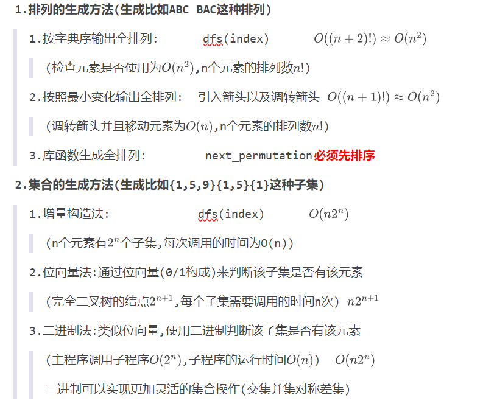
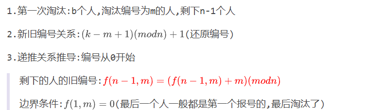

判断题 1*20 -> 20

单选题 1*20 -> 20

多选题 1*10  ->10

分析题 5*2 ->10

理解题 5*2 ->10

设计题 30*1 -> 30

## **Chap1 算法与问题**

**1.算法的概念(填空题)**

**2.算法的四个性质(描述题目)**

**3.稳定匹配算法**

## **Chap2 算法分析**

**1.时间/空间复杂度的定义**

**2.算法分析的两种方法**

**3.算法中出现的符号**

**4.算法符号的传递性(大O没有传递性)**

**5.复杂度比较中的极限法->对应的低阶/紧界/高阶->而不是上界和下界**

**(求偏序关系:A是B的上界/下界)**

**6.折半查找(O(logn))/分块查找(O(logn)+k)/计数排序(O(n+k))**

## **Chap3 枚举算法**

**1.枚举和蛮力的关系->枚举是蛮力的一种**

**2.枚举的优化(枚举变量/枚举值域/数据结构)**

**==3.集合和排序的生成方法==**

>

## **Chap4 贪心算法**

==**1.贪心算法的性质**==

>

==**2.贪心算法的证明(注意领先方法和交换论证)**==

>

**3.哈夫曼编码:贪心策略,前端编码:哈夫曼树产生的唯一编码**

## **Chap5 递归算法**

**1.递推和递归**

**2.递归算法不适用于循环问题(产生额外调用栈)**

**3.递归算法使用的问题(数据/问题的解法/数据结构->递归的)**

**4.递归使用的数据结构:stack**

**5.递推方程的求解(直接迭代法+差消迭代法+主定理法)**

**6.约瑟夫问题(递归问题)**

>

## **Chap6 分治问题**

**分治问题不存在重叠子问题,都是独立的**

**==1.分治算法的设计步骤(分解/解决/合并)==**

==**2.分治算法的特点(可解/可分/可并/独立)**==

>   其中动态规划满足:可解/可分/可并

==**3.分治算法的改进(分治递推方程)**==
$$
T(n) = aT(\frac{n}{b})+f(n)
$$

>   a:减少子问题个数(二分搜索/大数乘法)
>
>   b:改进分治均衡度(快速排序,线性时间选择)
>
>   f(n):减少分解合并时间(最接近点对,计数逆序)

**4.二分搜索(==仅在有序元素中使用==)**

**5.合并排序($O(nlogn)$)**

**6.堆排序($O(nlogn)$)**

## **Chap7 动态规划**

**动态规划中存在重叠子问题,所以记忆化搜索才管用**

**1.动态规划基本概念**

**2.动态规划/备忘录方法/区间动态规划**

>   自底向上/自顶向下(分解大问题)/自底向上(先做小问题)
>
>   自底向上:正推->无额外开销;自顶向下:反推->递归栈

**3.数字三角形(O(N^2)->使用线性dp表能降维O(N))**

>一个数字三角形,每一步只能移动相邻(正下/右下),找到数字和最大的路径

**4.动态规划的最短路径**

>1.Bellman-Ford算法(负权图和负权环)/2.FLOYD算法(负权图)/SPFA

## **Chap8 回溯算法和分治限界**

(旅行商问题/n皇后问题/背包问题/子集和问题)

**1.回溯算法的主要思想:按照选优条件进行==搜索==**

==**2.回溯算法的组成:解空间/树结构(排序树or子集树)/剪枝函数/限界函数**==

**3.排序树和子集树算法**

**4.回溯算法的搜索:dfs+stack(FILO)+满足要求的所有解**(八皇后/迷宫)

**5.分支限界的搜索:bfs+P_queue(FIFO)+满足要求的一个最优解**

**==6.回溯算法的改进==(直接tm给你改成启发式搜索)**

>**影响回溯算法的因素:主要取决于剪枝后节点的个数**
>
>>   1.产生拓展节点的时间
>>
>>   2.满足**显式约束**的拓展节点的个数
>>
>>   3.计算可行性约束函数/限界函数的是u见
>>
>>   4.满足**可行性约束**和**限界函数**的的拓展节点的个数
>>
>>   (当回溯算法使用$C_w+r $作为限界函数,变成A*搜索)
>
>**==算法效率改进==**
>
>>   1.使用接近解值的限界函数
>>
>>   >   比如背包问题使用$C_p+b $代替$C_P+r $($C_p$是当前总价值)
>>   >
>>   >   也就是使用更小的上界提前剪枝
>>
>>   2.利用对称性
>>
>>   >   比如n皇后问题利用y轴对称性减少一半的计算
>>
>>   3.使用分治法
>>
>>   >   虽然解决不了$c2^n $的计算时间,但是分治法可以降低c的大小
>>
>>   4.利用重排原理
>>
>>   >   为了使用更少的拓展节点产生更多的子节点,可以进行重排(类似B树)

## **Chap9 背包问题**

**0.部分背包:直接贪心(最高单位价值,并且可以划分物体)**

**1.0-1背包**

>背景:N种物品和容量为V的背包,每种物品数量是1件(第i种体积$v_i $价值$w_i$)
>$$
>f[i][j] = \begin{cases}
>f[i-1][j])&\leq j
>\\\\
>max(f[i-1][j], f[i-1][j - w[i]] + v[i])&>j
>\end{cases}
>$$
>

**2.完全背包问题**

>背景:N种物品和容量为V的背包,每种物品数量是无限件(第i种体积$v_i $价值$w_i$)

**3.多重背包**

>背景:N种物品和容量为V的背包,每种物品的数量是$s_i $件(第i种体积$v_i $价值$w_i$)
>
>**递推方程:不固定!!多重背包需要转化为0-1背包**
>
>0-1背包:$dp[i][j] = max(dp[i-1][j], dp[i-1][j - w[i]] + v[i])$
>
>直接背包:$dp[i][j] = max(dp[i-1][j], dp[i-1][j - k\times w[i]] + k\times v[i])$

## **Chap10 网络流**

(FF(没用)/EK/Dinic/ISAP/匈牙利)

**1.网络流的性质(最大容量限制/流入流出相同/容量自反性)**

**2.最大流最小割定理**

**3.增广路和参与网络**

**4.最大流算法优化**

**最大流基本算法FF算法的时间复杂度是O(mnC)**

**1.最大瓶颈容量增广路算法:选择瓶颈容量最大的路径增广,减少迭代次数**

>   优化到$O(m^2logC))$的容量缩放算法
>
>   优化到$O( m^2lognlogC)$的最大容量增广路算法

**2.最短增广路算法:选择边数最少的路径增广**

>   优化到$O(nm^2)$的EK算法
>
>   优化到$O(n^m)$的Dinic算法:用BFS和DFS找所有的增广路然后一起更新
>
>   优化到$O(n^2m)$的ISAP算法

## **Chap11 随机算法**

**1.随机算法的结果正确性**

**2.随机算法的运行时间**

**3.不同随机算法的基本思想(尤其是舍伍德)**

## **Chap12 计算复杂性**

**1.多项式时间**

**2.拟多项式时间**

**3.P/NP/NPC/NP-Hard**

==**4.多项式时间归约(和新增的算法有关)**==

>   