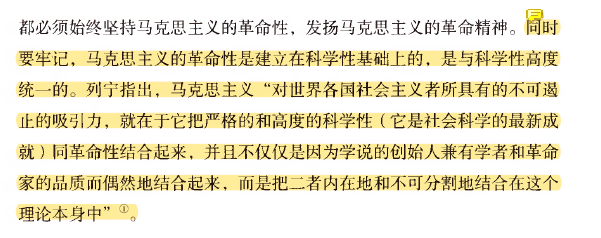

# **PPT课后思考题**

简答题 4×10分 只答要点即可

原著理论分析一题（20分）

材料分析一题 2-3问 （20分）

论述题一题（20分）

论述与材料分析，考查的是前四章原理。涉及原理全在PPT最后思考和论述体中。

## **Chap0**

###### **1.什么是马克思主义？马克思主义具有哪些基本特征？**

>>   是由""马克思和恩格斯创立""并为后继者所不断发展的==科学理论体系==。
>
>>   是==关于自然、社会和人类思维发展一般规律的学说==，
>>
>>   是==关于社会主义必然代替资本主义、最终实现共产主义的学说==，
>>
>>   是==关于无产阶级解放、全人类解放和每个人自由而全面发展的学说==。
>
>>   是无产阶级政党和社会主义国家的==指导思想==，是指引人民创造美好生活的行动指南，具有鲜明的阶级性。
>
>>   是博大精深的理论体系，马克思主义哲学、马克思主义政治经济学和科学社会主义有机统 一并构成了马克思主义。除此之外，还包含许多其他知识领域，并随着实践和科学的发展而 不断丰富自身的内容。

**基本特征：马克思主义具有鲜明的科学性、人民性、实践性、发展性,革命性**

>**科学性**：
>
>>   马克思主义是对自然、社会和人类思维发展本质和规律的正确反映。
>>
>>   马克思主义具有科学的世界观和方法论基础，即辩证==唯物主义和历史唯物主义。==
>>
>>   马克思主义的发展具有科学探索性，是一个不断探索和掌握客观规律的过程。
>
>**人民性**：人民至上是马克思主义的政治立场。马克思主义政党把人民放在心中最高位置，一切奋斗都致力于实现最广大人民的根本利益。马克思主义的人民性是以阶级性为深刻基础的 ,是无产阶级先进性的体现。
>
>**实践性**：马克思主义是从实践中来、到实践中去、在实践中接受检验，并随实践而不断发展 的学说。实践观点是马克思主义首要的和基本的观点。
>
>**发展性**：马克思主义是不断发展的学说，具有与时俱进的理论品质。马克思主义是时代的产 物，并随着时代、实践和科学的发展而不断发展。马克思主义理论体系是开放的，它不断吸 取人类最新的文明成果来充实和发展自己。
>
>**革命性:建立在高度的科学性上**
>
>

###### **==2.为什么说本土化和时代化是马克思主义创新发展基本路径？==**

>   本土化意味着**将马克思主义的基本原理==与各国的具体实际相结合==，使其能够在不同地区和文化背景中得以实现和检验。**Eg:毛泽东提出的“马克思主义中国化”理念，强调必须根据中国的具体国情来运用马克思主义，确保理论能够在实际中生根发芽。
>
>   时代化则是指**马克思主义的基本原理要与==时代的发展需求==相适应，能够回应时代的新问题和新挑战。**时代化要求马克思主义不仅要关注理论的发展，还要关注实践的发展，确保理论的创新能够指导和解决现实中的问题。
>
>   **本土化和时代化并非孤立进行，而是相互依存、相互促进。**马克思主义只有通过本土化才能 真正在全球范围内发挥作用，而通过时代化，**马克思主义才能保持其动态和发展的特性。**二者的结合使得马克思主义能够不断适应新的环境和挑战，实现持续的发展。

###### **==3.结合社会现实，谈谈马克思主义的当代价值和指导意义。==**

>   1.观察当代世界变化的认识工具
>
>   2.指引当代中国发展的行动指南
>
>   3.引领人类社会进步的科学真理

##　**chap1 唯物论**

###### **1.哲学基本问题内容及意义。**

>   哲学基本问题主要包括两方面内容：
>
>   一是存在和**思维、物质和意识谁为本原**的问题，即何者为第一性的问题；对这一问题的不同回答，形成了唯物主义和唯心主义两种根本对立的哲学派别。
>
>   二是**存在和思维、物质和意识是否具有同一性**的问题，即思维能否正确地反映存在、人能否认识或彻底认识世界的问题；对这一问题的不同回答，产生了可知论和不可知论的理论分野。

###### **==2.马克思主义的物质观及其现代意义。==**

>**马克思主义物质观：**
>
>1、(物质的独立性)马克思主义认为，物质是标志着客观实在的哲学范畴，它的唯一特性是客观实在性。**物质就是不依赖于人的意识并为人的意识所反映的客观实在。**
>
>2、(物质的第一性)物质是世界唯一的本源，**物质第一性**，意识第二性，意识是物质的产物，是物质世界的主观映象。
>
>3、物质世界是联系的，发展的，发展的根本原因在于事物的内部矛盾。
>
>4、时间与空间是物质运动的存在形式。 现代意义:
>
>①坚持了唯物主义一元论，同唯心主义一元论和二元论划清了界限。
>
>②坚持了能动的反映论和可知论，批判了不可知论。
>
>③体现了唯物论和辩证法的统一，克服了形而上学唯物主义的缺陷。
>
>④体现了唯物主义自然观与唯物主义历史观的统一。
>

###### **3.如何认识人工智能与人脑智能区别？**

>所谓人工智能，就是把人的部分智能活动机器化，让机器具有完成某种复杂目标的能力，它实质上是对人脑组织结构与思维运行机制的模仿，是人类智能的物化。人工智能是人的意识能动性的一种特殊表现，是人的本质力量的对象化 现实化。
>
>**智能机器不能达到人类智能的层级，不能真正具有人的意识，不能取代或超越人类智能。**
>
>第一，**人类意识**是知情意的统一体，而人工智能只是对人类的理性智能的模拟和扩展，不具备情感、信念、意志等人 类意识形式。
>
>第二，**社会性**是人的意识所固有的本质属性，而人工智能不可能真正具备人类的社会属性。
>
>第三，人类的自然语言是思维的物质外壳和意识的现实形式，而人工智能难以完全具备**理解自然语言**真实意义的能力。 
>
>第四，人工智能能够获得人类意识中可以化约为数字信号的内容，但人**脑中总有许多东西是无法化约的。譬如潜意识。**

###### **4.结合党的二十大报告的相关论述，运用==主观能动性与客观规律性的辩证统一关系原理==，说明中国共产党人面对前进路上风高浪急、甚至惊涛核浪如何发挥主观能动性去推动中华民族复兴号巨轮去乘风破浪、扬帆远航？**

>1 (给出定义)客观规律是指**事物运动过程中本身所固有的本质的联系和必然的趋势。**主观能动性是指**人们能动地认识世界和能动地改造世界的实践能力和作用。**
>
>2 (现实情况)规律的客观性和普遍性要求我们尊重规律，必须按客观规律办事，尊重客观规律是正确发挥主观能动性的前提和基础。尊重客观规律和发挥人的主观能动性是相辅相成的，辩证统一的。共产党人要从客观实际出发，找出中国革命建设道路的的规 律性，作为我们行动的依据。
>
>3 (要做的)在客观规律面前，人并不是无能为力的，人可以发挥主观能动性认识和利用规律，改造客观世界，造福人类。共产党人要发挥历史主动精神，不断解放思想，与时俱进，以求真务实的精神探求中国革命建设道路。
>
>4 (BS)要把尊重客观规律和发挥主观能动性结合起来。共产党人要把革命热情同科学态度结合起来。既要反对夸大意识能动作用 的唯意志主义，又要反对片面强调客观条件，安于现状，因循守旧无所作为的思想。

###### ==**5.真理绝对性、相对性及其辩证关系**==

真理既具有绝对性，又具有相对性，它们是同一客观真理的两种属性，任何真理都是绝对性和相对性的统一。（2 分）

>   真理的绝对性。真理的绝对性是指真理主客观统一的确定性和发展的无限性。一是指任何真理都标志 着主观与客观之间的符合，都包含着不依赖于人和人的意识的客观内容,都同谬误有原则的界限。这一点 是绝对的、无条件的。二是人类认识按其本性来说，能够正确认识无限发展着的物质世界，认识每前进 一步，都是对无限发展着的物质世界的接近，这一点也是绝对的、无条件的。（4 分）
>
>   真理的相对性。**真理的相对性是指人们在一定条件下对客观事物及其本质和发展规律的正确认识总是有限度的、不完善的。**
>
>   >   一是从客观世界的整体来看，任何真理都只是对客观世界的某一阶段、某一部分 的正确认识，人类已经达到的认识的广度总是有限度的，因而，认识有待扩展。
>   >
>   >   二是就特定事物而言，任何真理都只是对客观对象一定方面、一定层次和一定程度的正确认识，认识反映事物的深度是有限度 的，或是近似性的。因而，认识有待深化。也就是说，任何真理都只能是主观对客观事物近似正确即相 对正确的反映。（4 分）
>
>   **结合材料：**马克思主义作为客观真理，是绝对性和相对性的统一。它正确反映了人类社会的发展规律， 因而具有绝对性。
>
>   但是，马克思主义并没有穷尽真理，并没有穷尽对一切事物及其规律的认识，仍需要随着社会实践的发展而发展，因而又具有相对性。（2 分）
>
>   马克思主义真理的绝对性要求我们必须坚持 以马克思主义为指导思想，马克思主义真理的相对性要求我们又必须在实践中丰富和发展马克思主义。 （一要坚持，二要发展）（3 分）

###### **6.从矛盾的普遍性与特殊性的辩证角度看中国式现代化的内涵和意义**

(统一+离不开+相互转化)+中国(现代科技+传统的辩证)

>普遍性与特殊性相互区别。
>
>>   矛盾的普遍性是无条件的、绝对的，
>
>>   矛盾的特殊性是有条件的、相对的。
>
>矛盾的普遍性和特殊性相互联结。
>
>>   任何现实存在的事物的矛盾都是普遍性和特殊性的有机统一，普遍性寓于特殊性之中，并通过特殊性表现出来，没有特殊性就没有普遍性；
>
>>   特殊性离不开普遍性，世界上的事物无论怎样特殊，它总是和同类事物中的其他事物有共同之处，不包含普遍性的事物是不存在的。
>
>矛盾的普遍性与特殊性在一定条件下又相互转化。
>
>>   矛盾的普遍性和特殊性辩证关系的原理要求我们要在矛盾普遍性原理的指导下，具体分析矛盾的特殊性，不断实现矛盾的普遍性与特殊性、共性和个性的具体的历史的统一。
>
>中国式现代化的内涵和意义在于，通过发展现代科技和经济建设，提高国民生活水平，同时保持中国文化传统和民族特色。
>
>>   这种现代化的方式不仅能够促进经济发展和社会进步，还能够保护和传承中国传统文化，增强国家文化软实力和国际影响力。
>
>在实践中，中国式现代化需要处理好传统文化与现代文化、国内需求与国际接轨、政治制度与市场经济等方面的矛盾关系。只有在这些矛盾的普遍性和特殊性辩证关系中找到平衡点，才能实现中国式现代化的目标和意义。

###### 7.结合党的二十大报告关于系统观念的论述，深入思考系统**思维内涵和意义**。

内涵：**系统思维就是根据创新对象的系统特征**

>   从系统整体出发，着眼于系统的系统和要素、要素和要素、系统和环境的相互联系和相互作用关系，
>
>   采用系统分析方法，**以期获得系统目标==最优化的科学思维方式==。**

意义：系统思维可以帮助我们理解复杂系统的结构和运作原理，促进协同和合作，实现高效决策和优化。

## **Chap1 辩证法**

###### **1.简述矛盾的两重性及其辩证关系。**

>   矛盾的对立属性又称斗争性，矛盾的统一属性又称同一性。
>
>   

###### **2.简述矛盾在事物发展过程中的作用。**

>在事物发展过程中，矛盾的同一性和斗争性相互结合，共同发生作用，但在不同条件下，二者所处的地位会有所不同。在一定的条件下，矛盾的斗争性可能处于主要方面，而在另外的条件下，矛盾的同一性又可能处于主要方面。矛盾同一性和斗争性的辩证关系原理，要求我们在观察和处理问题时，必须善于把两者结合起来，在斗争性中把握同一性，在同一性中把握斗争性。

###### **3.简述质/量/度的含义及其质变量变规律。**

>   事物包含质/量/度三方面的规定性
>
>   >   质是一事物区别于其他事物的内在规定性
>   >
>   >   量是事物的规模、程度、速度等可以用数量关系表示的规定性。
>   >
>   >   度是保持事物质的稳定性的数量界限，即事物的限度、幅度和范围
>
>   >量变是事物数量的增减和组成要素排列次序的变动，是保持事物的质的相对稳定性的不显著变化，体现了事物发展渐进过程的连续性。
>   >
>   >质变是事物性质的根本变化，是事物由一种质态向另一种质态的飞跃，体现了事物发展渐进过程和连续性的中断。
>   >
>   >量变是质变的必要准备,质变是量变的必然结果,量变和质变是相互渗透的

###### **4.简述肯定否定含义及其否定之否定规律。**

>否定之否定规律揭示了事物发展的前进性与曲折性的统一。前进性体现在每一次否定都是质变，都把事物推进到新阶段；每一个周期都是开放的，前一个周期的终点是下一个周期的起点，不存在不被否定的终点。曲折性体现在回复性上，其中有暂时的停顿甚至是倒退。这表明，事物的发展不是直线式前进，而是螺旋式上升的。
>
>否定之否定规律对于人们的认识和实践活动具有重要的指导意义。按照否定之否定规律办事，就要求我们树立辩证的否定观，反对形而上学地肯定一切或否定一切，要对事物采取科学分析的态度，使实践活动符合事物自我否定的辩证本性。同时，又要求我们正确看待事物发展的过程，既要看到道路的曲折，更要看到前途的光明。

###### **5.简述必然性与偶然性的关系及其方法论意义。**

>必然与偶然相互依存。一方面，没有脱离偶然的必然。必然总是伴随着偶然，要通过偶然表现出来，并为自己开辟道路。另一方面，没有脱离必然的偶然。在似乎是偶然起支配作用的地方，实际上是必然起着决定性作用，并制约着偶然的作用形式及其变化。
>
>必然与偶然相互转化。相对于某一过程来说是必然的东西，对另一过程就可能成为偶然的东西，反之亦然。在事物的产生、发展和衰亡的过程中，包含必然性因素和偶然性因素的相互转化。

## **Chap2 实践与认识及其发展规律**

###### **1.实践的含义、基本特征与基本形式。**

###### **2.感性认识、理性认识及其辩证关系。**

>**感性认识**是由感觉器官感受到的关于事物的现象、各个片面和外部联系的认识;**理性认识**是人们对感 性材料进行抽象和概括而形成的关于事物的本质、事物的全体以及事物的内部联系的认识。
>
>感性认识和理性认识,是认识过程中的两个不同阶段,是辩证统一的。
>
>①理性认识依赖于感性认识,理性认识必须以感性认识为基础;
>
>②感性认识有待于发展到理性认识, 只有使感性认识上升到理性认识,才能把握事物的本质和规律,满 足实践的需要;  
>
>③最后,感性认识和理性认识相互渗透,相互包含。
>
>

###### **3.如何实现认识的“两次飞跃”？**

###### **4.真理绝对性、相对性及其辩证关系。**

>真理既具有绝对性，又具有相对性，它们是同一客观真理的两种属性，任何真理都是绝对性和相对性的 统一。（2 分）
>
>①真理的绝对性。真理的绝对性是指真理主客观统一的确定性和发展的无限性。一是指任何真理都标志 着主观与客观之间的符合，都包含着不依赖于人和人的意识的客观内容,都同谬误有原则的界限。这一点 是绝对的、无条件的。二是人类认识按其本性来说，能够正确认识无限发展着的物质世界，认识每前进 一步，都是对无限发展着的物质世界的接近，这一点也是绝对的、无条件的。（4 分）
>
>②真理的相对性。真理的相对性是指人们在一定条件下对客观事物及其本质和发展规律的正确认识总是 有限度的、不完善的。一是从客观世界的整体来看，任何真理都只是对客观世界的某一阶段、某一部分 的正确认识，人类已经达到的认识的广度总是有限度的，因而，认识有待扩展。二是就特定事物而言， 任何真理都只是对客观对象一定方面、一定层次和一定程度的正确认识，认识反映事物的深度是有限度 的，或是近似性的。因而，认识有待深化。也就是说，任何真理都只能是主观对客观事物近似正确即相 对正确的反映。（4 分）
>
>**结合材料：**马克思主义作为客观真理，是绝对性和相对性的统一。它正确反映了人类社会的发展规律， 因而具有绝对性。但是，马克思主义并没有穷尽真理，并没有穷尽对一切事物及其规律的认识，仍需要 随着社会实践的发展而发展，因而又具有相对性。（2 分）马克思主义真理的绝对性要求我们必须坚持 以马克思主义为指导思想，马克思主义真理的相对性要求我们又必须在实践中丰富和发展马克思主义。 （一要坚持，二要发展）（3 分）

###### **5.为什么实践是检验真理的唯一标准？**

>辩证唯物主义认为,实践是检验真理的唯一标准。实践之所以能够作为真理的检验标准,这是由真理的本 性和实践的特点决定的。
>
>①首先,从真理的本性看,真理是人们对客观事物及其发展规律的正确反映,它的本性在于主观和客观 相符合。所谓检验真理,就是检验人的主观认识同客观实际是否相符合以及符合程度。
>
>②其次,从实践的特点看,实践是人们改造世界的客观的物质性的活动,具有直接现实性的特点。人们 遵循一定的认识去实践就可以引出现实的结果,把主观的东西变为客观的东西。

## **Chap2 论述题**

**1.毛泽东指出：“我们要建筑中国革命这个房屋 ，必须先有中国革命的图样。不但须有一个大图样 ，总图样 ，还须有许 多小图样 ，分图样。而这些图样不是别的 ，就是我们在中国革命实践中所得来的关于客观实际情况的能动的反映。”根据这段论述谈谈如何理解==实践与认识==的辩证关系。**

>毛泽东的这段论述深刻揭示了实践与认识的辩证关系，强调了实践在认识形成和发展中的基础性作用， 以及认识对实践的指导功能。
>
>**实践是认识的基础**
>
>1.认识的来源：毛泽东提到的“ 中国革命的图样 ”，无论是“大图样 ”还是“小图样 ”，都是指对中国 革命实际情况的认识和理解。这些认识不是凭空产生的，而是来源于中国革命的实践。实践是认识的唯 一来源，只有通过实践，人们才能接触和感知到客观世界，从而形成对世界的认识。
>
>2.认识的发展：在实践中，人们会遇到各种问题和挑战，这些问题和挑战会促使人们不断思考、探索和 总结经验。这些经验和教训是认识发展的重要动力。毛泽东强调的“ 中国革命实践中所得来的关于客观 实际情况的能动的反映 ”，正是认识在实践中不断发展和深化的体现。
>
>3.认识的目的：认识的目的不是为了认识本身，而是为了指导实践。毛泽东提到的“ 图样 ”是为了“建 筑中国革命这个房屋 ”，即指导中国革命的实践。这表明，认识最终要回到实践中去，为实践服务。
>
>**认识对实践具有反作用**
>
>1.指导实践：正确的认识能够指导实践取得成功，而错误的认识则可能导致实践的失败。毛泽东强调的 “ 图样 ”就是对中国革命实践的正确认识，它能够为中国革命提供科学的指导。
>
>2.推动实践发展：认识不仅反映实践，还能预见和创造未来。通过对实践经验的总结和提炼，人们能够 形成对事物发展规律的正确认识，从而推动实践不断向前发展。毛泽东提到的“能动的反映 ”就体现了 认识对实践的能动作用。
>
>**实践与认识的辩证统一**
>
>实践与认识是相互依存、相互促进的。一方面，实践是认识的基础和动力，没有实践就没有认识；另一 方面，认识又指导着实践，推动实践的发展。毛泽东的论述正是对这一辩证关系的生动诠释。

**2.习近平指出：“世界上没有纯而又纯的哲学社会科学。世界上伟大的哲学社会科学成果都是在回答和解决人与社会面 临的重大问题中创造出来的。研究者生活在现实社会中 ，研究什么 ，主张什么 ，都会打下社会烙印。”请谈谈这段论述对 于理解真理与价值的辩证统一关系有什么帮助和启示。**

>**关系**：1、社会存在决定社会意识。2、社会意识对社会存在具有能动的反作用。3、社会意识具有相对 
>
>独立性。 
>
>**意义**：可以帮助我们在实际中一切从社会实际出发，形成正确的社会意识，用以指导社会实践。1 经济 建设与环境保护相协调发展，保护和改善环境就是保护和发展生产力，但不能只保护环境，不 
>
>发展经济， 加快经济建设，绝不能以破坏环境为代价换取经济的一时繁荣
>
>2 在推进现代化建设的进程中，我们在保持国民经济，持续较快增长的同时，必须把保护环境放在突出 
>
>位置。 
>
>3 我们必须认识到保护环境和改善环境，也是保护和发展生产力。 
>
>4 实践证明，保护好环境就能增加投资吸引力和经济竞争力。 
>
>5 加快经济建设，绝不能以破坏环境为代价，绝不能把环境保护同经济建设对立起来或割裂开来，决不 
>
>能走先污染后治理的老路。

**3.党的二十大报告提出“六个必须坚持”，其中第三条就是“坚持守正创新”。2023年2月7日，习近平总书记在学习贯彻党的二十大精神研讨班开班式上的重要讲话强调， “推进中国式现代化是一个系统工程，需要统筹兼顾、系统谋划、整体推进，正确处理好顶层设计与实践探索、战略与策略、守正与创新、效率与公平、活力与秩序、自立自强与对外开放等一系列重大关系。”结合本章所学，谈谈推进中国式现代化需要处理好守正与创新的关系的重要性。**

## **Chap3 人类社会及其发展规律**

###### **1.简述社会存在、社会意识及其辩证关系。**

>1、社会存在决定社会意识
>
>2、社会意识对社会存在具有能动的反作用
>
>3、但是社会意识具有相对独立性。

###### **2.习近平指出：“我们既要绿水青山，也要金山银山。宁要绿水青山，不要金山银山，而且绿水青山就是金山银山”。请结合自然地理环境在社会存在和发展中的作用，谈谈应怎样认识和处理经济发展与环境保护的关系？**

>**关系**：
>
>>   1、社会存在决定社会意识
>>
>>   2、社会意识对社会存在具有能动的反作用
>>
>>   3、社会意识具有相对独立性。 
>
>**意义**：可以帮助我们在实际中一切从社会实际出发，形成正确的社会意识，用以指导社会实践。
>
>>   1 经济建设与环境保护相协调发展，保护和改善环境就是保护和发展生产力，但不能只保护环境，不发展经济，加快经济建设，绝不能以破坏环境为代价换取经济的一时繁荣
>>
>>   2 在推进现代化建设的进程中，我们在保持国民经济，持续较快增长的同时，必须把保护环境放在突出位置。 
>>
>>   3 我们必须认识到保护环境和改善环境，也是保护和发展生产力。 
>>
>>   4 实践证明，保护好环境就能增加投资吸引力和经济竞争力。 
>>
>>   5 加快经济建设，绝不能以破坏环境为代价，绝不能把环境保护同经济建设对立起来或割裂开来，决不能走先污染后治理的老路。

###### **3.为什么物质生产方式是社会存在和发展的基础及决定力量？**

>物质资料的生产方式是社会发展的决定力量。 
>
>>   生产方式是人类社会特有的存在方式，是人区别于其他动物的根本标志。
>>
>>   生产方式**决定了社会的结构、性质和面貌。** 
>>
>>   生产方式的发展变化是**社会发展变化**的根本原因。 
>
>在人类社会存在和发展的物质条件中，除了生产方式外，还有地理环境和人口因素，其中物质资料的生产方式是社会发展最主要的、决定性的因素。

###### ==**4.运用生产力、生产关系及其辩证关系原理，谈谈你对新质生产力认识。**==

>**生产力**是人们改造自然、征服自然获取物质资料的能力。它包括劳动者、劳动资料和劳动对象三个基本要素，其中劳动者是决定性的要素。 
>
>**生产关系**是人们在物质资料生产过程中所发生的一定的、必然的、不以人的意志为转移的物质关系。**它包括生产资料的所有制关系、人们在生产中的地位和相互关系以及产品的分配关系三个方面**，其中生产资料的所有制关系是全部生产关系的核心和基础。 
>
>**生产力和生产关系的辨证关系表现为**： 
>
>>   **生产力决定生产关系**，生产力的状况决定生产关系的性质和状况，生产力发展了，生产关系迟早要发生变革； 
>>
>>   **生产关系对生产力具有能动的反作用**，当生产关系适合生产力发展状况时，生产关系就促进生产力的发展，反之，就阻碍生产力的发展。 
>>
>>   **新质生产力**代表先进生产力的演进方向，是由技术革命性突破、生产要素创新性配置、产业深度转型升级而催生的先进生产力质态。 新质生产力以劳动者、劳动资料、劳动对象及其优化组合的跃升为基本内涵，具有强大发展动能，能够引领创造新的社会生产时代。

###### **5.简述经济基础、上层建筑及其辩证关系。**

>**经济基础**是指一定社会中占统治地位的生产关系的总和。 
>
>**上层建筑**是指建立在经济基础之上的政治法律制度、政治设施以及与之相适应的社会意识形态。 
>
>**经济基础和上层建筑之间的辩证关系是：经济基础决定上层建筑，上层建筑反作用于经济基础。**
>
>（2）经济基础对上层建筑的决定作用表现在两个方面：
>
>其一，经济基础决定上层建筑的产生及其性质； 
>
>其二，经济基础的变化决定上层建筑的改变。 
>
>（3）上层建筑对经济基础的反作用，集中表现为它是为经济基础服务的。 
>
>当上层建筑为先进的经济基础服务时，起推动生产力发展和社会进步的作用；当上层建筑为落后的经济基础服务时，起阻碍生产力发展和社会进步的作用

**6.为什么说物质资料的生产方式是社会发展的决定性力量？**

>1.物质生产活动及生产方式是人类社会赖以存在和发展的基础,是人类其它一切活动的首要前提
>
>2.物质生产活动及生产方式决定社会的结构性质和面貌,制约着人们的经济生活/政治生活/精神生活

**7.在迎来中国共产党成立100周年的重要时刻，我国脱贫攻坚战取得了全面胜利，现行标准下9899万农村贫困人口全部脱贫，832个贫困县全部摘帽，区域性整体贫困得到解决，完成了消除绝对贫困的艰巨任务，孕育形成了“上下同心、尽锐出战、精准务实、开拓创新、攻坚克难、不负人民”的脱贫攻坚精神。请运用社会意识对社会存在的反作用原理，谈谈==精神力量==在我国社会发展中的作用。**

>精神力量在社会发展中的作用是多方面的，它能够激发人们的积极性和创造性，推动社会进步，促进社会和谐，增强国家的软实力和国际竞争力。
>
>脱贫攻坚精神作为社会意识的一部分，对我国社会发展产生了积极的反作用，激励了广大人民群众积极参与脱贫攻坚战，促0进了社会经济的发展，改善了人民的生活水平，增强了民族凝聚力和国家的综合国力。

###### ==**6.请结合我国科学技术的重大成就，如高铁、大飞机、“天宫”“蛟龙”“天眼”“悟空”“墨子”等。谈谈对科学技术及其革命在社会发展中的作用？**==

**科学技术作为先进生产力的重要标志，是推动社会文明进步的重要力量。**

1 科学技术是推动经济发展和社会发展的有力杠杆。科技是第一生产力。 

>   科技改变了人们的生产方式。其一，改变了社会生产力的要素构成，提高了生产自动化程度。其二，科技改变了人们的劳动形式。脑力劳动占比大大增加。最后，科技改变了社会经济结构，使第三产业在国名经济中占比日益提高。
>
>   ②科技大大影响了人们的生活方式。现代信息技术为人们提供了处理存储和传递信息的手段，给学习工作带来了极大的便利。③科技促进了思维方式的变革，使人们能够现代科技工具去研究新的课题，新的领域。 

2 我们要正确把握科学技术的社会作用。科技是一把双刃剑。当我们缺乏对自然的认识从而滥用科学技术会带来一系列的消极后果。如使用伐木机器砍伐树木过多从而导致环境恶化等。正确认识科学技术，首要的就是要有合理的社会制度进行保障，让科技为人类造福。

###### **7.请结合人民群众是历史创造者的原理，谈谈对“江山就是人民，人民就是江山”的理解。**

**（1）人民是创造历史的动力**，是决定党和国家前途命运的根本力量。人民是真正的英雄，党的历史伟业是人民创造的。党坚持走群众路线，坚持一切为了群众，一切依靠群众，从群众中来，到群众中去.群众路线始终是党的生命线和根本工作路线，是我们党永葆青春活力和战斗力的重要传家宝。

**（2）江山就是人民，人民就是江山。**

①打江山、守江山，守的是人民的心，我国的政权是人民的政权，为民造福是立党为公、执政为民的本质要求。必须坚持在发展中保障和改善民生，不断实现人民对美好生活的向往。

②尊重人民群众的首创精神。党始终把群众作为智慧和力量的源泉，始终把政治智慧的增长、执政本领的增强深深 扎根于人民的创造性实践中。 

**（3）党依靠人民创造历史伟业。**党依靠人民夺取了新民主主义革命、社会主义革命的等伟大胜利，依靠人民进行改革开放和社会主义现代化建设。党依靠人民推动党和国家事业发生历史性变革，取得历史性成就，推动中国特色社会主义进入新时代。中国人民的前进动力更加强大、奋斗精神更加昂扬、必胜信念更加坚定，推进中华民族实现 从站起来、富起来到强起来的伟大飞跃。

## **Chap4 资本主义的本质及规律**

###### **资本论**

## **Chap5 资本主义的发展及其趋势**

###### **1.简述垄断及产生的原因。**

>所谓**垄断**，简单地说就是“独占”，是指资本主义少数大企业为了获得高额垄断利润联合起来独占生产 和市场。 自由竞争引起生产集中，生产集中发展到—定阶段必然走向垄断，这是因为：
>
>>   1.当生产集中达到一定高度时，就具备了产生垄断的可能性；
>>
>>   2.生产高度集中后，也产生了垄断的必要性。
>>
>>   3.生产的高度集中，在一定程度上造成了竞争的困难，从而导致垄断的趋势；

###### **2.为什么说垄断没有消除竞争？**

###### **3.国家垄断资本主义的主要形式有哪些？**

>1.国家直接掌握的垄断资本。国有经济、国有企业。
>
>2.国家和私人资本在企业内部的结合。也即资本主义国家中的国有资本与私人资本结合在一个企业中 的经济形式。
>
>3.国家和私人资本在企业外部的结合。也就是国家垄断资本主义在资本主义私人企业的外部起作用，通过种种方式来促进、诱导私人
>
>企业向既定的方向发展，从而实现国家对经济的管理和调节。

###### **4.如何认识和把握经济全球化及其影响？**

>经济全球化是指在生产不断发展、科技加速进步、社会分工和国际分工不断深化、生产的社会化和国际 化不断提高的情况下，世界各国、各地区的经济活动越来越超出某一国家和地区的范围而相互联系、相 互依赖的过程。
>
>经济全球化是世界经济发展的必然趋势，任何国家都回避不了。我国正处于社会主义发展的初级阶 段，并将在这一阶段停留很长的一段时间，所以在全球化的发展趋势面前，我国要坚定不移地实行对外 开放的政策，适应经济全球化的趋势，积极参与国际经济合作与竞争，充分利用经济全球化带来的各种 有利条件和机遇；同时又要对经济全球化带来的风险保持清醒认识，坚持独立自主的原则，加强防范工 作，增强抵御和化解能力，切实维护我国经济安全，更好地发展和壮大自己。
>
>经济全球化的影响：
>
>经济全球化使各国经济的相互依存度和渗透性越来越强，任何国家要想置身于这一潮流之外而求得 较快发展是不可能的。就整个世界经济而言，经济全球化要求各国间加强经济协调与合作，从而能缓解 经济发展中的重重困难，能完成一国力量所难以承担的重大发展项目；经济全球化也意味着有可能实现 资源在全球范围内的合理、有效的配置，有利于各国经济实现优势互补，实现全球范围的专业化协作。 总之.在经济全球化的大环境中，世界经济和各国经济都有可能获得更大的发展。当然，经济全球化带来 的机遇和风险是并存的。由于经济发展水平不同， 各国并没有能够平等地、均衡地分享经济全球化的利 益，面临的机遇和挑战的具体内容也有不同。一般来说，发达资本主义国家经济实力强大，在经济全球 化进程中占据主导地位，有可能从中获取更大利益。而发展中国家由于经济力量较弱，在世界经济中处 于不利地位，在经济全球化的大潮中面临的风险也更大些。

**==5.简述当代资本主义变化的新特征。==**

>二十世纪 90 年代以来的‘经济全球化’。 经济全球化的成因：萌芽于‘国际分工’。 国际分工体系的形成与原因：
>
>16 世纪到 19 世纪，随着社会生产力的发展，生产和流通过程日益社会化、国际化，国际分工和生产 国际化是资本主义市场经济发展的必
>
>然趋势。19 世纪后半期发生的第二次产业革命，对国际分工起着重要作用：一方面交通运输的发展；
>
>另一方面资本输出成为资本主义国 家对外经济的重要手段。

## **Chap6 共产主义**

**1.谈谈你对马克思主义经典作家预见未来社会方法论原则认识。**

>   马克思主义经典作家站在科学的立场上，提出并自觉运用了预见未来社会的方法论原则。（2 分）
>
>   1.在揭示人类社会发展一般规律的基础上指明社会发展的方向；（2 分） 
>
>   2.在剖析资本主义旧世界的过程中阐发未来新世界的特点；（2 分）
>
>   3.在社会主义社会发展中不断深化对未来共产主义社会的认识； （2 分） 
>
>   4.立足于揭示未来社会的一般特征，而不对各种细节作具体描绘。（2 分）

**2.试述如何正确处理中国特色社会主义理想与树立共产主义远大理想的关系。**

(1) 正确认识和把握共产主义远大理想与中国特色社会主义共同理想的关系坚定社会主义和共产主义理 想信念，必须正确认识共产主义远大理想与中国特色社会主义共同理想的关系。这对关系具有丰富的理 论内涵，要从不同的角度和层面去认识和把握。

①从时间上看，远大理想与共同理想的关系是最终理想与阶段性理想的关系。

>   a．共产主义远大理想也就是最终理想，它的实现需要许多代人的艰苦奋斗，在这个艰苦奋斗的过程中，需要阶段性的理想。
>
>   b．中国特色社会主义共同理想，是在追求和实现共产主义远大理想过程中的一个阶段性理想，是当前正在着 力追求的阶段性理想或近期理想。                               

②从层次上看，远大理想与共同理想的关系是最高纲领与最低纲领的关系。实现共产主义远大理想要坚持最高纲领和最低纲领的统一。

>   a．党的最高理想和最终目标是实现共产主义，这也是党的最高纲领。
>
>   b．坚定中国特色社会主义共同理想，进一步推进中国特色社会主义事业，就是党的最低纲领在当前的要求。

③从范围来看，远大理想与共同理想的关系也是全人类理想与全体中国人民理想的关系。

>   a.远大理想体现的是全人类解放的共性，是面向全人类的更大的共同理想。
>
>   b.中国特色社会主义共同理想，主要是面向中国人民和中华民族成员的，是全体中华儿女和中国人民的“共同理想”，无疑具有“共同”性。但与远大理想相比，又体现了“中国特色”，体现了中国人民在社会主义和共产主义理想方面的个性特色。

(2)以辩证思维把握和处理远大理想和共同理想的关系必须以马克思主义的辩证思维和历史思维去把握 远大理想和共同理想的关系。任何时候都要坚持远大理想和共同理想的统一，不能把它们割裂开来、对 立起来。没有远大理想的指引，就不会有共同理想的确立和坚持；没有共同理想的实现，远大理想就没 有现实的基础。忘记远大理想而只顾眼前，就会失去前进的方向；离开现实工作而空谈远大理想，就会 脱离实际。

## **圣井**

###### **马克思主义本土化时代化**

###### **资本主义的新特征**

###### **为什么生产关系决定社会发展**

###### **马克思主义经典作家预见未来方法论的原理**

###### **真理的相对性绝对性及其辩证关系**

###### **科技对社会发展的认识**

